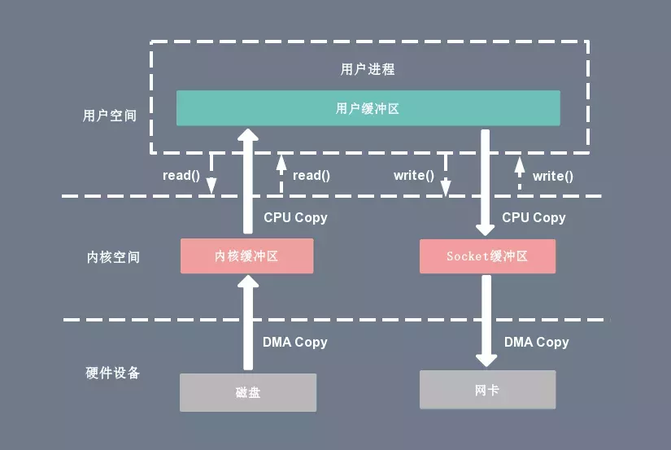
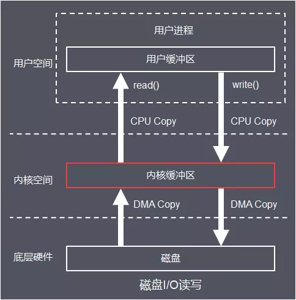
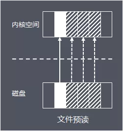
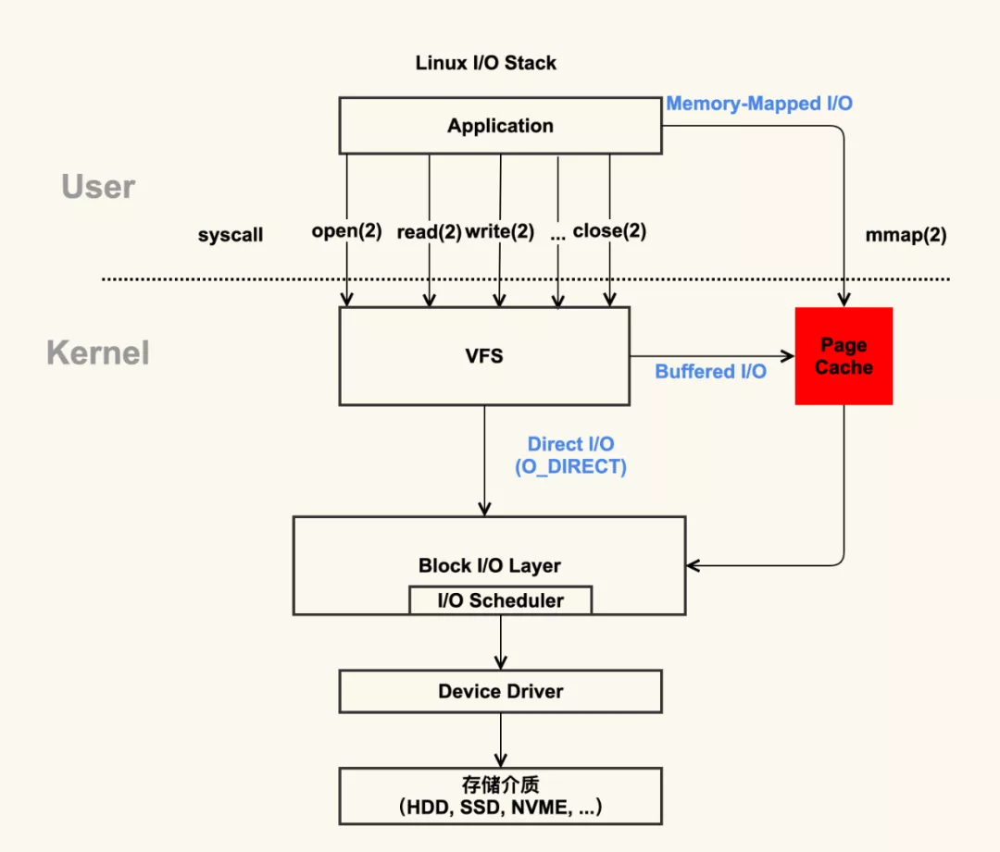

# Table of Contents

* [传统的 System Call I/O](#传统的-system-call-io)
  * [读操作](#读操作)
  * [写操作](#写操作)
  * [网络 I/O](#网络-io)
  * [磁盘 I/O](#磁盘-io)
* [高性能优化的 I/O](#高性能优化的-io)
* [存储设备的 I/O 栈](#存储设备的-io-栈)
* [I/O Buffering](#io-buffering)
* [参考资料](#参考资料)


# 传统的 System Call I/O


在 Linux 系统中，传统的访问方式是通过 write() 和 read() 两个系统调用实现的，通过 read() 函数读取文件到到缓存区中，然后通过 write() 方法把缓存中的数据输出到网络端口。

```
read(file_fd, tmp_buf, len);write(socket_fd, tmp_buf, len);
```

下图分别对应传统 I/O 操作的数据读写流程，整个过程涉及 2 次 CPU 拷贝、2 次 DMA 拷贝，总共 4 次拷贝，以及 4 次上下文切换。

- **CPU 拷贝**：

  由 CPU 直接处理数据的传送，数据拷贝时会一直占用 CPU 的资源。

- **DMA 拷贝**：

  由 CPU 向DMA磁盘控制器下达指令，让 DMA 控制器来处理数据的传送，数据传送完毕再把信息反馈给 CPU，从而减轻了 CPU 资源的占有率。

- **上下文切换**：

  当用户程序向内核发起系统调用时，CPU 将用户进程从用户态切换到内核态；

  当系统调用返回时，CPU 将用户进程从内核态切换回用户态。

 ##  读操作

当应用程序执行 read 系统调用读取一块数据的时候，如果这块数据已经存在于用户进程的页内存中，就直接从内存中读取数据。

如果数据不存在，则先将数据从磁盘加载数据到内核空间的读缓存（Read Buffer）中，再从读缓存拷贝到用户进程的页内存中。




```
read(file_fd, tmp_buf, len);
```

基于传统的 I/O 读取方式，read 系统调用会触发 2 次上下文切换，1 次 DMA 拷贝和 1 次 CPU 拷贝。

发起数据读取的流程如下：

1. 用户进程通过 read() 函数向 Kernel 发起 System Call，上下文从 user space 切换为 kernel space。
2. CPU 利用 DMA 控制器将数据从主存或硬盘拷贝到 kernel space 的读缓冲区（Read Buffer）。
3. CPU 将读缓冲区（Read Buffer）中的数据拷贝到 user space 的用户缓冲区（User Buffer）。
4. 上下文从 kernel space 切换回用户态（User Space），read 调用执行返回。


## 写操作

当应用程序准备好数据，执行 write 系统调用发送网络数据时，先将数据从用户空间的页缓存拷贝到内核空间的网络缓冲区（Socket Buffer）中，然后再将写缓存中的数据拷贝到网卡设备完成数据发送。

```
write(socket_fd, tmp_buf, len);
```

基于传统的 I/O 写入方式，write() 系统调用会触发 2 次上下文切换，1 次 CPU 拷贝和 1 次 DMA 拷贝。

用户程序发送网络数据的流程如下：

1. 用户进程通过 write() 函数向 kernel 发起 System Call，上下文从 user space 切换为 kernel space。
2. CPU 将用户缓冲区（User Buffer）中的数据拷贝到 kernel space 的网络缓冲区（Socket Buffer）。
3. CPU 利用 DMA 控制器将数据从网络缓冲区（Socket Buffer）拷贝到 NIC 进行数据传输。
4. 上下文从 kernel space 切换回 user space，write 系统调用执行返回。
   

 ##  网络 I/O


 ##  磁盘 I/O




# 高性能优化的 I/O

1. 零拷贝技术。

2. 多路复用技术。

3. 页缓存（PageCache）技术。


> 个人觉得，页缓存应该是第一？零拷贝、然后多路复用

其中，**页缓存（PageCache）**是操作系统对文件的缓存，用来减少对磁盘的 I/O 操作，以页为单位的，内容就是磁盘上的物理块，页缓存能帮助程序对文件进行顺序读写的速度几乎接近于内存的读写速度，主要原因就是由于 OS 使用 PageCache 机制对读写访问操作进行了性能优化。

**页缓存读取策略**：当进程发起一个读操作 （比如，进程发起一个 read() 系统调用），它首先会检查需要的数据是否在页缓存中：

- **如果在**，则放弃访问磁盘，而直接从页缓存中读取。
- **如果不在**，则内核调度块 I/O 操作从磁盘去读取数据，并读入紧随其后的少数几个页面（不少于一个页面，通常是三个页面），然后将数据放入页缓存中。




**页缓存写策略**：当进程发起 write 系统调用写数据到文件中，先写到页缓存，然后方法返回。此时数据还没有真正的保存到文件中去，**Linux 仅仅将页缓存中的这一页数据标记为 “脏”，并且被加入到脏页链表中。**

> 不知道Mysql是不是借鉴了操作系统。

然后，由 flusher 回写线程周期性将脏页链表中的页写到磁盘，让磁盘中的数据和内存中保持一致，最后清理“脏”标识。在以下三种情况下，脏页会被写回磁盘：

1. 空闲内存低于一个特定阈值。
2. 脏页在内存中驻留超过一个特定的阈值时。
3. 当用户进程调用 sync() 和 fsync() 系统调用时。


# 存储设备的 I/O 栈


由图可见，从系统调用的接口再往下，Linux 下的 IO 栈致大致有三个层次：

1. **文件系统层**，以 write 为例，内核拷贝了 write 参数指定的用户态数据到文件系统 Cache 中，并适时向下层同步。

2. **块层**，管理块设备的 IO 队列，对 IO 请求进行合并、排序（还记得操作系统课程学习过的 IO 调度算法吗？

   ）。

3. **设备层**，通过 DMA 与内存直接交互，完成数据和具体设备之间的交互。


结合这个图，想想 Linux 系统编程里用到的 **Buffered IO**、**mmap**、**Direct IO**，这些机制怎么和 **Linux I/O 栈**联系起来呢？上面的图有点复杂，我画一幅简图，把这些机制所在的位置添加进去：




这下一目了然了吧？传统的 Buffered IO 使用 read 读取文件的过程什么样的？假设要去读一个冷文件（Cache 中不存在），open 打开文件内核后建立了一系列的数据结构，接下来调用 read，到达文件系统这一层，发现 Page Cache 中不存在该位置的磁盘映射，然后创建相应的 Page Cache 并和相关的扇区关联。然后请求继续到达块设备层，在 IO 队列里排队，接受一系列的调度后到达设备驱动层，此时一般使用 DMA 方式读取相应的磁盘扇区到 Cache 中，然后 read 拷贝数据到用户提供的用户态 buffer 中去（read 的参数指出的）。


整个过程有几次拷贝？从磁盘到 Page Cache 算第一次的话，从 Page Cache 到用户态 buffer 就是第二次了。而 mmap 做了什么？mmap 直接把 Page Cache 映射到了用户态的地址空间里了，所以 mmap 的方式读文件是没有第二次拷贝过程的。


**那 Direct IO 做了什么？这个机制更狠，直接让用户态和块 IO 层对接，直接放弃 Page Cache，从磁盘直接和用户态拷贝数据。**好处是什么？写操作直接映射进程的buffer到磁盘扇区，以 DMA 的方式传输数据，减少了原本需要到 Page Cache 层的一次拷贝，提升了写的效率。对于读而言，第一次肯定也是快于传统的方式的，但是之后的读就不如传统方式了（当然也可以在用户态自己做 Cache，有些商用数据库就是这么做的）。


除了传统的 Buffered IO 可以比较自由的用偏移+长度的方式读写文件之外，mmap 和 Direct IO 均有数据按页对齐的要求，Direct IO 还限制读写必须是底层存储设备块大小的整数倍（甚至 Linux 2.4 还要求是文件系统逻辑块的整数倍）。所以接口越来越底层，换来表面上的效率提升的背后，需要在应用程序这一层做更多的事情。所以想用好这些高级特性，除了深刻理解其背后的机制之外，也要在系统设计上下一番功夫。


# I/O Buffering

如图，当程序调用各类文件操作函数后，用户数据（User Data）到达磁盘（Disk）的流程如图所示。


图中描述了 Linux 下文件操作函数的层级关系和内存缓存层的存在位置。中间的黑色实线是用户态和内核态的分界线。

从上往下分析这张图：

**1.** 首先是 C 语言 stdio 库定义的相关文件操作函数，这些都是用户态实现的跨平台封装函数。stdio 中实现的文件操作函数有自己的 stdio buffer，这是在用户态实现的缓存。此处使用缓存的原因很简单 — 系统调用总是昂贵的。如果用户代码以较小的 size 不断的读或写文件的话，stdio 库将多次的读或者写操作通过 buffer 进行聚合是可以提高程序运行效率的。stdio 库同时也支持 fflush 函数来主动的刷新 buffer，主动的调用底层的系统调用立即更新 buffer 里的数据。特别地，setbuf 函数可以对 stdio 库的用户态 buffer 进行设置，甚至取消 buffer 的使用。

**2.** **系统调用的 read/write 和真实的磁盘读写之间也存在一层 buffer**，这里用术语 Kernel buffer cache 来指代这一层缓存。在 Linux 下，文件的缓存习惯性的称之为 Page Cache，而更低一级的设备的缓存称之为 Buffer Cache。这两个概念很容易混淆，这里简单的介绍下概念上的区别：Page Cache 用于缓存文件的内容，和文件系统比较相关。文件的内容需要映射到实际的物理磁盘，这种映射关系由文件系统来完成；Buffer Cache 用于缓存存储设备块（比如磁盘扇区）的数据，而不关心是否有文件系统的存在（文件系统的元数据缓存在 Buffer Cache 中）。


# 参考资料

https://mp.weixin.qq.com/s/iRfq1Xs_0Ia3-OUmTpyKuw
