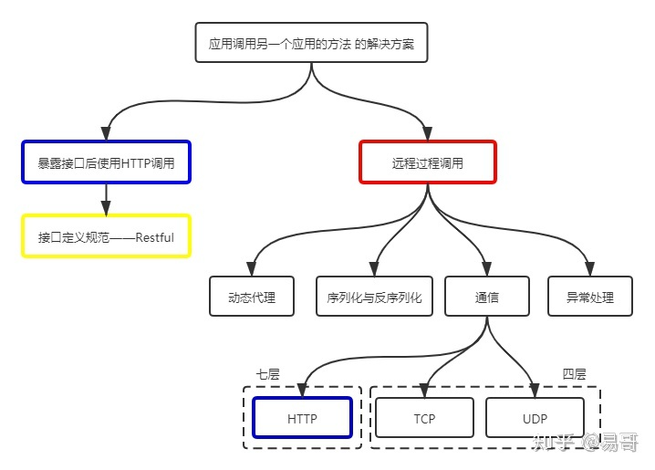
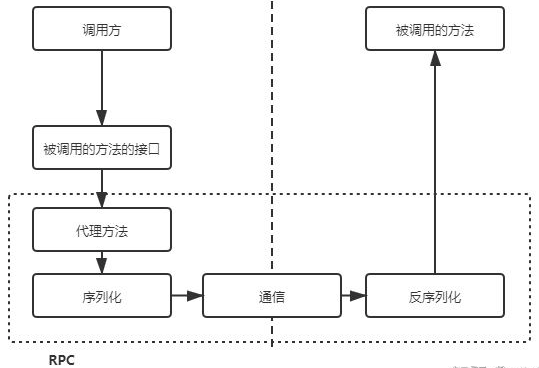

# Table of Contents

* [疑惑](#疑惑)
* [解答](#解答)
* [不单效率那么简单](#不单效率那么简单)
* [所以为什么要用rpc调用？](#所以为什么要用rpc调用)
* [RPC 底层是怎么实现的](#rpc-底层是怎么实现的)
  * [调用链路](#调用链路)
* [总结](#总结)
* [参考资料](#参考资料)


　	网上充斥着各类类似于这样的文章：rpc 比 http 快了多少倍？既然有了 http，为什么还要用 rpc 调用等等。遇到这类文章，说明对 http 和 rpc 是由理解误区的。

　　这里再次重复强调一遍，**通信协议不是 rpc 最重要的部分**，不要被这类回答带偏。如果要了解 rpc 请更多的去了解服务治理(SOA)的一些基本策略，推荐去看看 dubbo 的相关文档。


# 疑惑

　rpc是远端过程调用，其调用协议通常包含：**传输协议 和 序列化协议。**

　+   传输协议

　　比如著名的 grpc，它底层使用的是 http2 协议；还有 dubbo 一类的自定义报文的 tcp 协议

　+ 序列化协议

　　例如基于文本编码的 json 协议；也有二进制编码的 protobuf、hession 等协议；还有针对 java 高性能、高吞吐量的 kryo 和 ftc 等序列化协议

　　因此我理解大部人理解误区的问题应该是：

　　**为什么要使用自定义 tcp 协议的 rpc 做后端进程通信？**


# 解答

​		要解决这个问题就应该搞清楚 http 使用的 tcp 协议，和我们自定义的 tcp 协议在报文上的区别。

　　首先要 **否认** 一点 http 协议相较于 自定义tcp 报文协议，增加的开销在于连接的建立与断开。

　　第一、http协议是支持连接池复用的，也就是建立一定数量的连接不断开，并不会频繁的创建和销毁连接

　　第二、http也可以使用 protobuf 这种二进制编码协议对内容进行编码

　　**因此二者即 http 和 rpc 最大的区别还是在传输协议上。**


通用定义的http1.1协议的tcp报文包含太多废信息，一个POST协议的格式大致如下

```
HTTP/1.0 200 OK 
Content-Type: text/plain
Content-Length: 137582
Expires: Thu, 05 Dec 1997 16:00:00 GMT
Last-Modified: Wed, 5 August 1996 15:55:28 GMT
Server: Apache 0.84

<html>
  <body>Hello World</body>
</html>
```

　　即使编码协议也就是 body 是使用二进制编码协议，报文元数据也就是header头的键值对却使用了文本编码，非常占字节数。如上图所使用的报文中有效字节数仅仅占约 30%，也就是70%的时间用于传输元数据废编码。当然实际情况下报文内容可能会比这个长，但是报头所占的比例也是非常可观的。

　　那么假如我们使用自定义tcp协议的报文如下


　　报头占用的字节数也就只有16个byte，极大地精简了传输内容。

　　这也就是为什么后端进程间通常会采用 自定义tcp协议 的 rpc 来进行通信的原因。


# 不单效率那么简单

　　所谓的效率优势是针对 http1.1协议 来讲的，http2.0协议 已经优化编码效率问题，像 grpc 这种 rpc 库使用的就是 http2.0协议。这么来说吧，http容器的性能测试单位通常是kqps，自定义tpc协议则通常是以 10kqps 到 100kqps 为基准

　　简单来说成熟的 rpc库相对 http容器，更多的是封装了 “服务发现”，"负载均衡"，“熔断降级” 一类面向服务的高级特性。可以这么理解，rpc框架是面向服务的更高级的封装。如果把一个http servlet 容器上封装一层服务发现 和 函数代理调用，那它就已经可以做一个rpc框架了。


# 所以为什么要用rpc调用？

因为良好的 rpc 调用是 面向服务的封装，**针对服务的 可用性 和 效率 等都做了优化**。单纯使用http调用则缺少了这些特性。

可以这样说：用http不是因为它性能好，而是因为它普适，随便一个web容器就能跑起来你的应用。


# RPC 底层是怎么实现的

　之前有看过几个帖子，评论区有激烈的争吵，主要围绕两点，具体如下：

　　1. HTTP 和 RPC 是同一级别，还是被 RPC 包含？

　　2. Restful 也属于 RPC 吗？

　　对于以上两个问题，这里用一个图来一一说明：



上图是一个比较完整的关系图，这时我们发现HTTP（图中蓝色框）出现了两次。

　　其中一个是 和 RPC并列的，都是跨应用调用方法的解决方案；

　　另一个则是被RPC包含的，是RPC通信过程的可选协议之一。

　　因此，**第一个问题的答案是都对。看指的是哪一个蓝色框。**从题主的提问看，既然题主在纠结这两者，应该是指与RPC并列的蓝色框。

　　**第二个问题**是在问远程过程调用（红色框）是不是包含了Restful（黄色框），这种理解的关键在于对RPC的理解。

　　RPC字面理解是"远程过程调用"，即在一个应用中调用另一个应用的方法。那Restful是满足的，通过它可以实现在一个应用中调用另一个应用的方法。

　　但是，上述理解使得RPC的定义过于宽泛。RPC通常特指在一个应用中调用另一个应用的接口而实现的远程调用，即红色框所指的范围。这样，RPC是不包含Restful的。

　　因此，**第二个问题的答案是Restful不属于RPC。**

　　RPC的英文全称是：Remote Procedure Call，翻译为中文叫 “远程过程调用”。其中稍显晦涩的其实就是“过程”，过程其实就是“方法”。所以，可以把RPC理解为“远程方法调用”。

　　要了解远程过程调用，那先理解过程调用。非常简单，如下图，就是调用一个方法。这太常见了，不多解释。


而在分布式系统中，因为每个服务的边界都很小，很有可能调用别的服务提供的方法。这就出现了服务A 调用 服务B 中方法的需求，即远程过程调用。

　　要想让服务A 调用 服务B 中的方法，最先想到的就是通过 HTTP 请求实现。是的，这是很常见的，例如 服务B 暴露 Restful接口，然后让 服务A 调用它的接口。基于Restful的调用方式因为可读性好（服务B暴露出的是Restful接口，可读性当然好）而且HTTP请求可以通过各种防火墙，因此非常不错。

　　然而，如前面所述，基于Restful的远程过程调用有着明显的缺点，主要是效率低、封装调用复杂。当存在大量的服务间调用时，这些缺点变得更为突出。

　　服务A 调用 服务B 的过程是应用间的内部过程，**牺牲可读性提升效率、易用性是可取的**。基于这种思路，RPC产生了。

　　通常，RPC要求在调用方中放置被调用的方法的接口。**调用方只要调用了这些接口，就相当于调用了被调用方的实际方法，十分易用**。于是，调用方可以像调用内部接口一样调用远程的方法，而不用封装参数名和参数值等操作。


## 调用链路

第一、首先，调用方调用的是接口，必须得为接口构造一个假的实现。显然，要使**用动态代理**。这样，调用方的调用就被动态代理接收到了。

　　第二、动态代理接收到调用后，应该想办法调用远程的实际实现。这包括下面几步：

　　　　1. 识别具体要调用的远程方法的 IP、端口

　　　　2. 将调用方法的入参进行序列化

　　　　3. 通过通信将请求发送到远程的方法中

　　第三、这样，远程的服务就接收到了调用方的请求。它应该：

　　　　1. 反序列化各个调用参数

　　　　2. 定位到实际要调用的方法，然后输入参数，执行方法

　　　　3. 按照调用的路径返回调用的结果

　　整个过程如下所示。



　调用方调用内部的一个方法，但是被RPC框架偷梁换柱为远程的一个方法。之间的**通信数据可读性不需要好**，只需要RPC框架能读懂即可，因此**效率可以更高**。通常使用UDP或者TCP作为通讯协议，当然也可以使用HTTP。


# 总结

1. RPC和HTTP相比，不单单是自定义TCP传输协议，**针对服务的 可用性 和 效率 等都做了优化**。

   > 个人觉得对服务的封装和可用才是RPC的亮点


# 参考资料

https://www.cnblogs.com/liang1101/p/13083965.html
