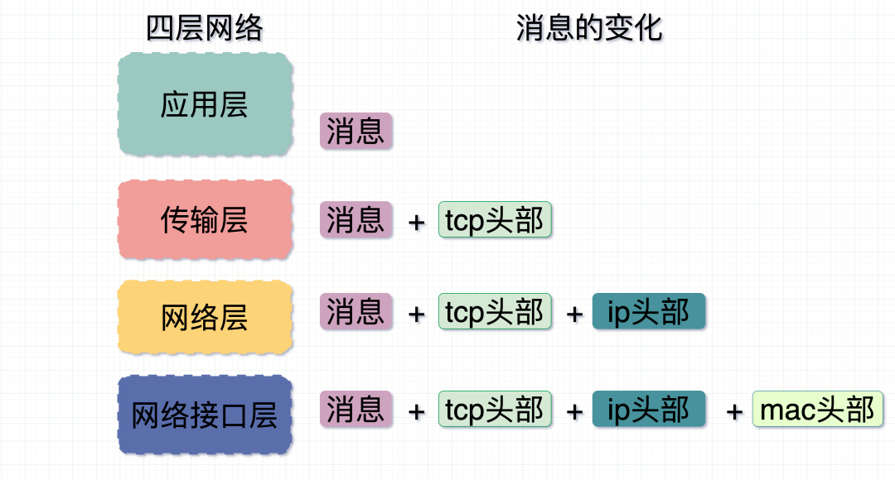
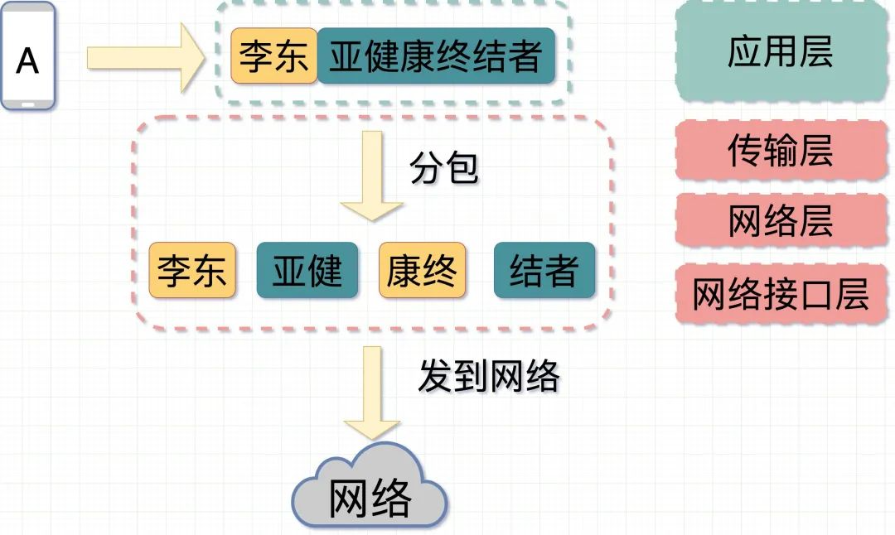
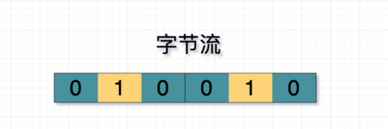
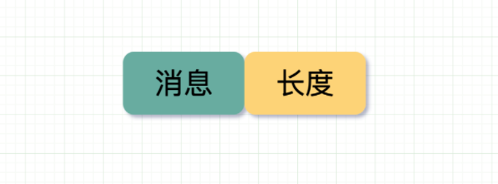

# Table of Contents

* [基础知识](#基础知识)
* [什么是粘包？](#什么是粘包)
* [为什么会出现粘包](#为什么会出现粘包)
* [怎么处理粘包](#怎么处理粘包)
  * [加入特殊标志](#加入特殊标志)
  * [加入消息长度信息](#加入消息长度信息)
* [IP 层有粘包问题吗](#ip-层有粘包问题吗)
* [UDP会粘包吗](#udp会粘包吗)
* [总结](#总结)
* [参考资料](#参考资料)

粘包这个词想必经常听到吧，那么到底什么是TCP粘包呢？会带来什么问题？我们应该怎么解决呢?

# 基础知识

[数据包在网络中路程](数据包在网络中路程.md)

- `MTU`：一个网络包的最大长度，以太网中一般为 `1500` 字节。
- `MSS`：除去 IP 和 TCP 头部之后，一个网络包所能容纳的 TCP 数据的最大长度。
- `IP头`: 记录的是从哪来和到哪去，传输层头记录到是到达目的主机后具体去哪个进程。
- `mac头部`: 记录的是硬件的唯一地址.

# 什么是粘包？

李东在手机上键入"李东""亚健康终结者"的时候，在 TCP 中把消息分成 MSS 大小后，消息顺着网线顺利发出。

网络稳得很，依靠[TCP可靠机制](TCP可靠机制.md)，将消息分片传到了对端手机 B 上。经过 TCP 层消息重组。变成"李东亚健康终结者"这样的**字节流（stream）**。

**本身TCP处理机制是没问题的！**但是开发人员在服务端处理**字节流**的时候，容易出现上一个包的内容与下一个包里的内容**粘在**一起被错误地当成了一个数据包解析了出来。这就是所谓的**粘包**。

> 精髓所在，多读几遍。
>
> 可见TCP并没问题，有问题的是开发人员

# 为什么会出现粘包

**TCP，Transmission Control Protocol**。传输控制协议，是一种面向连接的、可靠的、基于**字节流**的传输层通信协议。

字节流可以理解为一个双向的通道里流淌的数据，这个**数据**其实就是我们常说的二进制数据，简单来说就是一大堆 01 串。这些 01 串之间**没有任何边界**。

应用层传到 TCP 协议的数据，不是以**消息报为单位**向目的主机发送，而是以**字节流**的方式发送到下游，

这些数据可能被**切割和组装**成各种数据包，**接收端**收到这些数据包后没有**正确还原原来的消息**，因此出现粘包现象。

# 怎么处理粘包

粘包出现的根本原因是不确定**消息的边界**。接收端在面对**"无边无际"的二进制流**的时候，根本不知道收了多少 01 才算**一个消息**。一不小心拿多了就说是**粘包**。其实粘包根本不是 TCP 的问题，是使用者对于 TCP 的理解有误导致的一个问题。

只要在发送端每次发送消息的时候给消息**带上识别消息边界的信息**，接收端就可以根据这些信息识别出消息的边界，从而区分出每个消息。

## 加入特殊标志

可以通过特殊的标志作为头尾，比如当收到了`0xfffffe`或者回车符，则认为收到了新消息的头，此时继续取数据，直到收到下一个头标志`0xfffffe`或者尾部标记，才认为是一个完整消息。类似的像 HTTP 协议里当使用**chunked 编码**传输时，使用若干个 chunk 组成消息，最后由一个标明长度为 0 的 chunk 结束。

可能这时候会有朋友会问，采用`0xfffffe`标志位，用来标志一个数据包的开头，你就不怕你发的某个数据里正好有这个内容吗？

是的，**怕**，所以一般除了这个标志位，发送端在发送时还会加入各种校验字段（`校验和`或者对整段完整数据进行`CRC`之后获得的数据）放在标志位后面，在接收端拿到整段数据后校验下确保它就是发送端发来的完整数据。

##  加入消息长度信息

这个一般配合上面的特殊标志一起使用，在收到头标志时，里面还可以带上消息长度，以此表明在这之后多少 byte 都是属于这个消息的。如果在这之后正好有符合长度的 byte，则取走，作为一个完整消息给应用层使用。

**在实际场景中，HTTP 中的`Content-Length`就起了类似的作用，当接收端收到的消息长度小于 Content-Length 时，说明还有些消息没收到。那接收端会一直等，直到拿够了消息或超时**

# IP 层有粘包问题吗

IP 层会对大包进行切片，是不是也有粘包问题？

先说结论，不会。首先前文提到了，粘包其实是由于使用者无法正确区分消息边界导致的一个问题。

先看看 IP 层的切片分包是怎么回事。

- 如果消息过长，`IP层`会按**MTU 长度**把消息分成**N 个切片**，每个切片带有自身在**包里的位置（offset）**和**同样的IP头信息**。
- 各个切片在网络中进行传输。每个数据包切片可以在不同的路由中流转，然后**在最后的终点汇合后再组装**。
- 在接收端收到第一个切片包时会申请一块新内存，创建IP包的数据结构，等待其他切片分包数据到位。
- 等消息全部到位后就把整个消息包给到上层（传输层）进行处理。

可以看出整个过程，`IP 层`从按长度切片到把切片组装成一个数据包的过程中，都只管运输，都不需要在意消息的边界和内容，都不在意消息内容了，那就不会有粘包一说了。

`IP 层`表示：我只管把发送端给我的数据传到接收端就完了，我也不了解里头放了啥东西。

# UDP会粘包吗 

不会！

UDP在报头中有`16bit`用于指示**UDP 数据报文的长度**，假设这个长度是 n ，以此作为**数据边界**。因此在接收端的应用层能清晰地将不同的数据报文区分开，从报头开始取 n 位，就是一个**完整的**数据报，从而避免粘包和拆包的问题。

# 总结

粘包这个问题的根因是由于开发人员没有正确理解 TCP 面向字节流的数据传输方式，**本身并不是 TCP 的问题，是开发者的问题**。

- TCP 不管发送端要发什么，都基于字节流把数据发到接收端。这个字节流里可能包含上一次想要发的数据的部分信息。接收端根据需要在消息里加上识别消息边界的信息。不加就可能出现粘包问题。
- TCP 粘包跟Nagle算法有关系，但关闭 Nagle 算法并不解决粘包问题。
- UDP 是基于数据报的传输协议，不会有粘包问题。
- IP 层也切片，但是因为不关心消息里有啥，因此有不会有粘包问题。
- `TCP`发送端可以发`10 次`字节流数据，接收端可以分`100 次`去取；`UDP`发送端发了`10 次`数据报，那接收端就要在`10 次`收完。

数据包也只是按着 TCP 的方式进行组装和拆分，**如果数据包有错，那数据包也只是犯了每个数据包都会犯的错而已**。

# 参考资料

https://mp.weixin.qq.com/s/_IczZ0sMy_cjnTazOuoStw
