# Table of Contents

* [网络模型](#网络模型)
* [Http请求](#http请求)
  * [解析URL](#解析url)
  * [产生 HTTP 请求信息](#产生-http-请求信息)
* [真实地址查询 ——DNS](#真实地址查询-dns)
  * [域名的层级关系](#域名的层级关系)
* [指南好帮手 ——协议栈](#指南好帮手-协议栈)
* [可靠传输 —— TCP](#可靠传输--tcp)
  * [TCP包头格式](#tcp包头格式)
  * [三次握手](#三次握手)
  * [分割数据(MSS)](#分割数据mss)
  * [TCP报文](#tcp报文)
* [远程定位 —— IP](#远程定位--ip)
  * [IP 包头格式](#ip-包头格式)
  * [确认源地址IP(路由规则)](#确认源地址ip路由规则)
  * [IP报文生成](#ip报文生成)
* [MAC](#mac)
  * [MAC 包头格式](#mac-包头格式)
  * [MAC 发送方和接收方如何确认?(ARP)](#mac-发送方和接收方如何确认arp)
  * [**ARP 缓存**](#arp-缓存)
  * [MAC 报文生成](#mac-报文生成)
* [出口 —— 网卡](#出口--网卡)
* [送别者 —— 交换机](#送别者--交换机)
* [出境大门 —— 路由器](#出境大门--路由器)
  * [路由器与交换机的区别](#路由器与交换机的区别)
* [互相扒皮 —— 服务器 与 客户端](#互相扒皮--服务器-与-客户端)
* [总结](#总结)
* [参考资料](#参考资料)

> > **当键入网址后，到网页显示，其间发生了什么**?

# 网络模型

简单的网络模型

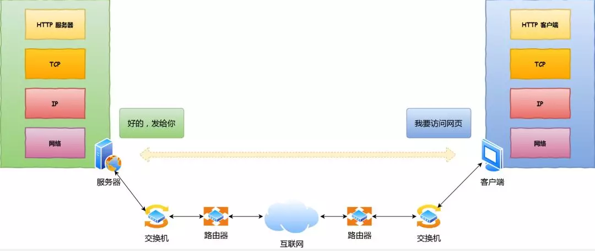

# Http请求

## 解析URL

首先浏览器做的第一步工作就是要对 `URL` 进行解析，从而生发送给 `Web` 服务器的请求信息。

让我们看看一条长长的 URL 里的各个元素的代表什么，见下图：

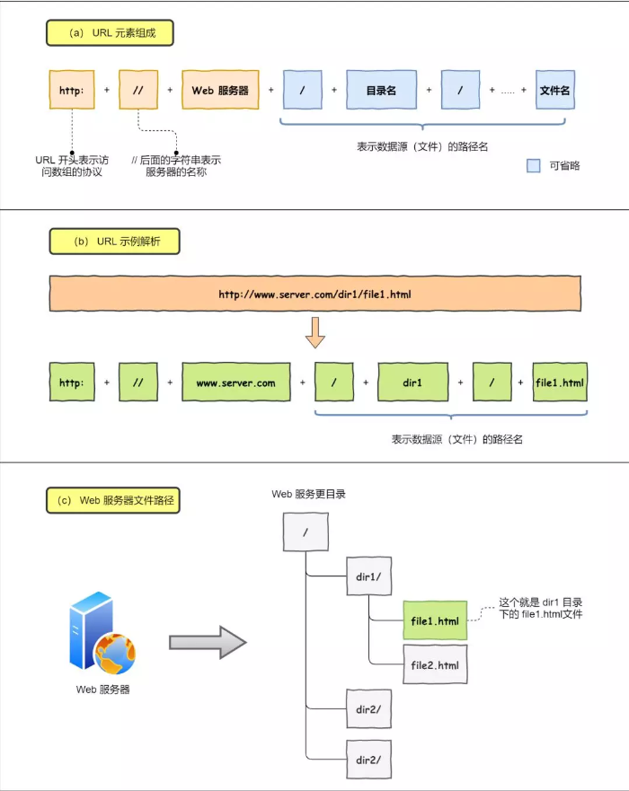

当没有路径名时，就代表访问根目录下事先设置的**默认文件**，也就是 `/index.html` 或者 `/default.html` 这些文件，这样就不会发生混乱了。

## 产生 HTTP 请求信息

对 `URL` 进行解析之后，浏览器确定了 Web 服务器和文件名，接下来就是根据这些信息来生成 HTTP 请求消息了。

> 超文本传输协议
>
> 个人理解：一种规定好可以传输消息的文本

# 真实地址查询 ——DNS

通过浏览器解析 URL 并生成 HTTP 消息后，**需要委托操作系统将消息发送给 `Web` 服务器。**

但在发送之前，还有一项工作需要完成，那就是**查询服务器域名对于的 IP 地址**，因为委托操作系统发送消息时，必须提供通信对象的 IP 地址。

比如我们打电话的时候，必须要知道对方的电话号码，但由于电话号码难以记忆，所以通常我们会将对方电话号 + 姓名保存在通讯录里。

所以，有一种服务器就专门保存了 **`Web` 服务器域名与 `IP` 的对应关系**，它就是 `DNS` 服务器。

## 域名的层级关系

DNS 中的域名都是用**句点**来分隔的，比如 `www.server.com`，这里的句点代表了不同层次之间的**界限**。

> 在域名中，**越靠右**的位置表示其层级**越高**。(英语就是反着来的)
>

根域是在最顶层，它的下一层就是 com 顶级域，再下面是 server.com。

所以域名的层级关系类似一个树状结构：

- 根 DNS 服务器
- 顶级域 DNS 服务器（com）
- 权威 DNS 服务器（server.com）

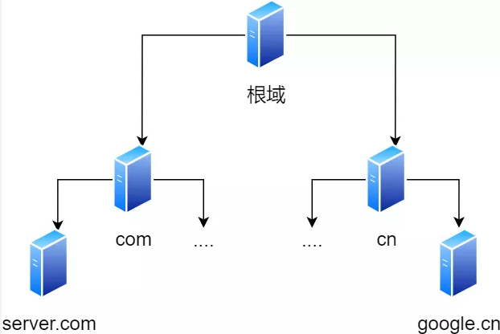

根域的 DNS 服务器信息保存在互联网中所有的 DNS 服务器中。

这样一来，任何 DNS 服务器就都可以找到并访问根域 DNS 服务器了。

因此，**客户端只要能够找到任意一台 DNS 服务器，就可以通过它找到根域 DNS 服务器，然后再一路顺藤摸瓜找到位于下层的某台目标 DNS 服务器**。

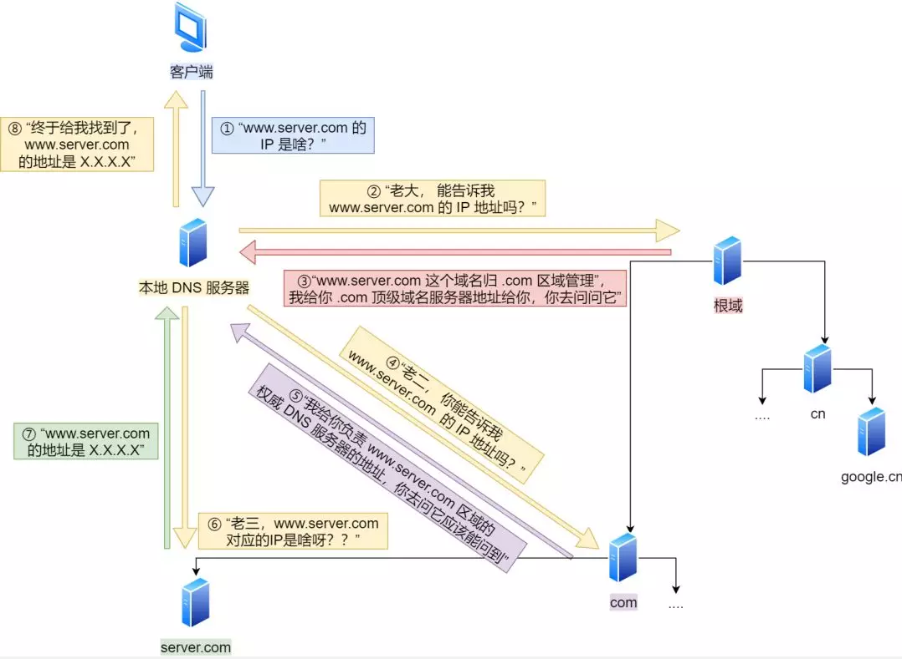

> DNS 域名解析的过程蛮有意思的，整个过程就和我们日常生活中找人问路的过程类似，**只指路不带路**。

[具体介绍](https://mp.weixin.qq.com/s/dRLQj9RTrC81C9HfQaC3jw)

# 指南好帮手 ——协议栈

通过 DNS 获取到 IP 后，就可以把 **HTTP 的传输工作**交给操作系统中的**协议栈**。

协议栈的内部分为几个部分，分别承担不同的工作。**上下关系是有一定的规则的**，上面的部分会向下面的部分委托工作，下面的部分收到委托的工作并执行。

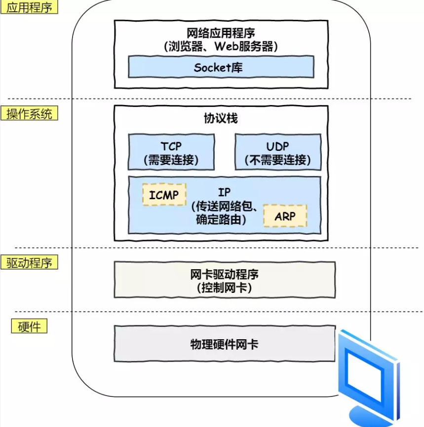

应用程序（浏览器）通过调用 Socket 库，来委托协议栈工作。

协议栈的上半部分有两块，分别是负责收发数据的 TCP 和 UDP 协议，它们两会**接受应用层的委托**执行收发数据的操作。

> java调用socket网络接口，可封装不同的协议

协议栈的下面一半是用 IP 协议控制网络包收发操作，在互联网上传数据时，**数据刽被切分成一块块的网络包**，**而将网络包发送给对方的操作就是由 IP 负责的**。

此外 IP 中还包括 `ICMP` 协议和 `ARP` 协议。

- `ICMP` 用于告知网络包传送过程中产生的错误以及各种控制信息。
- `ARP` 用于根据 IP 地址查询相应的以太网 MAC 地址。

IP 下面的网卡驱动程序负责控制网卡硬件，**而最下面的网卡则负责完成实际的收发操作，也就是对网线中的信号执行发送和接收操作。**

# 可靠传输 —— TCP

> Tcp是要建立连接的，UDP不需要
> 类似生活中的打电话和发邮件。

HTTP 是基于 TCP 协议传输的，所以在这我们先了解下 TCP 协议。

## TCP包头格式

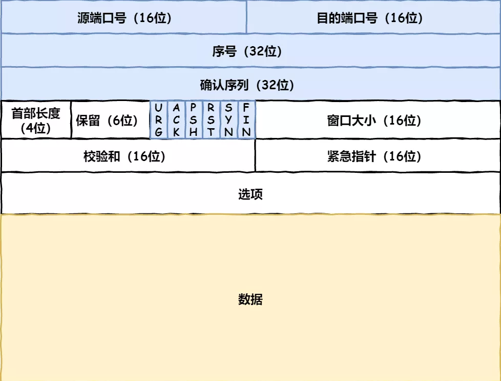

首先，**源端口号**和**目标端口**号是不可少的，如果没有这两个端口号，数据就不知道应该发给哪个应用。

接下来有包的**序**号，这个是为了解决包乱序的问题。

还有应该有的是**确认号**，目的是确认发出去对方是否有收到。如果没有收到就应该重新发送，直到送达，这个是为了解决不丢包的问题。

接下来还有一些**状态位**。例如 `SYN` 是发起一个连接，`ACK` 是回复，`RST` 是重新连接，`FIN` 是结束连接等。TCP 是面向连接的，因而双方要维护连接的状态，这些带状态位的包的发送，会引起双方的状态变更。

还有一个重要的就是**窗口大小**。TCP 要做**流量控制**，通信双方各声明一个窗口（缓存大小），标识自己当前能够的处理能力，别发送的太快，撑死我，也别发的太慢，饿死我。

除了做流量控制以外，TCP还会做**拥塞控制**，对于真正的通路堵车不堵车，它无能为力，唯一能做的就是控制自己，也即控制发送的速度。不能改变世界，就改变自己嘛。

> 后面会仔细了解TCP 比较经常问

## 三次握手

在 HTTP 传输数据之前，首先需要 TCP 建立连接，TCP 连接的建立，通常称为**三次握手**。

这个所谓的「连接」，只是双方计算机里维护一个状态机，在连接建立的过程中，双方的状态变化时序图就像这样。

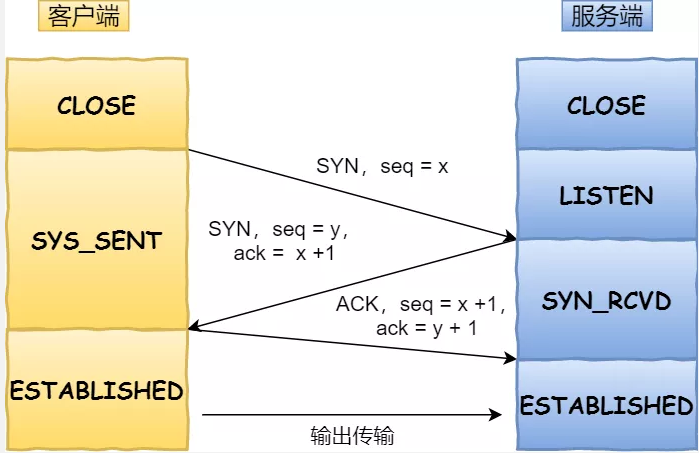

- 一开始，客户端和服务端都处于 `CLOSED` 状态。先是服务端主动监听某个端口，处于 `LISTEN` 状态。
- 然后客户端主动发起连接 `SYN`，之后处于 `SYN-SENT` 状态。
- 服务端收到发起的连接，返回 `SYN`，并且 `ACK` 客户端的 `SYN`，之后处于 `SYN-RCVD` 状态。
- 客户端收到服务端发送的 `SYN` 和 `ACK` 之后，发送 `ACK` 的 `ACK`，之后处于 `ESTABLISHED` 状态，因为它一发一收成功了。
- 服务端收到 `ACK` 的 `ACK` 之后，处于 `ESTABLISHED` 状态，因为它也一发一收了。

所以三次握手目的是**保证双方都有发送和接收的能力**。

## 分割数据(MSS)

如果 HTTP 请求消息比较长，超过了 `MSS` 的长度，这时 TCP 就需要把 HTTP 的数据拆解一块块的数据发送，而不是一次性发送所有数据。

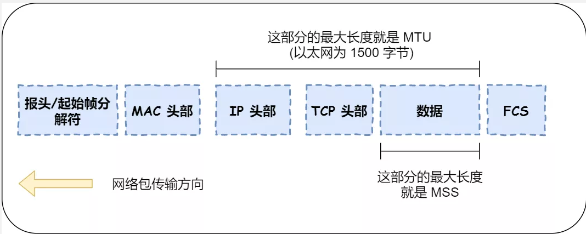

- `MTU`：一个网络包的最大长度，以太网中一般为 `1500` 字节。
- `MSS`：除去 IP 和 TCP 头部之后，一个网络包所能容纳的 TCP 数据的最大长度。

数据会被以 `MSS` 的长度为单位进行拆分，拆分出来的每一块数据都会被放进单独的网络包中。也就是在每个被拆分的数据加上 TCP 头信息，然后交给 IP 模块来发送数据。

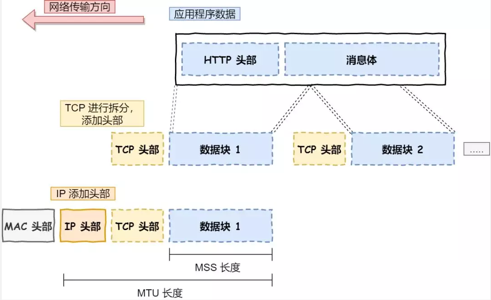

## TCP报文

TCP 协议里面会有两个端口，一个是浏览器监听的端口（通常是随机生成的），一个是 Web 服务器监听的端口（HTTP 默认端口号是 `80`， HTTPS 默认端口号是 `443`）。

在双方建立了连接后，TCP 报文中的数据部分就是存放 **HTTP 头部 + 数据**，组装好 TCP 报文之后，就需交给下面的网络层处理。

至此，网络包的报文如下图。

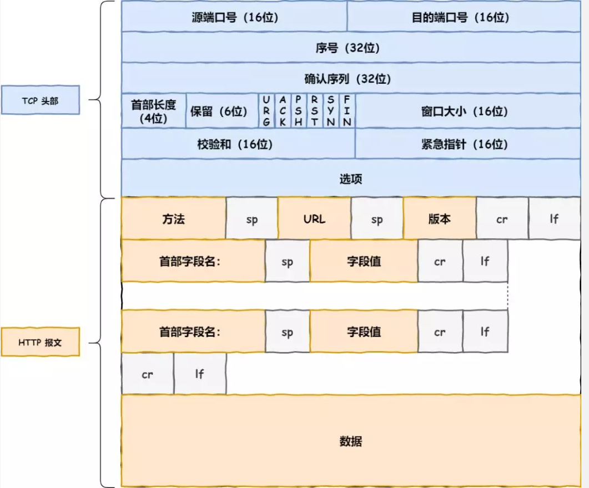

# 远程定位 —— IP

TCP 模块在**执行连接、收发、断开**等各阶段操作时，都需要**委托 IP 模块将数据封装成网络包**发送给通信对象。

## IP 包头格式

我们先看看 IP 报文头部的格式：

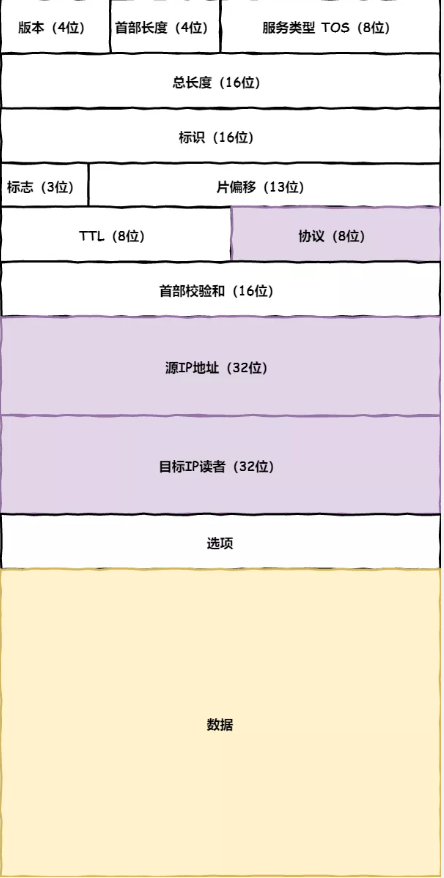

在 IP 协议里面需要有**源地址 IP** 和 **目标地址 IP**：

- 源地址IP，即是客户端输出的 IP 地址；
- 目标地址，即通过 DNS 域名解析得到的 Web 服务器 IP。

因为 HTTP 是经过 TCP 传输的，所以在 IP 包头的**协议号**，要填写为 `06`（十六进制），表示协议为 TCP。

## 确认源地址IP(路由规则)

假设客户端有多个网卡，就会有多个 IP 地址，那 IP 头部的源地址应该选择哪个 IP 呢？

当存在多个网卡时，在填写源地址 IP 时，就需要判断到底应该填写哪个地址。这个判断相当于在多块网卡中判断应该使用哪个一块网卡来发送包。

这个时候就需要根据**路由表**规则，来判断哪一个网卡作为源地址 IP。

在 Linux 操作系统，我们可以使用 `route -n` 命令查看当前系统的路由表。

举个例子，根据上面的路由表，我们假设 Web 服务器的目标地址是 `192.168.10.200`。

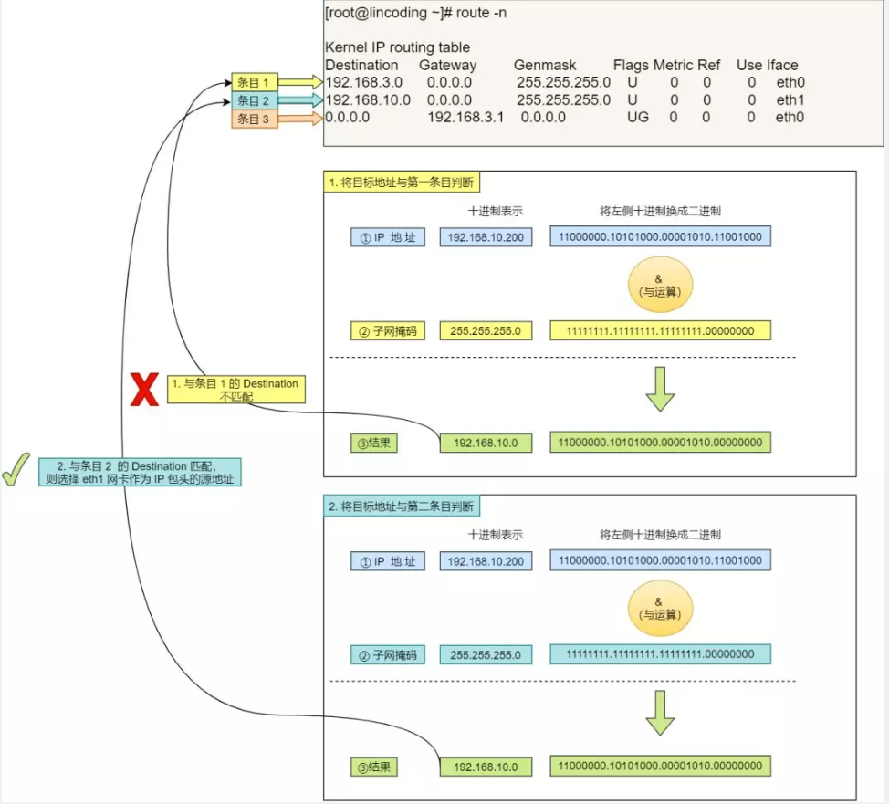

1. 首先先和第一条条目的子网掩码（`Genmask`）进行 **与运算**，得到结果为 `192.168.10.0`，但是第一个条目的 `Destination` 是 `192.168.3.0`，两者不一致所以匹配失败。
2. 再与第二条目的子网掩码进行 **与运算**，得到的结果为 `192.168.10.0`，与第二条目的 `Destination 192.168.10.0` 匹配成功，所以将使用 `eth1` 网卡的 IP 地址作为 IP
   包头的源地址。

那么假设 Web 服务器的目标地址是 `10.100.20.100`，那么依然依照上面的路由表规则判断，判断后的结果是和第三条目匹配。

第三条目比较特殊，它目标地址和子网掩码都是 `0.0.0.0`，这表示**默认网关**，如果其他所有条目都无法匹配，就会自动匹配这一行。并且后续就把包发给路由器，`Gateway` 即是路由器的 IP 地址。

> DNS最开始解析的时候 我们可以拿到IP
> 用这个IP和客户端的网卡的子网掩码进行与运算
>
> 如果没有匹配上，就有默认网关的`gateway`

## IP报文生成

# MAC

> 为什么有了Ip还需要mac？
> IP:收货地址
> MAC:个人信息
>
> 同一个热点下，IP是相同的，但是MAC不同。

生成了 IP 头部之后，接下来网络包还需要在 IP 头部的前面加上 **MAC 头部**。

> MAC地址（英语：Media Access Control Address），直译为媒体存取控制位址，也称为局域网地址（LAN Address），MAC位址，以太网地址（Ethernet Address）或物理地址（Physical Address），它是一个用来确认网络设备位置的位址。
>
> 在OSI模型中，第三层网络层负责IP地址，第二层数据链路层则负责MAC位址。MAC地址用于在网络中唯一标示一个网卡，一台设备若有一或多个网卡，则每个网卡都需要并会有一个唯一的MAC地址。

## MAC 包头格式

MAC 头部是以太网使用的头部，它包含了接收方和发送方的 MAC 地址等信息

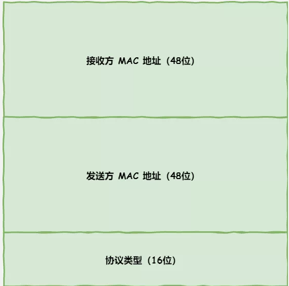

在 MAC 包头里需要**发送方 MAC 地址**和**接收方目标 MAC 地址**，用于**两点之间的传输**。

一般在 TCP/IP 通信里，MAC 包头的**协议类型**只使用：

- `0800` ：IP 协议
- `0806` ：ARP 协议

## MAC 发送方和接收方如何确认?(ARP)

**发送方**的 MAC 地址获取就比较简单了，MAC 地址是在网卡生产时写入到 ROM 里的，只要将这个值读取出来写入到 MAC 头部就可以了。

**接收方**的 MAC 地址就有点复杂了，只要告诉以太网对方的 MAC 的地址，以太网就会帮我们把包发送过去，那么很显然这里应该填写对方的 MAC 地址。

此时就需要 `ARP` 协议帮我们找到路由器的 MAC 地址。

ARP 协议会在以太网中以**广播**的形式，对以太网所有的设备喊出：“这个 IP 地址是谁的？请把你的 MAC 地址告诉我”。

然后就会有人回答：“这个 IP 地址是我的，我的 MAC 地址是 XXXX”。

如果对方和自己处于同一个子网中，那么通过上面的操作就可以得到对方的 MAC 地址。然后，我们将这个 MAC 地址写入 MAC 头部，MAC 头部就完成了。

## **ARP 缓存**

在后续操作系统会把本次查询结果放到一块叫做 **ARP 缓存**的内存空间留着以后用，不过缓存的时间就几分钟。

也就是说，在发包时：

- 先查询 ARP 缓存，如果其中已经保存了对方的 MAC 地址，就不需要发送 ARP 查询，直接使用 ARP 缓存中的地址。
- 而当 ARP 缓存中不存在对方 MAC 地址时，则发送 ARP 广播查询。

## MAC 报文生成

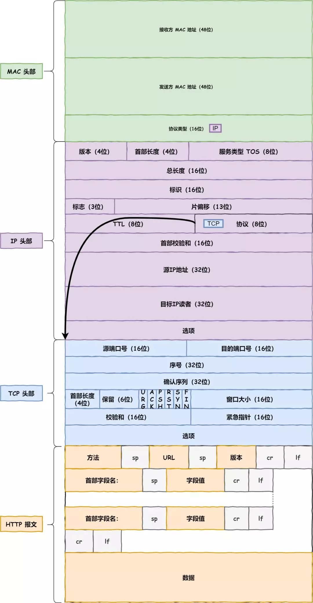

# 出口 —— 网卡

IP 生成的网络包只是存放在内存中的一串二进制数字信息，没有办法直接发送给对方。因此，我们需要将**数字信息转换为电信号**，才能在网线上传输，也就是说，这才是真正的数据发送过程。

负责执行这一操作的是**网卡**，要控制网卡还需要靠**网卡驱动程序**。

网卡驱动从 IP 模块获取到包之后，会将其**复制**到网卡内的缓存区中，接着会其**开头加上报头和起始帧分界符，在末尾加上用于检测错误的帧校验序列**。

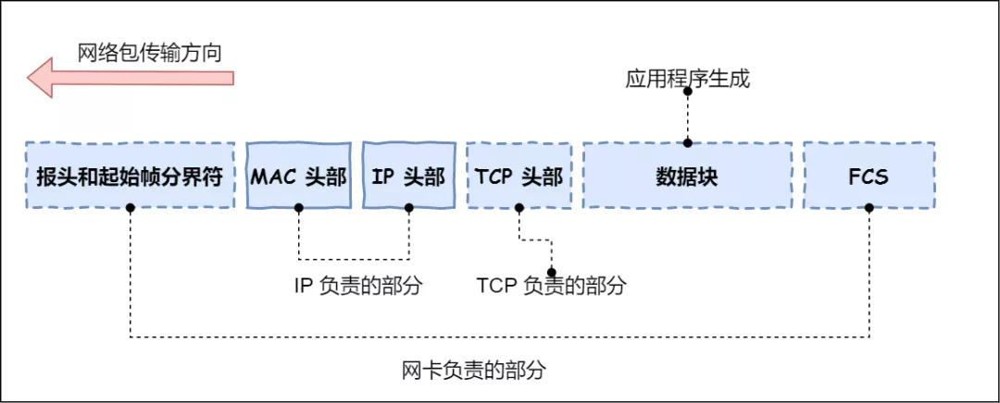

- 起始帧分界符是一个用来表示包起始位置的标记
- 末尾的 `FCS`（帧校验序列）用来检查包传输过程是否有损坏

最后网卡会将**包转为电信号，通过网线发送出去。**

# 送别者 —— 交换机

> 交换机拥有一条高带宽的背部总线和内部交换矩阵，在同一时刻可进行多个端口对之间的数据传输。

下面来看一下包是如何通过交换机的。交换机的设计是将网络包**原样**转发到目的地。交换机工作在 MAC 层，也称为**二层网络设备**。

# 出境大门 —— 路由器

> 简单地说：路由器是连接不同子网，（即不同IP地址段）使各子网间能够相互通讯的设备。
> 交换机：内部是有关
> 路由器：外部桥梁

## 路由器与交换机的区别

网络包经过交换机之后，现在到达了**路由器**，并在此被转发到下一个路由器或目标设备。

这一步转发的工作原理和交换机类似，也是通过查表判断包转发的目标。

不过在具体的操作过程上，路由器和交换机是有区别的。

- 因为**路由器**是基于 IP 设计的，俗称**三层**网络设备，路由器的各个端口都具有 MAC 地址和 IP 地址；
- 而**交换机**是基于以太网设计的，俗称**二层**网络设备，交换机的端口不具有 MAC 地址。

#  互相扒皮 —— 服务器 与 客户端

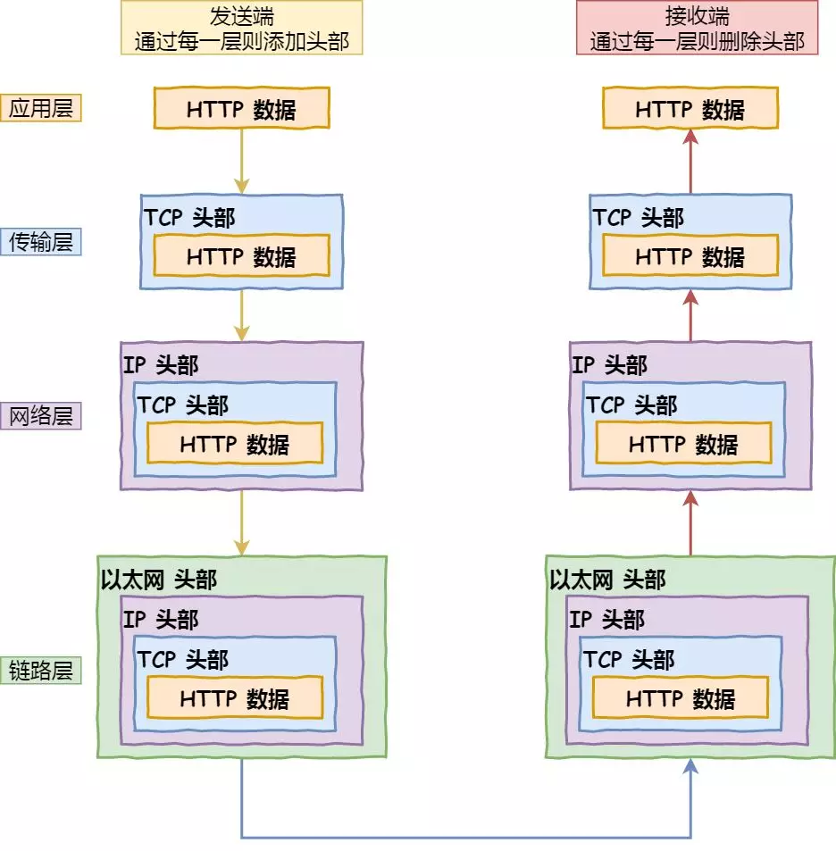

最后经历四次挥手

# 总结

1. 协议栈的图片才是精华

# 参考资料

https://mp.weixin.qq.com/s/iSZp41SRmh5b2bXIvzemIw
