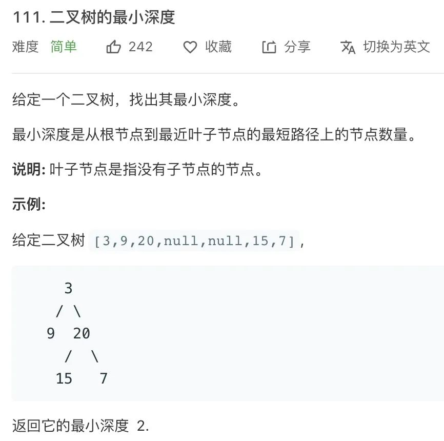
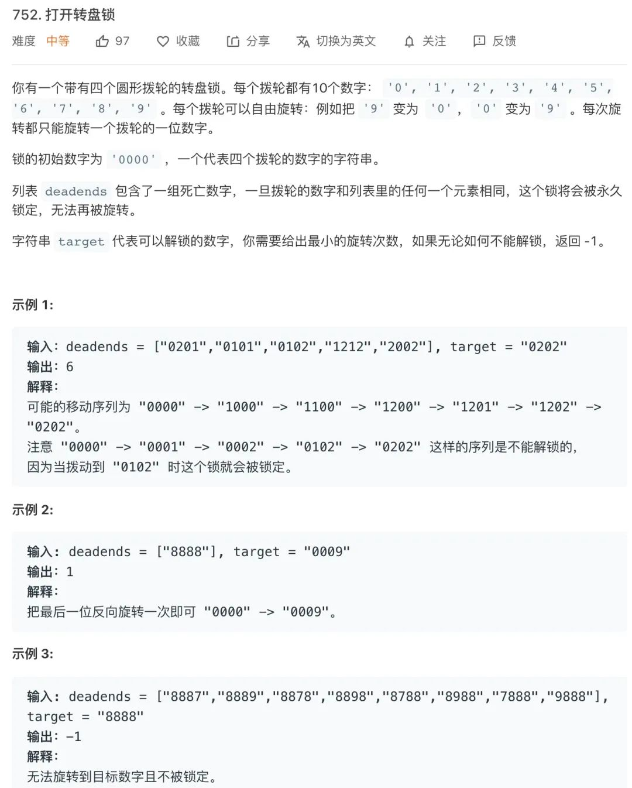

# Table of Contents

* [算法框架](#算法框架)
* [二叉树的最小高度](#二叉树的最小高度)
* [BFS 和DFS的探讨](#bfs-和dfs的探讨)
* [打开转盘锁](#打开转盘锁)
  * [思路分析](#思路分析)
  * [代码框架](#代码框架)
  * [代码逻辑](#代码逻辑)
* [双向BFS优化](#双向bfs优化)
* [参考资料](#参考资料)


BFS 的核心思想应该不难理解的，就是把一些问题抽象成图，从一个点开始，向四周开始扩散。一般来说，**我们写 BFS 算法都是用「队列」这种数据结构**，每次将一个节点周围的所有节点加入队列。


BFS 相对 DFS 的最主要的区别是：**BFS 找到的路径一定是最短的，但代价就是空间复杂度比 DFS 大很多**，至于为什么，我们后面介绍了框架就很容易看出来了。

本文就由浅入深写两道 BFS 的典型题目，分别是「二叉树的最小高度」和「打开密码锁的最少步数」，手把手教你怎么写 BFS 算法。


# 算法框架

问题的本质就是让你在一幅「图」中找到**从起点`start`到终点`target`的最近距离**，这个例子听起来很枯燥，但是 BFS 算法问题其实都是在干这个事儿。


```java
// 计算从起点 start 到终点 target 的最近距离
int BFS(Node start, Node target) {
    Queue<Node> q; // 核心数据结构
    Set<Node> visited; // 避免走回头路

    q.offer(start); // 将起点加入队列
    visited.add(start);
    int step = 0; // 记录扩散的步数

    while (q not empty) {
        //这行代码比较重要！！！ 因为队列的数据是在动态变化的，我们需要将当前数据的数量取出来。
      	//而不是简单的使用 q.size()
        int sz = q.size();
        /* 将当前队列中的所有节点向四周扩散 */
        for (int i = 0; i < sz; i++) {
            Node cur = q.poll();
            /* 划重点：这里判断是否到达终点 */
            if (cur is target)
                return step;
            /* 将 cur 的相邻节点加入队列 */
            for (Node x : cur.adj())
                if (x not in visited) {
                    q.offer(x);
                    visited.add(x);
                }
        }
        /* 划重点：更新步数在这里 */
        step++;
    }
}
```


# 二叉树的最小高度



怎么套到 BFS 的框架里呢？首先明确一下起点`start`和终点`target`是什么，怎么判断到达了终点？

**显然起点就是`root`根节点，终点就是最靠近根节点的那个「叶子节点」嘛**，叶子节点就是两个子节点都是`null`的节点：

```
if (cur.left == null && cur.right == null) 
    // 到达叶子节点
```

那么，按照我们上述的框架稍加改造来写解法即可：

```java
int minDepth(TreeNode root) {
    if (root == null) return 0;
    Queue<TreeNode> q = new LinkedList<>();
    q.offer(root);
    // root 本身就是一层，depth 初始化为 1
    int depth = 1;

    while (!q.isEmpty()) {
        //这里比较重要
        int sz = q.size();
        /* 将当前队列中的所有节点向四周扩散 */
        for (int i = 0; i < sz; i++) {
            TreeNode cur = q.poll();
            /* 判断是否到达终点 */
            if (cur.left == null && cur.right == null) 
                return depth;
            /* 将 cur 的相邻节点加入队列 */
            if (cur.left != null)
                q.offer(cur.left);
            if (cur.right != null) 
                q.offer(cur.right);
        }
        /* 这里增加步数 */
        depth++;
    }
    return depth;
}
```


# BFS 和DFS的探讨

**1、为什么 BFS 可以找到最短距离，DFS 不行吗**？

首先，你看 BFS 的逻辑，`depth`每增加一次，队列中的所有节点都向前迈一步，这保证了第一次到达终点的时候，走的步数是最少的。

DFS 不能找最短路径吗？其实也是可以的，但是时间复杂度相对高很多。

你想啊，DFS 实际上是靠递归的堆栈记录走过的路径，你要找到最短路径，肯定得把二叉树中所有树杈都探索完才能对比出最短的路径有多长对不对？

而 BFS 借助队列做到一次一步「齐头并进」，是可以在不遍历完整棵树的条件下找到最短距离的。

形象点说，DFS 是线，BFS 是面；DFS 是单打独斗，BFS 是集体行动。这个应该比较容易理解吧。


**2、既然 BFS 那么好，为啥 DFS 还要存在**？

BFS 可以找到最短距离，但是空间复杂度高，而 DFS 的空间复杂度较低。

还是拿刚才我们处理二叉树问题的例子，假设给你的这个二叉树是满二叉树，节点总数为`N`，对于 DFS 算法来说，空间复杂度无非就是递归堆栈，最坏情况下顶多就是树的高度，也就是`O(logN)`。

但是你想想 BFS 算法，队列中每次都会储存着二叉树一层的节点，这样的话最坏情况下空间复杂度应该是树的最底层节点的数量，也就是`N/2`，用 Big O 表示的话也就是`O(N)`。

由此观之，BFS 还是有代价的，一般来说在找最短路径的时候使用 BFS，其他时候还是 DFS 使用得多一些（主要是递归代码好写）。


# 打开转盘锁

[]()




这个题我最开始看的好懵，没有理解题目的意思。。。。。。

## 思路分析

BFS一般思路，就是将当前可能放到队列中，然后往下走，直到满足条件为止。

对于这题来说。首先是当前拨动密码有多少种可能？才能拨到正确的密码。对于`deadends`无非就是遇到了就跳出

1. 如果只是简单转一下锁，会有几种可能？一共有4个位置，每个位置可以**向上**也可以**向下**。

   比如说从`"0000"`开始，转一次，可以穷举出`"1000", "9000", "0100", "0900"，"0010"，"0090"，"0001"，"0009"`共 8 种密码。

2. 然后，再以这 8 种密码作为基础，对每个密码再转一下，穷举出所有可能…
3. 避开所有死亡密码，直到找到正确密码为止。


## 代码框架

```java
int openLock(String[] deadends, String target) {
    // 定义访问过的数据 
       Set<String> visited = new HashSet<>();
	//将死亡队列提前加入进去，不用走回头路
   	// 定义存储数据的队列
     Queue<String> q = new LinkedList<>();
    //加入起点
     q.offer("0000");
     visited.add("0000");
    
    //进行队列循环
     while (!q.isEmpty()) {

		  /* 将当前队列中的所有节点向周围扩散 */
        for (int i = 0; i < sz; i++) {
          //判断是否到达重点
         //判断是否以及走过 continue
         
          // 这里其实就是对应二叉树的左右节点，只不过这里情况复杂些
          //下面是加入8种可能性
         //遍历队列的数据 4个 因为每次波动密码后，都会有4个位置可以选择
           for (int j = 0; j < 4; j++) {
				
               //加入向上的
               //加入向下的
               
           }
        }
      
         
     }
	return -1;
    
}
```


## 代码逻辑

```java
   int openLock(String[] deadends, String target) {
    // 记录需要跳过的死亡密码
    Set<String> deads = new HashSet<>();
    for (String s : deadends) deads.add(s);
    // 记录已经穷举过的密码，防止走回头路
    Set<String> visited = new HashSet<>();
    Queue<String> q = new LinkedList<>();
    // 从起点开始启动广度优先搜索
    int step = 0;
    q.offer("0000");
    visited.add("0000");

    while (!q.isEmpty()) {
        int sz = q.size();
        /* 将当前队列中的所有节点向周围扩散 */
        for (int i = 0; i < sz; i++) {
            String cur = q.poll();

            /* 判断是否到达终点 */
            if (deads.contains(cur))
                continue;
            if (cur.equals(target))
                return step;

            /* 将一个节点的未遍历相邻节点加入队列 */
            for (int j = 0; j < 4; j++) {
                String up = plusOne(cur, j);
                if (!visited.contains(up)) {
                    q.offer(up);
                    visited.add(up);
                }
                String down = minusOne(cur, j);
                if (!visited.contains(down)) {
                    q.offer(down);
                    visited.add(down);
                }
            }
        }
        /* 在这里增加步数 */
        step++;
    }
    // 如果穷举完都没找到目标密码，那就是找不到了
    return -1;
}
// 将 s[j] 向上拨动一次
String plusOne(String s, int j) {
    char[] ch = s.toCharArray();
    if (ch[j] == '9')
        ch[j] = '0';
    else
        ch[j] += 1;
    return new String(ch);
}
// 将 s[i] 向下拨动一次
String minusOne(String s, int j) {
    char[] ch = s.toCharArray();
    if (ch[j] == '0')
        ch[j] = '9';
    else
        ch[j] -= 1;
    return new String(ch);
}
```


# 双向BFS优化

BFS 算法还有一种稍微高级一点的优化思路：**双向 BFS**，可以进一步提高算法的效率。

**传统的 BFS 框架就是从起点开始向四周扩散，遇到终点时停止；而双向 BFS 则是从起点和终点同时开始扩散，当两边有交集的时候停止**。

为什么这样能够能够提升效率呢？其实从 Big O 表示法分析算法复杂度的话，它俩的最坏复杂度都是`O(N)`，但是实际上双向 BFS 确实会快一些，我给你画两张图看一眼就明白了：


**不过，双向 BFS 也有局限，因为你必须知道终点在哪里**。比如我们刚才讨论的二叉树最小高度的问题，你一开始根本就不知道终点在哪里，也就无法使用双向 BFS；但是第二个密码锁的问题，是可以使用双向 BFS 算法来提高效率的，代码稍加修改即可：


# 参考资料

https://mp.weixin.qq.com/s/WH_XGm1-w5882PnenymZ7g
