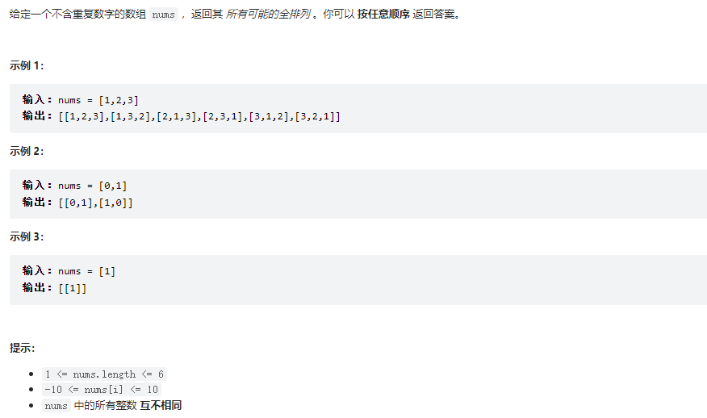
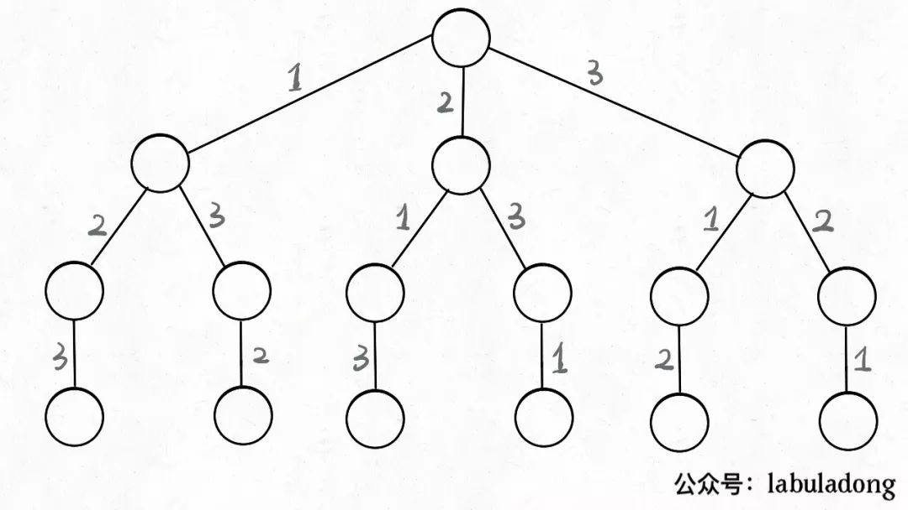
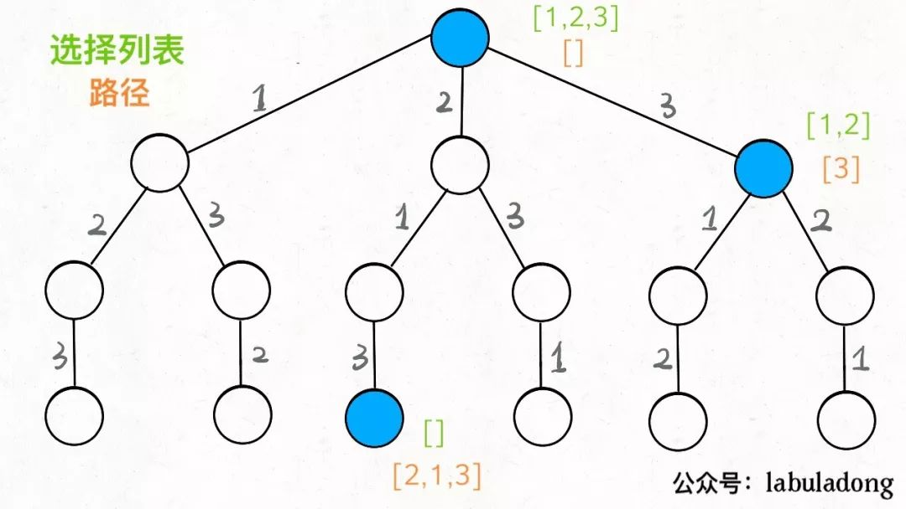
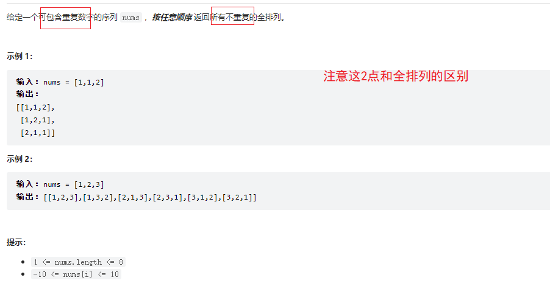

# Table of Contents

* [代码框架](#代码框架)
* [[46. 全排列](https://leetcode-cn.com/problems/permutations/){元素无重不可复选}](#46-全排列httpsleetcode-cncomproblemspermutations元素无重不可复选)
  * [代码逻辑](#代码逻辑)
* [[47.全排列II](https://leetcode-cn.com/problems/permutations-ii/){元素可重不可复选}](#47全排列iihttpsleetcode-cncomproblemspermutations-ii元素可重不可复选)
  * [个人思考](#个人思考)
  * [大神逻辑](#大神逻辑)
  * [思路分析](#思路分析)
* [元素无重可复选](#元素无重可复选)
* [参考资料](#参考资料)


# 代码框架


**解决一个回溯问题，实际上就是一个决策树的遍历过程**。你只需要思考 3 个问题：

**1、路径**：也就是已经做出的选择。

**2、选择列表**：也就是你当前可以做的选择。

**3、结束条件**：也就是到达决策树底层，无法再做选择的条件。

如果你不理解这三个词语的解释，没关系，我们后面会用「全排列」和「N 皇后问题」这两个经典的回溯算法问题来帮你理解这些词语是什么意思，现在你先留着印象。

代码方面，回溯算法的框架：

```java
result = []
def backtrack(路径, 选择列表):
    if 满足结束条件:
        result.add(路径)
        return

    for 选择 in 选择列表:
        做选择
        backtrack(路径, 选择列表)
        撤销选择 ?-- 为什么要撤销选择了，因为在你终止这一个遍历的时候，你需要回到最初的节点，做下一次的决策选择，你需要清空当前存储的临时变量。
```

**其核心就是 for 循环里面的递归，在递归调用之前「做选择」，在递归调用之后「撤销选择」**，特别简单。

> 如何做选择呢？这里是可以搞事情的
>
> 1. 之前选的是不是不可以选了？
> 2. 重复的可以选吗，


# [46. 全排列](https://leetcode-cn.com/problems/permutations/){元素无重不可复选}




我们在高中的时候就做过排列组合的数学题，我们也知道`n`个不重复的数，全排列共有 n! 个。

PS：**为了简单清晰起见，我们这次讨论的全排列问题不包含重复的数字**。

那么我们当时是怎么穷举全排列的呢？比方说给三个数`[1,2,3]`，你肯定不会无规律地乱穷举，一般是这样：

先固定第一位为 1，然后第二位可以是 2，那么第三位只能是 3；然后可以把第二位变成 3，第三位就只能是 2 了；然后就只能变化第一位，变成 2，然后再穷举后两位……

其实这就是回溯算法，我们高中无师自通就会用，或者有的同学直接画出如下这棵回溯树：



只要从根遍历这棵树，记录路径上的数字，其实就是所有的全排列。**我们不妨把这棵树称为回溯算法的「决策树」**。

**为啥说这是决策树呢，因为你在每个节点上其实都在做决策**。


比如说你站在下图的红色节点上：


你现在就在做决策，可以选择 1 那条树枝，也可以选择 3 那条树枝。为啥只能在 1 和 3 之中选择呢？因为 2 这个树枝在你身后，这个选择你之前做过了，而全排列是不允许重复使用数字的。

**现在可以解答开头的几个名词：**

**`[2]`就是「路径」，记录你已经做过的选择；**

**`[1,3]`就是「选择列表」，表示你当前可以做出的选择；**

**「结束条件」就是遍历到树的底层，在这里就是选择列表为空的时候**。

如果明白了这几个名词，**可以把「路径」和「选择列表」作为决策树上每个节点的属性**，比如下图列出了几个节点的属性：




**我们定义的`backtrack`函数其实就像一个指针，在这棵树上游走，同时要正确维护每个节点的属性，每当走到树的底层，其「路径」就是一个全排列**。

再进一步，如何遍历一棵树？这个应该不难吧。回忆一下之前 [学习数据结构的框架思维](http://mp.weixin.qq.com/s?__biz=MzAxODQxMDM0Mw==&mid=2247484520&idx=1&sn=2c6507c7f25c0fd29fd1d146ee3b067c&chksm=9bd7fa60aca073763785418d15ed03c9debdd93ca36f4828fa809990116b1e7536c3f68a7b71&scene=21#wechat_redirect) 写过，各种搜索问题其实都是树的遍历问题，而多叉树的遍历框架就是这样：

```
void traverse(TreeNode root) {
    for (TreeNode child : root.childern)
        // 前序遍历需要的操作
        traverse(child);
        // 后序遍历需要的操作
}
```

而所谓的前序遍历和后序遍历，他们只是两个很有用的时间点

**前序遍历的代码在进入某一个节点之前的那个时间点执行，后序遍历代码在离开某个节点之后的那个时间点执行**。

**我们只要在递归之前做出选择，在递归之后撤销刚才的选择**，就能正确得到每个节点的选择列表和路径。

> 这句话多读几遍！！


## 代码逻辑

```java

    List<List<Integer>> res = new LinkedList<>();

    LinkedList<Integer> track = new LinkedList<>();

    //为什么要定义一个这个，如果是数组 可以直接用track.contains来判断，链表就不行了。
    boolean[] used;

    public List<List<Integer>> permute(int[] nums) {
        used = new boolean[nums.length];
        backtrack(nums);
        return res;
    }

    void backtrack(int[] nums) {
        //终止条件
        if (track.size() == nums.length) {
            res.add(new LinkedList(track));
            return;
        }

        for (int i = 0; i < nums.length; i++) {
            //已经做过决策 跳出
            if (used[i]) {
                continue;
            }
            //加入路径
            used[i] = true;
            track.add(nums[i]);
            //选择列表
            backtrack(nums);
            //撤出路径
            used[i] = false;
            track.removeLast();
        }
    }
```


>  但如果题目不让你算全排列，而是让你算元素个数为 `k` 的排列，怎么算？

只需要更改下，终止结束条件就好了

```java
void backtrack(int[] nums, int k) {
    // base case，到达第 k 层
    if (track.size() == k) {
        // 第 k 层节点的值就是大小为 k 的排列
        res.add(new LinkedList(track));
        return;
    }

    // 回溯算法标准框架
    for (int i = 0; i < nums.length; i++) {
        // ...
        backtrack(nums, k);
        // ...
    }
}
```


# [47.全排列II](https://leetcode-cn.com/problems/permutations-ii/){元素可重不可复选}




## 个人思考

初始思路分析：

1. 当前元素包含重复的数据，那么我们进行选择列表选择的时候，如何辨别哪一个元素已经被选择了？
2. 返回结果需要返回不重复的数据，那么是不是需要在返回的时候，做一下判断？


代码框架

```java

void backTrack(int nums){
    //终止条件
    
    //加入最终返回结果，但是要去重
    
    //判断当前元素是否被选择过？
	
    //加入轨迹
    
    //下一层
    
    //退出轨迹  
    
}

```


## 大神逻辑

剪枝逻辑:就是将重复路径去除掉。

```java
List<List<Integer>> res = new LinkedList<>();
LinkedList<Integer> track = new LinkedList<>();
boolean[] used;

public List<List<Integer>> permuteUnique(int[] nums) {
    // 先排序，让相同的元素靠在一起
    Arrays.sort(nums);
    used = new boolean[nums.length];
    backtrack(nums, track);
    return res;
}

void backtrack(int[] nums) {
    if (track.size() == nums.length) {
        res.add(new LinkedList(track));
        return;
    }

    for (int i = 0; i < nums.length; i++) {
        if (used[i]) {
            continue;
        }
        // 新添加的剪枝逻辑，固定相同的元素在排列中的相对位置
        if (i > 0 && nums[i] == nums[i - 1] && !used[i - 1]) {
            continue;
        }
        track.add(nums[i]);
        used[i] = true;
        backtrack(nums);
        track.removeLast();
        used[i] = false;
    }
}

```


你对比一下之前的标准全排列解法代码，这段解法代码只有两处不同：

**1、对 `nums` 进行了排序。**

**2、添加了一句额外的剪枝逻辑。**

```java
   // 先排序，让相同的元素靠在一起
    Arrays.sort(nums);
    // 新添加的剪枝逻辑，固定相同的元素在排列中的相对位置
    if (i > 0 && nums[i] == nums[i - 1] && !used[i - 1]) {
        continue;
    }
```


## 思路分析

为了方便研究，依然把相同的元素用上标 `'` 以示区别。

假设输入为 `nums = [1,2,2']`，标准的全排列算法会得出如下答案：

```java
[
    [1,2,2'],[1,2',2],
    [2,1,2'],[2,2',1],
    [2',1,2],[2',2,1]
]

```

显然，这个结果存在重复，比如 `[1,2,2']` 和 `[1,2',2]` 应该只被算作同一个排列，但被算作了两个不同的排列。

所以现在的关键在于，如何设计剪枝逻辑，把这种重复去除掉？

**答案是，保证相同元素在排列中的相对位置保持不变**。

比如说 `nums = [1,2,2']` 这个例子，我保持排列中 `2` 一直在 `2'` 前面。

这样的话，你从上面 6 个排列中只能挑出 3 个排列符合这个条件：

```
[ [1,2,2'],[2,1,2'],[2,2',1] ]
```

这也就是正确答案。

进一步，如果 `nums = [1,2,2',2'']`，我只要保证重复元素 `2` 的相对位置固定，比如说 `2 -> 2' -> 2''`，也可以得到无重复的全排列结果。

仔细思考，应该很容易明白其中的原理：

**标准全排列算法之所以出现重复，是因为把相同元素形成的排列序列视为不同的序列，但实际上它们应该是相同的；而如果固定相同元素形成的序列顺序，当然就避免了重复**。

那么反映到代码上，你注意看这个剪枝逻辑：

```java
// 新添加的剪枝逻辑，固定相同的元素在排列中的相对位置
if (i > 0 && nums[i] == nums[i - 1] && !used[i - 1]) {
    // false:  如果前面的相邻相等元素没有用过，则跳过
	//true:  如果前面的相邻相等元素有用过 那么自己也可以开始用了
    continue;
}
// 选择 nums[i]
```

**当出现重复元素时，比如输入 `nums = [1,2,2',2'']`，`2'` 只有在 `2` 已经被使用的情况下才会被选择，`2''` 只有在 `2'` 已经被使用的情况下才会被选择，这就保证了相同元素在排列中的相对位置保证固定**。


#  元素无重可复选


直接把过滤条件 used去掉就好了


# 参考资料

+ https://mp.weixin.qq.com/s?__biz=MzAxODQxMDM0Mw==&mid=2247484709&idx=1&sn=1c24a5c41a5a255000532e83f38f2ce4&scene=21#wechat_redirect
+ https://labuladong.gitee.io/algo/4/30/110/  【全文】

