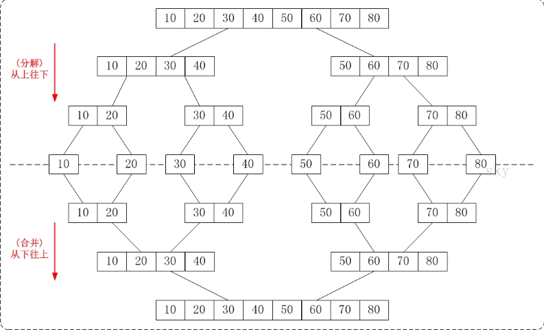

# Table of Contents

* [参考资料](#参考资料)
* [快排](#快排)
* [归并](#归并)


# 参考资料
[东哥手把手带你套框架刷通二叉树|第一期](https://mp.weixin.qq.com/s?__biz=MzAxODQxMDM0Mw==&mid=2247487126&idx=1&sn=4de13e66397bc35970963c5a1330ce18&scene=21#wechat_redirect)


举个例子，比如说我们的经典算法「快速排序」和「归并排序」，对于这两个算法，你有什么理解？**如果你告诉我，快速排序就是个二叉树的前序遍历，归并排序就是个二叉树的后续遍历，那么我就知道你是个算法高手了**。

```java
/* 二叉树遍历框架 */
void traverse(TreeNode root) {
    // 前序遍历 
    traverse(root.left)
    // 中序遍历
    traverse(root.right)
    // 后序遍历
}
```


为什么快速排序和归并排序能和二叉树扯上关系？我们来简单分析一下他们的算法思想和代码框架：


# 快排

快速排序的逻辑是，

若要对`nums[lo..hi]`进行排序，

+ 我们先找一个分界点`p`，通过交换元素使得`nums[lo..p-1]`都小于等于`nums[p]`，且`nums[p+1..hi]`都大于`nums[p]`，

+ 然后递归地去`nums[lo..p-1]`和`nums[p+1..hi]`中寻找新的分界点，

最后整个数组就被排序了。

快速排序的代码框架如下

```java
   static void sort(int[] nums, int lo, int hi) {
        if(lo<=hi){
            /****** 前序遍历位置 ******/
            // 通过交换元素构建分界点 p
            int p = partition(nums, lo, hi);
            /************************/
            sort(nums, lo, p - 1);
            sort(nums, p + 1, hi);
        }

    }
```

 先构造分界点，然后去左右子数组构造分界点，你看这不就是一个二叉树的前序遍历吗？ 


再来看怎么实现`partition`,找到基准值。

 假设对以下10个数进行快速排序： 


 我们先模拟快速排序的过程：首先，在这个序列中随便找一个数作为基准数，通常为了方便，以第一个数作为基准数。 


在初始状态下，数字6在序列的第1位。我们的目标是将6挪到序列中间的某个位置，假设这个位置是k kk。现在就需要寻找这个k kk，并且以第k位为分界点，左边的数都≤ 6 \le6≤6，右边的数都≥ 6 \ge6≥6。那么如何找到这个位置k kk呢？

我们要知道，快速排序其实是冒泡排序的一种改进，冒泡排序每次对相邻的两个数进行比较，这显然是一种比较浪费时间的。

而快速排序是分别从两端开始”探测”的，先从右往左找一个小于6的数，再从左往右找一个大于6的数，然后交换他们。这里可以用两个变量i ii和j jj，分别指向序列最左边和最右边。我们为这两个变量起个好听的名字“哨兵i ii”和“哨兵j jj”。刚开始的时候让哨兵i ii指向序列的最左边，指向数字6。让哨兵j jj指向序列的最右边，指向数字8。


首先哨兵j jj开始出动。因为此处设置的基准数是最左边的数，所以需要让哨兵j jj先出动，这一点非常重要。哨兵j jj一步一步地向左挪动（即j = j − 1 j = j-1j=j−1），直到找到一个小于6的数停下来。接下来哨兵i ii再一步一步向右挪动（即i = i + 1 i=i+1i=i+1），直到找到一个数大于6的数停下来。最后哨兵j jj停在了数字5面前，哨兵i ii停在了数字7面前。


 现在交换哨兵$i$和哨兵$j$所指向的元素的值。交换之后的序列如下。 


到此，第一次交换结束。接下来开始哨兵j jj继续向左挪动（再友情提醒，每次必须是哨兵j先出发）。他发现了4 < 6 4<64<6，停下来。哨兵i ii也继续向右挪动的，他发现了9 > 6 9>69>6，停下来。此时再次进行交换，交换之后的序列如下。


第二次交换结束。哨兵j jj继续向左挪动，他发现了3 < 6 3<63<6，又停下来。哨兵i ii继续向右移动，此时哨兵i ii和哨兵j jj相遇了，哨兵i ii和哨兵j jj都走到3面前。说明此时“探测”结束。我们将基准数6和3进行交换。交换之后的序列如下。


> 注意这里是需要交换位置的。

```java
 public static int partition(int[]arr,int begin,int end){
        int temp = arr[begin];
        int i = begin;
        int j = end;
        while (i!=j){
            //注意是 while
            while(i<j&&arr[j]>=temp){
                j--;
            }
            //注意是 while
            while(i<j&&arr[i]<=temp){
                i++;
            }
            if(i<j){
                //交换ij位置
                ArraysUtil.swap(arr,i,j);
            }
        }
        //ij相等 交换基准位置
        ArraysUtil.swap(arr, begin, i);
        return i;
    }
```


# 归并

归并排序的逻辑，若要对`nums[lo..hi]`进行排序，我们先对`nums[lo..mid]`排序，再对`nums[mid+1..hi]`排序，最后把这两个有序的子数组合并，整个数组就排好序了。

[https://mp.weixin.qq.com/s/7_jsikVCARPFrJ6Hj1EYsg?forceh5=1](https://mp.weixin.qq.com/s/7_jsikVCARPFrJ6Hj1EYsg?forceh5=1)




归并排序的代码框架如下：

```java
   public static void sort(int nums[],int lo,int hi){
        //注意 这里是小于 不是小于等于
      if(lo<hi){
          int mid = (lo + hi) / 2;
          sort(nums, lo, mid);
          sort(nums, mid + 1, hi);

          /****** 后序遍历位置 ******/
          // 合并两个排好序的子数组
          merge(nums, lo, mid, hi);
          /************************/
      }
    }
```

先对左右子数组排序，然后合并（**类似合并有序链表的逻辑**），你看这是不是二叉树的后序遍历框架？

我们看看merge是怎么实现的

```java
 /**
     * 类似合并有序链表
     * begin-mid
     * mid-end
     * 本身已经是有序的，我们需要合并他们
     */
    public static void merge(int arr[],int begin,int mid,int end){

        int left = begin;
        int right = mid+1;
        int temp[] = new int [arr.length];
        int i = 0;

        while (left<=mid&&right<=end){
            if(arr[left]<arr[right]){
                temp[i++]=arr[left++];
            }else {
                temp[i++]=arr[right++];
            }
        }

        while (left<=mid){
            temp[i++]=arr[left++];
        }

        while (right<=end){
            temp[i++]=arr[right++];
        }
        // 将temp的元素copy到arr中
        int t=0;
        int tempLeft = begin;

        while (tempLeft <= end) {
            arr[tempLeft++] = temp[t++];
        }
    }
```

