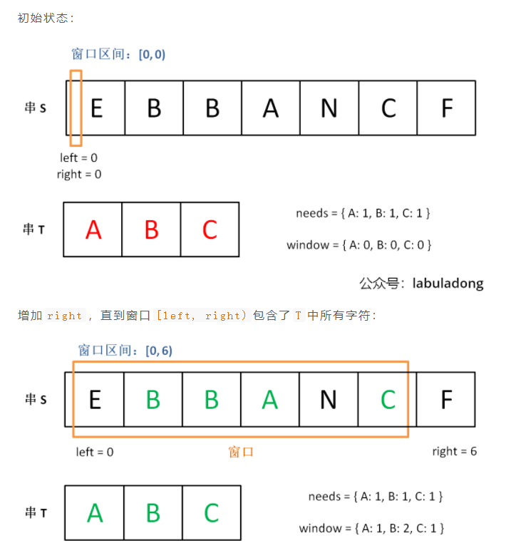
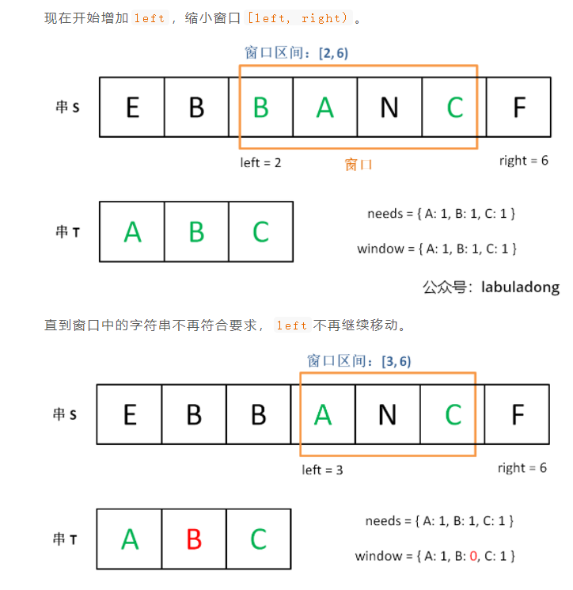
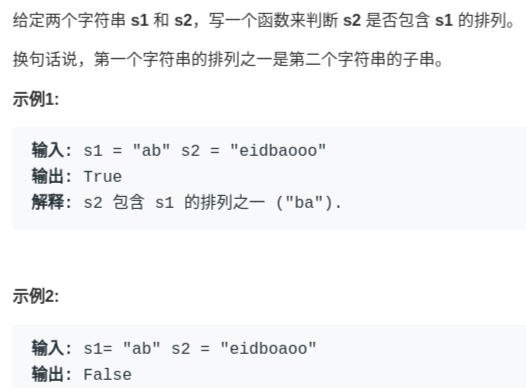

# Table of Contents

* [[76]最小覆盖字串](#76最小覆盖字串)
  * [滑动窗口算法思路](#滑动窗口算法思路)
  * [拆解思路(重点)](#拆解思路重点)
  * [最终解法](#最终解法)
* [[567]字符串排列](#567字符串排列)


# [76]最小覆盖字串

[https://leetcode-cn.com/problems/minimum-window-substring/](https://leetcode-cn.com/problems/minimum-window-substring/)


就是说要在`S`(source) 中找到包含`T`(target) 中全部字母的一个子串，且这个子串一定是所有可能子串中最短的。

如果我们使用暴力解法，代码大概是这样的：

```
for (int i = 0; i < s.size(); i++)
    for (int j = i + 1; j < s.size(); j++)
        if s[i:j] 包含 t 的所有字母:
            更新答案
```

思路很直接，但是显然，这个算法的复杂度肯定大于 O(N^2) 了，不好。


## 滑动窗口算法思路

***1、***我们在字符串`S`中使用双指针中的左右指针技巧，初始化`left = right = 0`，**把索引左闭右开区间`[left, right)`称为一个「窗口」**。

***2、***我们先不断地增加`right`指针扩大窗口`[left, right)`，直到窗口中的字符串符合要求（包含了`T`中的所有字符）。

***3、***此时，我们停止增加`right`，转而不断增加`left`指针缩小窗口`[left, right)`，直到窗口中的字符串不再符合要求（不包含`T`中的所有字符了）。同时，每次增加`left`，我们都要更新一轮结果。

***4、***重复第 2 和第 3 步，直到`right`到达字符串`S`的尽头。

这个思路其实也不难，**第 2 步相当于在寻找一个「可行解」，然后第 3 步在优化这个「可行解」，最终找到最优解，**也就是最短的覆盖子串。左右指针轮流前进，窗口大小增增减减，窗口不断向右滑动，这就是「滑动窗口」这个名字的来历。

下面画图理解一下，`needs`和`window`相当于计数器，分别记录`T`中字符出现次数和「窗口」中的相应字符的出现次数。

> needs: 我们需要找的数据
>
> `window`： 「窗口」中的相应字符的出现次数。
>
> 当needs=window的时候 说明window的数据已经复合要求了







之后重复上述过程，先移动`right`，再移动`left`…… 直到`right`指针到达字符串`S`的末端，算法结束。


## 拆解思路(重点)

1. 首先，初始化`window`和`need`两个哈希表，记录**窗口中的字符**和**需要凑齐的字符：**

   ```java
           //首先定义一个滑动窗口
           Map<Character, Integer> windows = Maps.newHashMap();
           //存放我们需要的数据 也就是t
           Map<Character, Integer> needs = Maps.newHashMap();
   
           for (char c : t.toCharArray()) {
               needs.put(c, needs.getOrDefault(c, 0) + 1);
           }
   ```

2. 然后，使用`left`和`right`变量初始化窗口的两端，不要忘了，区间`[left, right)`是左闭右开的，所以初始情况下窗口没有包含任何元素：

   ```java
           int left = 0, right = 0;
           int valid = 0;
           char[] chars = s.toCharArray();
           while (right < chars.length) {
               // 开始滑动
               char c = chars[right];
   
           }
   ```

   **其中`valid`变量表示窗口中满足`need`条件的字符个数**，如果`valid`和`need.size`的大小相同，则说明窗口已满足条件，已经完全覆盖了串`T`。

3. **现在开始套模板，只需要思考以下四个问题**：

   **1、**当移动`right`扩大窗口，即加入字符时，应该更新哪些数据？

   **2、**什么条件下，窗口应该暂停扩大，开始移动`left`缩小窗口？

   **3、**当移动`left`缩小窗口，即移出字符时，应该更新哪些数据？

   **4、**我们要的结果应该在扩大窗口时还是缩小窗口时进行更新？

4. **如果一个字符进入窗口，应该增加`window`计数器；如果一个字符将移出窗口的时候，应该减少`window`计数器；当`valid`满足`need`时应该收缩窗口；应该在收缩窗口的时候更新最终结果。**

## 最终解法

```java
public static   String minWindow(String s, String t) {
        //首先定义一个滑动窗口
        Map<Character, Integer> windows = new HashMap<>();
        //存放我们需要的数据 也就是t
        Map<Character, Integer> needs =new HashMap<>();

        for (char c : t.toCharArray()) {
            needs.put(c, needs.getOrDefault(c, 0) + 1);
        }

        int left = 0, right = 0;
        int valid = 0;
        char[] chars = s.toCharArray();

        // 记录最小覆盖子串的起始索引及长度
        int start = 0, len = Integer.MAX_VALUE;


        while (right < chars.length) {
            // 开始滑动
            char c = chars[right];
            //右移窗口
            right++;

            // 进行窗口内数据的一系列更新
            if (needs.containsKey(c)) {
                windows.put(c, windows.getOrDefault(c, 0) + 1);
                if (needs.get(c).equals(windows.get(c))) {
                    valid++;
                }
            }

            // 判断左侧窗口是否要收缩

            while (valid == needs.size()) {
                // 在这里更新最小覆盖子串
                if (right - left < len) {
                    start = left;
                    len = right - left;
                }
                // d 是将移出窗口的字符
                char d = chars[left];
                // 左移窗口
                left++;
                // 进行窗口内数据的一系列更新
                if (needs.containsKey(d)) {
                    if (needs.get(d).equals(windows.get(d))) {
                        valid--;
                    }
                    windows.put(d, windows.getOrDefault(d, 0) - 1);
                }
            }

        }

        // 返回最小覆盖子串
        return len == Integer.MAX_VALUE ? "": s.substring(start, start + len);
    }
```


# [567]字符串排列

[https://leetcode-cn.com/problems/permutation-in-string/](https://leetcode-cn.com/problems/permutation-in-string/)



注意哦，**输入的`s1`是可以包含重复字符的**，所以这个题难度不小。

> 这是与最小覆盖字串不同的地方 一个是覆盖 一个是相等

这种题目，是明显的滑动窗口算法，**相当给你一个`S`和一个`T`，请问你`S`中是否存在一个子串，包含`T`中所有字符且不包含其他字符**？


套用拆解思路

1. 什么时候right开始有移？

   > 这个可以套用模板，直接增加

2. 什么时候left开始左缩？

   > 窗口的大小>=当前T
   >
   > 为什么是这样， 从题目中我们可以看出，请问你`S`中是否存在一个子串，包含`T`中所有字符且不包含其他字符？
   >
   > 窗口的大小要>=当前T

3. 什么时候返回结果?

   > valid=need.size

   


```java
        // 判断左侧窗口是否要收缩
        while (right - left >= t.size()) {
            // 在这里判断是否找到了合法的子串
            if (valid == need.size())
                return true;
           
        }
```


