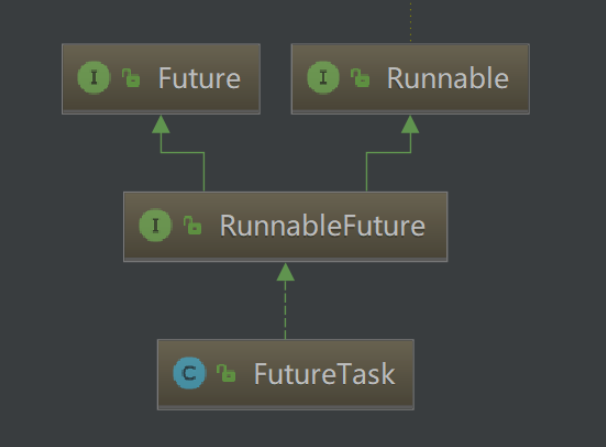

# Table of Contents

* [FutureTask](#futuretask)
  * [state](#state)
  * [awaitDone](#awaitdone)


>  `Future.get()`用于异步结果的获取。它是阻塞的，背后原理是什么呢？

我们可以看下`FutureTask`的类结构图：




FutureTask实现了`RunnableFuture`接口，`RunnableFuture`继承了`Runnable和Future`这两个接口， 对于Runnable，我们太熟悉了， 那么Future呢？

Future **表示一个任务的生命周期**，并提供了相应的方法来判断是否已经完成或取消，以及获取任务的结果和取消任务等。

```java
public interface Future<V> {

    boolean cancel(boolean mayInterruptIfRunning);
    //Future 是否被取消
    boolean isCancelled();
    //当前 Future 是否已结束
    boolean isDone();
    //或取Future的结果值。如果当前 Future 还没有结束，当前线程阻塞等待，
    V get() throws InterruptedException, ExecutionException;
    //获取 Future 的结果值。与 get()一样，不过多了超时时间设置
    V get(long timeout, TimeUnit unit)
        throws InterruptedException, ExecutionException, TimeoutException;
}


```


# FutureTask 

FutureTask 就是`Runnable和Future`的结合体，我们可以把`Runnable`看作生产者， Future `看作`消费者。而FutureTask 是被这两者共享的，生产者运行`run`方法计算结果，消费者通过`get`方法获取结果。

**生产者消费者模式，如果生产者数据还没准备的时候，消费者会被阻塞。**当生产者数据准备好了以后会唤醒消费者继续执行。我们来看下FutureTask内部是如何实现的。


## state 

FutureTask`内部维护了任务状态`state

```java
//NEW 新建状态,表示FutureTask新建还没开始执行
private static final int NEW          = 0;
//完成状态,表示FutureTask
private static final int COMPLETING   = 1;
//任务正常完成，没有发生异常
private static final int NORMAL       = 2;
//发生异常
private static final int EXCEPTIONAL  = 3;
//取消任务
private static final int CANCELLED    = 4;
//发起中断请求
private static final int INTERRUPTING = 5;
//中断请求完成
private static final int INTERRUPTED  = 6;


public class FutureTask<V> implements RunnableFuture<V> {

    public V get(long timeout, TimeUnit unit)
        throws InterruptedException, ExecutionException, TimeoutException {
        if (unit == null)
            throw new NullPointerException();
        int s = state;
         //如果状态小于等于 COMPLETING，表示 FutureTask 任务还没有完成， 则调用awaitDone让当前线程等待。
        if (s <= COMPLETING &&
            (s = awaitDone(true, unit.toNanos(timeout))) <= COMPLETING)
            throw new TimeoutException();
        return report(s);
	}	
}
```

## awaitDone

```java
 private int awaitDone(boolean timed, long nanos)
        throws InterruptedException {
        final long deadline = timed ? System.nanoTime() + nanos : 0L;
        WaitNode q = null;
        boolean queued = false;
        for (;;) {
            // 如果当前线程是中断标记，则  
            if (Thread.interrupted()) {
                //那么从列表中移除节点 q，并抛出 InterruptedException 异常
                removeWaiter(q);
                throw new InterruptedException();
            }

            int s = state;
            //如果状态已经完成，表示FutureTask任务已结束
            if (s > COMPLETING) {
                if (q != null)
                    q.thread = null;
                //返回
                return s;
            }
            // 表示还有一些后序操作没有完成，那么当前线程让出执行权
            else if (s == COMPLETING) // cannot time out yet
                Thread.yield();
            //将当前线程阻塞等待
            else if (q == null)
                q = new WaitNode();
            else if (!queued)
                queued = UNSAFE.compareAndSwapObject(this, waitersOffset,
                                                     q.next = waiters, q);
            //timed 为 true 表示需要设置超时                                        
            else if (timed) {
                nanos = deadline - System.nanoTime();
                if (nanos <= 0L) {
                    removeWaiter(q);
                    return state;
                }
                //让当前线程等待 nanos 时间
                LockSupport.parkNanos(this, nanos);
            }
            else
                LockSupport.park(this);
        }
    }
```
