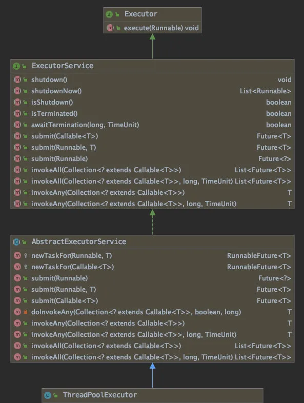
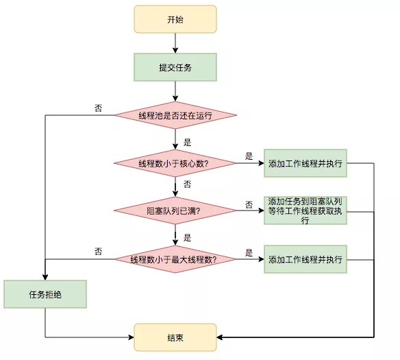
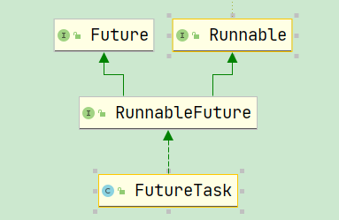
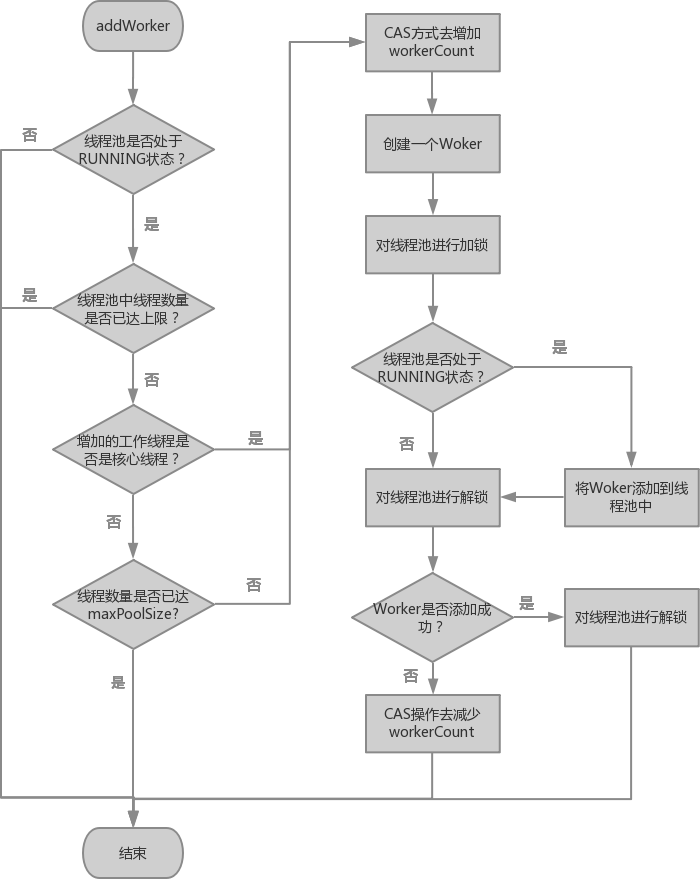

# Table of Contents

* [参考资料](#参考资料)
* [为什么使用线程池](#为什么使用线程池)
* [你会怎么设计线程池](#你会怎么设计线程池)
* [学习前提](#学习前提)
* [ThreadPoolExector架构图](#threadpoolexector架构图)
* [线程池是如何工作的？](#线程池是如何工作的)
  * [首先来看线程大小设置](#首先来看线程大小设置)
  * [再来看 workQueue 的大小设置](#再来看-workqueue-的大小设置)
  * [threadFactory 如何设置](#threadfactory-如何设置)
  * [如何实现动态调整线程池参数](#如何实现动态调整线程池参数)
  * [如何监控线程池？](#如何监控线程池)
* [线程池提交任务的2种方式](#线程池提交任务的2种方式)
  * [FutureTask](#futuretask)
* [ThreadPoolExecutor有哪些状态](#threadpoolexecutor有哪些状态)
* [ThreadPoolExecutor工作流程](#threadpoolexecutor工作流程)
  * [execute](#execute)
  * [wroker](#wroker)
    * [为什么要封装Wroker](#为什么要封装wroker)
  * [addWroker](#addwroker)
  * [runWorker](#runworker)
  * [getTask](#gettask)
  * [ThreadPoolExecutor的运行机制](#threadpoolexecutor的运行机制)
* [考点](#考点)
* [相关问题](#相关问题)
  * [阿里 Java 代码规范为什么不允许使用 Executors 快速创建线程池？](#阿里-java-代码规范为什么不允许使用-executors-快速创建线程池)
  * [如何实现核心线程池的预热](#如何实现核心线程池的预热)
  * [假设设置的核心线程大小为 500，最大线程为 800，缓冲队列为 5000，你能从这个设置中发现出一些问题并对这些参数进行调优吗？](#假设设置的核心线程大小为-500最大线程为-800缓冲队列为-5000你能从这个设置中发现出一些问题并对这些参数进行调优吗)
* [](#)


# 参考资料

+ <https://mp.weixin.qq.com/s?__biz=MzUxODAzNDg4NQ==&mid=2247487264&idx=2&sn=4bb89d3691e449469eca86eb71828feb&scene=21#wechat_redirect>
+ 动态设置参数:<https://mp.weixin.qq.com/s?__biz=MjM5NjQ5MTI5OA==&mid=2651751537&idx=1&sn=c50a434302cc06797828782970da190e&scene=21#wechat_redirect>


# 为什么使用线程池

+ 减少开销->每次创建和回收线程是要与内核空间交互！
  + 降低创建线程回收的频率。
  + 防止开发人员滥用线程。
+ 便于管理
  + 维护线程ID、线程状态、统计任务执行状态。
  + 统一执行线程任务

# 你会怎么设计线程池

1. 是不是先有一个队列，存储你要执行的任务
2. 任务会有很多种，是不是要用到适配器?
3. 队列没有任务，还用新建线程吗？如果还有线程，是不是要<font color=red>阻塞?</font>。
4. 线程需要一直存活吗？
5. 如果任务队列满了，后面来的任务怎么办？
6. 线程池是不是也需要状态?就跟线程的生命周期一样。
7. 线程可以无限新加吗？是不是要有一个限制？


相信带着这些问题去看线程池，你会有很大收获！

# 学习前提

+ [阻塞队列](阻塞队列.md)
+ [AQS](AQS.md)
+ [CAS](CAS.md)
+ [线程四种实现方式](线程四种实现方式.md)

# ThreadPoolExector架构图




- Executor: 最顶层的 Executor 接口只提供了一个 execute 接口，实现了提交任务与执行任务的解藕，这个方法是最核心的，也是我们源码剖析的重点，此方法最终是由 ThreadPoolExecutor 实现的，
- ExecutorService 扩展了 Executor 接口，实现了终止执行器，单个/批量提交任务等方法
- AbstractExecutorService 实现了 ExecutorService 接口，实现了除 execute 以外的所有方法，只将一个最重要的 execute 方法交给 ThreadPoolExecutor 实现。

# 线程池是如何工作的？

首先我们来看下如何创建一个线程池

```java
ThreadPoolExecutor threadPool = new ThreadPoolExecutor(10, 20, 600L,
                    TimeUnit.SECONDS, new LinkedBlockingQueue<>(4096),
                    new NamedThreadFactory("common-work-thread"));
// 设置拒绝策略，默认为 AbortPolicy
threadPool.setRejectedExecutionHandler(new ThreadPoolExecutor.AbortPolicy());

public ThreadPoolExecutor(int corePoolSize,
                              int maximumPoolSize,
                              long keepAliveTime,
                              TimeUnit unit,
                              BlockingQueue<Runnable> workQueue,
                              ThreadFactory threadFactory,
                              RejectedExecutionHandler handler) {
            // 省略代码若干
}
```



步骤如下

1、corePoolSize：如果提交任务后线程还在运行，当线程数小于 corePoolSize 值时，**无论线程池中的线程是否忙碌**，都会创建线程，并把任务交给此新创建的线程进行处理，如果线程数少于等于 corePoolSize，那么这些线程不会回收，除非将 allowCoreThreadTimeOut 设置为 true，**但一般不这么干**，因为频繁地创建销毁线程会极大地增加系统调用的开销。

2、workQueue：如果线程数大于核心数（corePoolSize）且小于最大线程数（maximumPoolSize），则会将任务先丢到阻塞队列里，然后线程自己去阻塞队列中拉取任务执行。

3、maximumPoolSize: 线程池中最大可创建的线程数，如果提交任务时队列满了且线程数未到达这个设定值，则会创建线程并执行此次提交的任务，如果提交任务时队列满了但线池数已经到达了这个值，此时说明已经超出了线池程的负载能力，就会执行拒绝策略，这也好理解，总不能让源源不断地任务进来把线程池给压垮了吧，我们首先要保证线程池能正常工作。

4、RejectedExecutionHandler：一共有以下四种拒绝策略

+ 可以自定义其策略。

- AbortPolicy：丢弃任务并抛出异常，这也是默认策略；
- CallerRunsPolicy：用调用者所在的线程来执行任务，所以开头的问题「线程把任务丢给线程池后肯定就马上返回了?」我们可以回答了，如果用的是 CallerRunsPolicy 策略，提交任务的线程（比如主线程）提交任务后并不能保证马上就返回，当触发了这个 reject 策略不得不亲自来处理这个任务。
- DiscardOldestPolicy：丢弃阻塞队列中靠最前的任务，并执行当前任务。
- DiscardPolicy：直接丢弃任务，不抛出任何异常，这种策略只适用于不重要的任务。

5、keepAliveTime: 线程存活时间，如果在此时间内超出 corePoolSize 大小的线程处于 idle 状态，这些线程会被回收，**也就是说核心线程一旦创建，是不会被轻易回收。**

6、threadFactory：可以用此参数设置线程池的命名，指定 defaultUncaughtExceptionHandler（有啥用，后文阐述）,甚至可以设定线程为守护线程。

现在问题来了，该如何合理设置这些参数呢。


##  首先来看线程大小设置

1. 针对 CPU 密集型的任务，在有 Ncpu个处理器的系统上，当线程池的大小为 Ncpu + 1 时，通常能实现最优的利用率，+1 是因为当计算密集型线程偶尔由于缺页故障或其他原因而暂停工作时，这个"额外"的线程也能确保 CPU 的时钟周期不会被浪费，所谓 CPU 密集，就是线程一直在忙碌，这样将线程池的大小设置为 Ncpu + 1 避免了线程的上下文切换，让线程时刻处于忙碌状态，将 CPU 的利用率最大化。

## 再来看 workQueue 的大小设置

由上文可知，如果最大线程大于核心线程数，当且仅当核心线程满了且 workQueue 也满的情况下，才会新增新的线程，也就是说如果 workQueue 是无界队列，那么当线程数增加到 corePoolSize 后，永远不会再新增新的线程了，也就是说此时 maximumPoolSize 的设置就无效了，也无法触发 RejectedExecutionHandler 拒绝策略，任务只会源源不断地填充到 workQueue，直到 OOM。

所以 workQueue 应该为有界队列，至少保证在任务过载的情况下线程池还能正常工作，那么哪些是有有界队列，哪些是无界队列呢。

有界队列我们常用的以下两个

- LinkedBlockingQueue: 链表构成的有界队列，按先进先出（FIFO）的顺序对元素进行排列，但注意在创建时需指定其大小，否则其大小默认为 Integer.MAX_VALUE，相当于无界队列了
- ArrayBlockingQueue: 数组实现的有界队列，按先进先出（FIFO）的顺序对元素进行排列。

无界队列我们常用 PriorityBlockingQueue 这个优先级队列，任务插入的时候可以指定其权重以让这些任务优先执行，但这个队列很少用，原因很简单，线程池里的任务执行顺序一般是平等的，如果真有必须某些类型的任务需要优先执行，大不了再开个线程池好了，将不同的任务类型用不同的线程池隔离开来，也是合理利用线程池的一种实践。


## threadFactory 如何设置

一般业务中会有多个线程池，如果某个线程池出现了问题，定位是哪一个线程出问题很重要，所以为每个线程池取一个名字就很有必要了

## 如何实现动态调整线程池参数

在实际的业务场景中，一般很难确定 corePoolSize， workQueue，maximumPoolSize 的大小，如果出问题了，一般来说只能重新设置一下这些参数再发布，这样往往需要耗费一些时间


- setCorePoolSize(int corePoolSize) 调整核心线程池大小
- setMaximumPoolSize(int maximumPoolSize)
- setKeepAliveTime() 设置线程的存活时间

线程池中最重要的参数，API以及提供了动态更新的方法。可以配合动态配置中心进行动态修改。

1. 先对线程池进行监控
2. 当队列数量过多或过少的时候，以及业务指标的时候，可以动态修改线程池核心参数来调整。

## 如何监控线程池？


线程池提供了以下几个方法可以监控线程池的使用情况：

| **方法**                | **含义**                                                     |
| ----------------------- | ------------------------------------------------------------ |
| getActiveCount()        | 线程池中正在执行任务的线程数量                               |
| getCompletedTaskCount() | 线程池已完成的任务数量，该值小于等于taskCount                |
| getCorePoolSize()       | 线程池的核心线程数量                                         |
| getLargestPoolSize()    | 线程池曾经创建过的最大线程数量。通过这个数据可以知道线程池是否满过，也就是达到了maximumPoolSize |
| getMaximumPoolSize()    | 线程池的最大线程数量                                         |
| getPoolSize()           | 线程池当前的线程数量                                         |
| getTaskCount()          | 线程池已经执行的和未执行的任务总数                           |


# 线程池提交任务的2种方式

有两种方式，调用 execute 和 submit 方法，来看下这两个方法的方法签名

```java
// 方式一：execute 方法
public void execute(Runnable command) {
}

// 方式二：ExecutorService 中 submit 的三个方法
<T> Future<T> submit(Callable<T> task);
<T> Future<T> submit(Runnable task, T result);
Future<?> submit(Runnable task);
```

区别在于调用 execute 无返回值，而调用  submit 可以返回 Future

可以用 Future 取消任务，判断任务是否已取消/完成，甚至可以阻塞等待结果。

submit 为啥能提交任务（Runnable）的同时也能返回任务（Future）的执行结果呢

```java
 public Future<?> submit(Runnable task) {
        if (task == null) throw new NullPointerException();
        RunnableFuture<Void> ftask = newTaskFor(task, null);
        execute(ftask);
        return ftask;
    }

    /**
     * @throws RejectedExecutionException {@inheritDoc}
     * @throws NullPointerException       {@inheritDoc}
     */
    public <T> Future<T> submit(Runnable task, T result) {
        if (task == null) throw new NullPointerException();
        RunnableFuture<T> ftask = newTaskFor(task, result);
        execute(ftask);
        return ftask;
    }

    /**
     * @throws RejectedExecutionException {@inheritDoc}
     * @throws NullPointerException       {@inheritDoc}
     */
    public <T> Future<T> submit(Callable<T> task) {
        if (task == null) throw new NullPointerException();
        RunnableFuture<T> ftask = newTaskFor(task);
        execute(ftask);
        return ftask;
    }
```


原来在最后执行 execute 前用 newTaskFor 将 task 封装成了 RunnableFuture，newTaskFor 返回了 FutureTask 这个类

## FutureTask




#  ThreadPoolExecutor有哪些状态


对于线程池来说，**我们最关心的是它的「状态」和「可运行的线程数量」**，

一般来说我们可以选择用两个变量来记录，不过 Doug Lea 只用了一个变量（ctl）就达成目的了，我们知道变量越多，代码的可维护性就越差，也越容易出 bug, 所以只用一个变量就达成了两个变量的效果，这让代码的可维护性大大提高，那么他是怎么设计的呢


+ 静态变量

```java
/**
 * ctl用于存储线程池状态
* 初始化时 线程池为Running 工作线程为0
 */
private final AtomicInteger ctl = new AtomicInteger(ctlOf(RUNNING, 0));
/**
 * COUTING_BITS表示使用多少位来存储线程数量
 */
private static final int COUNT_BITS = Integer.SIZE - 3;
/**
 * 线程池默认容量，因为使用了29位来存储，故容量为2^29 - 1
 */
private static final int CAPACITY   = (1 << COUNT_BITS) - 1;

private static final int RUNNING    = -1 << COUNT_BITS;	// 运行中
private static final int SHUTDOWN   =  0 << COUNT_BITS;	// 已关闭
private static final int STOP       =  1 << COUNT_BITS; // 已停止
private static final int TIDYING    =  2 << COUNT_BITS; // 清洁中
private static final int TERMINATED =  3 << COUNT_BITS; // 已终止
```


在控制线程池状态的同时，还巧妙的对ctl进行了复用，不仅能够存储了<font color=red>线程池的当前状态，也存储了线程池中的工作线程数量</font>。

其中高3位用于存储线程池状态，低29为用于存储工作线程的数量。从ThreadPoolExecutor的源码中可以看到线程池的几种运行状态：

- RUNNING：**接受新任务，也能处理阻塞队列的任务**
- SHUTDOWN：**不接受新任务，但是处理阻塞队列的任务**
- STOP：**不接受，不处理，中断处理任务**
- TYDING：线程池中已经没有工作线程即workerCount为0，池正在对有关资源进行最后的清理工作。当线程池中所有工作线程都停止后，线程池会进入该状态。
- TERMINATED：所有工作已经完成，线程池彻底关闭，准备等待被回收。


# ThreadPoolExecutor工作流程


+ 成员变量

```java

    /**
     * The queue used for holding tasks and handing off to worker
     * threads.  We do not require that workQueue.poll() returning
     * null necessarily means that workQueue.isEmpty(), so rely
     * solely on isEmpty to see if the queue is empty (which we must
     * do for example when deciding whether to transition from
     * SHUTDOWN to TIDYING).  This accommodates special-purpose
     * queues such as DelayQueues for which poll() is allowed to
     * return null even if it may later return non-null when delays
     * expire.
     */
private final BlockingQueue<Runnable> workQueue;

    /**
     * Lock held on access to workers set and related bookkeeping.
     * While we could use a concurrent set of some sort, it turns out
     * to be generally preferable to use a lock. Among the reasons is
     * that this serializes interruptIdleWorkers, which avoids
     * unnecessary interrupt storms, especially during shutdown.
     * Otherwise exiting threads would concurrently interrupt those
     * that have not yet interrupted. It also simplifies some of the
     * associated statistics bookkeeping of largestPoolSize etc. We
     * also hold mainLock on shutdown and shutdownNow, for the sake of
     * ensuring workers set is stable while separately checking
     * permission to interrupt and actually interrupting.
     */
    private final ReentrantLock mainLock = new ReentrantLock();

    /**
     * Set containing all worker threads in pool. Accessed only when
     * holding mainLock.
     注意这里是HashSet
     */
    private final HashSet<Worker> workers = new HashSet<Worker>();

    /**
     * Wait condition to support awaitTermination
     */
    private final Condition termination = mainLock.newCondition();

    /**
     * Tracks largest attained pool size. Accessed only under
     * mainLock.
     */
    private int largestPoolSize;

    /**
     * Counter for completed tasks. Updated only on termination of
     * worker threads. Accessed only under mainLock.
     */
    private long completedTaskCount;

    /*
     * All user control parameters are declared as volatiles so that
     * ongoing actions are based on freshest values, but without need
     * for locking, since no internal invariants depend on them
     * changing synchronously with respect to other actions.
     */

    /**
     * Factory for new threads. All threads are created using this
     * factory (via method addWorker).  All callers must be prepared
     * for addWorker to fail, which may reflect a system or user's
     * policy limiting the number of threads.  Even though it is not
     * treated as an error, failure to create threads may result in
     * new tasks being rejected or existing ones remaining stuck in
     * the queue.
     *
     * We go further and preserve pool invariants even in the face of
     * errors such as OutOfMemoryError, that might be thrown while
     * trying to create threads.  Such errors are rather common due to
     * the need to allocate a native stack in Thread.start, and users
     * will want to perform clean pool shutdown to clean up.  There
     * will likely be enough memory available for the cleanup code to
     * complete without encountering yet another OutOfMemoryError.
     */
    private volatile ThreadFactory threadFactory;

    /**
     * Handler called when saturated or shutdown in execute.
     */
    private volatile RejectedExecutionHandler handler;

    /**
     * Timeout in nanoseconds for idle threads waiting for work.
     * Threads use this timeout when there are more than corePoolSize
     * present or if allowCoreThreadTimeOut. Otherwise they wait
     * forever for new work.
     */
    private volatile long keepAliveTime;

    /**
     * If false (default), core threads stay alive even when idle.
     * If true, core threads use keepAliveTime to time out waiting
     * for work.
     */
    private volatile boolean allowCoreThreadTimeOut;

    /**
     * Core pool size is the minimum number of workers to keep alive
     * (and not allow to time out etc) unless allowCoreThreadTimeOut
     * is set, in which case the minimum is zero.
     */
    private volatile int corePoolSize;

    /**
     * Maximum pool size. Note that the actual maximum is internally
     * bounded by CAPACITY.
     */
    private volatile int maximumPoolSize;
```


## execute

```java
public void execute(Runnable command) {
    if (command == null)
        throw new NullPointerException();
    int c = ctl.get();
    // 如果当前线程数少于核心线程数（corePoolSize），无论核心线程是否忙碌，都创建线程，直到达到 corePoolSize 为止
    if (workerCountOf(c) < corePoolSize) {
        // 创建线程并将此任务交给 worker 处理（此时此任务即 worker 中的 firstTask）
        if (addWorker(command, true))
            return;
        c = ctl.get();
    }

    // 如果线程池处于 RUNNING 状态，并且线程数大于 corePoolSize 或者 
    // 线程数少于 corePoolSize 但创建线程失败了，则将任务丢进 workQueue 中
    if (isRunning(c) && workQueue.offer(command)) {
        int recheck = ctl.get();
        // 这里需要再次检查线程池是否处于 RUNNING 状态，因为在任务入队后可能线程池状态会发生变化，（比如调用了 shutdown 方法等），如果线程状态发生变化了，则移除此任务，执行拒绝策略
        if (! isRunning(recheck) && remove(command))
            reject(command);
        // 如果线程池在 RUNNING 状态下，线程数为 0，则新建线程加速处理 workQueue 中的任务
        else if (workerCountOf(recheck) == 0)
            addWorker(null, false);
    }
    // 这段逻辑说明线程数大于 corePoolSize 且任务入队失败了，此时会以最大线程数（maximumPoolSize）为界来创建线程，如果失败，说明线程数超过了 maximumPoolSize，则执行拒绝策略
    else if (!addWorker(command, false))
        reject(command);
}
```


## wroker

从这段代码中可以看到，创建线程是调用 addWorker 实现的，在分析 addWorker 之前，有必要简单提一下 Worker，线程池把每一个执行任务的线程都封装为 Worker 的形式，取名为 Worker 很形象，
**线程池的本质是生产者-消费者模型**，生产者不断地往 workQueue 中丢 task, workQueue 就像流水线一样不断地输送着任务，而 worker（工人） 不断地取任务来执行


### 为什么要封装Wroker

那么问题来了，为啥要把线程封装到 worker 中呢，线程池拿到 task 后直接丢给线程处理或者让线程自己去 workQueue 中处理不就完了？

**将线程封装为 worker 主要是为了更好地管理线程的中断，实现优雅关闭的方法**

```java
// 此处可以看出 worker 既是一个 Runnable 任务，也实现了 AQS（实际上是用 AQS 实现了一个独占锁，这样由于 worker 运行时会上锁，执行 shutdown，setCorePoolSize，setMaximumPoolSize等方法时会试着中断线程（interruptIdleWorkers） ，在这个方法中断方法中会先尝试获取 worker 的锁，如果不成功，说明 worker 在运行中，此时会先让 worker 执行完任务再关闭 worker 的线程，

// 实现优雅关闭线程的目的 -----这句话是重点
private final class Worker
    extends AbstractQueuedSynchronizer
    implements Runnable
    {
        private static final long serialVersionUID = 6138294804551838833L;

        // 实际执行任务的线程
        final Thread thread;
        // 上文提到，如果当前线程数少于核心线程数，创建线程并将提交的任务交给 worker 处理处理，此时 firstTask 即为此提交的任务，如果 worker 从 workQueue 中获取任务，则 firstTask 为空
        Runnable firstTask;
        // 统计完成的任务数
        volatile long completedTasks;

        Worker(Runnable firstTask) {
            // 初始化为 -1，这样在线程运行前（调用runWorker）禁止中断，在 interruptIfStarted() 方法中会判断 getState()>=0
            setState(-1); 
            this.firstTask = firstTask;

            // 根据线程池的 threadFactory 创建一个线程，将 worker 本身传给线程（因为 worker 实现了 Runnable 接口）
            this.thread = getThreadFactory().newThread(this);
        }

        public void run() {
            // thread 启动后会调用此方法
            runWorker(this);
        }

       
        // 1 代表被锁住了，0 代表未锁
        protected boolean isHeldExclusively() {
            return getState() != 0;
        }

        // 尝试获取锁
        protected boolean tryAcquire(int unused) {
            // 从这里可以看出它是一个独占锁，因为当获取锁后，cas 设置 state 不可能成功，这里我们也能明白上文中将 state 设置为 -1 的作用，这种情况下永远不可能获取得锁，而 worker 要被中断首先必须获取锁
            if (compareAndSetState(0, 1)) {
                setExclusiveOwnerThread(Thread.currentThread());
                return true;
            }
            return false;
        }

        // 尝试释放锁
        protected boolean tryRelease(int unused) {
            setExclusiveOwnerThread(null);
            setState(0);
            return true;
        }    

        public void lock()        { acquire(1); }
        public boolean tryLock()  { return tryAcquire(1); }
        public void unlock()      { release(1); }
        public boolean isLocked() { return isHeldExclusively(); }
            
        // 中断线程，这个方法会被 shutdowNow 调用，从中可以看出 shutdownNow 要中断线程不需要获取锁，也就是说如果线程正在运行，照样会给你中断掉，所以一般来说我们不用 shutdowNow 来中断线程，太粗暴了，中断时线程很可能在执行任务，影响任务执行
        void interruptIfStarted() {
            Thread t;
            // 中断也是有条件的，必须是 state >= 0 且 t != null 且线程未被中断
            // 如果 state == -1 ，不执行中断，再次明白了为啥上文中 setState(-1) 的意义
            if (getState() >= 0 && (t = thread) != null && !t.isInterrupted()) {
                try {
                    t.interrupt();
                } catch (SecurityException ignore) {
                }
            }
        }
    }
```


## addWroker

```java
//Set containing all worker threads in pool. Accessed only when  holding mainLock.
private final HashSet<Worker> workers = new HashSet<Worker>();
```

```java
private boolean addWorker(Runnable firstTask, boolean core) {
    retry:
    for (;;) {
        int c = ctl.get();

        // 获取线程池的状态
        int rs = runStateOf(c);

        // 如果线程池的状态 >= SHUTDOWN，即为 SHUTDOWN，STOP，TIDYING，TERMINATED 这四个状态，只有一种情况有可能创建线程，即线程状态为 SHUTDOWN, 且队列非空时，firstTask == null 代表创建一个不接收新任务的线程（此线程会从 workQueue 中获取任务再执行），这种情况下创建线程是为了加速处理完 workQueue 中的任务
        if (rs >= SHUTDOWN &&
            ! (rs == SHUTDOWN &&
               firstTask == null &&
               ! workQueue.isEmpty()))
            return false;

        for (;;) {
            // 获取线程数
            int wc = workerCountOf(c);
            // 如果超过了线程池的最大 CAPACITY（5 亿多，基本不可能）
            // 或者 超过了 corePoolSize（core 为 true） 或者 maximumPoolSize（core 为 false） 时
            // 则返回 false
            if (wc >= CAPACITY ||
                wc >= (core ? corePoolSize : maximumPoolSize))
                return false;
            // 否则 CAS 增加线程的数量，如果成功跳出双重循环
            if (compareAndIncrementWorkerCount(c))
                break retry;
            c = ctl.get();  // Re-read ctl

            // 如果线程运行状态发生变化，跳到外层循环继续执行
            if (runStateOf(c) != rs)
                continue retry;
            // 说明是因为 CAS 增加线程数量失败所致，继续执行 retry 的内层循环
        }
    }

    boolean workerStarted = false;
    boolean workerAdded = false;
    Worker w = null;
    try {
        // 能执行到这里，说明满足增加 worker 的条件了，所以创建 worker,准备添加进线程池中执行任务
        w = new Worker(firstTask);
        final Thread t = w.thread;
        if (t != null) {
            // 加锁，是因为下文要把 w 添加进 workers 中， workers 是 HashSet，不是线程安全的，所以需要加锁予以保证
            final ReentrantLock mainLock = this.mainLock;
            mainLock.lock();
            try {
                //  再次 check 线程池的状态以防执行到此步时发生中断等
                int rs = runStateOf(ctl.get());
                // 如果线程池状态小于 SHUTDOWN（即为 RUNNING），
                // 或者状态为 SHUTDOWN 但 firstTask == null（代表不接收任务，只是创建线程处理 workQueue 中的任务），则满足添加 worker 的条件
                if (rs < SHUTDOWN ||
                    (rs == SHUTDOWN && firstTask == null)) {
                                        // 如果线程已启动，显然有问题（因为创建 worker 后，还没启动线程呢），抛出异常
                    if (t.isAlive()) 
                        throw new IllegalThreadStateException();
                    workers.add(w);
                    int s = workers.size();

                    // 记录最大的线程池大小以作监控之用
                    if (s > largestPoolSize)
                        largestPoolSize = s;
                    workerAdded = true;
                }
            } finally {
                mainLock.unlock();
            }

            // 说明往 workers 中添加 worker 成功，此时启动线程
            if (workerAdded) {
                t.start();
                workerStarted = true;
            }
        }
    } finally {
        // 添加线程失败，执行 addWorkerFailed 方法，主要做了将 worker 从 workers 中移除，减少线程数，并尝试着关闭线程池这样的操作
        if (! workerStarted)
            addWorkerFailed(w);
    }
    return workerStarted;
}
```

从这段代码我们可以看到多线程下情况的不可预料性，我们发现在满足条件情况下，又对线程状态重新进行了 check,以防期间出现中断等线程池状态发生变更的操作，这也给我们以启发：多线程环境下的各种临界条件一定要考虑到位。

执行 addWorker 创建 worker 成功后，线程开始执行了（t.start()），由于在创建 Worker 时，将 Worker  自己传给了此线程，所以启动线程后，会调用  Worker 的 run 方法

```java
public void run() {
    runWorker(this);
}
```


## runWorker

```java
 final void runWorker(Worker w) {
    Thread wt = Thread.currentThread();
    Runnable task = w.firstTask;
    w.firstTask = null;
    // unlock 会调用 tryRelease 方法将 state 设置成 0，代表允许中断，允许中断的条件上文我们在 interruptIfStarted() 中有提过，即 state >= 0
    w.unlock();
    boolean completedAbruptly = true;
    try {
        // 如果在提交任务时创建了线程，并把任务丢给此线程，则会先执行此 task
        // 否则从任务队列中获取 task 来执行（即 getTask() 方法）
        while (task != null || (task = getTask()) != null) {
            w.lock();
            
            // 如果线程池状态为 >= STOP（即 STOP，TIDYING，TERMINATED ）时，则线程应该中断
            // 如果线程池状态 < STOP, 线程不应该中断,如果中断了（Thread.interrupted() 返回 true，并清除标志位）,再次判断线程池状态（防止在清除标志位时执行了 shutdownNow() 这样的方法）,如果此时线程池为 STOP，执行线程中断
            if ((runStateAtLeast(ctl.get(), STOP) ||
                 (Thread.interrupted() &&
                  runStateAtLeast(ctl.get(), STOP))) &&
                !wt.isInterrupted())
                wt.interrupt();
            try {
                // 执行任务前，子类可实现此钩子方法作为统计之用
                beforeExecute(wt, task);
                Throwable thrown = null;
                try {
                    task.run();
                } catch (RuntimeException x) {
                    thrown = x; throw x;
                } catch (Error x) {
                    thrown = x; throw x;
                } catch (Throwable x) {
                    thrown = x; throw new Error(x);
                } finally {
                    // 执行任务后，子类可实现此钩子方法作为统计之用
                    afterExecute(task, thrown);
                }
            } finally {
                task = null;
                w.completedTasks++;
                w.unlock();
            }
        }
        completedAbruptly = false;
    } finally {
        // 如果执行到这只有两种可能，一种是执行过程中异常中断了，一种是队列里没有任务了，从这里可以看出线程没有核心线程与非核心线程之分，哪个任务异常了或者正常退出了都会执行此方法，此方法会根据情况将线程数-1
        processWorkerExit(w, completedAbruptly);
    }
}
```


+ beforeExecute和afterExecute可以实现切面日志。
+ 当**null!=firstTask**或者**阻塞队列中不为null**，才会处理任务。
+ 如果为null,processWorkerExit对worker进行回收。


## getTask

```java
private Runnable getTask() {
    boolean timedOut = false; // Did the last poll() time out?

    for (;;) {
        int c = ctl.get();
        int rs = runStateOf(c);

        // 如果线程池状态至少为 STOP 或者
        // 线程池状态 == SHUTDOWN 并且任务队列是空的
        // 则减少线程数量，返回 null,这种情况下上文分析的 runWorker 会执行 processWorkerExit 从而让获取此 Task 的 woker 退出
        if (rs >= SHUTDOWN && (rs >= STOP || workQueue.isEmpty())) {
            decrementWorkerCount();
            return null;
        }

        int wc = workerCountOf(c);

        // 如果 allowCoreThreadTimeOut 为 true，代表任何线程在 keepAliveTime 时间内处于 idle 状态都会被回收，如果线程数大于 corePoolSize，本身在 keepAliveTime 时间内处于 idle 状态就会被回收
        boolean timed = allowCoreThreadTimeOut || wc > corePoolSize;

        // worker 应该被回收的几个条件，这个比较简单，就此略过
        if ((wc > maximumPoolSize || (timed && timedOut))
            && (wc > 1 || workQueue.isEmpty())) {
            if (compareAndDecrementWorkerCount(c))
                return null;
            continue;
        }

        try {
           // 阻塞获取 task，如果在 keepAliveTime 时间内未获取任务，说明超时了，此时 timedOut 为 true
            Runnable r = timed ?
                workQueue.poll(keepAliveTime, TimeUnit.NANOSECONDS) :
                workQueue.take();
            if (r != null)
                return r;
            timedOut = true;
        } catch (InterruptedException retry) {
            timedOut = false;
        }
    }
}

// LinkedBlockingQueue的takeFirst()方法
public E takeFirst() throws InterruptedException {
    final ReentrantLock lock = this.lock;
    lock.lock();
    try {
        E x;
        while ( (x = unlinkFirst()) == null)
            /*
             * 当队列为空时，调用take()的线程将会调用notEmpty的await()方法
             * 而notEmpty为一个Condition对象，其await()操作会将线程挂起
             */
            notEmpty.await();
        return x;
    } finally {
        lock.unlock();
    }
}
```


##  ThreadPoolExecutor的运行机制

当有新的任务提交到线程池的时候将会按下列步骤来处理任务：

1. 若线程池中的**工作线程数量 \< 核心线程数**，那么即使有空闲的线程，线程池也会创建一个新的工作线程来运行该任务
2. 若线程池中的**工作线程数量 \>= corePoolSize**，并且阻塞队列没满，那么线程池将会将任务加入到阻塞队列中
3. 若线程池中**corePoolSize \<= 工作线程数量 \< maximumPoolSize**，**且阻塞队列已满**，那么线程池将创建新的线程来处理任务
4. 若线程池中**工作线程数量已达上限**（maximumPoolSize），**且工作队列已满**，则将采取线程池饱和策略处理多余的任务





# 考点

1. 使用int变量来同时保存线程状态和工作线程数，避免并发操作。
2. worker初始化时，为什么state设置为-1，-》运行后才能中断。
3. 不同线程任务，线程池时怎么运行的？使用多态，重写run方法即可。、
4. beforeExecute和afterExecute可以实现切面日志
5. 使用阻塞队列进行线程阻塞，保证其线程不会空转。
6. 通过CAS对workCount进行数量控制。
7. Worker继承AQS:需要处理中断信号时，对状态进行同步。


# 相关问题

## 阿里 Java 代码规范为什么不允许使用 Executors 快速创建线程池？

newCachedThreadPool 方法的最大线程数设置成了 Integer.MAX_VALUE，而 newSingleThreadExecutor 方法创建 workQueue 时 LinkedBlockingQueue 未声明大小，相当于创建了无界队列，一不小心就会导致 OOM。


## 如何实现核心线程池的预热

使用  prestartAllCoreThreads() 方法，这个方法会一次性创建 corePoolSize 个线程，无需等到提交任务时才创建，提交创建好线程的话，一有任务提交过来，这些线程就可以立即处理。


## 假设设置的核心线程大小为 500，最大线程为 800，缓冲队列为 5000，你能从这个设置中发现出一些问题并对这些参数进行调优吗？

1. 任务队列设置过大

2. 可以对核心队列进行预热


# 
