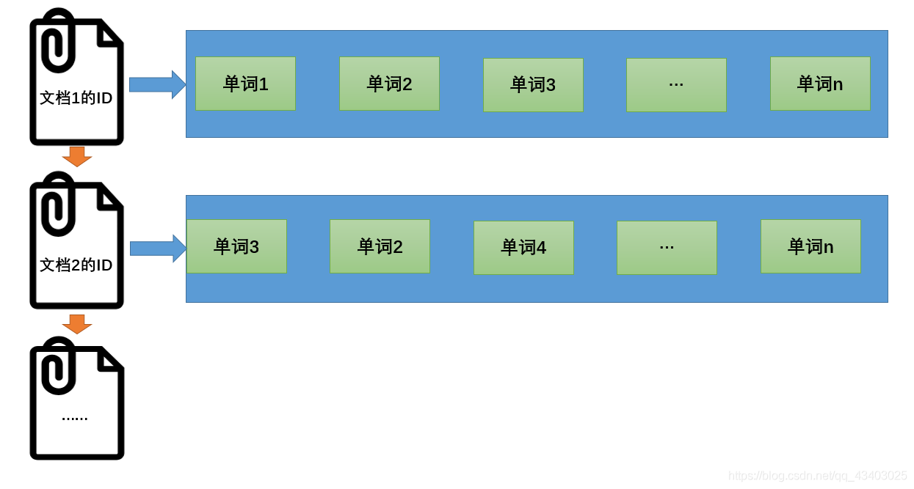
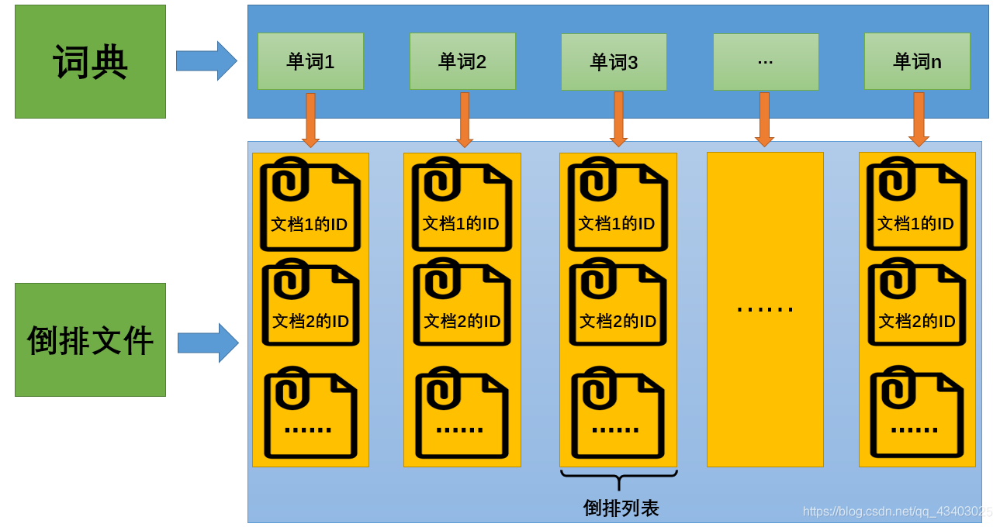

# Table of Contents

* [正向索引和反向索引](#正向索引和反向索引)
  * [正向索引](#正向索引)
  * [反向索引](#反向索引)
  * [总结](#总结)
* [单词-文档矩阵](#单词-文档矩阵)
* [倒排索引](#倒排索引)
* [例子](#例子)
* [参考资料](#参考资料)

# 正向索引和反向索引

##  正向索引

  **当用户发起查询时（假设查询为一个关键词），搜索引擎会扫描索引库中的所有文档，找出所有包含关键词的文档，这样依次从文档中去查找是否含有关键词的方法叫做正向索引**。

正向索引结构如下:
文档1的ID→单词1的信息；单词2的信息；单词3的信息…
文档2的ID→单词3的信息；单词2的信息；单词4的信息…

## 反向索引

为了增加效率，**搜索引擎会把正向索引变为反向索引（倒排索引）即把“文档→单词”的形式变为“单词→文档”的形式**。倒排索引具体机构如下:
单词1→文档1的ID；文档2的ID；文档3的ID…
单词2→文档1的ID；文档4的ID；文档7的ID…

##  总结

  正向索引：文档->关键词

  反向：关键词->文档

#   单词-文档矩阵

单词-文档矩阵是表达两者之间所具有的一种包含关系的概念模型。
现有以下几个文档:

D1：乔布斯去了中国。
D2：苹果今年仍能占据大多数触摸屏产能。
D3：苹果公司首席执行官史蒂夫·乔布斯宣布，iPad2将于3月11日在美国上市。
D4：乔布斯推动了世界，iPhone、iPad、iPad2，一款一款接连不断。
D5：乔布斯吃了一个苹果。
此时用户查询为“苹果 And (乔布斯 Or iPad2)”，表示包含单词“苹果”，同时还包含“乔布斯”或“iPad2”的其中一个。

则“单词-文档”矩阵为:

该矩阵可以从两个方向进行解读:

纵向: 表示每个单独的文档包含了哪些单词，比如D1包含了“乔布斯这个词”，D4包含了“乔布斯”和“iPad2”。
横向: 表示哪些文档包含了该单词，比如D2、D3、D5包含了“苹果”这个词。
搜索引擎的索引其实就是实现“单词-文档”矩阵的具体数据结构。可以有不同的方式来实现上述概念模型，比如“倒排索引”、“签名文件”、“后缀树”等方式，但是“倒排索引”是实现单词到文档映射关系的最佳实现方式。

# 倒排索引

>  倒排索引是实现“单词-文档矩阵”的一种具体存储形式。

通过倒排索引，可以根据单词快速获取包含这个单词的文档列表。**倒排索引主要由两个部分组成：“单词词典”和“倒排文件”**。

+ 单词词典：搜索引擎的通常索引单位是单词，单词词典是由文档集合中出现过的所有单词构成的字符串集合，单词词典内每条索引项记载**单词本身的一些信息**以及**指向“倒排列表”的指针**。
+ 到排列表：倒排列表记载了出现过**某个单词的所有文档的文档列表及单词在该文档中出现的位置信息**，每条记录称为一个倒排项(Posting)。根据倒排列表，即可获知哪些文档包含某个单词。
+ 倒排文件： 所有单词的倒排列表往往**顺序地存储在磁盘的某个文件里**，这个文件即被称之为倒排文件，倒排文件是存储倒排索引的物理文件。

# 例子

- Doc1：乔布斯去了中国。
- Doc2：苹果今年仍能占据大多数触摸屏产能。
- Doc3：苹果公司首席执行官史蒂夫·乔布斯宣布，iPad2将于3月11日在美国上市。
- Doc4：乔布斯推动了世界，iPhone、iPad、iPad2，一款一款接连不断。
- Doc5：乔布斯吃了一个苹果。

> **TF(term frequency): 单词在文档中出现的次数。**
> **Pos: 单词在文档中出现的位置。**

| 单词ID(WordID) | 单词(Word) | 倒排列表(DocID;TF;<Pos>)                    |
| ------------ | -------- | --------------------------------------- |
| 1            | 乔布斯      | (1;1;<1>),(3;1;<6>),(4;1;<1>),(5;1;<1>) |
| 2            | 苹果       | (2;1;<1>),(3;1;<1>),(5;1;<5>)           |
| 3            | iPad2    | (3;1;<8>),(4;1;<7>)                     |
| 4            | 宣布       | (3;1;<7>)                               |
| 5            | 了        | (1;1;<3>),(4;1;<3>)(5;1;<3>)            |

# 参考资料

【】https://blog.csdn.net/qq_43403025/article/details/114779166
