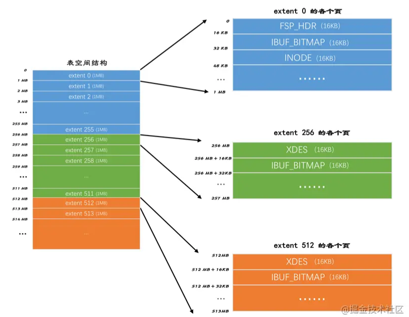
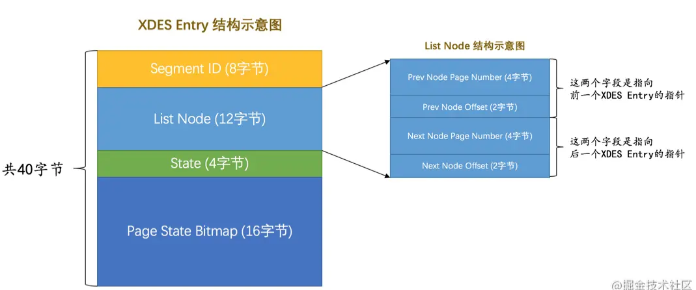
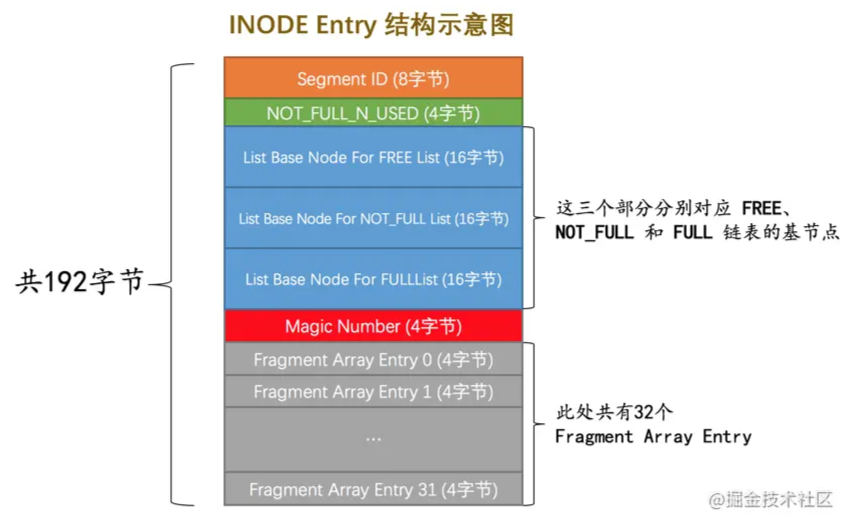
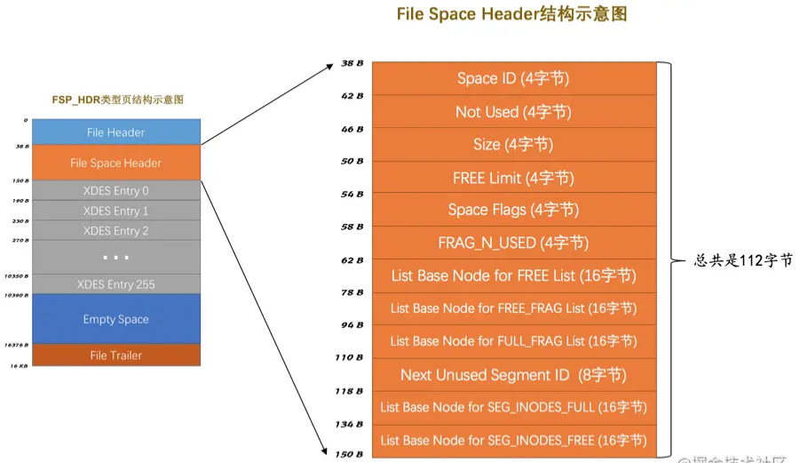
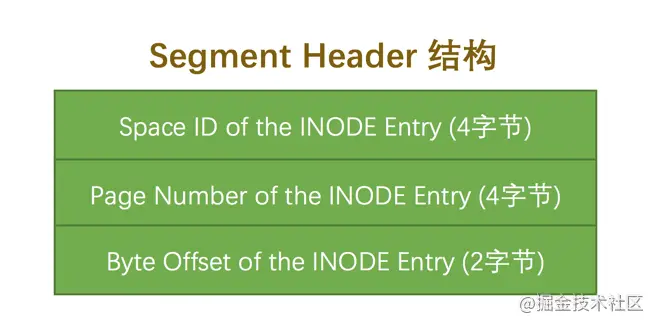
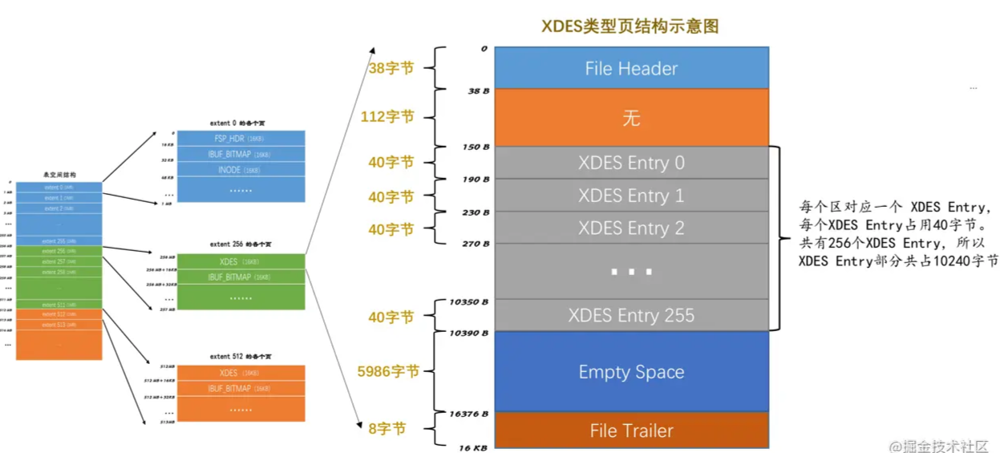
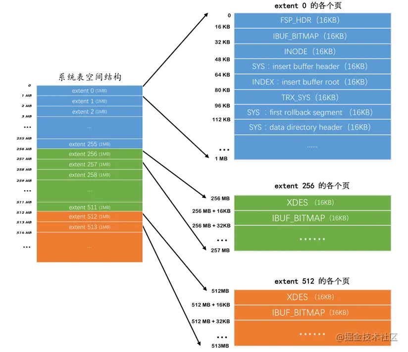

# Table of Contents

* [区的概念](#区的概念)
* [为什么要定义区？](#为什么要定义区)
* [段](#段)
  * [段分配策略](#段分配策略)
* [区分类](#区分类)
  * [XDES Entry](#xdes-entry)
  * [XDES Entry链表](#xdes-entry链表)
  * [链表基节点](#链表基节点)
  * [小结](#小结)
* [段结构](#段结构)
* [类型页面详细情况](#类型页面详细情况)
  * [`FSP_HDR`类型](#fsp_hdr类型)
    * [File Space Header](#file-space-header)
    * [XDES Entry部分](#xdes-entry部分)
    * [IBUF_BITMAP类型](#ibuf_bitmap类型)
    * [INODE类型](#inode类型)
    * [Segment Header （段和INODE关系）](#segment-header-段和inode关系)
  * [XDES](#xdes)
* [系统表空间](#系统表空间)
  * [InnoDB数据字典](#innodb数据字典)
    * [SYS_TABLES表](#sys_tables表)
    * [SYS_COLUMNS表](#sys_columns表)
    * [SYS_INDEXES表](#sys_indexes表)
    * [SYS_FIELDS表](#sys_fields表)
  * [Data Dictionary Header页面](#data-dictionary-header页面)
  * [information_schema系统数据库](#information_schema系统数据库)


> 1. 行格式-数据页-区-段-索引
> 2. 数据的维护是通过链表来维护
> 3. 


# 区的概念

表空间中的页实在是太多了，为了更好的管理这些页面提出了`区`（英文名：`extent`）的概念。

对于16KB的页来说，连续的64个页就是一个`区`，也就是说一个区默认占用1MB空间大小。

> 2^4*2^8=2^10=1M 
>
> 也就是默认区是1M大小


不论是系统表空间还是独立表空间，都可以看成是由若干个区组成的，<font color=red>每256个区被划分成一组。</font>



从上图中我们能得到如下信息：

- 第一个组最开始的3个页面的类型是固定的，也就是说`extent 0`这个区最开始的3个页面的类型是固定的，分别是：
  - `FSP_HDR`类型：这个类型的页面是用来登记整个表空间的一些整体属性以及本组所有的`区`，也就是`extent 0` ~ `extent 255`这256个区的属性，稍后详细唠叨。需要注意的一点是，整个表空间只有一个`FSP_HDR`类型的页面。
  - `IBUF_BITMAP`类型：这个类型的页面是存储本组所有的区的所有页面关于`INSERT BUFFER`的信息。当然，你现在不用知道啥是个`INSERT BUFFER`，后边会详细说到你吐。
  - `INODE`类型：这个类型的页面存储了许多称为`INODE`的数据结构，还是那句话，现在你不需要知道啥是个`INODE`，后边儿会说到你吐。
- 其余各组最开始的2个页面的类型是固定的，也就是说`extent 256`、`extent 512`这些区最开始的2个页面的类型是固定的，分别是：
  - `XDES`类型：全称是`extent descriptor`，用来登记本组256个区的属性，也就是说对于在`extent 256`区中的该类型页面存储的就是`extent 256` ~ `extent 511`这些区的属性，对于在`extent 512`区中的该类型页面存储的就是`extent 512` ~ `extent 767`这些区的属性。上边介绍的`FSP_HDR`类型的页面其实和`XDES`类型的页面的作用类似，只不过`FSP_HDR`类型的页面还会额外存储一些表空间的属性。
  - `IBUF_BITMAP`类型：上边介绍过了。

> 好了，宏观的结构介绍完了，里边儿的名词大家也不用记清楚，只要大致记得：表空间被划分为许多连续的`区`，每个区默认由64个页组成，每256个区划分为一组，每个组的最开始的几个页面类型是固定的就好了。


# 为什么要定义区？

我们都知道回表是有`顺序IO`和`随机IO`,`随机IO`是很慢的，所以我们应该尽量让链表中相邻的页的物理位置也相邻，这样进行范围查询的时候才可以使用所谓的`顺序I/O`。


<font color=red>所以才引入了`区`（`extent`）的概念，一个区就是在物理位置上连续的64个页。</font>


在表中数据量大的时候，为某个索引分配空间的时候就不再按照页为单位分配了，而是按照`区`为单位分配，甚至在表中的数据十分非常特别多的时候，可以一次性分配多个连续的区。虽然可能造成一点点空间的浪费（数据不足填充满整个区），但是从性能角度看，可以消除很多的随机`I/O`，功大于过嘛！

**但是任何设计都不可能完美，后面就需要想法利用这些剩余的空间！**


# 段 

我们提到的范围查询，其实是对`B+`树叶子节点中的记录进行顺序扫描，而如果不区分叶子节点和非叶子节点，统统把节点代表的页面放到申请到的区中的话，进行范围扫描的效果就大打折扣了。


叶子节点有自己独有的`区`，非叶子节点也有自己独有的`区`。存放叶子节点的区的集合就算是一个`段`（`segment`），存放非叶子节点的区的集合也算是一个`段`。也就是说一个索引会生成2个段，一个叶子节点段，一个非叶子节点段。


上面介绍为什么会有区的时候，提到了区的数据不一定被使用，

设计`InnoDB`的大叔们提出了一个碎片（fragment）区的概念，也就是在一个碎片区中，并不是所有的页都是为了存储同一个段的数据而存在的，而是碎片区中的页可以用于不同的目的，比如有些页用于段A，有些页用于段B，有些页甚至哪个段都不属于。**碎片区直属于表空间，并不属于任何一个段。**

> 可以广义的理解为，段和区是多对多的关系。


## 段分配策略

某个段分配存储空间的策略是这样的：

- 在刚开始向表中插入数据的时候，段是从某个碎片区以单个页面为单位来分配存储空间的。
- 当某个段已经占用了32个碎片区页面之后，就会以完整的区为单位来分配存储空间。


>  段=当前段下的区+零散页面


除了索引的叶子节点段和非叶子节点段之外，`InnoDB`中还有为存储一些特殊的数据而定义的段，比如回滚段等。


# 区分类

- 空闲的区：现在还没有用到这个区中的任何页面。
- 有剩余空间的碎片区：表示碎片区中还有可用的页面。
- 没有剩余空间的碎片区：表示碎片区中的所有页面都被使用，没有空闲页面。
- 附属于某个段的区。每一个索引都可以分为叶子节点段和非叶子节点段，除此之外InnoDB还会另外定义一些特殊作用的段，在这些段中的数据量很大时将使用区来作为基本的分配单位。


这4种类型的区也可以被称为区的4种状态（`State`），设计`InnoDB`的大叔们为这4种状态的区定义了特定的名词儿：

| 状态名      | 含义                 |
| ----------- | -------------------- |
| `FREE`      | 空闲的区             |
| `FREE_FRAG` | 有剩余空间的碎片区   |
| `FULL_FRAG` | 没有剩余空间的碎片区 |
| `FSEG`      | 附属于某个段的区     |


需要再次强调一遍的是，处于`FREE`、`FREE_FRAG`以及`FULL_FRAG`这三种状态的区都是独立的，算是直属于表空间；而处于`FSEG`状态的区是附属于某个段的。<font color=red>这句话多看几遍!</font>


## XDES Entry

为了方便管理这些区，设计`InnoDB`的大叔设计了一个称为`XDES Entry`的结构（全称就是Extent Descriptor Entry），每一个区都对应着一个`XDES Entry`结构，这个结构记录了对应的区的一些属性。




- `Segment ID`（8字节）

  每一个段都有一个唯一的编号，用ID表示，此处的`Segment ID`字段表示就是该区所在的段。当然前提是该区已经被分配给某个段了，不然的话该字段的值没啥意义。

- `List Node`（12字节）

  这个部分可以将若干个`XDES Entry`结构串联成一个链表，大家看一下这个`List Node`的结构：

  

  如果我们想定位表空间内的某一个位置的话，只需指定页号以及该位置在指定页号中的页内偏移量即可。所以：

  - `Pre Node Page Number`和`Pre Node Offset`的组合就是指向前一个`XDES Entry`的指针
  - `Next Node Page Number`和`Next Node Offset`的组合就是指向后一个`XDES Entry`的指针。

  把一些`XDES Entry`结构连成一个链表有啥用？

- `State`（4字节）

  这个字段表明区的状态。可选的值就是我们前边说过的那4个，分别是：`FREE`、`FREE_FRAG`、`FULL_FRAG`和`FSEG`。具体释义就不多唠叨了，前边说的够仔细了。

- `Page State Bitmap`（16字节）

  这个部分共占用16个字节，也就是128个比特位。我们说一个区默认有64个页，这128个比特位被划分为64个部分，每个部分2个比特位，对应区中的一个页。比如`Page State Bitmap`部分的第1和第2个比特位对应着区中的第1个页面，第3和第4个比特位对应着区中的第2个页面，依此类推，`Page State Bitmap`部分的第127和128个比特位对应着区中的第64个页面。这两个比特位的第一个位表示对应的页是否是空闲的，第二个比特位还没有用。

  其实就是定位区中数据页的位置。


## XDES Entry链表

某个段中插入数据的过程：

1. 当段中数据较少的时候，首先会查看表空间中是否有状态为`FREE_FRAG`的区，也就是找还有空闲空间的碎片区，如果找到了，那么从该区中取一些零散的页把数据插进去；否则到表空间下申请一个状态为`FREE`的区，也就是空闲的区，

2. 把该区的状态变为`FREE_FRAG`，然后从该新申请的区中取一些零散的页把数据插进去。之后不同的段使用零散页的时候都会从该区中取，直到该区中没有空闲空间，然后该区的状态就变成了`FULL_FRAG`。

   ​	怎么快速找到这些区？上文中的链表就起了作用。<font color=red>注意这里是表空间直属的链表</font>

   - 把状态为`FREE`的区对应的`XDES Entry`结构通过`List Node`来连接成一个链表，这个链表我们就称之为`FREE`链表。
   - 把状态为`FREE_FRAG`的区对应的`XDES Entry`结构通过`List Node`来连接成一个链表，这个链表我们就称之为`FREE_FRAG`链表。
   - 把状态为`FULL_FRAG`的区对应的`XDES Entry`结构通过`List Node`来连接成一个链表，这个链表我们就称之为`FULL_FRAG`链表。

3. 当段中数据已经占满了32个零散的页后，就直接申请完整的区来插入数据了。

   ​	`InnoDB`的大叔们为**每个段中的区**对应的`XDES Entry`结构建立了三个链表：<font color=red>注意这里是段直属的链表</font>

   - `FREE`链表：同一个段中，所有页面都是空闲的区对应的`XDES Entry`结构会被加入到这个链表。注意和直属于表空间的`FREE`链表区别开了，此处的`FREE`链表是附属于某个段的。
   - `NOT_FULL`链表：同一个段中，仍有空闲空间的区对应的`XDES Entry`结构会被加入到这个链表。
   - `FULL`链表：同一个段中，已经没有空闲空间的区对应的`XDES Entry`结构会被加入到这个链表。

   所以段在数据量比较大时插入数据的话，会先获取`NOT_FULL`链表的头节点，直接把数据插入这个头节点对应的区中即可，如果该区的空间已经被用完，就把该节点移到`FULL`链表中。


> 总结一下，数量小，走表空间直属的链表，数据量大，走段直属的链表。


## 链表基节点

为了更好的维护上面这15个链表，设计了一个叫`List Base Node`的结构，翻译成中文就是链表的基节点。

个结构中包含了**链表的头节点和尾节点的指针以及这个链表中包含了多少节点的信息**，我们画图看一下这个结构的示意图：


- `List Length`表明该链表一共有多少节点，
- `First Node Page Number`和`First Node Offset`表明该链表的头节点在表空间中的位置。
- `Last Node Page Number`和`Last Node Offset`表明该链表的尾节点在表空间中的位置。

一般我们把某个链表对应的`List Base Node`结构放置在表空间中固定的位置，这样想找定位某个链表就变得so easy啦。


## 小结

综上所述，

1. 表空间是由若干个区组成的，每个区都对应一个`XDES Entry`的结构，
2. 直属于表空间的区对应的`XDES Entry`结构可以分成`FREE`、`FREE_FRAG`和`FULL_FRAG`这3个链表；
3. 每个段可以附属若干个区，每个段中的区对应的`XDES Entry`结构可以分成`FREE`、`NOT_FULL`和`FULL`这3个链表。
4. 每个链表都对应一个`List Base Node`的结构，这个结构里记录了链表的头、尾节点的位置以及该链表中包含的节点数。


# 段结构

段其实不对应表空间中某一个连续的物理区域，而是一个逻辑上的概念，由若干个零散的页面以及一些完整的区组成。

每个段都定义了一个`INODE Entry`结构来记录一下段中的属性。



- `Segment ID`

  就是指这个`INODE Entry`结构对应的段的编号（ID）。

- `NOT_FULL_N_USED`

  这个字段指的是在`NOT_FULL`链表中已经使用了多少个页面。

- 3个`List Base Node`

  分别为段的`FREE`链表、`NOT_FULL`链表、`FULL`链表定义了`List Base Node`，这样我们想查找某个段的某个链表的头节点和尾节点的时候，就可以直接到这个部分找到对应链表的`List Base Node`。so easy!

- `Magic Number`：

  这个值是用来标记这个`INODE Entry`是否已经被初始化了（初始化的意思就是把各个字段的值都填进去了）。如果这个数字是值的`97937874`，表明该`INODE Entry`已经初始化，否则没有被初始化。（不用纠结这个值有啥特殊含义，人家规定的）。

- `Fragment Array Entry `       <font color=red>这个多看几遍</font>

  我们前边强调过无数次段是一些零散页面和一些完整的区的集合，每个`Fragment Array Entry`结构都对应着一个零散的页面，这个结构一共4个字节，表示一个零散页面的页号。


# 类型页面详细情况


## `FSP_HDR`类型

首先看第一个组的第一个页面，当然也是表空间的第一个页面，页号为`0`。这个页面的类型是`FSP_HDR`，它存储了表空间的一些整体属性以及第一个组内256个区的对应的`XDES Entry`结构，直接看这个类型的页面的示意图：


| 名称                | 中文名       | 占用空间大小 | 简单描述                       |
| ------------------- | ------------ | ------------ | ------------------------------ |
| `File Header`       | 文件头部     | `38`字节     | 页的一些通用信息               |
| `File Space Header` | 表空间头部   | `112`字节    | 表空间的一些整体属性信息       |
| `XDES Entry`        | 区描述信息   | `10240`字节  | 存储本组256个区对应的属性信息  |
| `Empty Space`       | 尚未使用空间 | `5986`字节   | 用于页结构的填充，没啥实际意义 |
| `File Trailer`      | 文件尾部     | `8`字节      | 校验页是否完整                 |

`File Header`和`File Trailer`就不再强调了，另外的几个部分中，`Empty Space`是尚未使用的空间，我们不用管它，重点来看看`File Space Header`和`XDES Entry`这两个部分。

### File Space Header

从名字就可以看出来，这个部分是用来存储表空间的一些整体属性的，废话少说



| 名称                                      | 占用空间大小 | 描述                                                         |
| ----------------------------------------- | ------------ | ------------------------------------------------------------ |
| `Space ID`                                | `4`字节      | 表空间的ID                                                   |
| `Not Used`                                | `4`字节      | 这4个字节未被使用，可以忽略                                  |
| `Size`                                    | `4`字节      | 当前表空间占有的页面数                                       |
| `FREE Limit`                              | `4`字节      | 尚未被初始化的最小页号，大于或等于这个页号的区对应的XDES Entry结构都没有被加入FREE链表 |
| `Space Flags`                             | `4`字节      | 表空间的一些占用存储空间比较小的属性                         |
| `FRAG_N_USED`                             | `4`字节      | FREE_FRAG链表中已使用的页面数量                              |
| `List Base Node for FREE List`            | `16`字节     | FREE链表的基节点                                             |
| `List Base Node for FREE_FRAG List`       | `16`字节     | FREE_FRAG链表的基节点                                        |
| `List Base Node for FULL_FRAG List`       | `16`字节     | FULL_FRAG链表的基节点                                        |
| `Next Unused Segment ID`                  | `8`字节      | 当前表空间中下一个未使用的 Segment ID                        |
| `List Base Node for SEG_INODES_FULL List` | `16`字节     | SEG_INODES_FULL链表的基节点                                  |
| `List Base Node for SEG_INODES_FREE List` | `16`字节     | SEG_INODES_FREE链表的基节点                                  |


这里头的`Space ID`、`Not Used`、`Size`这三个字段大家肯定一看就懂，其他的字段我们再详细瞅瞅，为了大家的阅读体验，我就不严格按照实际的字段顺序来解释各个字段了哈。

- `List Base Node for FREE List`、`List Base Node for FREE_FRAG List`、`List Base Node for FULL_FRAG List`。

  这三个大家看着太亲切了，分别是直属于表空间的`FREE`链表的基节点、`FREE_FRAG`链表的基节点、`FULL_FRAG`链表的基节点，这三个链表的基节点在表空间的位置是固定的，就是在表空间的第一个页面（也就是`FSP_HDR`类型的页面）的`File Space Header`部分。所以之后定位这几个链表就so easy啦。

- `FRAG_N_USED`

  这个字段表明在`FREE_FRAG`链表中已经使用的页面数量。

- `FREE Limit`

  我们知道表空间都对应着具体的磁盘文件，一开始我们创建表空间的时候对应的磁盘文件中都没有数据，所以我们需要对表空间完成一个初始化操作，包括为表空间中的区建立`XDES Entry`结构，为各个段建立`INODE Entry`结构，建立各种链表吧啦吧啦的各种操作。我们可以一开始就为表空间申请一个特别大的空间，但是实际上有绝大部分的区是空闲的，我们可以选择把所有的这些空闲区对应的`XDES Entry`结构加入`FREE`链表，也可以选择只把一部分的空闲区加入`FREE`链表，等啥时候空闲链表中的`XDES Entry`结构对应的区不够使了，再把之前没有加入`FREE`链表的空闲区对应的`XDES Entry`结构加入`FREE`链表，中心思想就是啥时候用到啥时候初始化，设计`InnoDB`的大叔采用的就是后者，他们为表空间定义了`FREE Limit`这个字段，在该字段表示的页号之前的区都被初始化了，之后的区尚未被初始化。

- `Next Unused Segment ID`

  表中每个索引都对应2个段，每个段都有一个唯一的ID，那当我们为某个表新创建一个索引的时候，就意味着要创建两个新的段。那怎么为这个新创建的段找一个唯一的ID呢？去遍历现在表空间中所有的段么？我们说过，遍历是不可能遍历的，这辈子都不可能遍历，所以设计`InnoDB`的大叔们提出了这个名叫`Next Unused Segment ID`的字段，该字段表明当前表空间中最大的段ID的下一个ID，这样在创建新段的时候赋予新段一个唯一的ID值就so easy啦，直接使用这个字段的值就好了。

- `Space Flags`

  表空间对于一些布尔类型的属性，或者只需要寥寥几个比特位搞定的属性都放在了这个`Space Flags`中存储，虽然它只有4个字节，32个比特位大小，却存储了好多表空间的属性，详细情况如下表：

  | 标志名称        | 占用的空间（单位：bit） | 描述                                     |
  | --------------- | ----------------------- | ---------------------------------------- |
  | `POST_ANTELOPE` | 1                       | 表示文件格式是否大于`ANTELOPE`           |
  | `ZIP_SSIZE`     | 4                       | 表示压缩页面的大小                       |
  | `ATOMIC_BLOBS`  | 1                       | 表示是否自动把值非常长的字段放到BLOB页里 |
  | `PAGE_SSIZE`    | 4                       | 页面大小                                 |
  | `DATA_DIR`      | 1                       | 表示表空间是否是从默认的数据目录中获取的 |
  | `SHARED`        | 1                       | 是否为共享表空间                         |
  | `TEMPORARY`     | 1                       | 是否为临时表空间                         |
  | `ENCRYPTION`    | 1                       | 表空间是否加密                           |
  | `UNUSED`        | 18                      | 没有使用到的比特位                       |

  > 小贴士： 不同MySQL版本里 SPACE_FLAGS 代表的属性可能有些差异，我们这里列举的是5.7.21版本的。不过大家现在不必深究它们的意思，因为我们一旦把这些概念展开，就需要非常大的篇幅，主要怕大家受不了。我们还是先挑重要的看，把主要的表空间结构了解完，这些 SPACE_FLAGS 里的属性的细节就暂时不深究了。

- `List Base Node for SEG_INODES_FULL List`和`List Base Node for SEG_INODES_FREE List`

  每个段对应的`INODE Entry`结构会集中存放到一个类型为`INODE`的页中，如果表空间中的段特别多，则会有多个`INODE Entry`结构，可能一个页放不下，这些`INODE`类型的页会组成两种列表：

  - `SEG_INODES_FULL`链表，该链表中的`INODE`类型的页面都已经被`INODE Entry`结构填充满了，没空闲空间存放额外的`INODE Entry`了。
  - `SEG_INODES_FREE`链表，该链表中的`INODE`类型的页面仍有空闲空间来存放`INODE Entry`结构。

  由于我们现在还没有详细唠叨`INODE`类型页，所以等会说过`INODE`类型的页之后再回过头来看着两个链表。


### XDES Entry部分

紧接着`File Space Header`部分的就是`XDES Entry`部分了，我们嘴上唠叨过无数次，却从没见过真身的`XDES Entry`就是在表空间的第一个页面中保存的。我们知道一个`XDES Entry`结构的大小是40字节，但是一个页面的大小有限，只能存放有限个`XDES Entry`结构，所以我们才把256个区划分成一组，在每组的第一个页面中存放256个`XDES Entry`结构。大家回看那个`FSP_HDR`类型页面的示意图，`XDES Entry 0`就对应着`extent 0`，`XDES Entry 1`就对应着`extent 1`... 依此类推，`XDES Entry255`就对应着`extent 255`。


### IBUF_BITMAP类型

对比前边介绍表空间的图，每个分组的第二个页面的类型都是`IBUF_BITMAP`，这种类型的页里边记录了一些有关`Change Buffer`的东东，由于这个`Change Buffer`里又包含了贼多的概念，考虑到大家在一章中接受这么多新概念有点呼吸不适，怕大家心脏病犯了所以就把`Change Buffer`的相关知识放到后边的章节中，大家稍安勿躁哈。

### INODE类型

第一个分组的第三个页面的类型是`INODE`。我们前边说过设计`InnoDB`的大叔为每个索引定义了两个段，而且为某些特殊功能定义了些特殊的段。为了方便管理，他们又为每个段设计了一个`INODE Entry`结构，这个结构中记录了关于这个段的相关属性。


从图中可以看出，一个`INODE`类型的页面是由这几部分构成的：

| 名称                            | 中文名       | 占用空间大小 | 简单描述                                   |
| ------------------------------- | ------------ | ------------ | ------------------------------------------ |
| `File Header`                   | 文件头部     | `38`字节     | 页的一些通用信息                           |
| `List Node for INODE Page List` | 通用链表节点 | `12`字节     | 存储上一个INODE页面和下一个INODE页面的指针 |
| `INODE Entry`                   | 段描述信息   | `16320`字节  |                                            |
| `Empty Space`                   | 尚未使用空间 | `6`字节      | 用于页结构的填充，没啥实际意义             |
| `File Trailer`                  | 文件尾部     | `8`字节      | 校验页是否完整                             |


除了`File Header`、`Empty Space`、`File Trailer`这几个老朋友外，我们重点关注`List Node for INODE Page List`和`INODE Entry`这两个部分。

首先看`INODE Entry`部分，我们前边已经详细介绍过这个结构的组成了，主要包括对应的段内零散页面的地址以及附属于该段的`FREE`、`NOT_FULL`和`FULL`链表的基节点。每个`INODE Entry`结构占用192字节，一个页面里可以存储`85`个这样的结构。

重点看一下`List Node for INODE Page List`这个玩意儿，因为一个表空间中可能存在超过85个段，所以可能一个`INODE`类型的页面不足以存储所有的段对应的`INODE Entry`结构，所以就需要额外的`INODE`类型的页面来存储这些结构。还是为了方便管理这些`INODE`类型的页面，设计`InnoDB`的大叔们将这些`INODE`类型的页面串联成两个不同的链表：

- `SEG_INODES_FULL`链表：该链表中的`INODE`类型的页面中已经没有空闲空间来存储额外的`INODE Entry`结构了。
- `SEG_INODES_FREE`链表：该链表中的`INODE`类型的页面中还有空闲空间来存储额外的`INODE Entry`结构了。

想必大家已经认出这两个链表了，我们前边提到过这两个链表的基节点就存储在`File Space Header`里边，也就是说这两个链表的基节点的位置是固定的，所以我们可以很轻松的访问到这两个链表。以后每当我们新创建一个段（创建索引时就会创建段）时，都会创建一个`INODE Entry`结构与之对应，存储`INODE Entry`的大致过程就是这样的：

- 先看看`SEG_INODES_FREE`链表是否为空，如果不为空，直接从该链表中获取一个节点，也就相当于获取到一个仍有空闲空间的`INODE`类型的页面，然后把该`INODE Entry`结构放到该页面中。当该页面中无剩余空间时，就把该页放到`SEG_INODES_FULL`链表中。
- 如果`SEG_INODES_FREE`链表为空，则需要从表空间的`FREE_FRAG`链表中申请一个页面，修改该页面的类型为`INODE`，把该页面放到`SEG_INODES_FREE`链表中，与此同时把该`INODE Entry`结构放入该页面。


### Segment Header （段和INODE关系）

我们知道一个索引会产生两个段，分别是叶子节点段和非叶子节点段，而每个段都会对应一个`INODE Entry`结构，那我们怎么知道某个段对应哪个`INODE Entry`结构呢？所以得找个地方记下来这个对应关系。希望你还记得我们在唠叨数据页，也就是`INDEX`类型的页时有一个`Page Header`部分，当然我不能指望你记住，所以把`Page Header`部分再抄一遍给你看：

Page Header部分

（为突出重点，省略了好多属性） 

| 名称                | 占用空间大小 | 描述                                       |
| ------------------- | ------------ | ------------------------------------------ |
| ...                 | ...          | ...                                        |
| `PAGE_BTR_SEG_LEAF` | `10`字节     | B+树叶子段的头部信息，仅在B+树的根页定义   |
| `PAGE_BTR_SEG_TOP`  | `10`字节     | B+树非叶子段的头部信息，仅在B+树的根页定义 |


其中的`PAGE_BTR_SEG_LEAF`和`PAGE_BTR_SEG_TOP`都占用10个字节，它们其实对应一个叫`Segment Header`的结构，该结构图示如下：





各个部分的具体释义如下：

| 名称                             | 占用字节数 | 描述                              |
| -------------------------------- | ---------- | --------------------------------- |
| `Space ID of the INODE Entry`    | `4`        | INODE Entry结构所在的表空间ID     |
| `Page Number of the INODE Entry` | `4`        | INODE Entry结构所在的页面页号     |
| `Byte Offset of the INODE Ent`   | `2`        | INODE Entry结构在该页面中的偏移量 |


这样子就很清晰了，`PAGE_BTR_SEG_LEAF`记录着叶子节点段对应的`INODE Entry`结构的地址是哪个表空间的哪个页面的哪个偏移量，`PAGE_BTR_SEG_TOP`记录着非叶子节点段对应的`INODE Entry`结构的地址是哪个表空间的哪个页面的哪个偏移量。这样子索引和其对应的段的关系就建立起来了。不过需要注意的一点是，因为一个索引只对应两个段，所以只需要在索引的根页面中记录这两个结构即可。


## XDES

我们把之后每个分组的第一个页面的类型定义为`XDES`，它的结构和`FSP_HDR`类型是非常相似的：



与`FSP_HDR`类型的页面对比，除了少了`File Space Header`部分之外，也就是除了少了记录表空间整体属性的部分之外，其余的部分是一样一样的。由于我们上边唠叨的已经够仔细了，对于`XDES`类型的页面也就不重复唠叨了哈。


# 系统表空间

了解完了独立表空间的基本结构，系统表空间的结构也就好理解多了，系统表空间的结构和独立表空间基本类似，只不过由于整个MySQL进程只有一个系统表空间，在系统表空间中会额外记录一些有关整个系统信息的页面，所以会比独立表空间多出一些记录这些信息的页面。因为这个系统表空间最牛逼，相当于是表空间之首，所以它的`表空间 ID`（Space ID）是`0`。

系统表空间与独立表空间的一个非常明显的不同之处就是在表空间开头有许多记录整个系统属性的页面，如图：




可以看到，系统表空间和独立表空间的前三个页面（页号分别为`0`、`1`、`2`，类型分别是`FSP_HDR`、`IBUF_BITMAP`、`INODE`）的类型是一致的，只是页号为`3`～`7`的页面是系统表空间特有的，我们来看一下这些多出来的页面都是干啥使的：

| 页号 | 页面类型  | 英文描述               | 描述                        |
| ---- | --------- | ---------------------- | --------------------------- |
| `3`  | `SYS`     | Insert Buffer Header   | 存储Insert Buffer的头部信息 |
| `4`  | `INDEX`   | Insert Buffer Root     | 存储Insert Buffer的根页面   |
| `5`  | `TRX_SYS` | Transction System      | 事务系统的相关信息          |
| `6`  | `SYS`     | First Rollback Segment | 第一个回滚段的页面          |
| `7`  | `SYS`     | Data Dictionary Header | 数据字典头部信息            |


除了这几个记录系统属性的页面之外，系统表空间的`extent 1`和`extent 2`这两个区，也就是页号从`64`~`191`这128个页面被称为`Doublewrite buffer`，也就是双写缓冲区。不过上述的大部分知识都涉及到了事务和多版本控制的问题，这些问题我们会放在后边的章节集中唠叨，现在讲述太影响用户体验，所以现在我们只唠叨一下有关InnoDB数据字典的知识，其余的概念在后边再看。


## InnoDB数据字典

我们平时使用`INSERT`语句向表中插入的那些记录称之为用户数据，MySQL只是作为一个软件来为我们来保管这些数据，提供方便的增删改查接口而已。但是每当我们向一个表中插入一条记录的时候，MySQL先要校验一下插入语句对应的表存不存在，插入的列和表中的列是否符合，如果语法没有问题的话，还需要知道该表的聚簇索引和所有二级索引对应的根页面是哪个表空间的哪个页面，然后把记录插入对应索引的`B+`树中。所以说，MySQL除了保存着我们插入的用户数据之外，还需要保存许多额外的信息，比方说：

- 某个表属于哪个表空间，表里边有多少列
- 表对应的每一个列的类型是什么
- 该表有多少索引，每个索引对应哪几个字段，该索引对应的根页面在哪个表空间的哪个页面
- 该表有哪些外键，外键对应哪个表的哪些列
- 某个表空间对应文件系统上文件路径是什么
- balabala ... 还有好多，不一一列举了

上述这些数据并不是我们使用`INSERT`语句插入的用户数据，实际上是为了更好的管理我们这些用户数据而不得已引入的一些额外数据，这些数据也称为`元数据`。InnoDB存储引擎特意定义了一些列的内部系统表（internal system table）来记录这些这些`元数据`：

| 表名               | 描述                                                       |
| ------------------ | ---------------------------------------------------------- |
| `SYS_TABLES`       | 整个InnoDB存储引擎中所有的表的信息                         |
| `SYS_COLUMNS`      | 整个InnoDB存储引擎中所有的列的信息                         |
| `SYS_INDEXES`      | 整个InnoDB存储引擎中所有的索引的信息                       |
| `SYS_FIELDS`       | 整个InnoDB存储引擎中所有的索引对应的列的信息               |
| `SYS_FOREIGN`      | 整个InnoDB存储引擎中所有的外键的信息                       |
| `SYS_FOREIGN_COLS` | 整个InnoDB存储引擎中所有的外键对应列的信息                 |
| `SYS_TABLESPACES`  | 整个InnoDB存储引擎中所有的表空间信息                       |
| `SYS_DATAFILES`    | 整个InnoDB存储引擎中所有的表空间对应文件系统的文件路径信息 |
| `SYS_VIRTUAL`      | 整个InnoDB存储引擎中所有的虚拟生成列的信息                 |

这些系统表也被称为`数据字典`，它们都是以`B+`树的形式保存在系统表空间的某些页面中，

**其中`SYS_TABLES`、`SYS_COLUMNS`、`SYS_INDEXES`、`SYS_FIELDS`这四个表尤其重要，称之为基本系统表（basic system tables）**，我们先看看这4个表的结构：

### SYS_TABLES表

SYS_TABLES表的列

 

| 列名         | 描述                                             |
| ------------ | ------------------------------------------------ |
| `NAME`       | 表的名称                                         |
| `ID`         | InnoDB存储引擎中每个表都有一个唯一的ID           |
| `N_COLS`     | 该表拥有列的个数                                 |
| `TYPE`       | 表的类型，记录了一些文件格式、行格式、压缩等信息 |
| `MIX_ID`     | 已过时，忽略                                     |
| `MIX_LEN`    | 表的一些额外的属性                               |
| `CLUSTER_ID` | 未使用，忽略                                     |
| `SPACE`      | 该表所属表空间的ID                               |


这个`SYS_TABLES`表有两个索引：

- 以`NAME`列为主键的聚簇索引
- 以`ID`列建立的二级索引

### SYS_COLUMNS表

SYS_COLUMNS表的列

 

| 列名       | 描述                                                         |
| ---------- | ------------------------------------------------------------ |
| `TABLE_ID` | 该列所属表对应的ID                                           |
| `POS`      | 该列在表中是第几列                                           |
| `NAME`     | 该列的名称                                                   |
| `MTYPE`    | main data type，主数据类型，就是那堆INT、CHAR、VARCHAR、FLOAT、DOUBLE之类的东东 |
| `PRTYPE`   | precise type，精确数据类型，就是修饰主数据类型的那堆东东，比如是否允许NULL值，是否允许负数啥的 |
| `LEN`      | 该列最多占用存储空间的字节数                                 |
| `PREC`     | 该列的精度，不过这列貌似都没有使用，默认值都是0              |


这个`SYS_COLUMNS`表只有一个聚集索引：

- 以`(TABLE_ID, POS)`列为主键的聚簇索引

### SYS_INDEXES表

SYS_INDEXES表的列

 

| 列名              | 描述                                                         |
| ----------------- | ------------------------------------------------------------ |
| `TABLE_ID`        | 该索引所属表对应的ID                                         |
| `ID`              | InnoDB存储引擎中每个索引都有一个唯一的ID                     |
| `NAME`            | 该索引的名称                                                 |
| `N_FIELDS`        | 该索引包含列的个数                                           |
| `TYPE`            | 该索引的类型，比如聚簇索引、唯一索引、更改缓冲区的索引、全文索引、普通的二级索引等等各种类型 |
| `SPACE`           | 该索引根页面所在的表空间ID                                   |
| `PAGE_NO`         | 该索引根页面所在的页面号                                     |
| `MERGE_THRESHOLD` | 如果页面中的记录被删除到某个比例，就把该页面和相邻页面合并，这个值就是这个比例 |


这个`SYS_INDEXES`表只有一个聚集索引：

- 以`(TABLE_ID, ID)`列为主键的聚簇索引

### SYS_FIELDS表

SYS_FIELDS表的列

 

| 列名       | 描述                         |
| ---------- | ---------------------------- |
| `INDEX_ID` | 该索引列所属的索引的ID       |
| `POS`      | 该索引列在某个索引中是第几列 |
| `COL_NAME` | 该索引列的名称               |


这个`SYS_FIELDS`表只有一个聚集索引：

- 以`(INDEX_ID, POS)`列为主键的聚簇索引


## Data Dictionary Header页面

只要有了上述4个基本系统表，也就意味着可以获取其他系统表以及用户定义的表的所有元数据。比方说我们想看看`SYS_TABLESPACES`这个系统表里存储了哪些表空间以及表空间对应的属性，那就可以：

- 到`SYS_TABLES`表中根据表名定位到具体的记录，就可以获取到`SYS_TABLESPACES`表的`TABLE_ID`
- 使用这个`TABLE_ID`到`SYS_COLUMNS`表中就可以获取到属于该表的所有列的信息。
- 使用这个`TABLE_ID`还可以到`SYS_INDEXES`表中获取所有的索引的信息，索引的信息中包括对应的`INDEX_ID`，还记录着该索引对应的`B+`数根页面是哪个表空间的哪个页面。
- 使用`INDEX_ID`就可以到`SYS_FIELDS`表中获取所有索引列的信息。

也就是说这4个表是表中之表，那这4个表的元数据去哪里获取呢？没法搞了，只能把这4个表的元数据，就是它们有哪些列、哪些索引等信息硬编码到代码中，然后设计`InnoDB`的大叔又拿出一个固定的页面来记录这4个表的聚簇索引和二级索引对应的`B+树`位置，这个页面就是页号为`7`的页面，类型为`SYS`，记录了`Data Dictionary Header`，也就是数据字典的头部信息。除了这4个表的5个索引的根页面信息外，这个页号为`7`的页面还记录了整个InnoDB存储引擎的一些全局属性，说话太啰嗦，直接看这个页面的示意图：


可以看到这个页面由下边几个部分组成：

| 名称                     | 中文名           | 占用空间大小 | 简单描述                                                     |
| ------------------------ | ---------------- | ------------ | ------------------------------------------------------------ |
| `File Header`            | 文件头部         | `38`字节     | 页的一些通用信息                                             |
| `Data Dictionary Header` | 数据字典头部信息 | `56`字节     | 记录一些基本系统表的根页面位置以及InnoDB存储引擎的一些全局信息 |
| `Segment Header`         | 段头部信息       | `10`字节     | 记录本页面所在段对应的INODE Entry位置信息                    |
| `Empty Space`            | 尚未使用空间     | `16272`字节  | 用于页结构的填充，没啥实际意义                               |
| `File Trailer`           | 文件尾部         | `8`字节      | 校验页是否完整                                               |


可以看到这个页面里竟然有`Segment Header`部分，意味着设计InnoDB的大叔把这些有关数据字典的信息当成一个段来分配存储空间，我们就姑且称之为`数据字典段`吧。由于目前我们需要记录的数据字典信息非常少（可以看到`Data Dictionary Header`部分仅占用了56字节），所以该段只有一个碎片页，也就是页号为`7`的这个页。

接下来我们需要细细唠叨一下`Data Dictionary Header`部分的各个字段：

- `Max Row ID`：我们说过如果我们不显式的为表定义主键，而且表中也没有`UNIQUE`索引，那么`InnoDB`存储引擎会默认为我们生成一个名为`row_id`的列作为主键。因为它是主键，所以每条记录的`row_id`列的值不能重复。原则上只要一个表中的`row_id`列不重复就可以了，也就是说表a和表b拥有一样的`row_id`列也没啥关系，不过设计InnoDB的大叔只提供了这个`Max Row ID`字段，不论哪个拥有`row_id`列的表插入一条记录时，该记录的`row_id`列的值就是`Max Row ID`对应的值，然后再把`Max Row ID`对应的值加1，也就是说这个`Max Row ID`是全局共享的。
- `Max Table ID`：InnoDB存储引擎中的所有的表都对应一个唯一的ID，每次新建一个表时，就会把本字段的值作为该表的ID，然后自增本字段的值。
- `Max Index ID`：InnoDB存储引擎中的所有的索引都对应一个唯一的ID，每次新建一个索引时，就会把本字段的值作为该索引的ID，然后自增本字段的值。
- `Max Space ID`：InnoDB存储引擎中的所有的表空间都对应一个唯一的ID，每次新建一个表空间时，就会把本字段的值作为该表空间的ID，然后自增本字段的值。
- `Mix ID Low(Unused)`：这个字段没啥用，跳过。
- `Root of SYS_TABLES clust index`：本字段代表`SYS_TABLES`表聚簇索引的根页面的页号。
- `Root of SYS_TABLE_IDS sec index`：本字段代表`SYS_TABLES`表为`ID`列建立的二级索引的根页面的页号。
- `Root of SYS_COLUMNS clust index`：本字段代表`SYS_COLUMNS`表聚簇索引的根页面的页号。
- `Root of SYS_INDEXES clust index`本字段代表`SYS_INDEXES`表聚簇索引的根页面的页号。
- `Root of SYS_FIELDS clust index`：本字段代表`SYS_FIELDS`表聚簇索引的根页面的页号。
- `Unused`：这4个字节没用，跳过。

以上就是页号为`7`的页面的全部内容，初次看可能会懵逼（因为有点儿绕），大家多瞅几次。


## information_schema系统数据库

需要注意一点的是，用户是不能直接访问`InnoDB`的这些内部系统表的，除非你直接去解析系统表空间对应文件系统上的文件。不过设计InnoDB的大叔考虑到查看这些表的内容可能有助于大家分析问题，所以在系统数据库`information_schema`中提供了一些以`innodb_sys`开头的表：

```
mysql> USE information_schema;
Database changed

mysql> SHOW TABLES LIKE 'innodb_sys%';
+--------------------------------------------+
| Tables_in_information_schema (innodb_sys%) |
+--------------------------------------------+
| INNODB_SYS_DATAFILES                       |
| INNODB_SYS_VIRTUAL                         |
| INNODB_SYS_INDEXES                         |
| INNODB_SYS_TABLES                          |
| INNODB_SYS_FIELDS                          |
| INNODB_SYS_TABLESPACES                     |
| INNODB_SYS_FOREIGN_COLS                    |
| INNODB_SYS_COLUMNS                         |
| INNODB_SYS_FOREIGN                         |
| INNODB_SYS_TABLESTATS                      |
+--------------------------------------------+
10 rows in set (0.00 sec)
```

在`information_schema`数据库中的这些以`INNODB_SYS`开头的表并不是真正的内部系统表（内部系统表就是我们上边唠叨的以`SYS`开头的那些表），而是在存储引擎启动时读取这些以`SYS`开头的系统表，然后填充到这些以`INNODB_SYS`开头的表中。以`INNODB_SYS`开头的表和以`SYS`开头的表中的字段并不完全一样，但供大家参考已经足矣。
