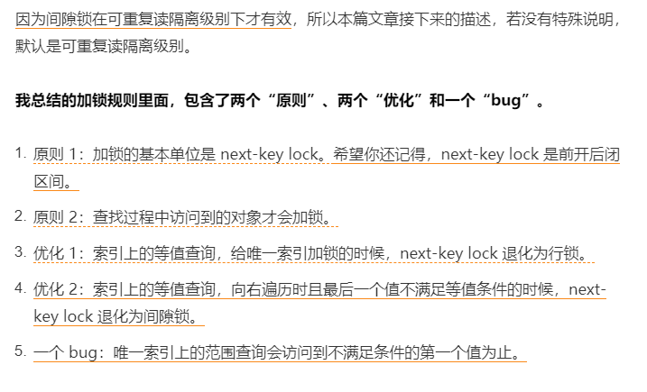
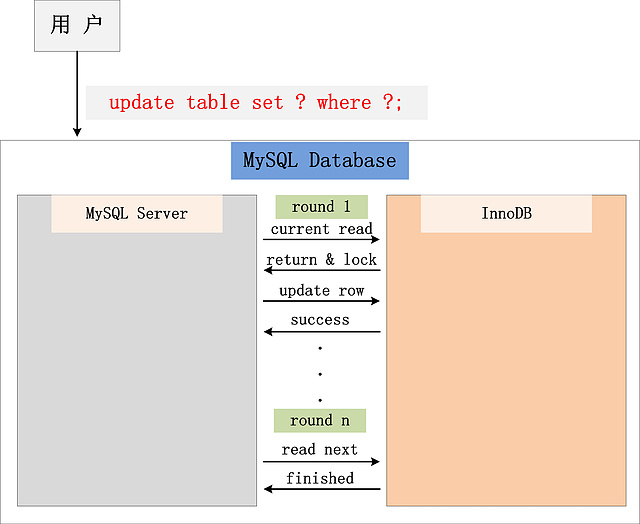

# Table of Contents

* [mysql读会加s锁吗，什么时候加读s锁？什么时候加X锁](#mysql读会加s锁吗什么时候加读s锁什么时候加x锁)
* [参考资料](#参考资料)

加间隙锁的规则(引用自林晓斌老师的mysql实战45讲):

# mysql读会加s锁吗，什么时候加读s锁？什么时候加X锁

Mysql的普通select是不会加s锁的

SELECT ... LOCK IN SHARE MODE的语句才会加s锁。我们平常用的mvcc是不会加s的，因为mvcc就是为了避免读写互斥才出来的。

所以我们说的加s锁的前提是，**当前读。**　

在一个支持MVCC并发控制的系统中，哪些读操作是快照读？哪些操作又是当前读呢？以MySQL InnoDB为例：

快照读：简单的select操作，属于快照读，不加锁。(当然，也有例外，下面会分析)

select * from table where ?;

当前读：特殊的读操作，插入/更新/删除操作，属于当前读，需要加锁。　　

select * from table where ? lock in share mode;

select * from table where ? for update;

insert into table values (…);

update table set ? where ?;

delete from table where ?;

所有以上的语句，都属于当前读，读取记录的最新版本。并且，读取之后，还需要保证其他并发事务不能修改当前记录，对读取记录加锁。其中，除了第一条语句，对读取记录加S锁 (共享锁)外，其他的操作，都加的是X锁 (排它锁)。

> 注意！！ 加锁要看目的，我们为什么要加锁？读读 读写 写写

　　为什么将 插入/更新/删除 操作，都归为当前读？可以看看下面这个 更新 操作，在数据库中的执行流程：

从图中，可以看到，一个Update操作的具体流程。当Update SQL被发给MySQL后，MySQL Server会根据where条件，读取第一条满足条件的记录，然后InnoDB引擎会将第一条记录返回，并加锁 (current read)。待MySQL Server收到这条加锁的记录之后，会再发起一个Update请求，更新这条记录。一条记录操作完成，再读取下一条记录，直至没有满足条件的记录为止。因此，Update操作内部，就包含了一个当前读。同理，Delete操作也一样。Insert操作会稍微有些不同，简单来说，就是Insert操作可能会触发Unique Key的冲突检查，也会进行一个当前读。

# 参考资料

+ https://www.cnblogs.com/tutar/p/5878651.html
+ https://zhuanlan.zhihu.com/p/214177479
