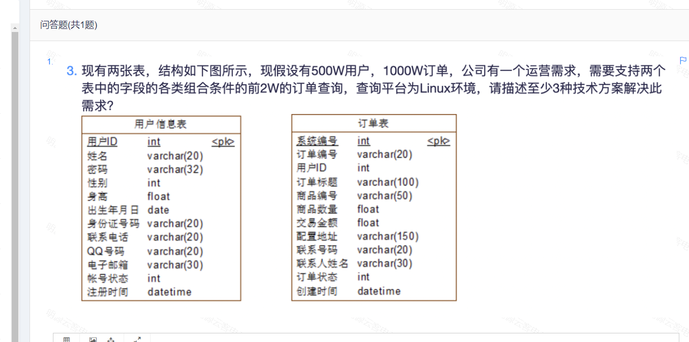

# Table of Contents

* [基础类](#基础类)
  * [drop、truncate 和 delete 的区别](#droptruncate-和-delete-的区别)
  * [为什么删除了表，表文件的大小还是没变？](#为什么删除了表表文件的大小还是没变)
  * [快速创建备份表](#快速创建备份表)
  * [MySQL如何分组拼接字符串？](#mysql如何分组拼接字符串)
  * [高水位清理](#高水位清理)
  * [快速查看表结构](#快速查看表结构)
* [如何理解 MySQL 的边读边发](#如何理解-mysql-的边读边发)
  * [MySQL 的大表查询为什么不会爆内存？](#mysql-的大表查询为什么不会爆内存)
  * [疑问](#疑问)
* [为什么 MySQL 会抖一下？](#为什么-mysql-会抖一下)
* [sql相关](#sql相关)
  * [exists](#exists)
  * [Group By](#group-by)
  * [Where 1=1](#where-11)
  * [UNION和UNION ALL的区别?](#union和union-all的区别)
* [优化](#优化)
  * [Mybatis中更新Mysql时间多了一秒](#mybatis中更新mysql时间多了一秒)
  * [优先级条件，怎么建立索引?](#优先级条件怎么建立索引)
  * [N中组合条件查询怎么做？](#n中组合条件查询怎么做)


# 基础类


## drop、truncate 和 delete 的区别

- DELETE 语句执行删除的过程是每次从表中删除一行，并且**同时将该行的删除操作作为事务记录在Undo日志中**保存以便进行进行回滚操作。
	  ```mysql
  delete
  from base_water_meter
  where ;
  ```
- TRUNCATE TABLE  则一次性地从表中删除所有的数据并不把单独的删除操作记录记入日志保存，删除行是不能恢复的。并且在删除的过程中不会激活与表有关的删除触发器。执行速度快。
	   ```mysql
   truncate  base_water_meter
   ```

- drop语句将表所占用的空间全释放掉。

  ```mysql
  drop table  ac_access_token_1
  ```

> 在速度上，一般来说，drop> truncate > delete。


- 如果**想删除部分数据**用 delete，注意带上 where 子句，回滚段要足够大；

- 如果**想删除表**，当然用 drop；如果想保留表而将所有数据删除，如果和事务无关，用 truncate 即可；


- 如果和事务有关，或者想触发 trigger，还是用 delete；如果是整理表内部的碎片，可以用 truncate 跟上 reuse stroage，再重新导入/插入数据。


## 为什么删除了表，表文件的大小还是没变？

- 数据项删除之后 InnoDB 某个页 page A 会被标记为可复用。
- delete 命令把整个表的数据删除，结果就是，所有的数据页都会被标记为可复用。但是磁盘上，文件不会变小。
- 经过大量增删改的表，都是可能是存在空洞的。这些空洞也占空间所以，如果能够把这些空洞去掉，就能达到收缩表空间的目的。
- 重建表，就可以达到这样的目的。可以使用 alter table A engine=InnoDB 命令来重建表。

```mysql
 alter table A engine=InnoDB
```
## 快速创建备份表


```mysql
mysql> create table   `bak_20220607_notice` like tf_notice;
mysql> insert into `bak_20220607_notice` select * from tf_notice;
```


## MySQL如何分组拼接字符串？

```mysql
SELECT  GROUP_CONCAT(DISTINCT home_town ORDER  BY home_town DESC) AS '领导关怀地区'
    FROM employees;
```


## 高水位清理

```java
ALTER TABLE 表名 Engine =InnoDB
```


## 快速查看表结构

```mys
show create table 表名
```


# 如何理解 MySQL 的边读边发

- 如果客户端接受慢，会导致 MySQL 服务端由于结果发不出去，这个事务的执行时间会很长。
- 服务端并不需要保存一个完整的结果集，取数据和发数据的流程都是通过一个 next_buffer 来操作的。
  + 获取一行，写到 net_buffer 中。这块内存的大小是由参数 net_buffer_length 定义的，默认是 16k。
  + 重复获取行，直到 net_buffer 写满，调用网络接口发出去。
  + 如果发送成功，就清空 net_buffer，然后继续取下一行，并写入 net_buffer。
  + 如果发送函数返回 EAGAIN 或 WSAEWOULDBLOCK，就表示本地网络栈（socket send buffer）写满了，进入等待。直到网络栈重新可写，再继续发送。
- 内存的数据页都是在 Buffer_Pool中操作的。
- InnoDB 管理 Buffer_Pool 使用的是改进的 LRU 算法，使用链表实现，实现上，按照 5:3 的比例把整个 LRU 链表分成了 young 区域和 old 区域。

## MySQL 的大表查询为什么不会爆内存？

- 由于 MySQL 是边读变发，因此对于数据量很大的查询结果来说，不会再 server 端保存完整的结果集，所以，如果客户端读结果不及时，会堵住 MySQL 的查询过程，但是不会把内存打爆。
- InnoDB 引擎内部，由于有淘汰策略，InnoDB 管理 Buffer_Pool 使用的是改进的 LRU 算法，使用链表实现，实现上，按照 5:3 的比例把整个 LRU 链表分成了 young 区域和 old 区域。对冷数据的全扫描，影响也能做到可控制。


> 内部：buffer pool的LRU内存淘汰策略
>
> 发送：边读 边发 


## 疑问

既然mysql没有保存完整的结果集，如果客户端接收很慢，假要花1分钟，执行的SQL是SELECT * FROM t，刚开始表t里有1W行数据，发送30s后表t里又进来了1W数据，那么客户端最后会收到多少数据？

> 1W 
>
> Mysql的隔离机制
> 快照读
>
> 实时读


# 为什么 MySQL 会抖一下？


脏页会被后台线程自动 flush，也会由于数据页淘汰而触发 flush，而刷脏页的过程由于会占用资源，可能会让你的更新和查询语句的响应时间长一些。


# sql相关

## exists
exists存在主要是代替in不走索引的问题

```mysql
select *
from tt_send_place_box a
where exists(select a.send_job_task_id
             from tt_send_place_box b
             where b.box_no = 'PAG40005O3'
               and b.send_job_task_id = '3202111282356099'
              #  查询完 是要匹配的
               and a.send_job_task_id = b.send_job_task_id
          );
```


## Group By


分组后，取第一条或者最后一天数据数据，

+ 方法一

```mysql
select send_task_id, max(operation_flag) as operation_flag
from ti_send_get_task
where icreate_tm > '2021-12-01'
group by send_task_id;
```

+ 方法二

```mysql
select *
from (select *
      from ti_send_get_task
      where icreate_tm > '2021-11-01'
      order by icreate_tm desc) tt
group by tt.send_task_id;

```


>  问题来了，如果我要取倒数第二条数据呢？


提供一种解决思路，用limit来解决，不过不知道效率怎么样。

```java
//取第一条数据后的 1条数据
select *
from ti_send_get_task where send_task_id='2202110312317272' limit 1,1;

```


## Where 1=1

平常在工作生活中，经常见到老代码是这样，为什么要这么写呢？

是为了预防SQL不带任何条件情况下，保证SQL的正确性。不过现在用Mybatis都是由标签的

```java
<WHERE>
<WHERE/>
```


## UNION和UNION ALL的区别?

UNION和UNION ALL都是将两个结果集合并为一个，两个要联合的SQL语句 字段个数必须一样，而且字段类型要“相容”（一致）；
UNION在进行表连接后会筛选掉重复的数据记录（效率较低），而UNION ALL则不会去掉重复的数据记录；
UNION会按照字段的顺序进行排序，而UNION ALL只是简单的将两个结果合并就返回；

**一般都是使用UNION ALL**

# 优化


## Mybatis中更新Mysql时间多了一秒

今天遇到代码生成的时间，更新到mysql时，多出一秒，

这是因为mysql的数据类型为datetime

当创建时间是2020-04-25 22:30:50.771，毫秒被四舍五入为2020-04-25 22:30:51

解决：

+ 将mysql时间类型改为datetime(3)【建议】
+ java传入时间，去掉毫秒值。


## 优先级条件，怎么建立索引?

背景：查询一个数据，数据量大概500W左右，但是查询条件多样化

条件1：A+B+C+D+E

条件2：F+A+N+D+E

条件3：D+F+C+D+E

等等

条件1有直接返回，否则条件2，依次类推。


解决方案：

**在存储数据的时候，多建立一个字段，满足条件1就存条件1的值，依次类推。建立hash索引。**

查询直接匹配即可。


## N中组合条件查询怎么做？




