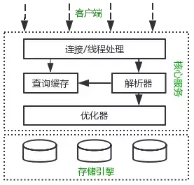
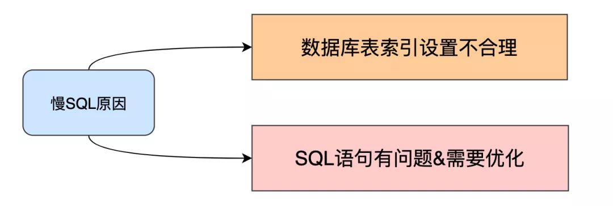

# Table of Contents

* [**MySQL逻辑架构**](#mysql逻辑架构)
* [**SQL语句执行过程**](#sql语句执行过程)
  * [客户端/服务端通信协议](#客户端服务端通信协议)
  * [查询缓存](#查询缓存)
  * [缓存失效](#缓存失效)
  * [语法解析和预处理](#语法解析和预处理)
  * [查询优化](#查询优化)
  * [查询执行引擎](#查询执行引擎)
  * [返回结果给客户端](#返回结果给客户端)
* [**慢SQL解决思路**](#慢sql解决思路)
* [总结](#总结)
* [参考资料](#参考资料)

# **MySQL逻辑架构**

+ MySQL逻辑架构整体分为三层，最上层为客户端层，并非MySQL所独有，诸如：连接处理、授权认证、安全等功能均在这一层处理。

+ MySQL大多数核心服务均在中间这一层，包括查询解析、分析、优化、缓存、内置函数(比如：时间、数学、加密等函数)。所有的跨存储引擎的功能也在这一层实现：存储过程、触发器、视图等。

+ 最下层为存储引擎，**其负责MySQL中的数据存储和提取**。和Linux下的文件系统类似，每种存储引擎都有其优势和劣势。中间的服务层通过API与存储引擎通信，这些API接口屏蔽了不同存储引擎间的差异。

# **SQL语句执行过程**

客户端和MySQL服务端的交互过程简介：

1. 客户端发送一条SQL语句给服务端，服务端的连接器先进行账号/密码、权限等环节验证，有异常直接拒绝请求。
2. 服务端查询缓存，如果SQL语句命中了缓存，则返回缓存中的结果，否则继续处理。
3. 服务端对SQL语句进行词法解析、语法解析、预处理来检查SQL语句的合法性。
4. 服务端通过优化器对之前生成的解析树进行优化处理，生成最优的物理执行计划。
5. 将生成的物理执行计划调用存储引擎的相关接口，进行数据查询和处理。
6. 处理完成后将结果返回客户端。

客户端和MySQL服务端的交互过程简图：

## 客户端/服务端通信协议

**MySQL客户端/服务端通信协议是“半双工”的**：在任一时刻，要么是服务器向客户端发送数据，要么是客户端向服务器发送数据，这两个动作不能同时发生。一旦一端开始发送消息，另一端要接收完整个消息才能响应它，所以我们无法也无须将一个消息切成小块独立发送，也没有办法进行流量控制。

**客户端用一个单独的数据包将查询请求发送给服务器**，所以当查询语句很长的时候，需要设置`max_allowed_packet`参数。但是需要注意的是，如果查询实在是太大，服务端会拒绝接收更多数据并抛出异常。

与之相反的是，**服务器响应给用户的数据通常会很多，由多个数据包组成**。但是当服务器响应客户端请求时，**客户端必须完整的接收整个返回结果**，而不能简单的只取前面几条结果，然后让服务器停止发送。因而在实际开发中，**尽量保持查询简单且只返回必需的数据，减小通信间数据包的大小和数量是一个非常好的习惯，**这也是查询中尽量避免使用`SELECT *`以及加上LIMIT限制的原因之一。

## 查询缓存

> 8.0已经移除了缓存。

使用缓存是好的，但是不仅仅是我们程序，Mysql使用缓存也会带来一系列问题，**既然是缓存，就会失效，那查询缓存何时失效呢？**

在任何的写操作时，MySQL必须将对应表的所有缓存都设置为失效。如果查询缓存非常大或者碎片很多，这个操作就可能带来很大的系统消耗，甚至导致系统僵死一会儿。而且查询缓存对系统的额外消耗也不仅仅在写操作，读操作也不例外：

- 任何的查询语句在开始之前都必须经过检查，即使这条SQL语句永远不会命中缓存
- 如果查询结果可以被缓存，那么执行完成后，会将结果存入缓存，也会带来额外的系统消耗

基于此，我们要知道并不是什么情况下查询缓存都会提高系统性能，缓存和失效都会带来额外消耗，**只有当缓存带来的资源节约大于其本身消耗的资源时，才会给系统带来性能提升。**

最后的忠告是不要轻易打开查询缓存，特别是写密集型应用。如果你实在是忍不住，可以将`query_cache_type`设置为DEMAND，这时只有加入`SQL_CACHE`的查询才会走缓存，其他查询则不会，这样可以非常自由地控制哪些查询需要被缓存。

MySQL Server会对查询语句进行Hash计算后，把得到的hash值与Query查询的结果集对应存放在Query Cache中。当MySQL Server打开Query Cache之后，MySQL Server会对接收到的每一个SELECT 语句通过特定的Hash算法计算该Query的Hash值，然后通过该hashi值到Query Cache中去匹配。

## 缓存失效

在表的结构或数据发生改变时，查询缓存中的数据不再有效。

## 语法解析和预处理

MySQL通过关键字将SQL语句进行解析，并生成一颗对应的解析树。这个过程解析器主要通过语法规则来验证和解析。比如SQL中是否使用了错误的关键字或者关键字的顺序是否正确等等。预处理则会根据MySQL规则进一步检查解析树是否合法。比如检查要查询的数据表和数据列是否存在等等。

## 查询优化

经过前面的步骤生成的语法树被认为是合法的了，并且由优化器将其转化成查询计划。多数情况下，一条查询可以有很多种执行方式，最后都返回相应的结果。优化器的作用就是找到这其中最好的执行计划。

+ 基于规则优化
+ 基于成本优化

## 查询执行引擎

在完成解析和优化阶段以后，MySQL会生成对应的执行计划，查询执行引擎根据执行计划给出的指令逐步执行得出结果。整个执行过程的大部分操作均是通过调用存储引擎实现的接口来完成，这些接口被称为handlerAPI。查询过程中的每一张表由一个handler实例表示。

实际上，MySQL在查询优化阶段就为每一张表创建了一个handler实例，优化器可以根据这些实例的接口来获取表的相关信息，包括表的所有列名、索引统计信息等。存储引擎接口提供了非常丰富的功能，但其底层仅有几十个接口，这些接口像搭积木一样完成了一次查询的大部分操作。

## 返回结果给客户端

查询执行的最后一个阶段就是将结果返回给客户端。即使查询不到数据，MySQL仍然会返回这个查询的相关信息，比如改查询影响到的行数以及执行时间等等。

如果查询缓存被打开且这个查询可以被缓存，MySQL也会将结果存放到缓存中。

结果集返回客户端是一个增量且逐步返回的过程。有可能MySQL在生成第一条结果时，就开始向客户端逐步返回结果集了。这样服务端就无须存储太多结果而消耗过多内存，也可以让客户端第一时间获得返回结果。需要注意的是，结果集中的每一行都会以一个满足①中所描述的通信协议的数据包发送，**再通过TCP协议**进行传输，在传输过程中，可能对MySQL的数据包进行缓存然后批量发送。

# **慢SQL解决思路**

我们从两个方面来进行阐述：

- 数据库表索引设置不合理
- SQL语句有问题，需要优化

- **索引区分度低**

假如表中有1000w记录，其中有status字段表示状态，可能90%的数据status=1，可以不将status作为索引，因为其对数据记录区分度很低。

SQL优化

- **使用连接代替子查询**

> 对于数据库来说，在绝大部分情况下，连接会比子查询更快，使用连接的方式，MySQL优化器一般可以生成更佳的执行计划，更高效地处理查询
> 而子查询往往需要运行重复的查询，子查询生成的临时表上也没有索引， 因此效率会更低。

- **LIMIT偏移量过大的优化**

> 禁止分页查询偏移量过大，如limit 100000,10

- **使用覆盖索引**
  减少select * 借助覆盖索引，减少回表查询次数。
- **多表关联查询时，小表在前，大表在后**

> 在MySQL中，执行from后的表关联查询是从左往右执行的，第一张表会涉及到全表扫描，所以将小表放在前面，先扫小表，扫描快效率较高，在扫描后面的大表，或许只扫描大表的前100行就符合返回条件并return了。

- **调整Where字句中的连接顺序**

> MySQL采用从左往右的顺序解析where子句，可以将过滤数据多的条件放在前面，最快速度缩小结果集。

- **使用小范围事务，而非大范围事务**
- **遵循最左匹配原则**
- **使用联合索引，而非建立多个单独索引**

# 总结

1. 首先介绍Mysql的逻辑架构，过度到Sql语句的执行过程。
2. 然后分别讲下Mysql执行过程的具体步骤、客户端/服务端通信、缓存、语法解析以及优化、生成执行计划、调用引擎。
3. 然后具体分析sql语句，是否加载了不必要的字段。
4. 分析sql执行计划。
5. 进行优化-》
6. 数据量大，分库分表
7. 使用缓存提升查询性能。

# 参考资料

+ https://mp.weixin.qq.com/s/9XKYvA5hmwictkbd42w-Ug
