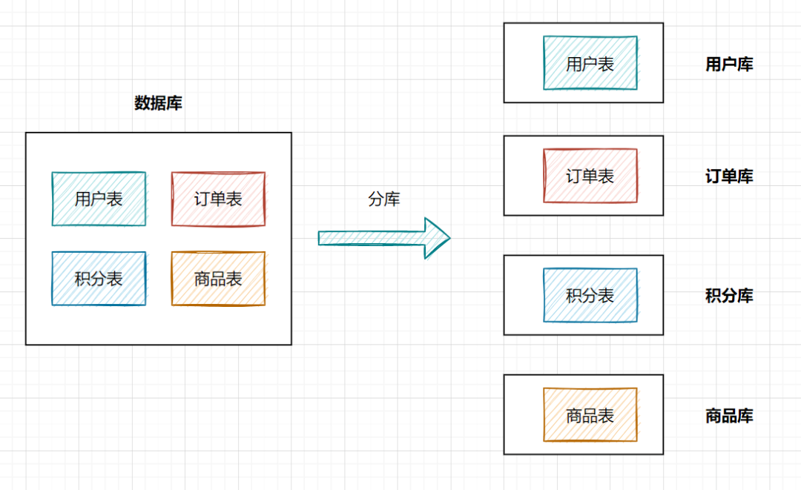
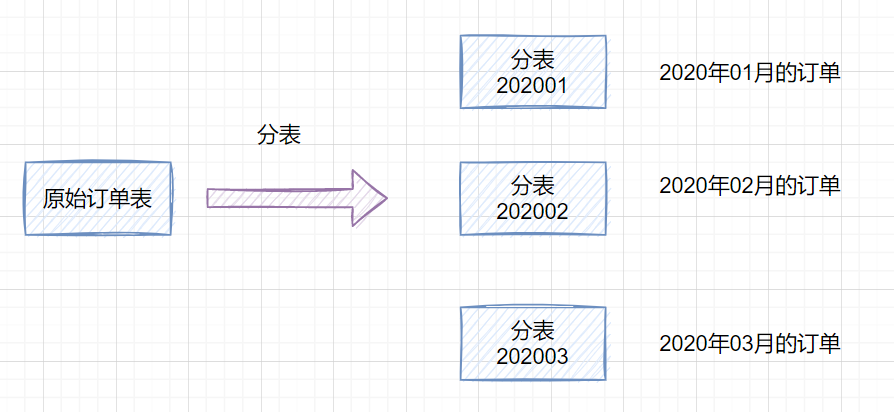
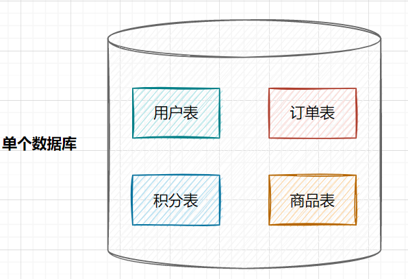
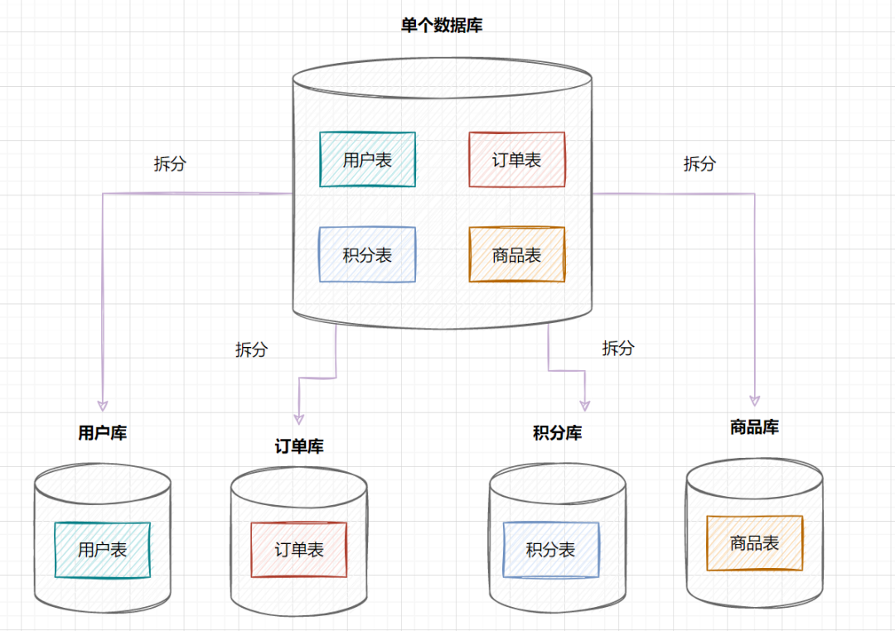
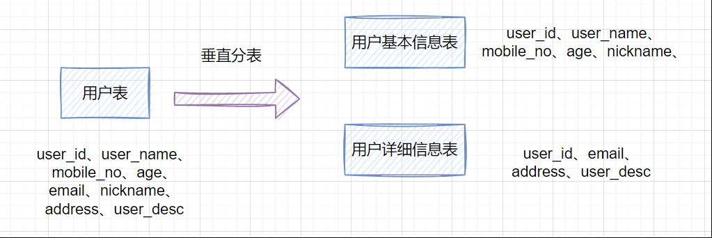
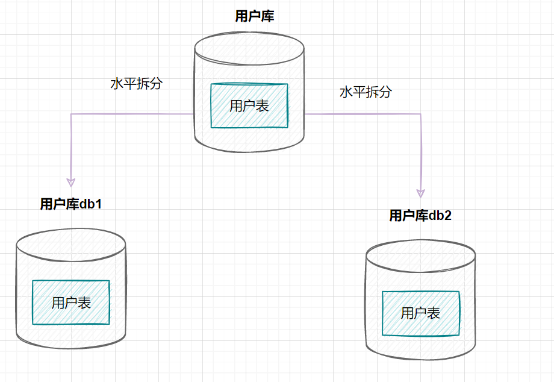
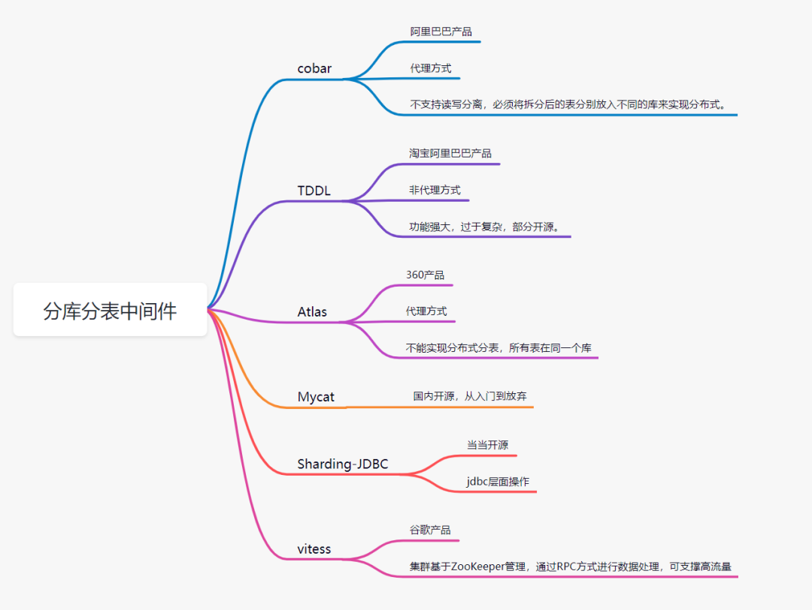

# Table of Contents

* [什么是分库分表](#什么是分库分表)
* [为什么需要分库分表](#为什么需要分库分表)
  * [为什么要分库](#为什么要分库)
  * [为什么要分表](#为什么要分表)
* [如何分库分表](#如何分库分表)
  * [垂直拆分](#垂直拆分)
    * [垂直分库](#垂直分库)
    * [垂直分表](#垂直分表)
  * [水平拆分](#水平拆分)
    * [水平分库](#水平分库)
    * [水平分表](#水平分表)
    * [水平分库分表策略](#水平分库分表策略)
* [什么时候开始考虑分库分表](#什么时候开始考虑分库分表)
  * [什么时候分表？](#什么时候分表)
  * [什么时候分库](#什么时候分库)
* [分库分表会导致哪些问题](#分库分表会导致哪些问题)
* [分库分表中间件简介](#分库分表中间件简介)
* [分表要停服嘛？不停服怎么做？](#分表要停服嘛不停服怎么做)
* [一般会问的具体问题](#一般会问的具体问题)

# 什么是分库分表

**分库**：就是一个数据库分成多个数据库，部署到不同机器。

**分表**：就是一个数据库表分成多个表。

# 为什么需要分库分表

## 为什么要分库

如果业务量剧增，数据库可能会出现性能瓶颈，这时候我们就需要考虑拆分数据库。从这几方面来看：

- **磁盘存储**

业务量剧增，MySQL单机磁盘容量会撑爆，拆成多个数据库，磁盘使用率大大降低。

- **并发连接支撑**

我们知道数据库连接是有限的。在高并发的场景下，大量请求访问数据库，MySQL单机是扛不住的！当前非常火的**微服务架构**出现，就是为了应对高并发。它把**订单、用户、商品**等不同模块，拆分成多个应用，并且把单个数据库也拆分成多个不同功能模块的数据库（**订单库、用户库、商品库**），以分担读写压力。

## 为什么要分表

数据量太大的话，SQL的查询就会变慢。如果一个查询SQL**没命中索引**，千百万数据量级别的表可能会拖垮整个数据库。

即使SQL命中了索引，如果表的数据量**超过一千万**的话，**查询也是会明显变慢的**。这是因为索引一般是B+树结构，数据千万级别的话，B+树的高度会增高，查询就变慢啦。

> 如何计算树的高度？

假设B+树的高度为2的话，即有一个根结点和若干个叶子结点。这棵B+树的存放总记录数为=根结点指针数*单个叶子节点记录行数。

- 如果一行记录的数据大小为1k，那么单个叶子节点可以存的记录数  `=16k/1k =16`.
- **非叶子节点内存放多少指针呢**？我们假设主键ID为**bigint类型，长度为8字节**(**面试官问你int类型，一个int就是32位，4字节**)，而指针大小在InnoDB源码中设置为6字节，所以就是 `8+6=14 `字节，`16k/14B =16*1024B/14B = 1170`

因此，一棵高度为2的B+树，能存放`1170 * 16=18720`条这样的数据记录。同理一棵高度为`3`的B+树，能存放`1170 *1170 *16 =21902400`，大概可以存放两千万左右的记录。B+树高度一般为1-3层，如果B+到了4层，查询的时候会**多查磁盘**的次数，SQL就会变慢。

因此单表数据量太大，SQL查询会变慢，所以就需要考虑分表啦。

# 如何分库分表

## 垂直拆分

### 垂直分库

在业务发展初期，业务功能模块比较少，为了快速上线和迭代，往往采用单个数据库来保存数据。数据库架构如下：

但是随着业务蒸蒸日上，系统功能逐渐完善。这时候，可以按照系统中的不同业务进行拆分，比如拆分成**用户库、订单库、积分库、商品库**，把它们部署在不同的数据库服务器，这就是**垂直分库**。

垂直分库，将原来一个单数据库的压力分担到不同的数据库，可以很好应对高并发场景。数据库垂直拆分后的架构如下：

### 垂直分表

如果一个单表包含了几十列甚至上百列，管理起来很混乱，每次都`select *`的话，还占用IO资源。这时候，我们可以将一些**不常用的、数据较大或者长度较长的列**拆分到另外一张表。

比如一张用户表，它包含`user_id、user_name、mobile_no、age、email、nickname、address、user_desc`，如果`email、address、user_desc`等字段不常用，我们可以把它拆分到另外一张表，命名为用户详细信息表。这就是垂直分表

## 水平拆分

### 水平分库

水平分库是指，将表的数据量切分到不同的数据库服务器上，每个服务器具有相同的库和表，只是表中的数据集合不一样。它可以有效的缓解单机单库的性能瓶颈和压力。

用户库的水平拆分架构如下：

### 水平分表

如果一个表的数据量太大，可以按照某种规则（如`hash取模、range`），把数据切分到多张表去。

一张订单表，按`时间range`拆分如下：

### 水平分库分表策略

分库分表策略一般有几种，使用与不同的场景：

- range范围

  range，即范围策略划分表。比如我们可以将表的主键，按照从`0~1000万`的划分为一个表，`1000~2000万`划分到另外一个表。如下图：

  

  **这种方案的优点：**

  - 这种方案有利于扩容，不需要数据迁移。假设数据量增加到5千万，我们只需要水平增加一张表就好啦，之前`0~4000万`的数据，不需要迁移。

  **缺点：**

  - 这种方案会有热点问题，因为订单id是一直在增大的，也就是说最近一段时间都是汇聚在一张表里面的。比如最近一个月的订单都在`1000万~2000`万之间，平时用户一般都查最近一个月的订单比较多，请求都打到`order_1`表啦，这就导致**数据热点**问题。

- hash取模

  hash取模策略：指定的路由key（一般是user_id、订单id作为key）对分表总数进行取模，把数据分散到各个表中。

  **缺点：**

  会有数据迁移问题，一致性hash环

- range+hash取模混合

  既然range存在热点数据问题，hash取模扩容迁移数据比较困难，我们可以综合两种方案一起嘛，取之之长，弃之之短。

  比较简单的做法就是，在拆分库的时候，我们可以先用**range范围**方案，比如订单id在0~4000万的区间，划分为订单库1;id在4000万~8000万的数据，划分到订单库2,将来要扩容时，id在8000万~1.2亿的数据，划分到订单库3。然后订单库内，再用**hash取模**的策略，把不同订单划分到不同的表。

  

# 什么时候开始考虑分库分表

##  什么时候分表？

如果你的系统处于快速发展时期，如果每天的订单流水都新增几十万，并且，订单表的查询效率明变慢时，就需要规划分库分表了。一般B+树索引高度是2~3层最佳，如果**数据量千万级别**，可能高度就变4层了，数据量就会明显变慢了。不过业界流传，一般500万数据就要**考虑分表**了。

##  什么时候分库

业务发展很快，还是多个服务共享一个单体数据库，数据库成为了性能瓶颈，就需要考虑分库了。比如订单、用户等，都可以抽取出来，新搞个应用（其实就是微服务思想），并且拆分数据库（订单库、用户库）。

# 分库分表会导致哪些问题

分库分表之后，也会存在一些问题：

- 事务问题

  分库分表后，假设两个表在不同的数据库，那么本地事务已经无效啦，需要使用分布式事务了。

- 跨库关联

  跨节点Join的问题：解决这一问题可以分两次查询实现

- 排序问题

  跨节点的count,order by,group by以及聚合函数等问题：可以分别在各个节点上得到结果后在应用程序端进行合并。

- 分页问题

  - 方案1：在个节点查到对应结果后，在代码端汇聚再分页。
  - 方案2：把分页交给前端，前端传来pageSize和pageNo，在各个数据库节点都执行分页，然后汇聚总数量前端。这样缺点就是会造成空查，如果分页需要排序，也不好搞。

- 分布式ID

  数据库被切分后，不能再依赖数据库自身的主键生成机制啦，最简单可以考虑UUID，或者使用雪花算法生成分布式ID。

# 分库分表中间件简介

# 分表要停服嘛？不停服怎么做？

> 分表是在原来base的基础上， 扩展出，base1、base2、base3，
>
> 等数据迁移过去后，base表就无用了。
>
> 不停服务的话，初始就是要保证双写

分五个步骤：

1. 编写代理层，加个开关（控制访问新的DAO还是老的DAO，或者是都访问），灰度期间，还是访问老的DAO。
2. 发版全量后，开启双写，既在旧表新增和修改，也在新表新增和修改。日志或者临时表记下新表ID起始值，旧表中小于这个值的数据就是存量数据，这批数据就是要迁移的。
3. 通过脚本把旧表的存量数据写入新表。
4. 停读旧表改读新表，此时新表已经承载了所有读写业务，但是这时候不要立刻停写旧表，需要保持双写一段时间。
5. 当读写新表一段时间之后，如果没有业务问题，就可以停写旧表啦

# 一般会问的具体问题

分库分表 用户 订单号 多维度查询怎么处理？

好，那么无论你是订单号还是用户ID作为shardingkey，按照以上的两种方式都可以解决问题了。那么还有一个问题就是如果既不是订单号又不是用户ID查询怎么办？最直观的例子就是来自商户端或者后台的查询，商户端都是以商户或者说卖家的ID作为查询条件来查的，后台的查询条件可能就更复杂了，像我碰到的有些后台查询条件能有几十个，这怎么查？？？别急，接下来分开说B端和后台的复杂查询。

现实中真正的流量大头都是来自于用户端C端，所以本质上解决了用户端的问题，这个问题就解了大半，剩下来自商户卖家端B端、后台支持运营业务的查询流量并不会很大，这个问题就好解。

**双写**，**双写就是下单的数据落两份，C端和B端的各自保存一份，C端用你可以用单号、用户ID做shardingkey都行，B端就用商家卖家的ID作为shardingkey就好**了。有些同学会说了，你双写不影响性能吗？因为对于B端来说轻微的延迟是可以接受的，所以可以采取异步的方式去落B端订单。你想想你去淘宝买个东西下单了，卖家稍微延迟个一两秒收到这个订单的消息有什么关系吗？你点个外卖商户晚一两秒收到这个订单有什么太大影响吗？

这是一个解决方案，另外一个方案就是走**离线数仓或者ES**查询，订单数据落库之后，不管你通过binlog还是MQ消息的都形式，**把数据同步到数仓或者ES**，他们支持的数量级对于这种查询条件来说就很简单了。同样这种方式肯定是稍微有延迟的，但是这种可控范围的延迟是可以接受的。

