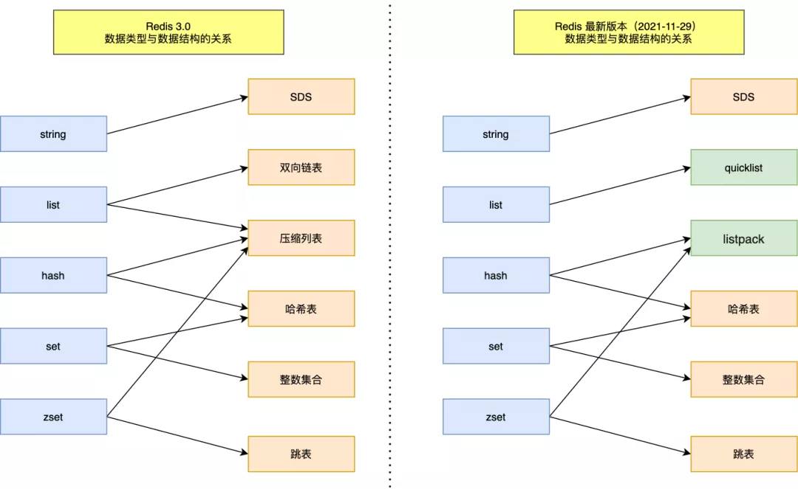
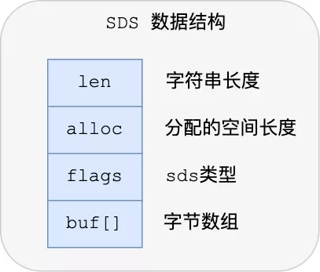
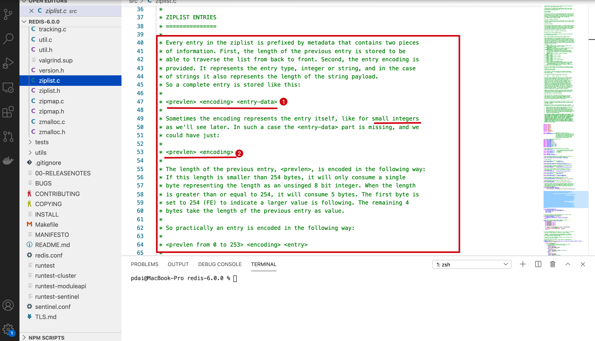

# Table of Contents

* [简单动态字符串-SDS](#简单动态字符串-sds)
  * [C语言缺点](#c语言缺点)
  * [SDS定义](#sds定义)
  * [为什么使用SDS](#为什么使用sds)
  * [SDS问题所在](#sds问题所在)
* [压缩列表 - ZipList](#压缩列表---ziplist)
  * [内存结构](#内存结构)
  * [Entry](#entry)
  * [省内存](#省内存)
  * [缺点](#缺点)
  * [小结](#小结)
* [快表-QuickList[双向链表 + 压缩列表]](#快表-quicklist双向链表--压缩列表)
  * [为什么会有快表](#为什么会有快表)
  * [内存结构](#内存结构-1)
  * [问题](#问题)
  * [LZF](#lzf)
* [listpack[repalce ZipList]](#listpackrepalce-ziplist)
* [字典/哈希表 - Dict](#字典哈希表---dict)
  * [一些要点](#一些要点)
  * [如何渐进式Hash的？](#如何渐进式hash的)
    * [rehash 触发条件](#rehash-触发条件)
* [整数集-intset](#整数集-intset)
  * [内存结构](#内存结构-2)
  * [整数集合的升级](#整数集合的升级)
* [跳表-ZSkipLsit](#跳表-zskiplsit)
  * [内存结构](#内存结构-3)
  * [删除](#删除)
  * [Redis的Zset为什么同时需要字典和跳表来实现？](#redis的zset为什么同时需要字典和跳表来实现)
  * [如何讲跳表](#如何讲跳表)
  * [为什么不用平衡树、哈希表、B+树](#为什么不用平衡树哈希表b树)
* [参考资料](#参考资料)


上文说到，redisObject是由数据类型+数据结构组成的，那么到底有哪些数据结构呢？




理解为什么会设计这样的数据结构，知道解决了什么问题，会让你对知识点理解更深刻。


+ 简单动态字符串-SDS
+ 压缩列表-ZipList
+ 快表-QuickLsit
+ 字典/哈希表-dict
+ 整数集-intset
+ 跳表-ZSkipLsit

# 简单动态字符串-SDS


Redis 是用 C 语言写的，但是对于Redis的字符串，却不是 C 语言中的字符串（即以空字符’\0’结尾的字符数组），它是自己构建了一种名为 **简单动态字符串（simple dynamic string,SDS**）的抽象类型，并将 SDS 作为 Redis的默认字符串表示。


## C语言缺点

- 获取字符串长度的时间复杂度为  O（N）；
- 字符串的结尾是以 “\0” 字符标识，字符串里面不能包含有 “\0” 字符，因此不能保存二进制数据；
- 字符串操作函数不高效且不安全，比如有缓冲区溢出的风险，有可能会造成程序运行终止；


## SDS定义

这是一种用于<font color=red>存储二进制数据</font>的一种结构, 具有<font color=red>动态扩容</font>的特点. 其实现位于src/sds.h与src/sds.c中。


下图就是 Redis 5.0 的 SDS 的数据结构：





+ len，记录了字符串长度。这样获取字符串长度的时候，只需要返回这个成员变量值就行，时间复杂度只需要 O（1）。

+ alloc，分配给字符数组的空间长度。这样在修改字符串的时候，可以通过 alloc - len 计算出剩余的空间大小，可以用来判断空间是否满足修改需求，如果不满足的话，就会自动将 SDS  的空间扩展至执行修改所需的大小，然后才执行实际的修改操作，所以使用 SDS 既不需要手动修改 SDS 的空间大小，也不会出现前面所说的缓冲区溢出的问题。

+ flags，用来表示不同类型的 SDS。一共设计了 5 种类型，分别是 sdshdr5、sdshdr8、sdshdr16、sdshdr32 和 sdshdr64，后面在说明区别之处。

+ buf[]，字符数组，用来保存实际数据。不仅可以保存字符串，也可以保存二进制数据。


其中`sdshdr`是头部, `buf`是真实存储用户数据的地方. 

`‘\0’ `是SDS遵循了C字符串以空字符串结尾的惯例(之所以遵循是因为可以让SDS重用C语言的一些库函数 ),

<font color=red> 保存这个空字符串的一个字节空间不计算在 len中</font>；


## 为什么使用SDS


+ 常数复杂度获取字符串长度

  C语言是遍历字符串O(n)

  Reids因为有len所以是O(1)

+ 杜绝缓冲区溢出

  C进行拼接字符串时，如果没有足够的内存空间会，缓冲区溢出。

  SDS会根据len的长度来进行空间扩展。

+ 减少修改字符串时带来的内存重新分配次数

  C字符串的每次增长或者缩短都需要程序进行一次内存重分配的操作:

  **因为内存重分配涉及复杂的算法，并且可能需要执行系统调用，它通常是一个比较耗时的操作 Redis作为数据库，如果每次都要重新内存分配会影响性能**


    + 空间预分配
    
      空间预分配用户优化SDS字符串增长操作.当API对一个SDS进行修改,并且需要扩展空间的时候，程序会为SDS分配额外的未使用空间
      – 如果对SDS进行修改之后，SDS长度(len 属性的值)将小于1M,那么程序分配和len属性同样大小的未使用空间。
      例如 len增长之后等于13字节,那么预分配之后的内存大小等于
      13+13+1 = 27(额外的1字节是 空字符串)
      – 如果SDS长度大于1M; 那么会分配未使用空间1M;
      例如增长之后SDS长度将变成30M ,那么再分配1M的未使用空间
      30M+1M +1byte ;
      **也可以说增长之后大于1M,那么最多只会预分配出1M的未使用空间；**
    
      **通过预分配策略，Redis可以减少连续执行字符串增长操作所需要的内存重分配次数**
    
    一直增大，超出512M怎么办？

+ 惰性释放

  惰性空间释放用于优化SDS的字符串缩短操作，当API需要缩短字符串时候，程序不会立即使用内存重新分配来回收多余的字节；
  但是SDS提供了相应的API,让我们可以在有需要的时候真正的释放SDS的未使用空间，所以不用担心惰性空间释放策略会造成内存浪费！
  
  定时+时间事件处理+LRU
  
  
  
+ 二进制安全

  字符串必须符合某种编码(比如ASCII),并且除了末尾之外，字符串里面不能包含空字符 ‘\n’ ，否则最先被程序读入空字符串将被误认为是字符串结尾，这些限制使得C字符串只能保存文本数据，而不能保存像 图片，音频，视频等等二进制文件。

  SDS就不存在这样的问题，Redis的buf数组是用来保存一系列的二进制数据。


+ 兼容C部分函数

  `‘\0’ `是SDS遵循了C字符串以空字符串结尾的惯例(之所以遵循是因为可以让SDS重用C语言的一些库函数 ),


## SDS问题所在

SDS的结构决定了，在存储数据的同时，会有头部字段冗余。以及预分配机制。

所以为了有优化使用Big key带来的内存开销，我们可以使用压缩列表来完成。

或者使用hash来完成。

big key真实案例：<a href="bigKey优化案例.pdf" alt="链接">详情见链接🔗</a>

> 总结下

# 压缩列表 - ZipList


ziplist是为了提高存储效率而设计的一种特殊编码的<font color=red>双向链表</font>。它可以存储<font color=red>字符串或者整数，存储整数时是采用整数的二进制而不是字符串形式存储</font>。他能在O(1)的时间复杂度下完成list两端的push和pop操作。但是因为每次操作都需要重新分配ziplist的内存，所以实际复杂度和ziplist的内存使用量相关。

一般来说，<font color=red>数据量小的时候</font>，Redis底层会使用ZipLsit来优化内存结构。

> List 
>
> Hash
>
> 在编码不超过某些字符的时候，采用的都是ZipList


数组要求每个元素的大小相同,如果我们要存储不同长度的字符串,那我们就需要用最大长度的字符串大小作为元素的大小(假设是20个字节)。存储小于 20 个字节长度的字符串的时候，便会浪费部分存储空间。


要利用好数组的特性，需要对数组空间进行压缩，但是会带来一个问题，不知道每个元素大小是多少，因此无法计算下一个节点的位置。这个时候，我们可以给元素属性增加一个Length,这就是一个简单的压缩列表。


## 内存结构


+ `zlbytes`字段的类型是uint32_t, 这个字段中存储的是整个ziplist所占用的内存的字节数

+ `zltail`字段的类型是uint32_t, 它指的是ziplist中最后一个entry的偏移量. 用于快速定位最后一个entry, 以快速完成pop等操作

+ `zllen`字段的类型是uint16_t, 它指的是整个ziplit中entry的数量. 这个值只占2bytes（16位）: 如果ziplist中entry的数目小于65535(2的16次方), 那么该字段中存储的就是实际entry的值. 若等于或超过65535, 那么该字段的值固定为65535, 但实际数量需要一个个entry的去遍历所有entry才能得到.

+ `zlend`是一个终止字节, 其值为全F, 即0xff. ziplist保证任何情况下, 一个entry的首字节都不会是255


## Entry




+ 第一种情况：一般结构 <prevlen> <encoding> <entry-data>
  + prevlen：上一个节点长度
  + encoding: 不同的情况下值不同，用于表示当前entry的类型和长度；
  + entry-data: 真是用于存储entry表示的数据；

+ <prevlen> <encoding> 

  + 在entry中存储的是int类型时，encoding和entry-data会合并在encoding中表示，此时没有entry-data字段

  + redis中，在存储数据时，会先尝试将string转换成int存储，节省空间；

- **prevlen编码**

当前一个元素长度小于254（255用于zlend）的时候，prevlen长度为1个字节，值即为前一个entry的长度，如果长度大于等于254的时候，prevlen用5个字节表示，第一字节设置为254，后面4个字节存储一个小端的无符号整型，表示前一个entry的长度；

```java
11111111=2^8-1 
```


- **encoding编码**

encoding的长度和值根据保存的是int还是string，还有数据的长度而定；

前两位用来表示类型，当为“11”时，表示entry存储的是int类型，其他表示存储的是string；

## 省内存

- ziplist节省内存是相对于普通的list来说的，如果是普通的数组，那么它每个元素占用的内存是一样的且取决于最大的那个元素（很明显它是需要预留空间的）；
- 所以ziplist在设计时就很容易想到要尽量让每个元素按照实际的内容大小存储，**所以增加encoding字段**，针对不同的encoding来细化存储大小；
- 这时候还需要解决的一个问题是遍历元素时如何定位下一个元素呢？在普通数组中每个元素定长，所以不需要考虑这个问题；但是ziplist中每个data占据的内存不一样，所以为了解决遍历，**需要增加记录上一个元素的length**，**所以增加了prelen字段**。

##  缺点

+ ziplist也不预留内存空间, 并且在移除结点后, 也是立即缩容, 这代表<font color=red>每次写操作都会进行内存分配操作</font>.

+ 之前说过,每个节点的previous_entry_length都记录了前一个节点的长度,如果长度小于254那么previous_entry_length需要用1字节来保存这个长度值。现在假设这种情况:压缩列表有多个连续的长度介于250-253之间的节点e1-eN。因为每个节点的长度都小于254字节，所以这些节点的previous_entry_length属性都是1字节长度。此时如果将一个长度大于254的新节点设置为压缩列表的头节点，那么这个新节点成为头节点，也就是e1节点的前置节点。此时将e1的previous_entry_length扩展为5字节长度,此时e1又超过了254，于是e2的previous_entry_length也超过了254··· .此时这些节点就会连锁式的更新，并重新分配空间。除了新增加的节点会引发连锁更新之外，删除也会。假设中间有一个小于250的删除了，也会连锁更新。同上面所说的类似。因为连锁更新在最坏的情况下需要对压缩列表执行N次空间重分配操作，而每次空间重分配的最坏复杂度为O(N),所以连锁更新的最坏复杂度为`O(N^2)。虽然这很耗费时间，但是实际情况下这种发生的概率非常低的。对很少一部分节点进行连锁更新绝对不会影响性能的。

## 小结 

Redis 3.2后之后就是用了QucikList 


#  快表-QuickList[双向链表 + 压缩列表]

A doubly linked list of ziplists

List内部实现就是QuickList 


## 为什么会有快表

+ 链表： 可以实现list功能，但是内存开销大，容易产生内存碎片。
+ ZipList:一块完整的内存，但是不利于修改


其实 quicklist 就是「双向链表 + 压缩列表」组合，因为一个 quicklist 就是一个链表，而链表中的每个元素又是一个压缩列表。


## 内存结构


## 问题

到底一个quicklist节点包含多长的ziplist合适呢？比如，同样是存储12个数据项，既可以是一个quicklist包含3个节点，而每个节点的ziplist又包含4个数据项，也可以是一个quicklist包含6个节点，而每个节点的ziplist又包含2个数据项。


一个quicklist节点上的ziplist要保持一个合理的长度。那到底多长合理呢？这可能取决于具体应用场景。实际上，Redis提供了一个配置参数`list-max-ziplist-size`，就是为了让使用者可以来根据自己的情况进行调整。	

```java
list-max-ziplist-size -2
```

它可以取正值，也可以取负值。

+ 当取正值的时候，表示按照<font color=red>数据项个数</font>来限定每个quicklist节点上的ziplist长度。
+ 当取负值的时候，表示按照<font color=red>占用字节数</font>来限定每个quicklist节点上的ziplist长度。


##  LZF

当列表很长的时候，最容易被访问的很可能是两端的数据，中间的数据被访问的频率比较低（访问起来性能也很低）。如果应用场景符合这个特点，那么list还提供了一个选项，能够把中间的数据节点进行压缩，从而进一步节省内存空间。Redis的配置参数`list-compress-depth`就是用来完成这个设置的。

```java
list-compress-depth 0
```

这个参数表示一个quicklist两端不被压缩的<font color=red>双向链表</font>节点个数,而不是ZipList上的是个数。

- 0: 是个特殊值，表示都不压缩。这是Redis的默认值。
- 1: 表示quicklist两端各有1个节点不压缩，中间的节点压缩。
- 2: 表示quicklist两端各有2个节点不压缩，中间的节点压缩。
- 3: 表示quicklist两端各有3个节点不压缩，中间的节点压缩。
- 依此类推…
  


Redis对于quicklist内部节点的压缩算法，采用的 LZF——一种无损压缩算法。

```java
list-max-ziplist-size 3
list-compress-depth 2
```
如下图所示


- 两端各有2个橙黄色的节点，是没有被压缩的。它们的数据指针zl指向真正的ziplist。中间的其它节点是被压缩过的，它们的数据指针zl指向被压缩后的ziplist结构，即一个quicklistLZF结构。
- 左侧头节点上的ziplist里有2项数据，右侧尾节点上的ziplist里有1项数据，中间其它节点上的ziplist里都有3项数据（包括压缩的节点内部）。这表示在表的两端执行过多次`push`和`pop`操作后的一个状态。


# listpack[repalce ZipList]

quicklist 虽然通过控制 quicklistNode 结构里的压缩列表的大小或者元素个数，来减少连锁更新带来的性能影响，但是并没有完全解决连锁更新的问题。

因为 quicklistNode 还是用了压缩列表来保存元素，压缩列表连锁更新的问题，来源于它的结构设计，所以要想彻底解决这个问题，需要设计一个新的数据结构。

于是，Redis 在 5.0 新设计一个数据结构叫 listpack，目的是替代压缩列表，**它最大特点是 listpack 中每个节点不再包含前一个节点的长度了**，压缩列表每个节点正因为需要保存前一个节点的长度字段，就会有连锁更新的隐患。

不同于ziplist，listpackEntry中的len记录的是**当前entry的长度，而非上一个entry的长度。**listpackEntry中可存储的为字符串或整型。

> 多读几遍

**我看了 Redis 的 Github，在最新  6.2 发行版本中，Redis Hash 对象、Set 对象的底层数据结构的压缩列表还未被替换成 listpack，而 Redis 的最新代码（还未发布版本）已经将所有用到压缩列表底层数据结构的 Redis 对象替换成 listpack 数据结构来实现，估计不久将来，Redis 就会发布一个将压缩列表为 listpack 的发行版本**。


# 字典/哈希表 - Dict

这个数据结构和Java是相等的


## 一些要点

- **哈希算法**：Redis计算哈希值和索引值方法如下：

  ```java
  
  #1、使用字典设置的哈希函数，计算键 key 的哈希值
  hash = dict->type->hashFunction(key);
  
  #2、使用哈希表的sizemask属性和第一步得到的哈希值，计算索引值
  index = hash & dict->ht[x].sizemask;
  ```

  这里具体是怎么实现Hash的跟java有区别吗

- **解决哈希冲突**：这个问题上面我们介绍了，**方法是链地址法**。通过字典里面的 *next 指针指向下一个具有相同索引值的哈希表节点。


- **扩容和收缩**：当哈希表保存的键值对太多或者太少时，就要通过 rerehash(重新散列）来对哈希表进行相应的扩展或者收缩。具体步骤：

  1、如果执行扩展操作，会基于原哈希表创建一个大小等于 ht[0].used*2n 的哈希表（也就是每次扩展都是根据原哈希表已使用的空间扩大一倍创建另一个哈希表）。相反如果执行的是收缩操作，每次收缩是根据已使用空间缩小一倍创建一个新的哈希表。

  2、重新利用上面的哈希算法，计算索引值，然后将键值对放到新的哈希表位置上。

  3、所有键值对都迁徙完毕后，释放原哈希表的内存空间。

- **触发扩容的条件**：

  1、服务器目前没有执行 BGSAVE 命令或者 BGREWRITEAOF 命令，并且负载因子大于等于1。

  2、服务器目前正在执行 BGSAVE 命令或者 BGREWRITEAOF 命令，并且负载因子大于等于5。

  ps：负载因子 = 哈希表已保存节点数量 / 哈希表大小。

  

- **渐近式 rehash**

  什么叫渐进式 rehash？也就是说扩容和收缩操作不是一次性、集中式完成的，而是分多次、渐进式完成的。如果保存在Redis中的键值对只有几个几十个，那么 rehash 操作可以瞬间完成，但是如果键值对有几百万，几千万甚至几亿，那么要一次性的进行 rehash，势必会造成Redis一段时间内不能进行别的操作。所以Redis采用渐进式 rehash,这样在进行渐进式rehash期间，字典的删除查找更新等操作可能会在两个哈希表上进行，第一个哈希表没有找到，就会去第二个哈希表上进行查找。<font color=red>但是进行 增加操作，一定是在新的哈希表上进行的</font>。
  
  
  

## 如何渐进式Hash的？

+ 首先，生成新Hash表ht[1]，为 ht[1] 分配空间。此时字典同时持有ht[0]和ht[1]两个哈希表。字典的偏移索引从静默状态-1，设置为0，表示Rehash 工作正式开始。
+ 然后，迁移ht[0]数据到ht[1]。在 Rehash进行期间，每次对字典执行增删查改操作，**程序会顺带迁移一个ht[0]上的数据**，并更新偏移索引。与此同时，周期函数也会定时迁移一批。
+ 最后，ht[1]和ht[0]指针对象交换。随着字典操作的不断执行， 最终在某个时间点上，ht[0]的所有键值对都会被Rehash至 ht[1]，此时再将ht[1]和ht[0]指针对象互换，同时把偏移索引的值设为-1，表示Rehash操作已完成。

> 如果字典正在Rehash，此时有请求过来，Redis会怎么处理？

针对新增Key，是往ht[1]里面插入。针对读请求，先从ht[0]读，没找到再去ht[1]找。至于删除和更新，其实本质是先找到位置，再进行操作，所以和读请求一样，先找ht[0]，再找ht[1]，找到之后再进行操作。


	### rehash 触发条件

介绍了 rehash 那么多，还没说什么时情况下会触发 rehash 操作呢？

rehash 的触发条件跟**负载因子（load factor）**有关系。

负载因子可以通过下面这个公式计算：


触发 rehash 操作的条件，主要有两个：

- **当负载因子大于等于 1 ，并且 Redis 没有在执行 bgsave 命令或者 bgrewiteaof 命令，也就是没有执行 RDB 快照或没有进行 AOF 重写的时候，就会进行 rehash 操作。**
- **当负载因子大于等于 5 时，此时说明哈希冲突非常严重了，不管有没有有在执行 RDB 快照或 AOF 重写，都会强制进行 rehash 操作。**


# 整数集-intset


整数集合（intset）是<font color=red>集合类型的底层实现之一</font>，当一个集合只包含整数值元素，并且这个集合的元素<font color=red>数量不多</font>时，Redis 就会使用整数集合作为集合键的底层实现。


## 内存结构

```java
typedef struct intset {
    uint32_t encoding;//表示编码方式，的取值有三个：INTSET_ENC_INT16, INTSET_ENC_INT32, INTSET_ENC_INT64
    uint32_t length;//代表其中存储的整数的个数
    int8_t contents[];//
} intset;
```

+ `encoding` 表示编码方式，的取值有三个：INTSET_ENC_INT16, INTSET_ENC_INT32, INTSET_ENC_INT64

+ `length` 代表其中存储的整数的个数

+ `contents` 指向实际存储数值的连续内存区域, 就是一个数组；整数集合的每个元素都是 contents 数组的一个数组项（item），各个项在数组中按值得大小**从小到大有序排序**，且数组中不包含任何重复项。（虽然 intset 结构将 contents 属性声明为 int8_t 类型的数组，但实际上 contents 数组并不保存任何 int8_t 类型的值，contents 数组的真正类型取决于 encoding 属性的值）

  


content数组里面每个元素的数据类型是由encoding来决定的，<font color=red>那么如果原来的数据类型是int16, 当我们再插入一个int32类型的数据时怎么办呢</font>？这就是下面要说的intset的升级。


## 整数集合的升级


当在一个int16类型的整数集合中插入一个int32类型的值，整个集合的所有元素都会转换成32类型。 整个过程有三步：

- 根据新元素的类型（比如int32），扩展整数集合底层数组的空间大小，并为新元素分配空间。
- 将底层数组现有的所有元素都转换成与新元素相同的类型， 并将类型转换后的元素放置到正确的位上， 而且在放置元素的过程中， 需要继续维持底层数组的<font color=red>有序性质不变</font>。
- 最后改变encoding的值，length+1。

**那么如果我们删除掉刚加入的int32类型时，会不会做一个降级操作呢**？

不会。主要还是减少开销的权衡。

> 整数集合支持降级操作吗？

**不支持降级操作**，一旦对数组进行了升级，就会一直保持升级后的状态。比如前面的升级操作的例子，如果删除了 65535 元素，整数集合的数组还是 int32_t 类型的，并不会因此降级为 int16_t 类型。


这里有一个疑问，如果升级到64，那么岂不是很浪费空间，不知道redis这点是怎么解决的？

但是回到我们最开始定义Inset的地方，是数量不多的时候才会用此结构。并且数据类型都为32.去降级，先O(n)，在进行内存搜索，开销是不是更大？


# 跳表-ZSkipLsit


跳跃表结构在 Redis 中的运用场景只有一个，那就是作为<font color=red>有序列表 (Zset)</font> 的使用。跳跃表的性能可以保证在查找，删除，添加等操作的时候在对数期望时间内完成，这个性能是可以和平衡树来相比较的，而且在实现方面比平衡树要优雅，这就是跳跃表的长处。跳跃表的缺点就是需要的存储空间比较大，属于<font color=red>利用空间来换取时间的数据结构</font>。


如果你对B+数比较熟悉，你会很容易熟悉跳表，因为思想是一样的。


## 内存结构 


redis跳跃表并没有在单独的类（比如skplist.c)中定义，而是其定义在server.h中, 如下:

```java

/* ZSETs use a specialized version of Skiplists */
typedef struct zskiplistNode {
    sds ele;
    double score;
    struct zskiplistNode *backward;
    struct zskiplistLevel {
        struct zskiplistNode *forward;
        unsigned int span;
    } level[];
} zskiplistNode;

typedef struct zskiplist {
    struct zskiplistNode *header, *tail;
    unsigned long length;
    int level;
```


以下暂时没理解


**zskiplist的核心设计要点**

- **头结点**不持有任何数据, 且其<font color=red>level[]的长度为32</font>

- 每个结点

  - `ele`字段，持有数据，是sds类型

  - `score`字段, 其标示着结点的得分, 结点之间凭借得分来判断先后顺序, 跳跃表中的结点按结点的得分升序排列.

  - `backward`指针, 这是原版跳跃表中所没有的. 该指针指向结点的前一个紧邻结点.

  - ```
    level
    ```

    字段, 用以记录所有结点(除过头结点外)；每个结点中最多持有32个zskiplistLevel结构. 实际数量在结点创建时, 按幂次定律随机生成(不超过32). 每个zskiplistLevel中有两个字段

    - `forward`字段指向比自己得分高的某个结点(不一定是紧邻的), 并且, 若当前zskiplistLevel实例在level[]中的索引为X, 则其forward字段指向的结点, 其level[]字段的容量至少是X+1. 这也是上图中, 为什么forward指针总是画的水平的原因.
    - `span`字段代表forward字段指向的结点, 距离当前结点的距离. 紧邻的两个结点之间的距离定义为1.


##  跳表节点查询过程

查找一个跳表节点的过程时，跳表会从头节点的最高层开始，逐一遍历每一层。在遍历某一层的跳表节点时，会用跳表节点中的 SDS 类型的**元素和元素的权重**来进行判断，共有两个判断条件：

- 如果当前节点的权重「小于」要查找的权重时，跳表就会访问该层上的下一个节点。
- 如果当前节点的权重「等于」要查找的权重时，并且当前节点的 SDS 类型数据「小于」要查找的数据时，跳表就会访问该层上的下一个节点。

如果上面两个条件都不满足，或者下一个节点为空时，跳表就会使用目前遍历到的节点的 level 数组里的下一层指针，然后沿着下一层指针继续查找，这就相当于跳到了下一层接着查找。

举个例子，下图有个 3 层级的跳表。


如果要查找「元素：abcd，权重：4」的节点，查找的过程是这样的：

- 先从头节点的最高层开始，L2 指向了「元素：abc，权重：3」节点，这个节点的权重比要查找节点的小，所以要访问该层上的下一个节点；
- 但是该层上的下一个节点是空节点，于是就会跳到「元素：abc，权重：3」节点的下一层去找，也就是 leve[1];
- 「元素：abc，权重：3」节点的  leve[1] 的下一个指针指向了「元素：abcde，权重：4」的节点，然后将其和要查找的节点比较。虽然「元素：abcde，权重：4」的节点的权重和要查找的权重相同，但是当前节点的 SDS 类型数据「大于」要查找的数据，所以会继续跳到「元素：abc，权重：3」节点的下一层去找，也就是 leve[0]；
- 「元素：abc，权重：3」节点的 leve[0] 的下一个指针指向了「元素：abcd，权重：4」的节点，该节点正是要查找的节点，查询结束。


## 跳表节点层数设置

跳表的相邻两层的节点数量的比例会影响跳表的查询性能。

举个例子，下图的跳表，第二层的节点数量只有 1 个，而第一层的节点数量有 6 个。


这时，如果想要查询节点 6，那基本就跟链表的查询复杂度一样，就需要在第一层的节点中依次顺序查找，复杂度就是 O(N) 了。所以，为了降低查询复杂度，我们就需要维持相邻层结点数间的关系。

**跳表的相邻两层的节点数量最理想的比例是 2:1，查找复杂度可以降低到 O(logN)**。


下图的跳表就是，相邻两层的节点数量的比例是 2 : 1。


> 那怎样才能维持相邻两层的节点数量的比例为 2 : 1  呢？

如果采用新增节点或者删除节点时，来调整跳表节点以**维持比例**的方法的话，会带来额外的开销。

Redis 则采用一种巧妙的方法是，**跳表在创建节点的时候，随机生成每个节点的层数**，并没有严格维持相邻两层的节点数量比例为 2 : 1 的情况。

具体的做法是，**跳表在创建节点时候，会范围为[0-1]生成的一个随机数，如果这个随机数小于 0.25（相当于概率 25%），那么层数就增加 1 层，然后继续生成下一个随机数，直到随机数的结果大于 0.25 结束，最终确定该节点的层数**。

这样的做法，相当于每增加一层的概率不超过 25%，层数越高，概率越低，层高最大限制是 64。


## 随机层数实现

```java
int zslRandomLevel(void) {
    int level = 1;
    while ((random()&0xFFFF) < (ZSKIPLIST_P * 0xFFFF))
        level += 1;
    return (level<ZSKIPLIST_MAXLEVEL) ? level : ZSKIPLIST_MAXLEVEL;
}

```

使用概率均衡的思路，确定新插入节点的层数。Redis使用随机函数决定层数。直观上来说，默认1层，和丢硬币一样，如果是正面就继续往上，这样持续迭代，最大层数32层。


直观上期望的目标是 50% 的概率被分配到 Level 1，25% 的概率被分配到 Level 2，12.5% 的概率被分配到 Level 3，以此类推…有 2-63 的概率被分配到最顶层，因为这里每一层的晋升率都是 50%。


当level[0]有2的64次方个节点时，才能达到32层，因此层数上限是32完全够用了。


## 删除


根据节点找到对应的数据，进行删除，然后进行链表指针更改。如果其他层级也有这个索引 需要一起删掉


## Redis的Zset为什么同时需要字典和跳表来实现？

Zset是一个有序列表，字典和跳表分别对应两种查询场景，**字典用来支持按成员查询数据，跳表则用以实现高效的范围查询，**这样两个场景，性能都做到了极致


## 如何讲跳表

可以先从数组、链表、数的优缺点，过渡到跳表。

跳表本质上是对链表的一种优化，通过逐层跳步采样的方式构建索引，以加快查找速度。如果只用普通链表，只能一个一个往后找。跳表就不一样了，可以高层索引，一次跳跃多个节点，如果找过头了，就用更下层的索引。

## 为什么不用平衡树、哈希表、B+树


+ 先看看作者的回答

  ```html
  There are a few reasons:
  
  They are not very memory intensive. It's up to you basically. Changing parameters about the probability of a node to have a given number of levels will make then less memory intensive than btrees.
  A sorted set is often target of many ZRANGE or ZREVRANGE operations, that is, traversing the skip list as a linked list. With this operation the cache locality of skip lists is at least as good as with other kind of balanced trees.
  
  They are simpler to implement, debug, and so forth. For instance thanks to the skip list simplicity I received a patch (already in Redis master) with augmented skip lists implementing ZRANK in O(log(N)). It required little changes to the code.
  
  About the Append Only durability & speed, I don't think it is a good idea to optimize Redis at cost of more code and more complexity for a use case that IMHO should be rare for the Redis target (fsync() at every command). Almost no one is using this feature even with ACID SQL databases, as the performance hint is big anyway.
  About threads: our experience shows that Redis is mostly I/O bound. I'm using threads to serve things from Virtual Memory. The long term solution to exploit all the cores, assuming your link is so fast that you can saturate a single core, is running multiple instances of Redis (no locks, almost fully scalable linearly with number of cores), and using the "Redis Cluster" solution that I plan to develop in the future.
  
  ```

  简而言之就是<font color=red>实现简单且达到了类似效果</font>。

+ 哈希 平衡树 B+树

  + 哈希：查找O(1) 但不是有序的，无法做便利查找。
  + 平衡树
    + 查找实际都是O(log n) 但平衡树实现顺序查找比较麻烦，需要中序遍历。
    + 插入、删除开销比较达，ZSkipList插入和删除只需要修改相邻节点的指针，操作简单又快速。
    + 内存  一般来说，平衡树每个节点包含2个指针（分别指向左右子树），而skiplist每个节点包含的指针数目平均为1/(1-p)，具体取决于参数p的大小。如果像Redis里的实现一样，取p=1/4，那么平均每个节点包含1.33个指针，比平衡树更有优势。

  + B+
    + 非叶子节点存储索引，叶子节点存储数据，且叶子节点的大小就是磁盘页的大小，充分利用了磁盘预读功能，降低磁盘IO。 **Redis是内存中读取数据，不涉及IO，因此使用了跳表**+
    + 插入 删除 和内存 跟平衡树差不多
    + B+ 时间复杂度  可以看作Ologm(n) 但是redis插入是<font color=red>无序的</font>，B+树分裂会造成比较达的开销


# 参考资料


https://mp.weixin.qq.com/s/MGcOl1kGuKdA7om0Ahz5IA?forceh5=1
