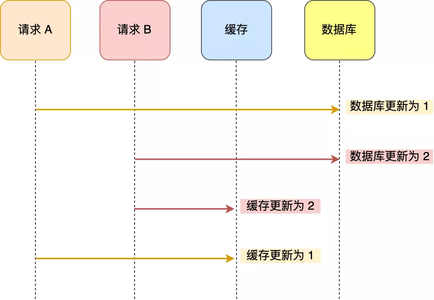
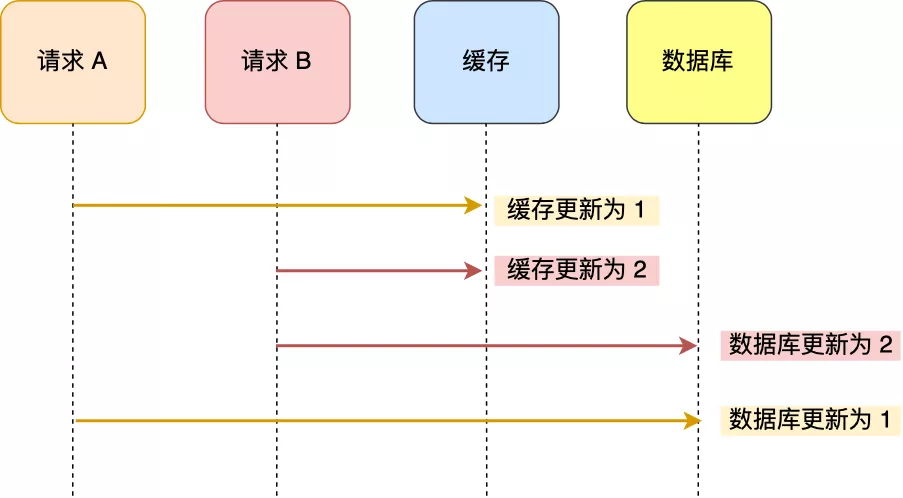
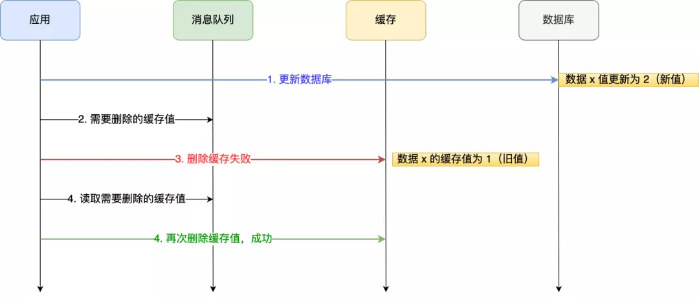

# Table of Contents

* [数据库和缓存不一致问题](#数据库和缓存不一致问题)
* [数据一致性](#数据一致性)
  * [Cache Aside(旁路缓存策略)](#cache-aside旁路缓存策略)
  * [Read/Write Through](#readwrite-through)
* [目前项目用的](#目前项目用的)
* [如何保证「先更新数据库 ，再删除缓存」这两个操作能执行成功？](#如何保证先更新数据库-再删除缓存这两个操作能执行成功)
  * [重试机制](#重试机制)
  * [binlog](#binlog)

# 数据库和缓存不一致问题

读取缓存步骤一般没有什么问题，但是一旦涉及到数据更新：数据库和缓存更新，就容易出现缓存(Redis)和数据库（MySQL）间的数据一致性问题。

+  先更新数据库，再更新缓存

举个例子，比如「请求 A 」和「请求 B 」两个请求，同时更新「同一条」数据，则可能出现这样的顺序：

此时，数据库中的数据是 2，而缓存中的数据却是 1，**出现了缓存和数据库中的数据不一致的现象**。

+  先更新缓存，再更新数据库

  

假设「请求 A 」和「请求 B 」两个请求，同时更新「同一条」数据，则可能出现这样的顺序：

此时，数据库中的数据是 1，而缓存中的数据却是 2，**出现了缓存和数据库中的数据不一致的现象**。

> 所以，**无论是「先更新数据库，再更新缓存」，还是「先更新缓存，再更新数据库」，这两个方案都存在并发问题，当两个请求并发更新同一条数据的时候，可能会出现缓存和数据库中的数据不一致的现象**。

那我们怎么解决这个问题？

# 数据一致性

从设计思路来说，有Cache Aside和Read/Write Through两种模式，前者是把缓存责任交给应用层，后者是将缓存的责任，放置到服务提供方。

## Cache Aside(旁路缓存策略)

> 更新 DB，然后直接删除 cache 。

- **失效**：应用程序先从cache取数据，没有得到，则从数据库中取数据，成功后，放到缓存中。

- **命中**：应用程序从cache中取数据，取到后返回。

- **更新**：先把数据存到数据库中，**成功后**，再让缓存失效。(还是用的先更新数据库在更新缓存的)

那么，是不是Cache Aside这个就不会有并发问题了？不是的，比如，一个是读操作，但是没有命中缓存，然后就到数据库中取数据，此时来了一个写操作，写完数据库后，让缓存失效，然后，之前的那个读操作再把老的数据放进去，所以，会造成脏数据。

但，这个case理论上会出现，

不过，实际上出现的概率可能非常低，因为这个条件需要发生在读缓存时缓存失效，而且并发着有一个写操作。而实际上数据库的写操作会比读操作慢得多，而且还要锁表，**而读操作必需在写操作前进入数据库操作，而又要晚于写操作更新缓存**，所有的这些条件都具备的概率基本并不大。
在加上我们的**缓存不都是有失效时间吗。**

> 兜底方法:
>
> 请求到过期缓存的时候，返回错误，让用户重新加载。

## Read/Write Through 

先更新缓存，缓存负责同步更新数据库

>  两种模式各有优缺点，从透明性考虑，服务方比较合适；如果从性能极致来说，业务方会更有优势，毕竟可以减去服务RPC的损耗。

# 目前项目用的 

就是使用旁路缓存策略

对于热点key是放在本地内存中的。

# 如何保证「先更新数据库 ，再删除缓存」这两个操作能执行成功？

举个例子，来说明下。

应用要把数据 X 的值从 1 更新为 2，先成功更新了数据库，然后在 Redis 缓存中删除 X 的缓存，但是这个操作却失败了，这个时候数据库中 X 的新值为 2，Redis 中的 X 的缓存值为 1，出现了数据库和缓存数据不一致的问题。

## 重试机制

我们可以引入**消息队列**，将第二个操作（删除缓存）要操作的数据加入到消息队列，由消费者来操作数据。

- 如果应用**删除缓存失败**，可以从消息队列中重新读取数据，然后再次删除缓存，这个就是**重试机制**。当然，如果重试超过的一定次数，还是没有成功，我们就需要向业务层发送报错信息了。
- 如果**删除缓存成功**，就要把数据从消息队列中移除，避免重复操作，否则就继续重试。

## binlog

订阅 Mysql 数据库的 binlog 日志对缓存进行操作。

Canal 模拟 MySQL 主从复制的交互协议，**把自己伪装成一个 MySQL 的从节点**，向 MySQL 主节点发送 dump 请求，MySQL 收到请求后，就会开始推送 Binlog 给 Canal，Canal 解析 Binlog 字节流之后，转换为便于读取的结构化数据，供下游程序订阅使用。

缺点：增加了系统复杂度，一般实时性要求不高的，不用这个方案。
