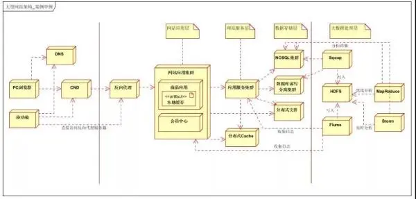
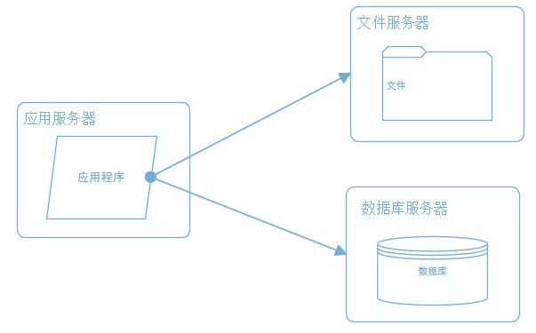
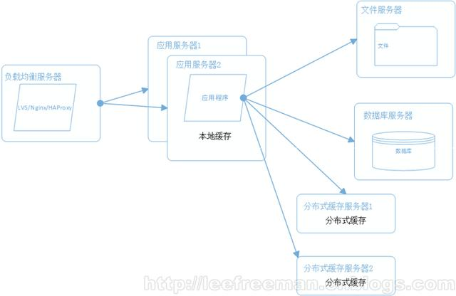
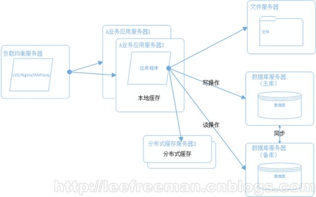
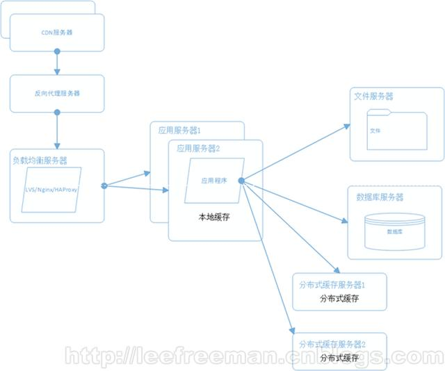
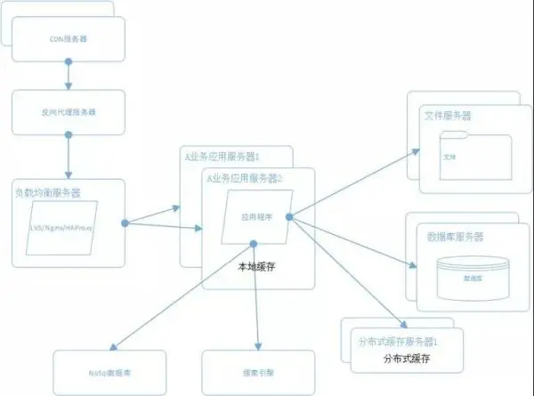
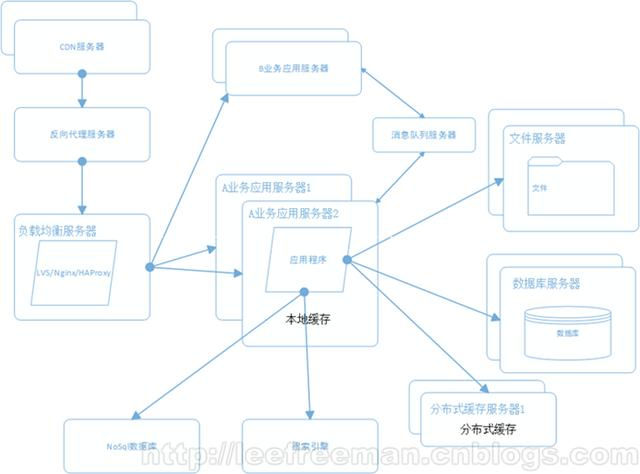
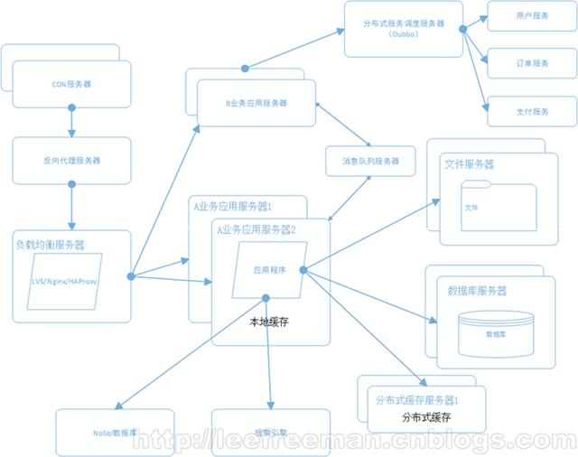
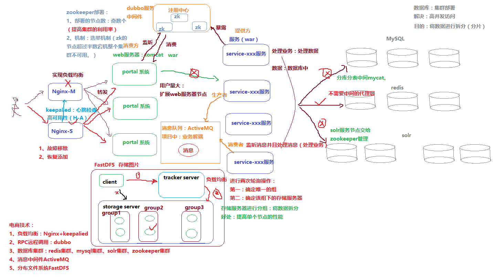

# Table of Contents

* [大型分布式网站架构技术](#大型分布式网站架构技术)
  * [大型网站的特点](#大型网站的特点)
  * [大型网站架构目标](#大型网站架构目标)
  * [大型网站架构模式](#大型网站架构模式)
  * [高性能框架](#高性能框架)
  * [高可用框架](#高可用框架)
  * [可伸缩架构](#可伸缩架构)
  * [可扩展架构](#可扩展架构)
  * [大型架构举例](#大型架构举例)
* [大型电商网站系统架构演变过程](#大型电商网站系统架构演变过程)
  * [最开始的网站架构(单体应用)](#最开始的网站架构单体应用)
  * [应用、数据、文件分离](#应用数据文件分离)
  * [利用缓存改善网站性能](#利用缓存改善网站性能)
  * [使用集群改善应用服务器性能](#使用集群改善应用服务器性能)
  * [数据库读写分离和分库分表](#数据库读写分离和分库分表)
  * [使用CDN和反向代理提高网站性能](#使用cdn和反向代理提高网站性能)
  * [使用分布式文件系统](#使用分布式文件系统)
  * [使用NoSql和搜索引擎](#使用nosql和搜索引擎)
  * [将应用服务器进行业务拆分(其实已经是分布式了)](#将应用服务器进行业务拆分其实已经是分布式了)
  * [搭建分布式服务](#搭建分布式服务)
* [一张图说明电商架构](#一张图说明电商架构)
* [大型电商网站架构案例](#大型电商网站架构案例)
  * [电商网站需求](#电商网站需求)
  * [网站初级架构](#网站初级架构)
  * [系统容量预估(重点看下，可以预估下QPS)](#系统容量预估重点看下可以预估下qps)
  * [网站架构分析](#网站架构分析)
* [参考资料](#参考资料)

# 大型分布式网站架构技术

## 大型网站的特点 

- 用户多，分布广泛
- 大流量，高并发
- 海量数据，服务高可用
- 安全环境恶劣，易受网络攻击
- 功能多，变更快，频繁发布
- 从小到大，渐进发展
- 以用户为中心
- 免费服务，付费体验

## 大型网站架构目标

- 高性能：提供快速的访问体验。
- 高可用：网站服务一直可以正常访问。
- 可伸缩：通过硬件增加/减少，提高/降低处理能力。
- 安全性：提供网站安全访问和数据加密、安全存储等策略。
- 扩展性：方便地通过新增/移除方式，增加/减少新的功能/模块。
- 敏捷性：随需应变，快速响应;

## 大型网站架构模式

+ 分层：一般可以氛围应用层、服务层、数据层、管理层与分析层。

  > 应用层：首页、用户中心、订单中心。
  >
  > 服务层：登录模块、权限服务、订单服务、
  >
  > 数据层：数据库、文件服务、缓存、搜索服务
  >
  > 管理层：不太懂？？？
  >
  > 分析层：大数据分析结构写回数据层。

+ 分割：一般按照业务/模块/功能特点进行划分，比如应用层分为首页、用户中心。

  > 微服务的拆分。

+ 分布：将应用分开部署(比如多台物理机)，通过**远程调用**协同工作。

  > 分布式的出现：是为了摆脱单机资源的束缚
  >
  > 比如：上海部署一套系统供上海访问；深圳在搞一套。

+ 集群：一个应用/模块/功能部署多份(如：多台物理机)，**通过负载均衡共同提供对外访问。**

  > 这里就会设计到幂等性问题。

  分布式和集群区别：https://zhuanlan.zhihu.com/p/144921237

+ 缓存：将数据放在距离应用或用户最近的位置，加快访问速度。

  > 一级缓存 二级缓存 类似CPU

+ 异步：将同步的操作异步化。客户端发出请求，不等待服务端响应，等服务端处理完毕后，使用通知或轮询的方式告知请求方。一般指：请求——响应——通知模式。

+ 冗余：增加副本，提高可用性、安全性与性能。

  > 个人理解：当前资源足够提供一个服务的情况下多给点资源以防突发情况。多部署一台机器？

- 安全：对已知问题有有效的解决方案，对未知/潜在问题建立发现和防御机制。

- 自动化：将重复的、不需要人工参与的事情，通过工具的方式，使用机器完成。

  > 类似jenkins自动部署，自动化测试等。

- 敏捷性：积极接受需求变更，快速响应业务发展需求。

## 高性能框架

以用户为中心，提供快速的网页访问体验。主要指标有【较短的响应时间，较大的并发处理、较高的吞吐量与稳定的性能指数。】

**分为前端优化、应用层优化、服务层优化、数据层优化**

+ 前端优化: 不太懂 交给前端吧

+ 浏览器优化：启用Http2.0、使用浏览器缓存；CDN加速；反向代理

    [正向代理和反向代理.md](../L.Web/正向代理和反向代理.md)

+ 应用层优化：集群、缓存、异步。
+ 服务层优化：合理的架构、多线程、资源复用(对象池、连接池)、良好的数据结构、JVM调优、单例、Cache；
+ 数据层优化：缓存、固态硬盘、光纤传输、优化读写、磁盘冗余、分布式存储(HDFS)、NoSQL等。

## 高可用框架

>  大型网站应该在任何时候都可以正常访问，正常提供对外服务。

因为大型网站的复杂性，分布式，廉价服务器，开源数据库，操作系统等特点，要保证高可用是很困难的，也就是说网站的故障是不可避免的。

如何提高可用性，就是需要迫切解决的问题。首先，需要从架构级别考虑，在规划的时候，就考虑可用性。行业内一般用几个9表示可用性指标，比如四个9(99.99)，一年内允许的不可用时间是53分钟。

不同层级使用的策略不同，一般采用【冗余备份】和【失效转移】解决高可用问题。

- 应用层：一般设计为无状态的，对于每次请求，使用哪一台服务器处理是没有影响的。一般使用负载均衡技术(需要解决Session同步问题)实现高可用。
- 服务层：负载均衡，分级管理，快速失败(超时设置)，异步调用，服务降级，服务熔断、幂等设计等。
- 数据层：冗余备份(冷，热备[同步，异步]，温备)，失效转移(确认，转移，恢复)。数据高可用方面著名的理论基础是CAP理论(持久性，可用性，数据一致性[强一致，用户一致，最终一致])

## 可伸缩架构

伸缩性是指在不改变原有架构设计的基础上，通过添加/减少硬件(服务器)的方式，提高/降低系统的处理能力。

- 应用层：对应用进行垂直或水平切分。然后针对单一功能进行负载均衡(DNS、HTTP[反向代理]、IP、链路层)。
- 服务层：与应用层类似;
- 数据层：分库、分表、NoSQL等;常用算法Hash，一致性Hash。

## 可扩展架构
可以方便地进行功能模块的新增/移除，提供代码/模块级别良好的可扩展性。

- 模块化，组件化：高内聚，低耦合，提高复用性，扩展性。
- 稳定接口：定义稳定的接口，在接口不变的情况下，内部结构可以“随意”变化。
- 设计模式：应用面向对象思想，原则，使用设计模式，进行代码层面的设计。
- 消息队列：模块化的系统，通过消息队列进行交互，使模块之间的依赖解耦。
- 分布式服务：公用模块服务化，提供其他系统使用，提高可重用性，扩展性。

## 大型架构举例

以上采用七层逻辑架构，第一层客户层，第二层前端优化层，第三层应用层，第四层服务层，第五层数据存储层，第六层大数据存储层，第七层大数据处理层。

- 客户层：支持PC浏览器和手机APP。
- 前端层：使用DNS负载均衡，CDN本地加速以及反向代理服务;
- 应用层：网站应用集群;按照业务进行垂直拆分，比如商品应用，会员中心等;
- 服务层：提供公用服务，比如用户服务，订单服务，支付服务等;
- 数据层：支持关系型数据库集群(支持读写分离)，NOSQL集群，分布式文件系统集群;以及分布式Cache;
- 大数据存储层：支持应用层和服务层的日志数据收集，关系数据库和NOSQL数据库的结构化和半结构化数据收集;
- 大数据处理层：通过Mapreduce进行离线数据分析或Storm实时数据分析，并将处理后的数据存入关系型数据库。(实际使用中，离线数据和实时数据会按照业务要求进行分类处理，并存入不同的数据库中，供应用层或服务层使用)。

# 大型电商网站系统架构演变过程

一个成熟的大型网站(如淘宝、天猫、腾讯等)的系统架构并不是一开始设计时就具备完整的高性能、高可用、高伸缩等特性的，它是随着用户量的增加，业务功能的扩展逐渐演变完善的，在这个过程中，开发模式、技术架构、设计思想也发生了很大的变化，就连技术人员也从几个人发展到一个部门甚至一条产品线。

所以成熟的系统架构是随着业务的扩展而逐步完善的，并不是一蹴而就;不同业务特征的系统，会有各自的侧重点，例如淘宝，要解决海量的商品信息的搜索、下单、支付;例如腾讯，要解决数亿用户的实时消息传输;百度它要处理海量的搜索请求。

他们都有各自的业务特性，系统架构也有所不同。尽管如此我们也可以从这些不同的网站背景中，找出其中共用的技术，这些技术和手段广泛运用在大型网站系统的架构中，下面就通过介绍大型网站系统的演化过程，来认识这些技术和手段。

## 最开始的网站架构(单体应用)

最初的架构，应用程序、数据库、文件都部署在一台服务器上，如图：

## 应用、数据、文件分离

随着业务的扩展，一台服务器已经不能满足性能需求，故将应用程序、数据库、文件各自部署在独立的服务器上，并且根据服务器的用途配置不同的硬件，达到最佳的性能效果。

## 利用缓存改善网站性能

在硬件优化性能的同时，同时也通过软件进行性能优化，在大部分的网站系统中，都会利用缓存技术改善系统的性能，使用缓存主要源于热点数据的存在，大部分网站访问都遵循28原则（即80%的访问请求，最终落在20%的数据上），所以我们可以对热点数据进行缓存，减少这些数据的访问路径，提高用户体验。

缓存实现常见的方式是本地缓存、分布式缓存。当然还有CDN、反向代理等，这个后面再讲。本地缓存，顾名思义是将数据缓存在应用服务器本地，可以存在内存中，也可以存在文件，OSCache就是常用的本地缓存组件。本地缓存的特点是速度快，但因为本地空间有限所以缓存数据量也有限。分布式缓存的特点是，可以缓存海量的数据，并且扩展非常容易，在门户类网站中常常被使用，速度按理没有本地缓存快，常用的分布式缓存是Memcached、Redis。

## 使用集群改善应用服务器性能

应用服务器作为网站的入口，会承担大量的请求，我们往往通过应用服务器集群来分担请求数。应用服务器前面部署负载均衡服务器调度用户请求，根据分发策略将请求分发到多个应用服务器节点。

常用的负载均衡技术硬件的有F5，价格比较贵，软件的有LVS、Nginx、HAProxy。LVS是四层负载均衡，根据目标地址和端口选择内部服务器，Nginx是七层负载均衡和HAProxy支持四层、七层负载均衡，可以根据报文内容选择内部服务器，因此LVS分发路径优于Nginx和HAProxy，性能要高些，而Nginx和HAProxy则更具配置性，如可以用来做动静分离（根据请求报文特征，选择静态资源服务器还是应用服务器）。

## 数据库读写分离和分库分表

随着用户量的增加，数据库成为最大的瓶颈，改善数据库性能常用的手段是进行读写分离以及分表，读写分离顾名思义就是将数据库分为读库和写库，通过主备功能实现数据同步。分库分表则分为水平切分和垂直切分，水平切换则是对一个数据库特大的表进行拆分，例如用户表。垂直切分则是根据业务不同来切换，如用户业务、商品业务相关的表放在不同的数据库中。

## 使用CDN和反向代理提高网站性能

假如我们的服务器都部署在成都的机房，对于四川的用户来说访问是较快的，而对于北京的用户访问是较慢的，这是由于四川和北京分别属于电信和联通的不同发达地区，北京用户访问需要通过互联路由器经过较长的路径才能访问到成都的服务器，返回路径也一样，所以数据传输时间比较长。对于这种情况，常常使用CDN解决，**CDN将数据内容缓存到运营商的机房，用户访问时先从最近的运营商获取数据，这样大大减少了网络访问的路径。**比较专业的CDN运营商有蓝汛、网宿。
而反向代理，则是部署在网站的机房，当用户请求达到时首先访问反向代理服务器，反向代理服务器将缓存的数据返回给用户，如果没有没有缓存数据才会继续走应用服务器获取，也减少了获取数据的成本。反向代理有Squid，Nginx。

## 使用分布式文件系统

用户一天天增加，业务量越来越大，产生的文件越来越多，单台的文件服务器已经不能满足需求。需要分布式的文件系统支撑。常用的分布式文件系统有NFS。

## 使用NoSql和搜索引擎

对于海量数据的查询和分析，我们使用NoSQL数据库加上搜索引擎可以达到更好的性能。并不是所有的数据都要放在关系型数据中。常用的NoSQL有MongoDB、HBase、Redis，搜索引擎有Lucene、Solr、Elasticsearch。

## 将应用服务器进行业务拆分(其实已经是分布式了)

随着业务进一步扩展，应用程序变得非常臃肿，这时我们需要将应用程序进行业务拆分，如百度分为新闻、网页、图片等业务。每个业务应用负责相对独立的业务运作。**业务之间通过消息进行通信或者同享数据库来实现。**

> 消息队列或者GRPC
>
> 衍生出了 注册中心 网关 动态配置 等等

## 搭建分布式服务

这时我们发现各个业务应用都会使用到一些基本的业务服务，例如用户服务、订单服务、支付服务、安全服务，这些服务是支撑各业务应用的基本要素。我们将这些服务抽取出来利用分部式服务框架搭建分布式服务。

# 一张图说明电商架构

> 以下是基于Dubbo和zk实现的 。可以替换为Spring Cloud 

# 大型电商网站架构案例

## 电商网站需求

客户需求：

- 建立一个全品类的电子商务网站（B2C），用户可以在线购买商品，可以在线支付，也可以货到付款；
- 用户购买时可以在线与客服沟通；
- 用户收到商品后，可以给商品打分，评价；
- 目前有成熟的进销存系统；需要与网站对接；
- 希望能够支持3~5年，业务的发展；
- 预计3~5年用户数达到1000万；
- 定期举办双11，双12,三八男人节等活动；
- 其他的功能参考京东或国美在线等网站。

客户就是客户，不会告诉你具体要什么，只会告诉你他想要什么，我们很多时候要引导，挖掘客户的需求。好在提供了明确的参考网站。因此，下一步要进行大量的分析，结合行业，以及参考网站，给客户提供方案。

其他的略~~~~~

需求功能矩阵

需求管理传统的做法，会使用用例图或模块图（需求列表）进行需求的描述。这样做常常忽视掉一个很重要的需求（非功能需求），因此推荐大家使用需求功能矩阵，进行需求描述。

本电商网站的需求矩阵如下：

 

| 网站需求             | 功能需求           | 非功能需求                                             |
| -------------------- | ------------------ | ------------------------------------------------------ |
| 全品类的电子商务网站 | 分类管理，商品管理 | 方便进行多品类管理（灵活性）网站访问速度要快（高性能） |

图片存储的要求（海量小图片）用户可以在线购买商品会员管理，购物车，结算功能良好购物体验（可用性，性能）在线支付或货到付款多种在线支付方式支付过程要安全，数据加密（安全性）多种支付接口灵活切换（灵活性，扩展性）可以在线与客服沟通在线客服功能可靠性：即时通讯商品打分评价商品评论 目前有成熟的进销存系统对接进销存属于约束条件对接时要考虑数据一致性，鲁棒性支持3~5年，业务的发展 属于约束条件伸缩性，可扩展性3~5年用户数达到1000万 约束条件举办双11，双12,三八男人节等活动活动管理，秒杀突增访问流量（可伸缩）实时性要求（高性能）参考京东或国美在线 参考条件

以上是对电商网站需求的简单举例，目的是说明（1）需求分析的时候，要全面，大型分布式系统重点考虑非功能需求；（2）描述一个简单的电商需求场景，使大家对下一步的分析设计有个依据。

## 网站初级架构

一般网站，刚开始的做法，是三台服务器，一台部署应用，一台部署数据库，一台部署NFS文件系统。

这是前几年比较传统的做法，之前见到一个网站10万多会员，垂直服装设计门户，N多图片。使用了一台服务器部署了应用，数据库以及图片存储。出现了很多性能问题。

如下图：

但是，目前主流的网站架构已经发生了翻天覆地的变化。一般都会采用集群的方式，进行高可用设计。至少是下面这个样子：

.png)

- 使用集群对应用服务器进行冗余，实现高可用;(负载均衡设备可与应用一块部署)
- 使用数据库主备模式，实现数据备份和高可用;

## 系统容量预估(重点看下，可以预估下QPS)

预估步骤：

- 注册用户数-日均UV量-每日的PV量-每天的并发量;
- 峰值预估：平常量的2~3倍;
- 根据并发量(并发，事务数)，存储容量计算系统容量。

根据客户需求：3~5年用户数达到1000万注册用户，可以做每秒并发数预估：

- 每天的UV为200万(二八原则);
- 每日每天点击浏览30次;
- PV量：200*30=6000万;
- 集中访问量：24*0.2=4.8小时会有6000万*0.8=4800万(二八原则);
- 每分并发量：4.8*60=288分钟，每分钟访问4800/288=16.7万(约等于);
- 每秒并发量：16.7万/60=2780(约等于);
- 假设：高峰期为平常值的三倍，则每秒的并发数可以达到8340次。
- 1毫秒=1.3次访问;

**服务器预估：(以tomcat服务器举例)**

按一台web服务器，支持每秒300个并发计算。平常需要10台服务器(约等于);[tomcat默认配置是150]，高峰期需要30台服务器;

## 网站架构分析
根据以上预估，有几个问题：

- 需要部署大量的服务器，高峰期计算，可能要部署30台Web服务器。并且这三十台服务器，只有秒杀，活动时才会用到，存在大量的浪费。
- 所有的应用部署在同一台服务器，应用之间耦合严重。需要进行垂直切分和水平切分。
- 大量应用存在冗余代码
- 服务器Session同步耗费大量内存和网络带宽
- 数据需要频繁访问数据库，数据库访问压力巨大。

大型网站一般需要做以下架构优化(优化是架构设计时，就要考虑的，一般从架构/代码级别解决，调优主要是简单参数的调整，比如JVM调优;如果调优涉及大量代码改造，就不是调优了，属于重构)：

- 业务拆分
- 应用集群部署(分布式部署，集群部署和负载均衡)
- 多级缓存
- 单点登录(分布式Session)
- 数据库集群(读写分离，分库分表)
- 服务化
- 消息队列
- 其他技术

-1635219960365.png)

# 参考资料

https://mp.weixin.qq.com/s/gkVluyJ_GQ5pnmRWX-zP9g

https://www.cnblogs.com/luodengxiong/p/5212120.html
