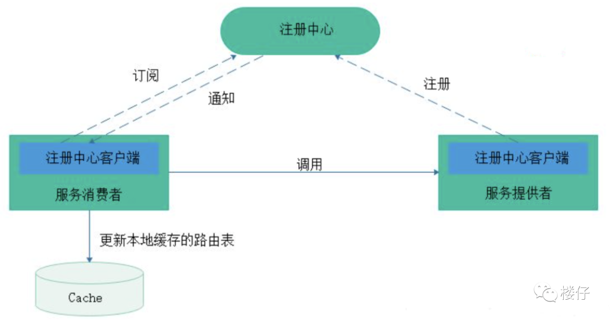
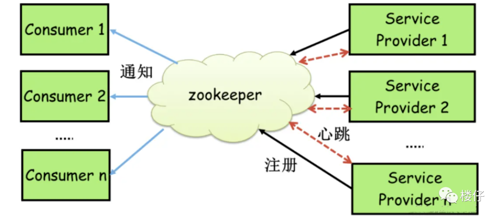
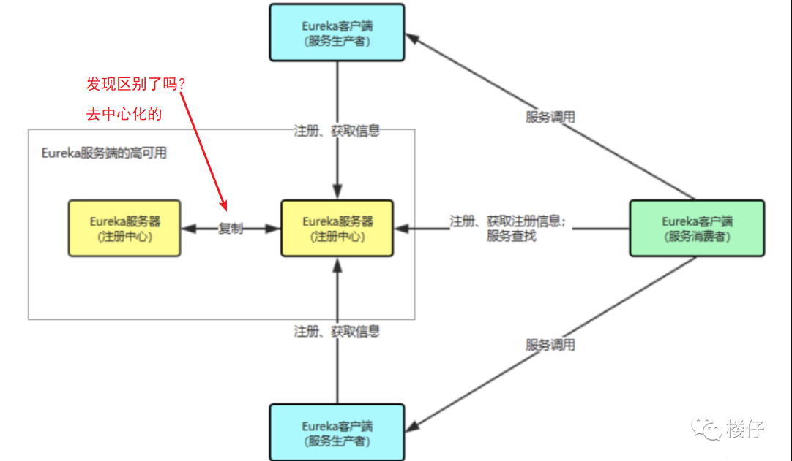

# 注册中心基本概念

注册中心主要有三种角色：

- **服务提供者（RPC Server）**：在启动时，向 Registry 注册自身服务，并向 Registry 定期发送心跳汇报存活状态。
- **服务消费者（RPC Client）**：在启动时，向 Registry 订阅服务，把 Registry 返回的服务节点列表缓存在本地内存中，并与 RPC Sever 建立连接。
- **服务注册中心（Registry）**：用于保存 RPC Server 的注册信息，当 RPC Server 节点发生变更时，Registry 会同步变更，RPC Client 感知后会刷新本地 内存中缓存的服务节点列表。

最后，RPC Client 从**本地缓存**的服务节点列表中，基于负载均衡算法选择一台 RPC Sever 发起调用。

> 如果client不做客户端缓存的时候，每次请求都是比较耗时的
>
> 但是做了缓存的话，怎么能保证server服务是存在的。
>
> 如果调取失败怎么做呢？
>
> 这都是注册中心这个机制需要考虑的。

# 分布式理论

[分布式理论](../../../面试题/分布式.md)

# 分布式系统协议

[分布式算法](../../C.数据结构与算法/CAP/Overview.md)

# 常用注册中心

这里主要介绍5种常用的注册中心，分别为**Zookeeper、Eureka、Nacos、Consul和ETCD**。

## Zookeeper(CP)

Zookeeper可以充当一个服务注册表（Service Registry），让多个服务提供者形成一个集群，让服务消费者通过服务注册表获取具体的服务访问地址（Ip+端口）去访问具体的服务提供者。如下图所示：

每当一个**服务提供者**部署后都要将自己的服务注册到zookeeper的某一路径上: /{service}/{version}/{ip:port} 。

比如我们的HelloWorldService部署到两台机器，那么Zookeeper上就会创建两条目录：

- /HelloWorldService/1.0.0/100.19.20.01:16888
- /HelloWorldService/1.0.0/100.19.20.02:16888

在zookeeper中，进行服务注册，实际上就是在zookeeper中创建了一个znode节点，该节点存储了该服务的IP、端口、调用方式(协议、序列化方式)等。该节点承担着最重要的职责，它由服务提供者(发布服务时)创建，以供服务消费者获取节点中的信息，从而定位到服务提供者真正网络拓扑位置以及得知如何调用。

**RPC服务注册/发现过程简述如下：**

1. 服务提供者启动时，会将其服务名称，ip地址注册到配置中心。
2. 服务消费者在第一次调用服务时，会通过注册中心找到相应的服务的IP地址列表，并缓存到本地，以供后续使用。当消费者调用服务时，不会再去请求注册中心，而是直接通过负载均衡算法从IP列表中取一个服务提供者的服务器调用服务。
3. 当服务提供者的某台服务器宕机或下线时，相应的ip会从服务提供者IP列表中移除。同时，注册中心会将新的服务IP地址列表发送给服务消费者机器，缓存在消费者本机。
4. 当某个服务的所有服务器都下线了，那么这个服务也就下线了。
5. 同样，当服务提供者的某台服务器上线时，注册中心会将新的服务IP地址列表发送给服务消费者机器，缓存在消费者本机。
6. 服务提供方可以根据服务消费者的数量来作为服务下线的依据。

zookeeper提供了“心跳检测”功能：**它会定时向各个服务提供者发送一个请求（实际上建立的是一个 socket 长连接），如果长期没有响应，服务中心就认为该服务提供者已经“挂了”，并将其剔除。**

比如100.100.0.237这台机器如果宕机了，那么zookeeper上的路径就会只剩/HelloWorldService/1.0.0/100.100.0.238:16888。

Zookeeper的Watch机制其实就是一种**推拉结合的模式**：

- 服务消费者会去监听相应路径（/HelloWorldService/1.0.0），一旦路径上的数据有任务变化（增加或减少），**Zookeeper只会发送一个事件类型和节点信息给关注的客户端，而不会包括具体的变更内容**，所以事件本身是轻量级的，这就是推的部分。
- **收到变更通知的客户端需要自己去拉变更的数据**，这就是拉的部分。

### Zookeeper不适合作为注册中心

作为一个分布式协同服务，ZooKeeper非常好，但是对于Service发现服务来说就不合适了，因为对于Service发现服务来说就算是返回了包含不实的信息的结果也比什么都不返回要好。**所以当向注册中心查询服务列表时，我们可以容忍注册中心返回的是几分钟以前的注册信息，但不能接受服务直接down掉不可用。**

**但是zk会出现这样一种情况，当master节点因为网络故障与其他节点失去联系时，剩余节点会重新进行leader选举。**问题在于，选举leader的时间太长，30 ~ 120s, 且选举期间整个zk集群都是不可用的，这就导致在选举期间注册服务瘫痪。在云部署的环境下，因网络问题使得zk集群失去master节点是较大概率会发生的事，虽然服务能够最终恢复，**但是漫长的选举时间导致的注册长期不可用是不能容忍的。**

所以说，**作为注册中心，可用性的要求要高于一致性！**

在 CAP 模型中，**Zookeeper整体遵循一致性（CP）原则**，即在任何时候对 Zookeeper 的访问请求能得到一致的数据结果，但是当机器下线或者宕机时，**不能保证服务可用性。**

那为什么Zookeeper不使用最终一致性（AP）模型呢？因为这个依赖**Zookeeper的核心算法是ZAB，所有设计都是为了强一致性**。这个对于分布式协调系统，完全没没有毛病，但是**你如果将Zookeeper为分布式协调服务所做的一致性保障，用在注册中心，或者说服务发现场景，这个其实就不合适。**

## Eureka(AP)

### Eureka 特点

- **可用性（AP原则）**：Eureka 在设计时就紧遵AP原则，Eureka的集群中，只要有一台Eureka还在，就能保证注册服务可用，只不过查到的信息可能不是最新的（不保证强一致性）。
- **去中心化架构**(**重点**)：Eureka Server 可以运行多个实例来构建集群，不同于 ZooKeeper 的选举 leader 的过程，Eureka Server 采用的是Peer to Peer 对等通信。这是一种去中心化的架构，无 master/slave 之分，每一个 Peer 都是对等的。节点通过彼此互相注册来提高可用性，每个节点需要添加一个或多个有效的 serviceUrl 指向其他节点。每个节点都可被视为其他节点的副本。
- **请求自动切换**：在集群环境中如果某台 Eureka Server 宕机，Eureka Client 的请求会自动切换到新的 Eureka Server 节点上，当宕机的服务器重新恢复后，Eureka 会再次将其纳入到服务器集群管理之中。
- **节点间操作复制**：当节点开始接受客户端请求时，所有的操作都会在节点间进行复制操作，将请求复制到该 Eureka Server 当前所知的其它所有节点中。
- **自动注册&心跳**：当一个新的 Eureka Server 节点启动后，会首先尝试从邻近节点获取所有注册列表信息，并完成初始化。Eureka Server 通过 getEurekaServiceUrls() 方法获取所有的节点，并且会通过心跳契约的方式定期更新。
- **自动下线**：默认情况下，如果 Eureka Server 在一定时间内没有接收到某个服务实例的心跳（默认周期为30秒），Eureka Server 将会注销该实例（默认为90秒， eureka.instance.lease-expiration-duration-in-seconds 进行自定义配置）。
- **保护模式**：当 Eureka Server 节点在短时间内丢失过多的心跳时，那么这个节点就会进入自我保护模式。

除了上述特点，Eureka还有一种自我保护机制，如果在15分钟内超过 **85%** 的节点都没有正常的心跳，那么Eureka就认为客户端与注册中心出现了网络故障，此时会出现以下几种情况：

- Eureka不再从注册表中移除因为长时间没有收到心跳而过期的服务；
- Eureka仍然能够接受新服务注册和查询请求，但是不会被同步到其它节点上（即保证当前节点依然可用）
- 当网络稳定时，当前实例新注册的信息会被同步到其它节点中。

### Eureka工作流程

了解完 Eureka 核心概念，自我保护机制，以及集群内的工作原理后，我们来整体梳理一下 Eureka 的工作流程：

1. Eureka Server 启动成功，等待服务端注册。在启动过程中如果配置了集群，**集群之间定时通过 Replicate 同步注册表**，每个 Eureka Server 都存在独立完整的服务注册表信息。
2. Eureka Client 启动时根据配置的 Eureka Server 地址去注册中心注册服务。
3. Eureka Client 会每 30s 向 Eureka Server 发送一次心跳请求，证明客户端服务正常。
4. **当 Eureka Server 90s 内没有收到 Eureka Client 的心跳，注册中心则认为该节点失效，会注销该实例。**
5. 单位时间内 Eureka Server 统计到有大量的 Eureka Client 没有上送心跳，则认为可能为网络异常，进入自我保护机制，不再剔除没有上送心跳的客户端。
6. 当 Eureka Client 心跳请求恢复正常之后，Eureka Server 自动退出自我保护模式。
7. Eureka Client 定时全量或者增量从注册中心获取服务注册表，并且将获取到的信息缓存到本地。
8. 服务调用时，Eureka Client 会先从本地缓存找寻调取的服务。**如果获取不到，先从注册中心刷新注册表，再同步到本地缓存。**
9. Eureka Client 获取到目标服务器信息，发起服务调用。
10. Eureka Client 程序关闭时向 Eureka Server 发送取消请求，Eureka Server 将实例从注册表中删除。

## Nacos(CP||AP)

