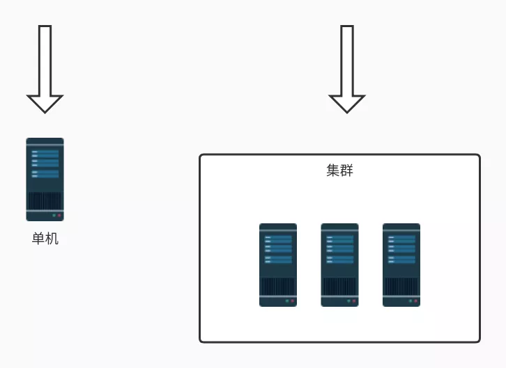
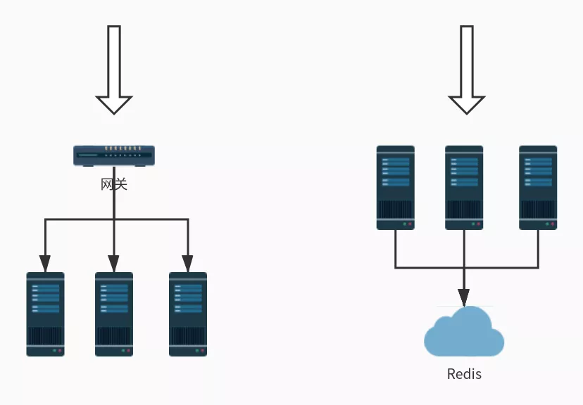
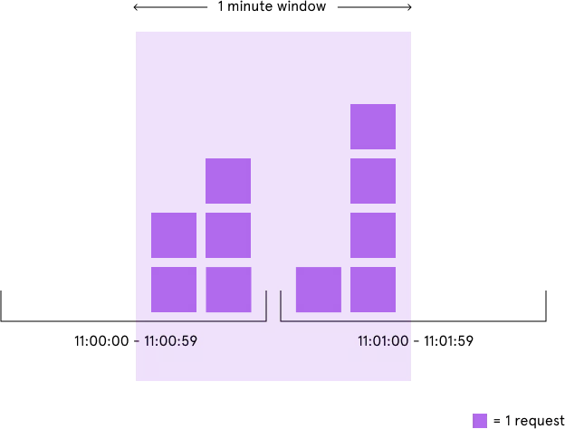
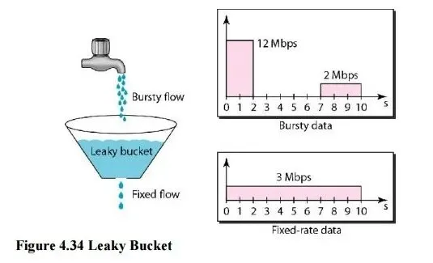
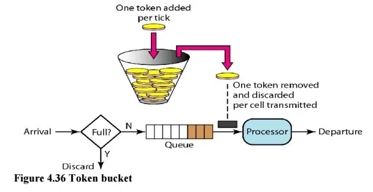

# Table of Contents

* [为什么要限流](#为什么要限流)
* [场景限流的场景](#场景限流的场景)
  * [限流思路](#限流思路)
    * [熔断](#熔断)
    * [服务降级](#服务降级)
    * [延迟处理](#延迟处理)
    * [特权处理](#特权处理)
* [缓存、熔断、降级、限流区别](#缓存熔断降级限流区别)
  * [限流的对象](#限流的对象)
  * [限流的处理方式](#限流的处理方式)
  * [限流的架构(**网关层限流** 和 中间件限流)](#限流的架构网关层限流-和-中间件限流)
* [常见限流算法](#常见限流算法)
  * [计数器法](#计数器法)
    * [固定窗口算法（Fixed Window)](#固定窗口算法fixed-window)
    * [滑动窗口算法（Rolling Window 或 Sliding Window）](#滑动窗口算法rolling-window-或-sliding-window)
  * [漏桶算法（Leaky Bucket）](#漏桶算法leaky-bucket)
  * [令牌桶算法（Token Bucket）](#令牌桶算法token-bucket)
    * [实现方式](#实现方式)
* [并发限流](#并发限流)
* [一些开源项目](#一些开源项目)
* [在网关中实现限流](#在网关中实现限流)
* [参考资料](#参考资料)


# 为什么要限流

像我旁边有一个国家景区,平时可能根本没什么人前往,但是一到五一或者春节就人满为患,这时候景区管理人员就会实行一系列的政策来限制进入人流量, 为什么要限流呢?

假如景区能容纳一万人,现在进去了三万人,势必摩肩接踵,整不好还会有事故发生,这样的结果就是所有人的体验都不好,如果发生了事故景区可能还要关闭,**导致对外不可用,这样的后果就是所有人都觉得体验糟糕透了。**

限流的思想就是:**在保证可用的情况下尽可能多增加进入的人数,其余的人在外面排队等待,保证里面的一万人可以正常游玩。**


# 场景限流的场景

**缓存**、**降级** 和 **限流** 被称为高并发、分布式系统的三驾马车，网关作为整个分布式系统中的第一道关卡，限流功能自然必不可少。通过限流，可以控制服务请求的速率，从而提高系统应对突发大流量的能力，让系统更具弹性。限流有着很多实际的应用场景，比如双十一的秒杀活动， 12306 的抢票等。


> **缓存**、**降级** 和 **限流** ：根本目的还是为了保证系统‘可用’的情况下，尽可能处理或者延迟处理以及不处理某些请求


## 限流思路

对系统服务进行限流，一般有如下几个模式：

### 熔断

系统在设计之初就把熔断措施考虑进去。当系统出现问题时，如果短时间内无法修复，系统要自动做出判断，开启熔断开关，拒绝流量访问，避免大流量对后端的过载请求。

系统也应该能够动态监测后端程序的修复情况，当程序已恢复稳定时，可以关闭熔断开关，恢复正常服务。常见的熔断组件有 Hystrix 以及阿里的 Sentinel，两种互有优缺点，可以根据业务的实际情况进行选择。


### 服务降级

将系统的所有功能服务进行一个分级，当系统出现问题需要紧急限流时，**可将不是那么重要的功能进行降级处理**，停止服务，这样可以释放出更多的资源供给核心功能的去用。

例如在电商平台中，如果突发流量激增，可临时将商品评论、积分等非核心功能进行降级，停止这些服务，释放出机器和CPU等资源来保障用户正常下单，而这些降级的功能服务可以等整个系统恢复正常后，再来启动，进行补单/补偿处理。除了功能降级以外，还可以采用不直接操作数据库，而全部读缓存、写缓存的方式作为临时降级方案。

### 延迟处理

这个模式需要在系统的前端设置一个流量缓冲池，**将所有的请求全部缓冲进这个池子，不立即处理。**

然后后端真正的业务处理程序从这个池子中取出请求依次处理，常见的可以用队列模式来实现。这就相当于用异步的方式去减少了后端的处理压力，但是当流量较大时，后端的处理能力有限，缓冲池里的请求可能处理不及时，会有一定程度延迟。**后面具体的漏桶算法以及令牌桶算法就是这个思路。**

### 特权处理

这个模式需要将用户进行分类，通过预设的分类，让系统优先处理需要高保障的用户群体，其它用户群的请求就会延迟处理或者直接不处理。

# 缓存、熔断、降级、限流区别

+ **缓存**:是用来增加系统吞吐量，提升访问速度提供高并发。

+ **熔断**：当失败次数超过一定阈值的时候出发服务熔断，熔断后**一般**会进行服务降级。

  > 你也可以不降级,熔断后的选择一般都是降级.

+ **降级**:是在系统某些服务组件不可用的时候、流量暴增、资源耗尽等情况下，**暂时屏蔽掉出问题的服务，继续提供降级服务，给用户尽可能的友好提示，返回兜底数据，不会影响整体业务流程**，待问题解决再重新上线服务

+ **限流**，是指在使用缓存和降级无效的场景。比如当达到阈值后限制接口调用频率，访问次数，库存个数等，在出现服务不可用之前，提前把服务降级。只服务好一部分用户。


## 限流的对象

通过上面的介绍，我们对限流的概念可能感觉还是比较模糊，到底限流限的是什么？顾名思义，限流就是限制流量，但这里的流量是一个比较笼统的概念。如果考虑各种不同的场景，限流是非常复杂的，而且和具体的业务规则密切相关，可以考虑如下几种常见的场景：

- 限制某个接口一分钟内最多请求 100 次
- 限制某个用户的下载速度最多 100KB/S
- 限制某个用户同时只能对某个接口发起 5 路请求
- 限制某个 IP 来源禁止访问任何请求

从上面的例子可以看出，根据不同的请求者和请求资源，可以组合出不同的限流规则。可以根据请求者的 IP 来进行限流，或者根据请求对应的用户来限流，又或者根据某个特定的请求参数来限流。而限流的对象可以是请求的频率，传输的速率，或者并发量等，其中最常见的两个限流对象是请求频率和并发量，他们对应的限流被称为 **请求频率限流**（Request rate limiting）和 **并发量限流**（Concurrent requests limiting）。

**传输速率限流** 在下载场景下比较常用，比如一些资源下载站会限制普通用户的下载速度，只有购买会员才能提速，这种限流的做法实际上和请求频率限流类似，只不过一个限制的是请求量的多少，一个限制的是请求数据报文的大小

## 限流的处理方式

在系统中设计限流方案时，有一个问题值得设计者去仔细考虑，当请求者被限流规则拦截之后，我们该如何返回结果。一般我们有下面三种限流的处理方式：

- 拒绝服务
- 排队等待
- 服务降级

最简单的做法是拒绝服务，直接抛出异常，返回错误信息（比如返回 HTTP 状态码 429 Too Many Requests），或者给前端返回 302 重定向到一个错误页面，提示用户资源没有了或稍后再试。

但是对于一些比较重要的接口不能直接拒绝，比如秒杀、下单等接口，我们既不希望用户请求太快，也不希望请求失败，这种情况一般会将请求放到一个消息队列中排队等待，消息队列可以起到削峰和限流的作用。

第三种处理方式是服务降级，当触发限流条件时，直接返回兜底数据，比如查询商品库存的接口，可以默认返回有货。

## 限流的架构(**网关层限流** 和 中间件限流)

针对不同的系统架构，需要使用不同的限流方案。如下图所示，**服务部署的方式一般可以分为单机模式和集群模式：**




+ 单机模式的限流非常简单，可以直接基于内存就可以实现，

+ 集群模式的限流必须依赖于某个“中心化”的组件，比如网关或 Redis，从而引出两种不同的限流架构：**网关层限流** 和 **中间件限流**。




# 常见限流算法

通过上面的学习，我们知道限流可以分为请求频率限流和并发量限流，根据系统架构的不同，又可以分为网关层限流和分布式限流。在不同的应用场景下，我们需要采用不同的限流算法。这一节将介绍一些主流的限流算法。

有一点要注意的是，利用池化技术也可以达到限流的目的，比如线程池或连接池，但这不是本文的重点。

## 计数器法

简单粗暴,比如指定线程池大小，指定数据库连接池大小、nginx连接数等,这都属于计数器算法。


### 固定窗口算法（Fixed Window)

**固定窗口算法是一种最简单的限流算法，它根据限流的条件，将请求时间映射到一个时间窗口，再使用计数器累加访问次数。**

譬如限流条件为每分钟 5 次，那么就按照分钟为单位映射时间窗口，假设一个请求时间为 11:00:45，时间窗口就是 11:00:00 ~ 11:00:59，在这个时间窗口内设定一个计数器，每来一个请求计数器加一，当这个时间窗口的计数器超过 5 时，就触发限流条件。当请求时间落在下一个时间窗口内时（11:01:00 ~ 11:01:59），上一个窗口的计数器失效，当前的计数器清零，重新开始计数。

计数器算法非常容易实现，**在单机场景下可以使用 AtomicLong、LongAdder 或 Semaphore 来实现计数，而在分布式场景下可以通过 Redis 的 INCR 和 EXPIRE 等命令并结合 EVAL 或 lua 脚本来实现**，Redis 官网提供了几种简单的实现方式。无论是请求频率限流还是并发量限流都可以使用这个算法。

+ 缺点

不过这个算法的缺陷也比较明显，**那就是存在严重的临界问题**。由于每过一个时间窗口，计数器就会清零，这使得限流效果不够平滑，恶意用户可以利用这个特点绕过我们的限流规则。如下图所示，我们的限流条件本来是每分钟 5 次，但是恶意用户在 11:00:00 ~ 11:00:59 这个时间窗口的后半分钟发起 5 次请求，接下来又在 11:01:00 ~ 11:01:59 这个时间窗口的前半分钟发起 5 次请求，这样我们的系统就在 1 分钟内承受了 10 次请求。




### 滑动窗口算法（Rolling Window 或 Sliding Window）

为了解决固定窗口算法的临界问题，可以将时间窗口划分成更小的时间窗口，然后随着时间的滑动删除相应的小窗口，而不是直接滑过一个大窗口，这就是滑动窗口算法。我们为每个小时间窗口都设置一个计数器，大时间窗口的总请求次数就是每个小时间窗口的计数器的和。如下图所示，我们的时间窗口是 5 秒，可以按秒进行划分，将其划分成 5 个小窗口，时间每过一秒，时间窗口就滑过一秒：


##  漏桶算法（Leaky Bucket）

除了计数器算法，另一个很自然的限流思路是将所有的请求缓存到一个队列中，**然后按某个固定的速度慢慢处理**，这其实就是**漏桶算法**（Leaky Bucket）。

漏桶算法假设将请求装到一个桶中，桶的容量为 M，当桶满时，请求被丢弃。在桶的底部有一个洞，桶中的请求像水一样按固定的速度（每秒 r 个）漏出来。我们用下面这个形象的图来表示漏桶算法


桶的上面是个水龙头，我们的请求从水龙头流到桶中，水龙头流出的水速不定，有时快有时慢，这种忽快忽慢的流量叫做 **Bursty flow**。如果桶中的水满了，多余的水就会溢出去，相当于请求被丢弃。从桶底部漏出的水速是固定不变的，可以看出漏桶算法可以平滑请求的速率。

漏桶算法可以通过一个队列来实现，如下图所示：


当请求到达时，不直接处理请求，而是将其放入一个队列，然后另一个线程以固定的速率从队列中读取请求并处理，从而达到限流的目的。注意的是这个队列可以有不同的实现方式，比如设置请求的存活时间，或将队列改造成 PriorityQueue，根据请求的优先级排序而不是先进先出。当然队列也有满的时候，如果队列已经满了，那么请求只能被丢弃了。漏桶算法有一个缺陷，在处理突发流量时效率很低，于是人们又想出了下面的令牌桶算法。

##  令牌桶算法（Token Bucket）

**令牌桶算法**（Token Bucket）是目前应用最广泛的一种限流算法，它的基本思想由两部分组成：**生成令牌** 和 **消费令牌**。

- 生成令牌：假设有一个装令牌的桶，最多能装 M 个，然后按某个固定的速度（每秒 r 个）往桶中放入令牌，桶满时不再放入；
- 消费令牌：我们的每次请求都需要从桶中拿一个令牌才能放行，当桶中没有令牌时即触发限流，这时可以将请求放入一个缓冲队列中排队等待，或者直接拒绝；

令牌桶算法的图示如下：




在上面的图中，我们将请求放在一个缓冲队列中，**可以看出这一部分的逻辑和漏桶算法几乎一模一样，只不过在处理请求上，一个是以固定速率处理，一个是从桶中获取令牌后才处理。**

**仔细思考就会发现，令牌桶算法有一个很关键的问题，就是桶大小的设置，正是这个参数可以让令牌桶算法具备处理突发流量的能力**

。譬如将桶大小设置为 100，生成令牌的速度设置为每秒 10 个，那么在系统空闲一段时间的之后（桶中令牌一直没有消费，慢慢的会被装满），突然来了 50 个请求，这时系统可以直接按每秒 50 个的速度处理，随着桶中的令牌很快用完，处理速度又会慢慢降下来，和生成令牌速度趋于一致。这是令牌桶算法和漏桶算法最大的区别，漏桶算法无论来了多少请求，只会一直以每秒 10 个的速度进行处理。当然，处理突发流量虽然提高了系统性能，但也给系统带来了一定的压力，如果桶大小设置不合理，突发的大流量可能会直接压垮系统。


### 实现方式

通过上面对令牌桶的原理分析，一般会有两种不同的实现方式。

+ 第一种方式是启动一个内部线程，不断的往桶中添加令牌，处理请求时从桶中获取令牌，和上面图中的处理逻辑一样。
+ 第二种方式不依赖于内部线程，**而是在每次处理请求之前先实时计算出要填充的令牌数并填充**，然后再从桶中获取令牌。

```java
package com.qm.study.Distributed;

public class TokenBucket {

    /**
     * 令牌桶大小
     */
    private final long capacity;
    /**
     * 表示填充速度，每毫秒填充多少个
     */
    private final double refillTokensPerOneMillis;
    /**
     * 令牌桶可用令牌
     */
    private double availableTokens;
    /**
     * 上一次填充时间
     */
    private long lastRefillTimestamp;

    /**
     *
     * @param capacity   桶大小
     * @param refillTokens 需要生成的令牌
     * @param refillPeriodMillis 生成令牌的时间
     */
    public TokenBucket(long capacity, long refillTokens, long refillPeriodMillis) {
        this.capacity = capacity;
        this.refillTokensPerOneMillis = (double) refillTokens / (double) refillPeriodMillis;
        this.availableTokens = capacity;
        this.lastRefillTimestamp = System.currentTimeMillis();
    }

    synchronized public boolean tryConsume(int numberTokens) {
        refill();
        if (availableTokens < numberTokens) {
            return false;
        } else {
            availableTokens -= numberTokens;
            return true;
        }
    }

    /**
     *     填充令牌
     */
    private void refill() {
        long currentTimeMillis = System.currentTimeMillis();
        if (currentTimeMillis > lastRefillTimestamp) {
            long millisSinceLastRefill = currentTimeMillis - lastRefillTimestamp;
            double refill = millisSinceLastRefill * refillTokensPerOneMillis;
            this.availableTokens = Math.min(capacity, availableTokens + refill);
            this.lastRefillTimestamp = currentTimeMillis;
        }
    }

    public static void main(String[] args) {
        //桶大小为 100，且每秒生成 100 个令牌
        TokenBucket limiter = new TokenBucket(100, 100, 1000);
    }
}
```


# 并发限流

简单来说就是设置系统阈值总的QPS个数,这些也挺常见的,就拿Tomcat来说,很多参数就是出于这个考虑,例如

配置的`acceptCount` 设置响应连接数, `maxConnections`设置瞬时最大连接数, `maxThreads` 设置最大线程数,在各个框架或者组件中,并发限流体现在下面几个方面:

- 限制总并发数（如数据库连接池、线程池）
- 限制瞬时并发数（nginx的limit_conn模块，用来限制瞬时并发连接数）
- 限制时间窗口内的平均速率（如Guava的RateLimiter、nginx的limit_req模块，限制每秒的平均速率）
- 其他的还有限制远程接口调用速率、限制MQ的消费速率。
- 另外还可以根据网络连接数、网络流量、CPU或内存负载等来限流。

有了并发限流，就意味着在处理高并发的时候多了一种保护机制，不用担心瞬间流量导致系统挂掉或雪崩，最终做到有损服务而不是不服务；但是限流需要评估好，不能乱用，否则一些正常流量出现一些奇怪的问题而导致用户体验很差造成用户流失。


# 一些开源项目


# 在网关中实现限流

# 参考资料

[参考资料](https://mp.weixin.qq.com/s/NaZnFc8W-6TASQQxUpOViQ)

