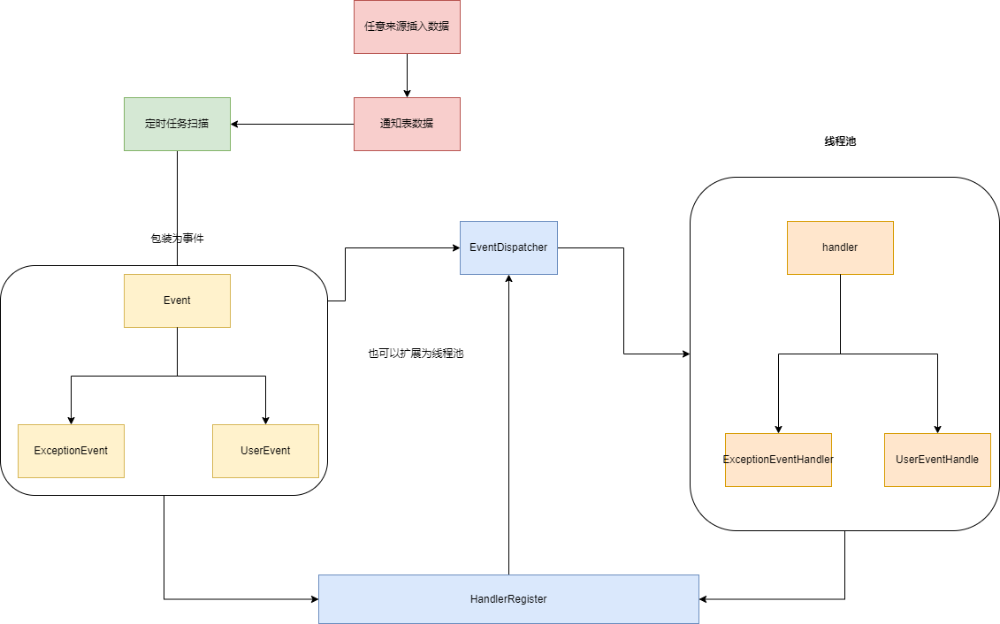

# Table of Contents

* [事件分发机制流程图](#事件分发机制流程图)
* [事件](#事件)
  * [Event](#event)
  * [AbstractEvent](#abstractevent)
  * [ExceptionEvent](#exceptionevent)
* [Handler](#handler)
  * [Handler](#handler-1)
  * [HandlerRegister](#handlerregister)
  * [AbstractHandler](#abstracthandler)
  * [ExceptionEventHandler](#exceptioneventhandler)
* [Dispatch](#dispatch)
  * [EventDispatcher](#eventdispatcher)
  * [EventDispatcherImpl](#eventdispatcherimpl)


最近自己在梳理现有项目的事件分发机制，现整理下。


# 事件分发机制流程图





# 事件

定义初始事件

## Event

```java
public interface Event {

    Class<? extends Event> getType();
}
```

## AbstractEvent
```java
public abstract class AbstractEvent implements Event {

    public Class<? extends Event> getType() {
        return getClass();
    }

}
```

## ExceptionEvent

```java
public class ExceptionEvent extends AbstractEvent {


    /**
     * 需要包装的对象
     */
    private Object object;

    public ExceptionEvent(Object object) {
        this.object = object;
    }
}
```


#  Handler

使用模板方法来控制一些行为

## Handler

```java
public interface Handler<E extends Event> {

    void onEvent(E event);
}
```


## HandlerRegister

```java
public class HandlerRegister {

    private final Map<Class<? extends Event>, Handler> handlerMap = Maps.newHashMap();


    /**
     *  注册 event和handler
     * @param event
     * @param handler
     */
    public void registerHandler(Class<? extends Event> event,Handler handler) {
        handlerMap.put(event, handler);
    }

    /**
     * 根据事件获取对应handler
     * @param event
     * @return
     */
    public Handler getHandler(Class<? extends Event> event) {
        return handlerMap.get(event);
    }

}
```


## AbstractHandler

```java
public abstract class AbstractHandler<E extends Event> implements Handler {


    /**
     * 执行前
     * @param event
     */
    void beforeHandle(E event) {
    }

    /**
     * 执行后
     * @param event
     */
    void afterHandle(E event) {
    }

    /**
     * 子类需要实现的党法
     *
     * @param event
     */
    abstract void Handle(E event);


    public void onEvent(Event event) {
        E ev = (E) event;
        beforeHandle(ev);
        try {
            Handle(ev);
        } catch (Exception e) {
            //失败处理
        }
        afterHandle(ev);
    }
}
```

## ExceptionEventHandler

```java
public class ExceptionEventHandler extends AbstractHandler<ExceptionEvent> implements InitializingBean {


    @Autowired
    private HandlerRegister handlerRegister;


    void beforeHandle(ExceptionEvent event) {
    }


    void afterHandle(ExceptionEvent event) {
    }

    /**
     * 子类需要实现的党法
     *
     * @param event
     */
    void Handle(ExceptionEvent event) {

    }

    @Override
    public void afterPropertiesSet() throws Exception {
        handlerRegister.registerHandler(ExceptionEvent.class, this);

    }

}
```


# Dispatch

## EventDispatcher

```java
public interface EventDispatcher {


    void dispatch(Event event);

}
```

## EventDispatcherImpl

```java
public class EventDispatcherImpl implements EventDispatcher, InitializingBean {

    @Autowired
    private HandlerRegister handlerRegister;

    @Autowired
    private ThreadPoolExecutor threadPoolExecutor;


    @Override
    public void dispatch(Event event) {
        Handler handler = handlerRegister.getHandler(event.getType());

        threadPoolExecutor.submit(() -> {
            try {
                handler.onEvent(event);
            } catch (Exception e) {
                //处理失败消息
            }
        });


    }

    @Override
    public void afterPropertiesSet() throws Exception {
        threadPoolExecutor = new ThreadPoolExecutor(10, 10, 10L, TimeUnit.SECONDS, new LinkedBlockingDeque<>());
    }
}
```
