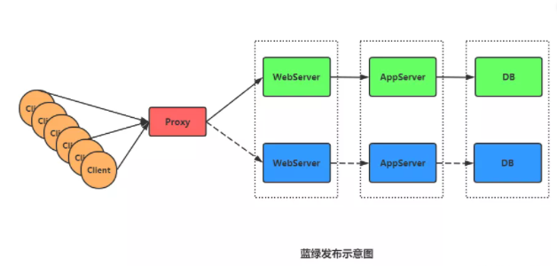

在项目迭代的过程中，不可避免需要”上线“。上线对应着部署，或者重新部署；部署对应着修改；修改则意味着风险。目前有很多部署发布的技术, 这儿将常见的做一个总结。

上面所说难免有些抽象, 举一个情景例子, 加入你是微博项目负责人员, 现在新版本较原来的老版本有很大的改变, 这设计到服务架构、前端UI等等, 经过测试功能没有障碍, 那么这时候如何让用户切换到新的版本呢?

显而易见, 第一次发布的应用是没有所谓的这个问题的, 这种如何发布的思考只会出现在后面的版本迭代中。

# 蓝绿发布

 蓝绿部署中，一共有两套系统：

+ 一套是正在提供服务系统(也就是上面说的旧版)，标记为“绿色”；

+ 另一套是准备发布的系统，标记为“蓝色”。

两套系统都是功能完善的，并且正在运行的系统，只是系统版本和对外服务情况不同。

正在**对外提供服务的老系统是绿色系统，新部署的系统是蓝色系统。** 

蓝色系统不对外提供服务，用来做啥？

用来做发布前测试，测试过程中发现任何问题，可以直接在蓝色系统上修改，不干扰用户正在使用的系统。

蓝色系统经过反复的测试、修改、验证，确定达到上线标准之后，直接将用户切换到蓝色系统, 切换后的一段时间内，依旧是蓝绿两套系统并存，但是用户访问的已经是蓝色系统。这段时间内观察蓝色系统（新系统）工作状态，如果出现问题，直接切换回绿色系统。

当确信对外提供服务的蓝色系统工作正常，不对外提供服务的绿色系统已经不再需要的时候，蓝色系统正式成为对外提供服务系统，成为新的绿色系统。 原先的绿色系统可以销毁，将资源释放出来，用于部署下一个蓝色系统。

> 个人理解就是，绿色是master分支  蓝色是fix分支

## 蓝绿发布特点

1. 蓝绿部署的目的是**减少发布时的中断时间** 、**能够快速撤回发布** 。
2. 两套系统没有耦合的时候才能百分百保证不干扰

## 蓝绿发布注意事项

蓝绿部署只是上线策略中的一种，它不是可以应对所有情况的万能方案。 蓝绿部署能够简单快捷实施的前提假设是目标系统是非常内聚的，如果目标系统相当复杂，那么如何切换、两套系统的数据是否需要以及如何同步等，都需要仔细考虑。

当你切换到蓝色环境时，需要妥当处理未完成的业务和新的业务。如果你的数据库后端无法处理，会是一个比较麻烦的问题；

- 可能会出现需要同时处理“微服务架构应用”和“传统架构应用”的情况，如果在蓝绿部署中协调不好这两者，还是有可能会导致服务停止。
- 需要提前考虑数据库与应用部署同步迁移 /回滚的问题。
- 蓝绿部署需要有基础设施支持。
- 在非隔离基础架构（ VM 、 Docker 等）上执行蓝绿部署，蓝色环境和绿色环境有被摧毁的风险。

# 滚动发布

 一般是取出一个或者多个服务器停止服务，执行更新，并重新将其投入使用。周而复始，直到集群中所有的实例都更新成新版本。 

> 可以理解为【串行】发布

# 灰度发布(常用)

灰度发布, 也叫金丝雀发布。是指在黑与白之间，能够平滑过渡的一种发布方式。AB test就是一种灰度发布方式，让一部分用户继续用A，一部分用户开始用B，如果用户对B没有什么反对意见，那么逐步扩大范围，把所有用户都迁移到B上面来。灰度发布可以保证整体系统的稳定，在初始灰度的时候就可以发现、调整问题，以保证其影响度，而我们平常所说的金丝雀部署也就是灰度发布的一种方式。

具体到服务器上, 实际操作中还可以做更多控制，譬如说，给最初更新的10台服务器设置较低的权重、控制发送给这10台服务器的请求数，然后逐渐提高权重、增加请求数。一种平滑过渡的思路, 这个控制叫做“流量切分”。

一般来说，用户流量先达到网关，进行鉴权。然后根据用户配置，进行自定义转发到【正常】或者【灰度】服务器。

正常环境： 前端 后端

灰度环境：前端 后端

#  A/B测试

**A/B测试和蓝绿发布、滚动发布以及金丝雀发布，完全是两回事。**

蓝绿发布、滚动发布和金丝雀是发布策略，目标是确保新上线的系统稳定，关注的是新系统的BUG、隐患。

A/B测试是效果测试，同一时间有多个版本的服务对外服务，这些服务都是经过足够测试，达到了上线标准的服务，有差异但是没有新旧之分（它们上线时可能采用了蓝绿部署的方式）。

**A/B测试关注的是不同版本的服务的实际效果，譬如说转化率、订单情况等。**

# 参考资料

https://mp.weixin.qq.com/s/Vj6FQVWI_apKzveZu3sgNA

