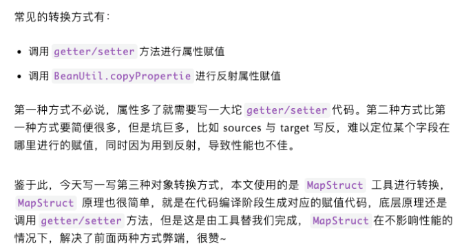

# MapStruct 





## 引入依赖

```java
<dependency>
     <groupId>org.mapstruct</groupId>
     <artifactId>mapstruct-jdk8</artifactId>
     <version>1.1.0.Final</version>
</dependency>
```

这个依赖项会导入MapStruct的核心注释。由于MapStruct在编译时工作，并且会集成到像Maven和Gradle这样的构建工具上，我们还必须在<build中/>标签中添加一个插件maven-compiler-plugin，并在其配置中添加annotationProcessorPaths，该插件会在构建时生成对应的代码。

```java
<plugin>
    <groupId>org.apache.maven.plugins</groupId>
    <artifactId>maven-compiler-plugin</artifactId>
    <configuration>
        <source>1.8</source>
        <target>1.8</target>
        <annotationProcessorPaths>
            <path>
                <groupId>org.mapstruct</groupId>
                <artifactId>mapstruct-processor</artifactId>
                <version>1.1.0.Final</version>
            </path>
        </annotationProcessorPaths>
    </configuration>
</plugin>
```


此时Student 类内容如下：

```java
public class Student {
    private Integer id;
    private String name;
    private Integer age;
    private String sex;//setters, getters, toString()  方法此处省略不写，但是实际开发需要写的哦 
}
```

 

此时User 类内容如下

```java
public class User {
    private Integer id;
    private String name;
    private Integer age;
    private String sex;//setters, getters, toString() 方法此处省略不写，但是实际开发需要写的哦  }
```

 

## 普通转换model

此时 Student 和 User 的属性名字都相同那么转换接口就是


```java
import org.mapstruct.Mapper;

@Mapper(componentModel = "spring")
public interface UserMapping {

    /**
     * Student 转化为 User
     * @param Student
     * @return
     */
     User studentToUser(Student student);
}
```


程序运行前要先编译 mvn clean compile ， 从而mapstruct框架生成UserMappingImpl 实现类。

编译后的Bean

```java
public class UserMappingImpl implements UserMapping {

    @Override
    public User studentToUser(Student student) {
        if ( student == null ) {
            return null;
        }

        User user = new User();

        user.setId( student.getId() );
        user.setName( student.getName() );
        user.setAge( student.getAge() );
        user.setSex( student.getSex() );

        return user;
    }
}
```


## 特殊转换model

属性名称不对应，如果 User 和 Student 的属性名称不对应例如：


```java
import org.mapstruct.Mapper;
import org.mapstruct.Mapping;
import org.mapstruct.Mappings;

@Mapper(componentModel = "spring")
public interface UserMapping {

    /**
     * Student 转化为 User
     * @param Student
     * @return
     */
     @Mappings({
            @Mapping(target = "uname", source = "sname")
          // 多个属性不对应可以用 "，" 隔开编写多个@Mapping
          // ,@Mapping(target = "uname", source = "sname")
    })
     User studentToUser(Student student);
}
```
字段类型不对应

　　字符串转时间，或者时间转字符串，都是用后面的dateFormat值为时间格式

```java
@Mappings({
            @Mapping(target = "createTime", source = "createTimeStr", dateFormat = "yyyy-MM-dd~hh:mm:ss") 
            // 多个属性不对应可以用 "，" 隔开编写多个@Mapping
    }) 
```


但是这样写还是不太爽，每次都要挂对应的Mapper类

##  参考资料

https://www.cnblogs.com/junzhu-bye/p/12900950.html


# Converter

**mapstruct-spring-annotations** 使开发人员能够通过`ConversionService`使用定义的 **Mapstruct** 映射器，而不必单独导入每个 **Mapper**，从而允许 **Mapper** 之间的松散耦合。，它本身不会影响**Mapstruct**的机制。


**Spring framework**提供了一个`Converter<S,T>`接口：

```
@FunctionalInterface
public interface Converter<S, T> {
    @Nullable
    T convert(S source);

    default <U> Converter<S, U> andThen(Converter<? super T, ? extends U> after) {
        Assert.notNull(after, "After Converter must not be null");
        return (s) -> {
            T initialResult = this.convert(s);
            return initialResult != null ? after.convert(initialResult) : null;
        };
    }
}
```

它的作用是将`S`转换为`T`，这和**Mapstruct**的作用不谋而合。

`Converter`会通过`ConverterRegistry`这个注册接口注册到`ConversionService`，然后你就可以通过`ConversionService`的`convert`方法来进行转换：

```
    <T> T convert(@Nullable Object source, Class<T> targetType);
```


## 继承Converter


### 如果方法命名不一样


```java
@Mapper(componentModel = "spring")
public interface UserMapping extends Converter<Student,User> {

    /**
     * Student 转化为 User
     * @return User
     */
     User studentToUser(Student student);
}

注意 我们这里是有2个方法的，一个Converter 一个 studentToUser
```

调用时：

```java
@Autowired
private ConversionService conversionService;

Student stu = ……;
User user = conversionService.convert(stu,User.class);
```


编译类

```java
@Component
public class UserMappingImpl implements UserMapping {

    @Override
    public User convert(Student arg0) {
        if ( arg0 == null ) {
            return null;
        }

        User user = new User();

        user.setId( arg0.getId() );
        user.setName( arg0.getName() );
        user.setAge( arg0.getAge() );
        user.setSex( arg0.getSex() );

        return user;
    }

    @Override
    public User studentToUser(Student student) {
        if ( student == null ) {
            return null;
        }

        User user = new User();

        user.setId( student.getId() );
        user.setName( student.getName() );
        user.setAge( student.getAge() );
        user.setSex( student.getSex() );

        return user;
    }
}
```

### 如果方法命名一样(推荐)

命名一样，会使用mapStruct的机制


### **那我理解是不是所有的转换搞一个mapper就可以了？**

```java
Student1 user = conversionService.convert(student, Student1.class);
```


并不行！！因为你没有注册对应的关系,所以会报错的。


## **MapStruct Spring Extensions** 

 **MapStruct Spring Extensions** 会自动生成一个适配类处理**Mapper**注册：

默认情况下，生成的适配类将位于包`org.mapstruct.extensions.spring.converter`中，名称固定为`ConversionServiceAdapter`。


# 参考链接

https://mp.weixin.qq.com/s/XrmchQUiKcQ9ooteq-6ZlQ