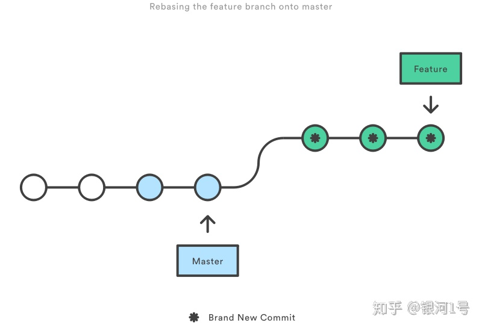

# Table of Contents

* [下载大文件](#下载大文件)
* [git merge 和Rebase的区别](#git-merge-和rebase的区别)
  * [merge](#merge)
  * [rebase](#rebase)
  * [rebase的黄金法则](#rebase的黄金法则)
* [git rm —cached的作用](#git-rm-cached的作用)
* [git push --force origin](#git-push---force-origin)

# 传统的GitFlow工作流程

- **master** 该分支上的代码随时可以部署到生产环境
- **develop** 作为每日构建的集成分支，到达稳定状态时可以发布并merge回master
- **Feature branches** 每个新特性都在独立的feature branch上进行开发，并在开发结束后merge回develop
- **Release branches** 为每次发布准备的release candidate，在这个分支上只进行bug fix，并在完成后merge回master和develop
- **Hotfix branches** 用于快速修复，在修复完成后merge回master和develop


# 下载大文件

1.

```
git config --global core.compression 0
```

2.

```
git clone --depth 1 <repo_URI>
```

3.

```
git fetch --unshallow 
```

4.

```
git fetch --depth=2147483647
```

5.

```
git pull --all
```

按照步骤操作即可，本人亲测可以。


实际操作第二步就解决问题了。


# git merge 和Rebase的区别


[原文链接](https://zhuanlan.zhihu.com/p/57872388)

我们来说说当master新提交与你正在开发的功能相关。要将新提交合并到你的feature分支中，你有两个选择：merge或rebase。


## merge

  最简单的是将master分支合并到feature分支中：
  `git checkout feature`
  `git merge master`
  或者，你可以简化为一行：
  `git merge master feature`
  这会在feature分支中创建一个新的“merge commit”，它将两个分支的历史联系在一起，为你生成如下所示的分支结构：

  !

合并很好，因为它是一种非破坏性的操作。现有分支结构不会以任何方式更改。这避免了rebase的所有潜在缺陷（下面讨论）。
另一方面，这也意味着每次上游更改时feature都需要合并，且有无关的合并提交。如果master改动非常频繁，这可能会严重污染你分支的历史记录。尽管可以使用高级git log选项减轻此问题的影响，但它可能使其他开发人员难以理解项目的历史更改记录。

## rebase

  

作为merge的替代方法，你可以使用以下命令将feature分支rebase到master分支上：
`git checkout feature`
`git rebase master`
这会将整个feature分支移动到master分支的顶端，从而有效地整合了所有master的新提交。但是，rebase不是使用merge commit，**而是通过为原始分支中的每个提交创建全新的提交来重写项目历史记录。**




rebase的主要好处是可以获得更清晰的项目历史记录。首先，它消除了不必要的git merge产生的merge commit。其次，正如在上图中所看到的，rebase也会产生完美线性的项目历史记录 - 你可以从feature分支顶端一直跟随到项目的开始而没有任何的分叉。这使得它比命令git log，git bisect和gitk更容易导航项目。
但是，对这个原始的提交历史记录有两个权衡：安全性和可追溯性。

**注意：**

+ **如果你不遵循rebase的黄金法则，重写项目历史记录可能会对你的协作工作流程造成灾难性后果。**

+ **其次rebase会丢失merge commit提供的上下文 - 你无法看到上游更改何时合并到功能中。**


## rebase的黄金法则

git rebase的黄金法则是永远不要在公共分支使用它。

想想如果你把master分支rebase到你的feature分支会发生什么：


rebase将master所有提交移动到feature顶端。问题是这只发生在你的仓库中。所有其他开发人员仍在使用原始版本master。由于rebase导致全新的提交，Git会认为你的master分支的历史与其他人的历史不同。


# git rm —cached的作用


# git push --force origin

当你分支需要回退到某个提交点的时候，使用 git reset --hard  commitid

需要push到origin  ： git push --force origin
