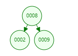
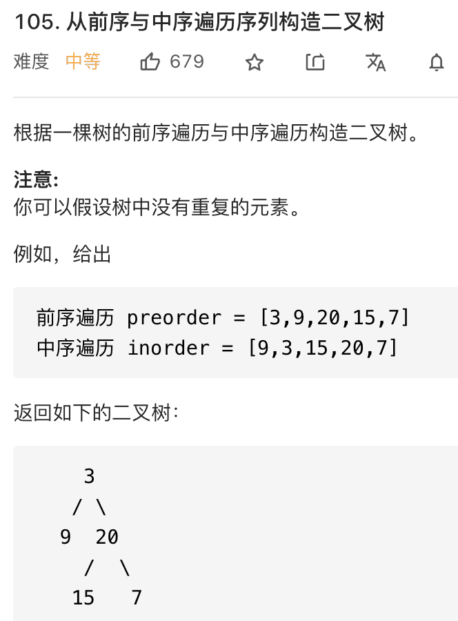
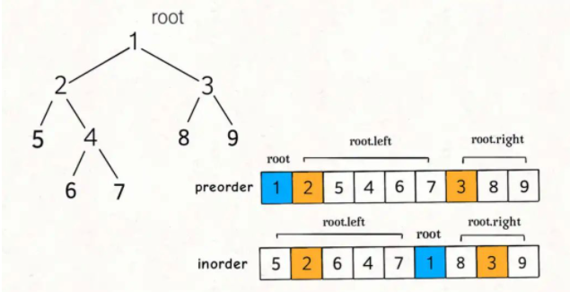
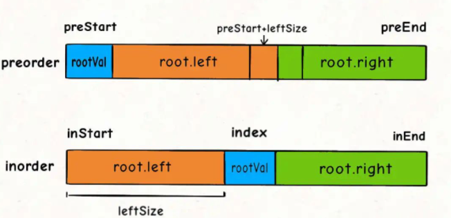
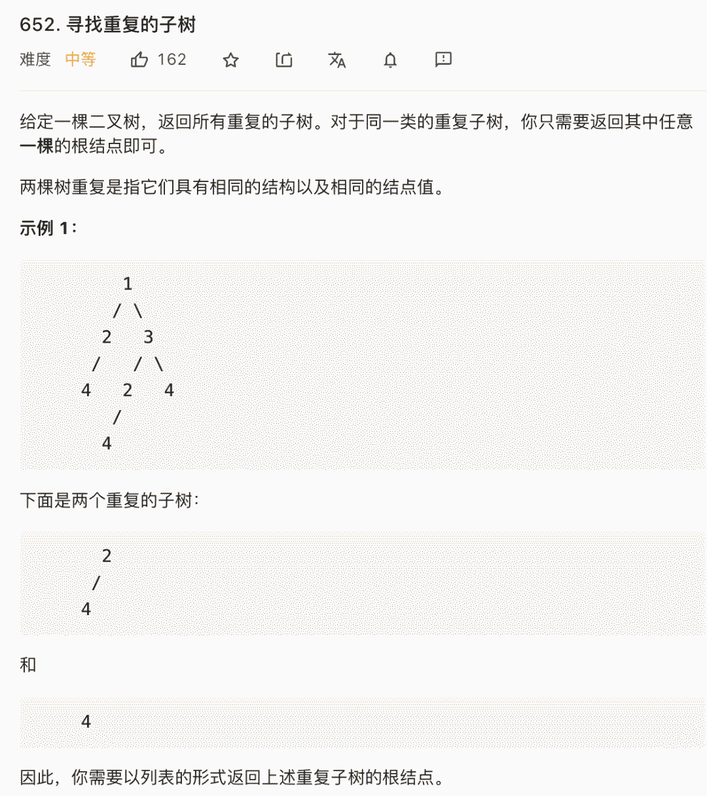

# Table of Contents

* [前提知识](#前提知识)
* [参考资料](#参考资料)
* [二叉树有多少个节点](#二叉树有多少个节点)
* [[226]翻转二叉树](#226翻转二叉树)
* [二叉树的最大深度高度宽度](#二叉树的最大深度高度宽度)
* [[116]填充每个节点的下一个右侧节点指针](#116填充每个节点的下一个右侧节点指针)
  * [单节点](#单节点)
  * [双节点](#双节点)
* [[114]. 将二叉树展开为链表](#114-将二叉树展开为链表)
* [[102]二叉树的层序遍历](#102二叉树的层序遍历)
* [二期](#二期)
* [[654]最大二叉树](#654最大二叉树)
* [[105] 通过前序和中序遍历结果构造二叉树](#105-通过前序和中序遍历结果构造二叉树)
* [[106] 通过后序和中序遍历结果构造二叉树](#106-通过后序和中序遍历结果构造二叉树)
* [三期](#三期)
* [[652] 寻找重复的子树](#652-寻找重复的子树)


# 前提知识

+ [二叉树基础知识](../C.数据结构与算法/dataStructures/二叉树.md)
  了解二叉树的前序、中序、后序遍历

+ [数据结构演示网站](https://www.cs.usfca.edu/~galles/visualization/Algorithms.html)

+ 了解递归的定义：**写递归算法的关键是要明确函数的「定义」是什么，然后相信这个定义，利用这个定义推导最终结果，绝不要试图跳入递归**。

  > 怎么明确这个定义呢？个人理解拆分到一定颗粒度，然后看这个颗粒度需要做什么
  
+ 递归算法的关键要明确函数的定义，相信这个定义，而不要跳进递归细节。

  写二叉树的算法题，都是基于递归框架的，**我们先要搞清楚`root`节点它自己要做什么**，然后根据题目要求选择使用**前序，中序，后续**的递归框架。

  > 如何判断是前序、中序、后续
  >
  > 这个通过刷题目多锻炼
  
  二叉树题目的难点在于如何通过题目的要求思考出每一个节点需要做什么，这个只能通过多刷题进行练习了。
# 参考资料

[手把手刷二叉树](https://mp.weixin.qq.com/s/AzQzw-pC8A-0kS0NJn2eWw)


# 二叉树有多少个节点

[https://leetcode-cn.com/problems/count-complete-tree-nodes/submissions/](https://leetcode-cn.com/problems/count-complete-tree-nodes/submissions/)

对于一颗普通的树



常规思路是不是如下

1. 统计当前节点的左节点
2. 统计当前节点的右节点
3. 左+右+1(自己)=3


那么代码思路就是如下

```java
public int count(){
    //递归左节点
    //递归右节点
    //后续遍历 处理逻辑
}
```


```java
    public int countNodes(TreeNode root) {
        //对于完全二叉树 可能存在节点为空的情况
        if(root==null){
            return 0;
        }
        int left=countNodes(root.left);
        int right=countNodes(root.right);

        return left+right+1;
    }
```


# [226]翻转二叉树

[https://leetcode-cn.com/problems/invert-binary-tree/](https://leetcode-cn.com/problems/invert-binary-tree/)

我们先从简单的题开始，看看力扣第 226 题「翻转二叉树」，输入一个二叉树根节点`root`，让你把整棵树镜像翻转，比如输入的二叉树如下：

```
     4
   /   \
  2     7                     
 / \   / \
1   3 6   9
```

算法原地翻转二叉树，使得以`root`为根的树变成：

```
     4
   /   \
  7     2
 / \   / \
9   6 3   1
```

通过观察，**我们发现只要把二叉树上的每一个节点的左右子节点进行交换，最后的结果就是完全翻转之后的二叉树**。

```java
    public TreeNode invertTree(TreeNode root) {
        //特殊情况
        if(null==root){
            return null;
        }
        //一般情况
        TreeNode temp= root.left;
        root.left = root.right;
        root.right = temp;
        //不要想着递归 而是下面2行代码是处理当前节点的左右节点
        invertTree(root.left);
        invertTree(root.right);
        return root;
    }
```
**注意：**值得一提的是，如果把交换左右子节点的代码放在后序遍历的位置也是可以的，但是放在中序遍历的位置是不行的，请你想一想为什么？这个应该不难想到

```java
  public TreeNode invertTree(TreeNode root) {
        //特殊情况
        if(null==root){
            return null;
        }
        
        //不要想着递归 而是下面2行代码是处理当前节点的左右节点
        invertTree(root.left);
		//交换位置
        TreeNode temp= root.left;
        root.left = root.right;
        root.right = temp;

        invertTree(root.right);
        return root;
    }
```

这个最开始没理解，后面来画图理解了，中序遍历，在递归回来的时候，又会交换左右节点的位置，导致最开始交换的又换回来了。


# 二叉树的最大深度高度宽度

[二叉树的最大深度高度宽度](../C.数据结构与算法/labuladong/二叉树/二叉树的最大深度高度宽度.md)


#  [116]填充每个节点的下一个右侧节点指针


[https://leetcode-cn.com/problems/populating-next-right-pointers-in-each-node/](https://leetcode-cn.com/problems/populating-next-right-pointers-in-each-node/)


题目的意思就是把二叉树的每一层节点都用`next`指针连接起来：


这个题有2个解法，分别是站在单个节点和2个节点的维度来递归处理。


## 单节点

对于2这个节点

```java
4->5 对应代码 root.left.next = root.right
5->6 对应代码 root.right.next = root.next.left
         root.next=3
         root.next.left=6
```

对应代码

```java
public Node connect(Node root) {
        if (root == null) {
            return null;
        }
	    //排除为空的情况
        if (root.left != null) {
            root.left.next = root.right;
            if (root.next != null) {
                //这个图画出来后 还是比较好理解的
                root.right.next = root.next.left;
            }
        }
    	//递归左节点
        connect(root.left);
        //递归右节点
        connect(root.right);
        return root;
    }
```


## 双节点


对于 2和 3 这个节点而言

2->3
4->5
5->6

6->7

```java
 public Node connect(Node root) {

        if(null==root){
            return root;
        }

        doConnect(root.left,root.right);
        return root;
    }

    public  void doConnect(Node left,Node right){
        if (left == null || right == null) {
            return;
        }
        //2->3
        left.next = right;
        //4->5
        doConnect(left.left,left.right);
        //5->6
        doConnect(right.left,right.right);
        //6->7
        doConnect(left.right,right.left);
    }
```


# [114]. 将二叉树展开为链表


如果使用递归的话

对于当前列子来说，首先拉平2这个节点，变为2-3-4
对于5这个节点，因为5的左边没有值，所以为5-6

```java

//  第一件事 方法 拉平当前节点的左边
//  第二件事 方法 拉平当前节点的右边
//  第三件事 将 当前节点的 左边拼接到右边
代码如下
     public void flatten(TreeNode root) {
        if(root == null){
            return;
        }

        //使用递归
        //处理左节点 拉平
        flatten(root.left);
        //处理右节点 拉平
        flatten(root.right);
        //去掉左边
        TreeNode temp = root.right;
        root.right =  root.left;
        root.left = null;

        //将temp的数据 拼在 右边 判断为空的情况
    	// 找到最后一个节点 拼接temp

           TreeNode p = root;
            while (p.right != null) {
                p = p.right;
            }
            p.right = temp ;
}

```


# [102]二叉树的层序遍历

+ 利用队列，放入每一层级的Node
```java
public List<List<Integer>> levelOrder(TreeNode root) {

        List<List<Integer>> reslutList = new ArrayList<>();
        if(null==root){
            return reslutList;
        }
        Queue<TreeNode> queue = new ArrayDeque<TreeNode>();
        queue.offer(root);

        while (!queue.isEmpty()){

            List<Integer> res = new ArrayList<>();

            int size = queue.size();

            for (Object o : queue) {
                TreeNode node = queue.poll();
                res.add(node.val);
                if (node.left != null) queue.offer(node.left);
                if (node.right != null) queue.offer(node.right);
            }

            reslutList.add(res);
        }

        return reslutList;
    }
```

+ 使用递归
```java
  public List<List<Integer>> levelOrder(TreeNode root) {
        List<List<Integer>> result = new ArrayList<>();

        if (null == root) {
            return result;
        }
        calc(result, root, 0);
        return result;
    }

    public void calc(List<List<Integer>> result, TreeNode root, int level) {

        if (level >= result.size()) {
            result.add(new ArrayList<Integer>());
        }
        result.get(level).add(root.val);
        if (null != root.left) {
            calc(result, root.left, level + 1);
        }
        if (null != root.right) {
            calc(result, root.right, level + 1);
        }
    }
```


# 二期

https://mp.weixin.qq.com/s?__biz=MzAxODQxMDM0Mw==&mid=2247487270&idx=1&sn=2f7ad74aabc88b53d94012ceccbe51be&scene=21#wechat_redirect

# [654]最大二叉树


[https://leetcode-cn.com/problems/maximum-binary-tree/](https://leetcode-cn.com/problems/maximum-binary-tree/)


**对于构造二叉树的问题，根节点要做的就是把想办法把自己构造出来**。

我们肯定要遍历数组把找到最大值`maxVal`，把根节点`root`做出来，然后对`maxVal`左边的数组和右边的数组进行递归调用，作为`root`的左右子树。

```java
代码框架
    TreeNode constructMaximumBinaryTree([3,2,1,6,0,5]) {
    // 找到数组中的最大值
    TreeNode root = new TreeNode(6);
    // 递归调用构造左右子树
    root.left = constructMaximumBinaryTree([3,2,1]);
    root.right = constructMaximumBinaryTree([0,5]);
    return root;
```


```java
 public TreeNode constructMaximumBinaryTree(int[] nums) {
        if (nums.length == 0) {
            return null;
        }
        return build(nums, 0, nums.length - 1);

    }

    public TreeNode build(int[] nums, int l, int r) {
        // 明明已经拆分了，为什么要加这个判断 ？ 这里有点疑问
        
    	//递归 需要有终止条件
        if(l>r){
            return null;
        }
        //找到最大值
        int index = 0;
        //这里可能会有溢出的问题 
        int maxValue = Integer.MIN_VALUE;

        for(int i=l;i<=r;i++){
            if(nums[i]>maxValue){
                maxValue = nums[i];
                index = i;
            }
        }
        TreeNode treeNode = new TreeNode(maxValue);
        treeNode.left = build(nums, l, index - 1);
        treeNode.right = build(nums,index+1,r);

        return treeNode;
    }
```


# [105] 通过前序和中序遍历结果构造二叉树

[https://leetcode-cn.com/problems/construct-binary-tree-from-preorder-and-inorder-traversal/](https://leetcode-cn.com/problems/construct-binary-tree-from-preorder-and-inorder-traversal/)




函数签名如下：

```
TreeNode buildTree(int[] preorder, int[] inorder);
```

废话不多说，直接来想思路，首先思考，根节点应该做什么。

**类似上一题，我们肯定要想办法确定根节点的值，把根节点做出来，然后递归构造左右子树即可**。


我们先来回顾一下，前序遍历和中序遍历的结果有什么特点？

```java
void traverse(TreeNode root) {
    // 前序遍历
    preorder.add(root.val);
    traverse(root.left);
    traverse(root.right);
}

void traverse(TreeNode root) {
    traverse(root.left);
    // 中序遍历
    inorder.add(root.val);
    traverse(root.right);
}
```


这样的遍历顺序差异，导致了`preorder`和`inorder`数组中的元素分布有如下特点：



找到根节点是很简单的，前序遍历的第一个值`preorder[0]`就是根节点的值，关键在于如何通过根节点的值，将`preorder`和`postorder`数组划分成两半，构造根节点的左右子树？

```java
/* 主函数 */
TreeNode buildTree(int[] preorder, int[] inorder) {
    return build(preorder, 0, preorder.length - 1,
                 inorder, 0, inorder.length - 1);
}

/* 
   若前序遍历数组为 preorder[preStart..preEnd]，
   后续遍历数组为 postorder[postStart..postEnd]，
   构造二叉树，返回该二叉树的根节点 
*/
TreeNode build(int[] preorder, int preStart, int preEnd, 
               int[] inorder, int inStart, int inEnd) {
	    if (preStart > preEnd) {
            return null;
        }
    // root 节点对应的值就是前序遍历数组的第一个元素
    int rootVal = preorder[preStart];
    // rootVal 在中序遍历数组中的索引
    int index = 0;
    for (int i = inStart; i <= inEnd; i++) {
        if (inorder[i] == rootVal) {
            index = i;
            break;
        }
    }

    TreeNode root = new TreeNode(rootVal);
    // 递归构造左右子树
    root.left = build(preorder, ?, ?,
                      inorder, ?, ?);

    root.right = build(preorder, ?, ?,
                       inorder, ?, ?);
    return root;
}
```

对于代码中的`rootVal`和`index`变量，就是下图这种情况：


对于左右子树对应的`inorder`数组的起始索引和终止索引比较容易确定：


```java
root.left = build(preorder, ?, ?,
                  inorder, inStart, index - 1);

root.right = build(preorder, ?, ?,
                   inorder, index + 1, inEnd);
```


中序是比较好推的，因为**根节点在中间**


对于`preorder`数组呢？如何确定左右数组对应的起始索引和终止索引？

这个可以通过左子树的节点数推导出来，假设左子树的节点数为`leftSize`，那么`preorder`数组上的索引情况是这样的：



直接看这图是不好理解的，我们2张图对比下


现在是要找到，pre根节点的左右节点。

pre : 1[25467] [389]

in：[52647]1 [869]


index-instart=left的长度

那么 pre的left=prestart+index-instart


```java
root.left = build(preorder, preStart, preStart+leftSize,
                  inorder, inStart, index - 1);

root.right = build(preorder, preStart+1+leftSize, preEnd,
                   inorder, index + 1, inEnd);
```


# [106] 通过后序和中序遍历结果构造二叉树

[https://leetcode-cn.com/problems/construct-binary-tree-from-inorder-and-postorder-traversal/](https://leetcode-cn.com/problems/construct-binary-tree-from-inorder-and-postorder-traversal/)


函数签名

```java
public TreeNode buildTree(int[] inorder, int[] postorder) {

}
```


# 三期

https://mp.weixin.qq.com/s?__biz=MzAxODQxMDM0Mw==&mid=2247487527&idx=1&sn=9cf2b0d8608ba26ea7c6a5c9b41d05a1&scene=21#wechat_redirect

# [652] 寻找重复的子树

[https://leetcode-cn.com/problems/find-duplicate-subtrees/](https://leetcode-cn.com/problems/find-duplicate-subtrees/)





思路分析：

1. 如何判断数据重复呢？ 一般第一反应就是放在map中。那么放入map中的key是什么样?
2. 放入key的应该是二叉树的节点，那么该如何放呢？前序遍历？中序？后序？
3. 只有**后序才能知道自己左右节点的情况。**


+ 前提条件：

```java

    //判断是否重复的keu
    HashSet<String, Integer> hashSet = new HashSet<>();
    //存放返回的结果
    LinkedList<List<TreeNode>> res = new LinkedList<List<TreeNode>>();
    
```


+ 代码框架

```java
 public List<TreeNode> findDuplicateSubtrees(TreeNode root) {
        traverse(root);
        return res;
    }

    public String traverse(TreeNode root) {
        if (null == root) {
            return "#";
        }
        String left = traverse(root.left);
        String right = traverse(root.right);

        String key = left + right + root.val;
        //判断key是否重复 并放入返回结果
        return key;
    }
```


+ 最终代码

```java
//判断key是否重复 并放入返回结果
Integer count = hashMap.getOrDefault(key, 0);
//第一次放进去
if (1 == count) {
    res.add(root);
}
hashMap.put(key, count + 1);
```

