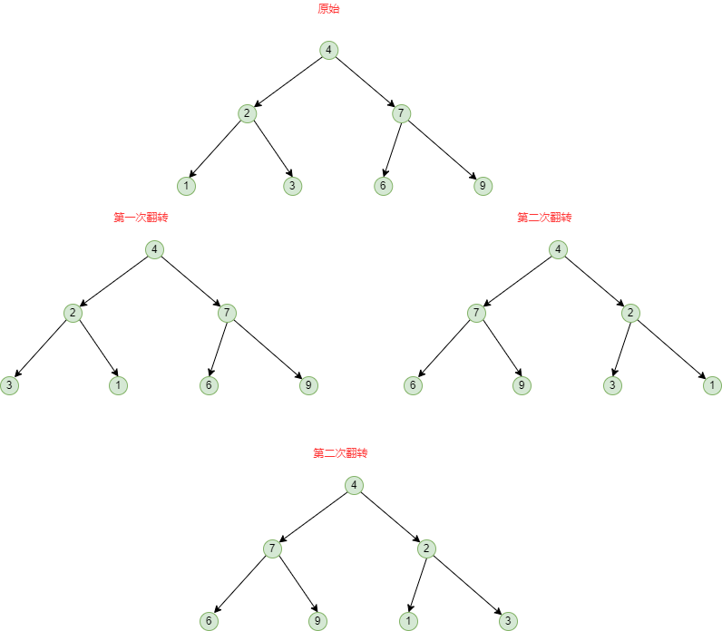

# Table of Contents

* [前提知识](#前提知识)
* [参考资料](#参考资料)
* [[226]翻转二叉树](#226翻转二叉树)
* [[116]填充每个节点的下一个右侧节点指针](#116填充每个节点的下一个右侧节点指针)
  * [单节点](#单节点)
  * [双节点](#双节点)
* [[114]. 将二叉树展开为链表](#114-将二叉树展开为链表)
* [[102]二叉树的层序遍历](#102二叉树的层序遍历)


# 前提知识

+ [二叉树基础知识](../C.数据结构与算法/dataStructures/二叉树.md)
  了解二叉树的前序、中序、后序遍历

+ [数据结构演示网站](https://www.cs.usfca.edu/~galles/visualization/Algorithms.html)

+ 了解递归的定义：**写递归算法的关键是要明确函数的「定义」是什么，然后相信这个定义，利用这个定义推导最终结果，绝不要试图跳入递归**。

  > 怎么明确这个定义呢？个人理解拆分到一定颗粒度，然后看这个颗粒度需要做什么
  
+ 递归算法的关键要明确函数的定义，相信这个定义，而不要跳进递归细节。

  写二叉树的算法题，都是基于递归框架的，**我们先要搞清楚`root`节点它自己要做什么**，然后根据题目要求选择使用前序，中序，后续的递归框架。

  二叉树题目的难点在于如何通过题目的要求思考出每一个节点需要做什么，这个只能通过多刷题进行练习了。
# 参考资料

[手把手刷二叉树](https://mp.weixin.qq.com/s/AzQzw-pC8A-0kS0NJn2eWw)


# [226]翻转二叉树

[https://leetcode-cn.com/problems/invert-binary-tree/](https://leetcode-cn.com/problems/invert-binary-tree/)

我们先从简单的题开始，看看力扣第 226 题「翻转二叉树」，输入一个二叉树根节点`root`，让你把整棵树镜像翻转，比如输入的二叉树如下：

```
     4
   /   \
  2     7                     
 / \   / \
1   3 6   9
```

算法原地翻转二叉树，使得以`root`为根的树变成：

```
     4
   /   \
  7     2
 / \   / \
9   6 3   1
```

通过观察，**我们发现只要把二叉树上的每一个节点的左右子节点进行交换，最后的结果就是完全翻转之后的二叉树**。

```java
    public TreeNode invertTree(TreeNode root) {
        //特殊情况
        if(null==root){
            return null;
        }
        //一般情况
        TreeNode temp= root.left;
        root.left = root.right;
        root.right = temp;
        //不要想着递归 而是下面2行代码是处理当前节点的左右节点
        invertTree(root.left);
        invertTree(root.right);
        return root;
    }
```
**注意：**值得一提的是，如果把交换左右子节点的代码放在后序遍历的位置也是可以的，但是放在中序遍历的位置是不行的，请你想一想为什么？这个应该不难想到

```java
  public TreeNode invertTree(TreeNode root) {
        //特殊情况
        if(null==root){
            return null;
        }
        
        //不要想着递归 而是下面2行代码是处理当前节点的左右节点
        invertTree(root.left);
		//交换位置
        TreeNode temp= root.left;
        root.left = root.right;
        root.right = temp;

        invertTree(root.right);
        return root;
    }
```

这个最开始没理解，后面来画图理解了，中序遍历，在递归回来的时候，又会交换左右节点的位置，导致最开始交换的又换回来了。





#  [116]填充每个节点的下一个右侧节点指针


[https://leetcode-cn.com/problems/populating-next-right-pointers-in-each-node/](https://leetcode-cn.com/problems/populating-next-right-pointers-in-each-node/)


题目的意思就是把二叉树的每一层节点都用`next`指针连接起来：

.png)


这个题有2个解法，分别是站在单个节点和2个节点的维度来递归处理。


## 单节点

对于2这个节点

```java
4->5 对应代码 root.left.next = root.right
5->6 对应代码 root.right.next = root.next.left
         root.next=3
         root.next.left=6
```

对应代码

```java
public Node connect(Node root) {
        if (root == null) {
            return null;
        }
	    //排除为空的情况
        if (root.left != null) {
            root.left.next = root.right;
            if (root.next != null) {
                //这个图画出来后 还是比较好理解的
                root.right.next = root.next.left;
            }
        }
    	//递归左节点
        connect(root.left);
        //递归右节点
        connect(root.right);
        return root;
    }
```


## 双节点


对于 2和 3 这个节点而言

2->3
4->5
5->6

6->7

```java
 public Node connect(Node root) {

        if(null==root){
            return root;
        }

        doConnect(root.left,root.right);
        return root;
    }

    public  void doConnect(Node left,Node right){
        if (left == null || right == null) {
            return;
        }
        //2->3
        left.next = right;
        //4->5
        doConnect(left.left,left.right);
        //5->6
        doConnect(right.left,right.right);
        //6->7
        doConnect(left.right,right.left);
    }
```


# [114]. 将二叉树展开为链表


如果使用递归的话

对于当前列子来说，首先拉平2这个节点，变为2-3-4
对于5这个节点，因为5的左边没有值，所以为5-6

```java

//  第一件事 方法 拉平当前节点的左边
//  第二件事 方法 拉平当前节点的右边
//  第三件事 将 当前节点的 左边拼接到右边
代码如下
     public void flatten(TreeNode root) {
        if(root == null){
            return;
        }

        //使用递归
        //处理左节点 拉平
        flatten(root.left);
        //处理右节点 拉平
        flatten(root.right);
        //去掉左边
        TreeNode temp = root.right;
        root.right =  root.left;
        root.left = null;

        //将temp的数据 拼在 右边 判断为空的情况
    	// 找到最后一个节点 拼接temp

           TreeNode p = root;
            while (p.right != null) {
                p = p.right;
            }
            p.right = temp ;
}

```


# [102]二叉树的层序遍历

+ 利用队列，放入每一层级的Node
```java
public List<List<Integer>> levelOrder(TreeNode root) {

        List<List<Integer>> reslutList = new ArrayList<>();
        if(null==root){
            return reslutList;
        }
        Queue<TreeNode> queue = new ArrayDeque<TreeNode>();
        queue.offer(root);

        while (!queue.isEmpty()){

            List<Integer> res = new ArrayList<>();

            int size = queue.size();

            for (Object o : queue) {
                TreeNode node = queue.poll();
                res.add(node.val);
                if (node.left != null) queue.offer(node.left);
                if (node.right != null) queue.offer(node.right);
            }

            reslutList.add(res);
        }

        return reslutList;
    }
```

+ 使用递归
```java
  public List<List<Integer>> levelOrder(TreeNode root) {
        List<List<Integer>> result = new ArrayList<>();

        if (null == root) {
            return result;
        }
        calc(result, root, 0);
        return result;
    }

    public void calc(List<List<Integer>> result, TreeNode root, int level) {

        if (level >= result.size()) {
            result.add(new ArrayList<Integer>());
        }
        result.get(level).add(root.val);
        if (null != root.left) {
            calc(result, root.left, level + 1);
        }
        if (null != root.right) {
            calc(result, root.right, level + 1);
        }
    }
```
