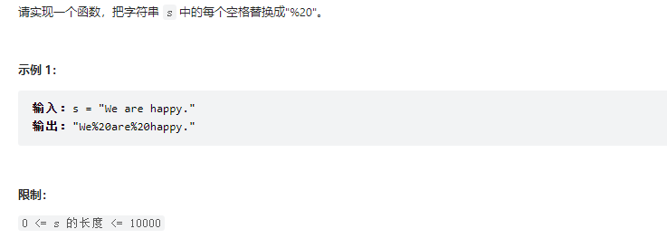
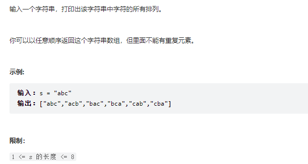

# 数组

## [剑指 Offer 04. 二维数组中的查找](https://leetcode-cn.com/problems/er-wei-shu-zu-zhong-de-cha-zhao-lcof/)


思路分析：

1. 先判断target在二维数组的哪一个元素里面，在进行一维数组的判断
2. 注意判断空的逻辑

```java
 public boolean findNumberIn2DArray(int[][] matrix, int target) {
		//判空逻辑
        if (null == matrix) {
            return false;
        }
        int row = matrix.length - 1;
        if (row < 0) {
            return false;
        }
        int col = matrix[0].length - 1;

        int j = 0;
        while (row >= 0 && j <= col) {
            //先判断target位于哪一行
            if (matrix[row][j] > target) {
                row--;
            } else if (matrix[row][j] < target) {
                j++;
            } else {
                return true;
            }
        }
        return false;
    }
```


## [剑指 Offer 11. 旋转数组的最小数字](https://leetcode-cn.com/problems/xuan-zhuan-shu-zu-de-zui-xiao-shu-zi-lcof/)


思路分析：

1. 既然求最小值，那直接排序不就好了，但是排序会造成不稳定。
2. 看到数组和链表这种，一般就是先双指针
3. 对于本题，进行比较左右比较就好了


+ 初始版

  ```java
       public int minArray(int[] num) {
          int length = num.length;
          if (1 == length) {
              return num[0];
          }
          int left = 0;
          int right = length - 1;
          while (left < right) {
              if(num[left]<num[right]){
                  right--;
              }else {
                  left++;
              }
          }
          return num[left];
      }
  ```

  

+ 进阶版

  初始版本是将所有数进行了比较，但实际上还可以用二分法，少比较。

  ```java
  public int minArray(int[] num) {
          int length = num.length;
          if (1 == length) {
              return num[0];
          }
          int left = 0;
          int right = length - 1;
          while (left < right) {
              int medium = (left + right) / 2;
              if (num[medium] < num[right]) {
                  right = medium;
              } else if (num[medium] > num[right]) {
                  left = medium + 1;
              } else {//会有等于的情况，需要减去
                  right--;
              }
          }
          return num[left];
      }
  ```

  

  

> 现在是有数组的最小值，那如果是最大值呢？

很简单，判断反过来就好了

```java
        while (left < right) {
            if(num[left]<num[right]){
                left++;
            }else {
                right--;
            }
        }
```


# 字符串

## [剑指 Offer 05. 替换空格](https://leetcode-cn.com/problems/ti-huan-kong-ge-lcof/)



思路分析

1. 是用正则进行替代，直接替换对应位置即可。

   > 使用正则把不相干的提取出来，在进行拼接。

2. 用额外的字符串进行承接，逐个遍历，进行替换。

   > for(old){
   >
   > ​	//如果是空 就放入替换字符
   >
   > ​	new.add()
   >
   > }

3. **但是实际上，很多类似的题目，都可以预先给数组扩容后，再从后往前操作！！**

   1. 定义2个指针，old执行原有字符的末尾，new指向扩容后字符末尾
   2. old>=0,进行替换

   ```java
    while(oldIndex>=0 && newIndex>oldIndex){
               char c=str.charAt(oldIndex);
               if(c==' '){
                   oldIndex--;
                   str.setCharAt(newIndex--,'0');
                   str.setCharAt(newIndex--,'2');
                   str.setCharAt(newIndex--,'%');
               }else{
                   str.setCharAt(newIndex,c);
                   oldIndex--;
                   newIndex--;
               }
           }
   ```

## [剑指 Offer 38. 字符串的排列](https://leetcode-cn.com/problems/zi-fu-chuan-de-pai-lie-lcof/)




# 链表


# 二叉树


# 参考资料

https://www.cnblogs.com/gzshan/p/10910831.html