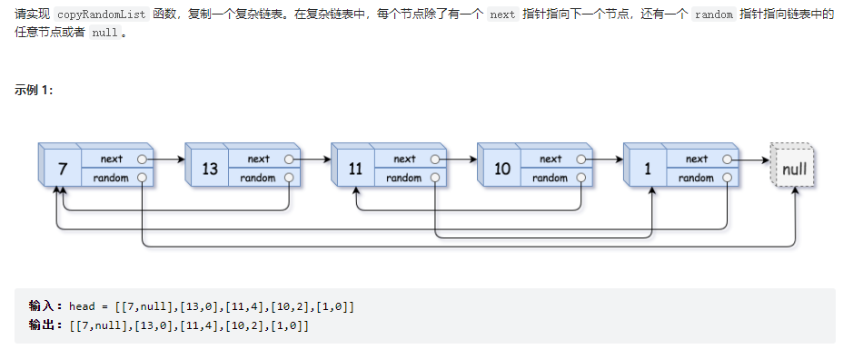

# Table of Contents

* [数组](#数组)
  * [[剑指 Offer 04. 二维数组中的查找](https://leetcode-cn.com/problems/er-wei-shu-zu-zhong-de-cha-zhao-lcof/)](#剑指-offer-04-二维数组中的查找httpsleetcode-cncomproblemser-wei-shu-zu-zhong-de-cha-zhao-lcof)
  * [[剑指 Offer 11. 旋转数组的最小数字](https://leetcode-cn.com/problems/xuan-zhuan-shu-zu-de-zui-xiao-shu-zi-lcof/)](#剑指-offer-11-旋转数组的最小数字httpsleetcode-cncomproblemsxuan-zhuan-shu-zu-de-zui-xiao-shu-zi-lcof)
* [字符串](#字符串)
  * [[剑指 Offer 05. 替换空格](https://leetcode-cn.com/problems/ti-huan-kong-ge-lcof/)](#剑指-offer-05-替换空格httpsleetcode-cncomproblemsti-huan-kong-ge-lcof)
  * [[剑指 Offer 38. 字符串的排列](https://leetcode-cn.com/problems/zi-fu-chuan-de-pai-lie-lcof/)](#剑指-offer-38-字符串的排列httpsleetcode-cncomproblemszi-fu-chuan-de-pai-lie-lcof)
* [链表](#链表)
  * [[剑指 Offer 06. 从尾到头打印链表](https://leetcode-cn.com/problems/cong-wei-dao-tou-da-yin-lian-biao-lcof/)](#剑指-offer-06-从尾到头打印链表httpsleetcode-cncomproblemscong-wei-dao-tou-da-yin-lian-biao-lcof)
  * [[剑指 Offer 35. 复杂链表的复制](https://leetcode-cn.com/problems/fu-za-lian-biao-de-fu-zhi-lcof/)](#剑指-offer-35-复杂链表的复制httpsleetcode-cncomproblemsfu-za-lian-biao-de-fu-zhi-lcof)
* [其他链表题目](#其他链表题目)
* [二叉树](#二叉树)
  * [[剑指 Offer 34. 二叉树中和为某一值的路径](https://leetcode-cn.com/problems/er-cha-shu-zhong-he-wei-mou-yi-zhi-de-lu-jing-lcof/)](#剑指-offer-34-二叉树中和为某一值的路径httpsleetcode-cncomproblemser-cha-shu-zhong-he-wei-mou-yi-zhi-de-lu-jing-lcof)
* [参考资料](#参考资料)


# 数组

## [剑指 Offer 04. 二维数组中的查找](https://leetcode-cn.com/problems/er-wei-shu-zu-zhong-de-cha-zhao-lcof/)


思路分析：

1. 先判断target在二维数组的哪一个元素里面，在进行一维数组的判断
2. 注意判断空的逻辑

```java
 public boolean findNumberIn2DArray(int[][] matrix, int target) {
		//判空逻辑
        if (null == matrix) {
            return false;
        }
        int row = matrix.length - 1;
        if (row < 0) {
            return false;
        }
        int col = matrix[0].length - 1;

        int j = 0;
        while (row >= 0 && j <= col) {
            //先判断target位于哪一行
            if (matrix[row][j] > target) {
                row--;
            } else if (matrix[row][j] < target) {
                j++;
            } else {
                return true;
            }
        }
        return false;
    }
```


## [剑指 Offer 11. 旋转数组的最小数字](https://leetcode-cn.com/problems/xuan-zhuan-shu-zu-de-zui-xiao-shu-zi-lcof/)


思路分析：

1. 既然求最小值，那直接排序不就好了，但是排序会造成不稳定。
2. 看到数组和链表这种，一般就是先双指针
3. 对于本题，进行比较左右比较就好了


+ 初始版

  ```java
       public int minArray(int[] num) {
          int length = num.length;
          if (1 == length) {
              return num[0];
          }
          int left = 0;
          int right = length - 1;
          while (left < right) {
              if(num[left]<num[right]){
                  right--;
              }else {
                  left++;
              }
          }
          return num[left];
      }
  ```

  

+ 进阶版

  初始版本是将所有数进行了比较，但实际上还可以用二分法，少比较。

  ```java
  public int minArray(int[] num) {
          int length = num.length;
          if (1 == length) {
              return num[0];
          }
          int left = 0;
          int right = length - 1;
          while (left < right) {
              int medium = (left + right) / 2;
              if (num[medium] < num[right]) {
                  right = medium;
              } else if (num[medium] > num[right]) {
                  left = medium + 1;
              } else {//会有等于的情况，需要减去
                  right--;
              }
          }
          return num[left];
      }
  ```

  

  

> 现在是有数组的最小值，那如果是最大值呢？

很简单，判断反过来就好了

```java
        while (left < right) {
            if(num[left]<num[right]){
                left++;
            }else {
                right--;
            }
        }
```


# 字符串

## [剑指 Offer 05. 替换空格](https://leetcode-cn.com/problems/ti-huan-kong-ge-lcof/)


思路分析

1. 是用正则进行替代，直接替换对应位置即可。

   > 使用正则把不相干的提取出来，在进行拼接。

2. 用额外的字符串进行承接，逐个遍历，进行替换。

   > for(old){
   >
   > ​	//如果是空 就放入替换字符
   >
   > ​	new.add()
   >
   > }

3. **但是实际上，很多类似的题目，都可以预先给数组扩容后，再从后往前操作！！**

   1. 定义2个指针，old执行原有字符的末尾，new指向扩容后字符末尾
   2. old>=0,进行替换

   ```java
    while(oldIndex>=0 && newIndex>oldIndex){
               char c=str.charAt(oldIndex);
               if(c==' '){
                   oldIndex--;
                   str.setCharAt(newIndex--,'0');
                   str.setCharAt(newIndex--,'2');
                   str.setCharAt(newIndex--,'%');
               }else{
                   str.setCharAt(newIndex,c);
                   oldIndex--;
                   newIndex--;
               }
           }
   ```

## [剑指 Offer 38. 字符串的排列](https://leetcode-cn.com/problems/zi-fu-chuan-de-pai-lie-lcof/)


见全排列： [回溯算法](../C.数据结构与算法/labuladong/回溯算法.md)


# 链表

## [剑指 Offer 06. 从尾到头打印链表](https://leetcode-cn.com/problems/cong-wei-dao-tou-da-yin-lian-biao-lcof/)


这个题目就很简单了。

1. 你可以先将链表的数据放到数组，在反转数组
2. 可以直接反转链表，在放入数组。 (如果不放数组，这个方法就好)
3. 放到栈里面，在放入数组。
4. 放到LinkedList中，取出最后一个

```java
 public int[] reversePrint(ListNode head) {
        LinkedList<Integer> A=new LinkedList<Integer>();
        while(head!=null){
            A.add(head.val);
            head = head.next;
        }
        int [] arr=new int[A.size()];
        for(int i=0;i<arr.length;i++){
            arr[i]=A.removeLast();
        }
        return arr;
    }

```


## [剑指 Offer 35. 复杂链表的复制](https://leetcode-cn.com/problems/fu-za-lian-biao-de-fu-zhi-lcof/)




**这个难点在于你复制的时候，怎么提前将random构造出来，在你用的时候可以用得到。**

1. 利用Hashmap

   ```java
    public Node copyRandomList(Node head) {
   
           if (head == null) {
               return null;
           }
           //先全部遍历一遍 构造 原始对象->new对象
           Map<Node, Node> map = new HashMap<>();
           Node cur = head;
           while (cur != null) {
               map.put(cur, new Node(cur.val));
               cur = cur.next;
           }
           cur = head;
           while (cur != null) {
               Node value = map.get(cur);
               value.next = map.get(cur.next);
               value.random = map.get(cur.random);
               cur = cur.next;
           }
           return map.get(head);
       }
   ```

   
# 其他链表题目

[其他链表题目](../k.leetcode/链表.md)


# 二叉树

## [剑指 Offer 34. 二叉树中和为某一值的路径](https://leetcode-cn.com/problems/er-cha-shu-zhong-he-wei-mou-yi-zhi-de-lu-jing-lcof/)

搞定[回溯算法](../C.数据结构与算法/labuladong/回溯算法.md)后，你会发现特别简单


```java
    LinkedList<List<Integer>> res = new LinkedList<>();
    LinkedList<Integer> path = new LinkedList<>();

    public List<List<Integer>> pathSum(TreeNode root, int target) {
        if (null == root) {
            return null;
        }
        backTrack(root, target);
        return res;
    }

    public void backTrack(TreeNode root, int target) {

        if (null == root) {
            return;
        }

        //加入路径
        path.add(root.val);
        target = target - root.val;

        //终止条件  从根节点到叶子节点
        if (target == 0&&null==root.left&&null==root.right) {
            res.add(new LinkedList(path));
            //为什么不加个 return 因为（根节点到叶子节点）>target
        }
        //选择列表
        backTrack(root.left, target);
        backTrack(root.right, target);
        target = target + root.val;
        //退出路径
        path.removeLast();
    }
```


# 参考资料

https://www.cnblogs.com/gzshan/p/10910831.html
