# Table of Contents

* [数组](#数组)
  * [[剑指 Offer 04. 二维数组中的查找]](#剑指-offer-04-二维数组中的查找)
  * [[剑指 Offer 11. 旋转数组的最小数字]](#剑指-offer-11-旋转数组的最小数字)
  * [[剑指 Offer 21. 调整数组顺序使奇数位于偶数前面]](#剑指-offer-21-调整数组顺序使奇数位于偶数前面)
  * [[剑指 Offer 39. 数组中出现次数超过一半的数字](经典题目)](#剑指-offer-39-数组中出现次数超过一半的数字经典题目)
  * [[162. 寻找峰值]](#162-寻找峰值)
  * [[剑指 Offer 45. 把数组排成最小的数]](#剑指-offer-45-把数组排成最小的数)
  * [[剑指 Offer 03. 数组中重复的数字]](#剑指-offer-03-数组中重复的数字)
  * [[202. 快乐数]](#202-快乐数)
  * [其他数组题目](#其他数组题目)
* [字符串](#字符串)
  * [[剑指 Offer 05. 替换空格]](#剑指-offer-05-替换空格)
  * [[剑指 Offer 38. 字符串的排列]](#剑指-offer-38-字符串的排列)
  * [[剑指 Offer 58 - I. 翻转单词顺序]](#剑指-offer-58---i-翻转单词顺序)
  * [[43. 字符串相乘]](#43-字符串相乘)
  * [滑动窗口](#滑动窗口)
* [[22. 括号生成]](#22-括号生成)
* [[14. 最长公共前缀]](#14-最长公共前缀)
      * [[14. 最长公共前缀](https://leetcode-cn.com/problems/longest-common-prefix/)](#14-最长公共前缀httpsleetcode-cncomproblemslongest-common-prefix)
* [链表](#链表)
  * [[剑指 Offer 06. 从尾到头打印链表]](#剑指-offer-06-从尾到头打印链表)
  * [[剑指 Offer 35. 复杂链表的复制]](#剑指-offer-35-复杂链表的复制)
  * [[83. 删除排序链表中的重复元素]](#83-删除排序链表中的重复元素)
* [[61. 旋转链表]](#61-旋转链表)
  * [其他链表题目](#其他链表题目)
* [二叉树](#二叉树)
  * [[剑指 Offer 34. 二叉树中和为某一值的路径]](#剑指-offer-34-二叉树中和为某一值的路径)
  * [[剑指 Offer 26. 树的子结构]](#剑指-offer-26-树的子结构)
  * [[剑指 Offer 32 - I. 从上到下打印二叉树]](#剑指-offer-32---i-从上到下打印二叉树)
  * [[剑指 Offer 32 - II. 从上到下打印二叉树 II]](#剑指-offer-32---ii-从上到下打印二叉树-ii)
  * [[剑指 Offer 32 - III. 从上到下打印二叉树 III]](#剑指-offer-32---iii-从上到下打印二叉树-iii)
  * [其他二叉树](#其他二叉树)
* [虾皮算法题](#虾皮算法题)
      * [[52. N皇后 II](https://leetcode-cn.com/problems/n-queens-ii/)](#52-n皇后-iihttpsleetcode-cncomproblemsn-queens-ii)
* [参考资料](#参考资料)


# 数组

## [剑指 Offer 04. 二维数组中的查找]

 [剑指 Offer 04. 二维数组中的查找](https://leetcode-cn.com/problems/er-wei-shu-zu-zhong-de-cha-zhao-lcof/)


思路分析：

1. 先判断target在二维数组的哪一个元素里面，在进行一维数组的判断
2. 注意判断空的逻辑

```java
 public boolean findNumberIn2DArray(int[][] matrix, int target) {
		//判空逻辑
        if (null == matrix) {
            return false;
        }
        int row = matrix.length - 1;
        if (row < 0) {
            return false;
        }
        int col = matrix[0].length - 1;

        int j = 0;
        while (row >= 0 && j <= col) {
            //先判断target位于哪一行
            if (matrix[row][j] > target) {
                row--;
            } else if (matrix[row][j] < target) {
                j++;
            } else {
                return true;
            }
        }
        return false;
    }
```


## [剑指 Offer 11. 旋转数组的最小数字]

 [剑指 Offer 11. 旋转数组的最小数字](https://leetcode-cn.com/problems/xuan-zhuan-shu-zu-de-zui-xiao-shu-zi-lcof/)


思路分析：

1. 既然求最小值，那直接排序不就好了，但是排序会造成不稳定。
2. 看到数组和链表这种，一般就是先双指针
3. 对于本题，进行比较左右比较就好了


+ 初始版

  ```java
       public int minArray(int[] num) {
          int length = num.length;
          if (1 == length) {
              return num[0];
          }
          int left = 0;
          int right = length - 1;
          while (left < right) {
              if(num[left]<num[right]){
                  right--;
              }else {
                  left++;
              }
          }
          return num[left];
      }
  ```

  

+ 进阶版

  初始版本是将所有数进行了比较，但实际上还可以用二分法，少比较。

  ```java
  public int minArray(int[] num) {
          int length = num.length;
          if (1 == length) {
              return num[0];
          }
          int left = 0;
          int right = length - 1;
          while (left < right) {
              int medium = (left + right) / 2;
              if (num[medium] < num[right]) {
                  right = medium;
              } else if (num[medium] > num[right]) {
                  left = medium + 1;
              } else {//会有等于的情况，需要减去
                  right--;
              }
          }
          return num[left];
      }
  ```

  

  

> 现在是有数组的最小值，那如果是最大值呢？

很简单，判断反过来就好了

```java
        while (left < right) {
            if(num[left]<num[right]){
                left++;
            }else {
                right--;
            }
        }
```


## [剑指 Offer 21. 调整数组顺序使奇数位于偶数前面]

[剑指 Offer 21. 调整数组顺序使奇数位于偶数前面](https://leetcode-cn.com/problems/diao-zheng-shu-zu-shun-xu-shi-qi-shu-wei-yu-ou-shu-qian-mian-lcof/)

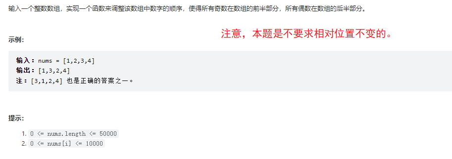

```java
public int[] exchange(int[] nums) {


        int left = 0;

        int right = nums.length - 1;


        while (left < right) {

            //判断左边的数 是不是偶数
            //像这种  while里面还有while的一定要判断 左边界和右边界的问题
            while (left < right&&nums[left] % 2 != 0) {
                left++;
            }
            //判断右边的数 是不是奇数
            while (left < right&&nums[right] % 2 == 0) {
                right--;
            }
            //进行交换位置
            int temp = nums[left];
            nums[left] = nums[right];
            nums[right] = temp;
        }

        return nums;

    }
```


这个题目如果在难一点，【并保证奇数和奇数，偶数和偶数之间的相对位置不变。】我们应该怎么做。


> 相对位置是指,12345678     2468 相对位置不变 

那么这题就很做做了,奇数放一个数组,偶数放一个数组


## [剑指 Offer 39. 数组中出现次数超过一半的数字](经典题目)

[剑指 Offer 39. 数组中出现次数超过一半的数字](https://leetcode-cn.com/problems/shu-zu-zhong-chu-xian-ci-shu-chao-guo-yi-ban-de-shu-zi-lcof/)


+ 方法一：首先对数组进行排序，在一个有序数组中，次数超过一半的必定是中位数，那么可以直接取出中位数，然后遍历数组，看中位数是否出现次数超过一半，这取决于排序的时间复杂度，最快为O(nlogn)。

+ 方法二：使用HashMap存储，在遍历得到大于一半的数字。

+ 解题思路：[【摩尔投票】数组中出现次数超过一半的数字 - 数组中出现次数超过一半的数字 - 力扣（LeetCode） (leetcode-cn.com)](https://leetcode-cn.com/problems/shu-zu-zhong-chu-xian-ci-shu-chao-guo-yi-ban-de-shu-zi-lcof/solution/mo-er-tou-piao-shu-zu-zhong-chu-xian-ci-8xbnz/)

  + 不同候选人的选票之间，可以一一抵消。

  + 若当前胜利者存在多张选票时，不同的候选人的票，只能抵消一张当前胜利者的票。

  + 若当前双方的选票被抵消为零，下一次抽出的候选人，**将作为暂时的胜利者领先。**

    > 最后一个是有限制条件的！！也就是**数组中一定有超过一半的元素！！**


```java
 public int majorityElement(int[] nums) {

        int count = 0;
        int temp = 0;

        for (int i = 0; i < nums.length; i++) {
            if (count == 0) {
                temp = nums[i];
                count++;
            } else {
                if (temp == nums[i]) {
                    count++;
                } else {
                    count--;
                }
            }
        }
        return temp;

    }
```


## [162. 寻找峰值]

[162. 寻找峰值](https://leetcode-cn.com/problems/find-peak-element/)


峰值元素是指其值**严格大于左右相邻值**的元素。

题目要求 `O(log n)`的做法，我们先看看 `O(n)`的解法


+ 常规解法：

```java
 public int findPeakElement(int[] nums) {
        int length = nums.length;
        if (1 == length) {
            return 0;
        }
        //峰值有可能出现在 第一个 中间  最后一个
        for (int i = 0; i < length; i++) {
            if (i == 0 && nums[i] > nums[i + 1]) {
                return i;
            } else if (i == length - 1 && nums[i - 1] < nums[i]) {
                return i;
            } else if (nums[i] > nums[i + 1] && nums[i - 1] < nums[i]) {
                return i;
            }
        }
        return -1;
    }
```


为什么要写常规解法呢，如果题目要求你求出全部的峰值，就可以用上了，但本题只是随机一个即可。

+ 二分法:

```java
  public int findPeakElement(int[] nums) {
        int length = nums.length;
        if (1 == length) {
            return 0;
        }

        // 先特判两边情况
        if(nums[0] > nums[1]) return 0;
        if(nums[length - 1] > nums[length - 2]) return length - 1;

        int left = 0;
        int right = length - 1;

        while (left <= right) {

            int mid = (left + right) / 2;

            if (mid >= 1&mid < length - 1&&nums[mid - 1] < nums[mid] && nums[mid] > nums[mid + 1]) {
                return mid;
            } else if (mid >= 1&& nums[mid - 1] > nums[mid]){
                //mid已经比较过 
                right = mid - 1;
            } else if (mid < length - 1 && nums[mid] < nums[mid+1]) {
                left = mid + 1;
            }
        }

        return -1;
    }
```


## [剑指 Offer 45. 把数组排成最小的数]

[剑指 Offer 45. 把数组排成最小的数](https://leetcode-cn.com/problems/ba-shu-zu-pai-cheng-zui-xiao-de-shu-lcof/)

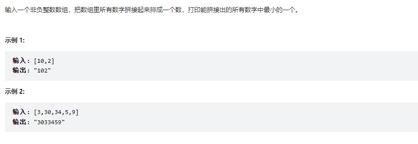

题解：[🗡☞offer45.把数组排成最小的数 - 把数组排成最小的数 - 力扣（LeetCode） (leetcode-cn.com)](https://leetcode-cn.com/problems/ba-shu-zu-pai-cheng-zui-xiao-de-shu-lcof/solution/offer45ba-shu-zu-pai-cheng-zui-xiao-de-s-eh8d/)


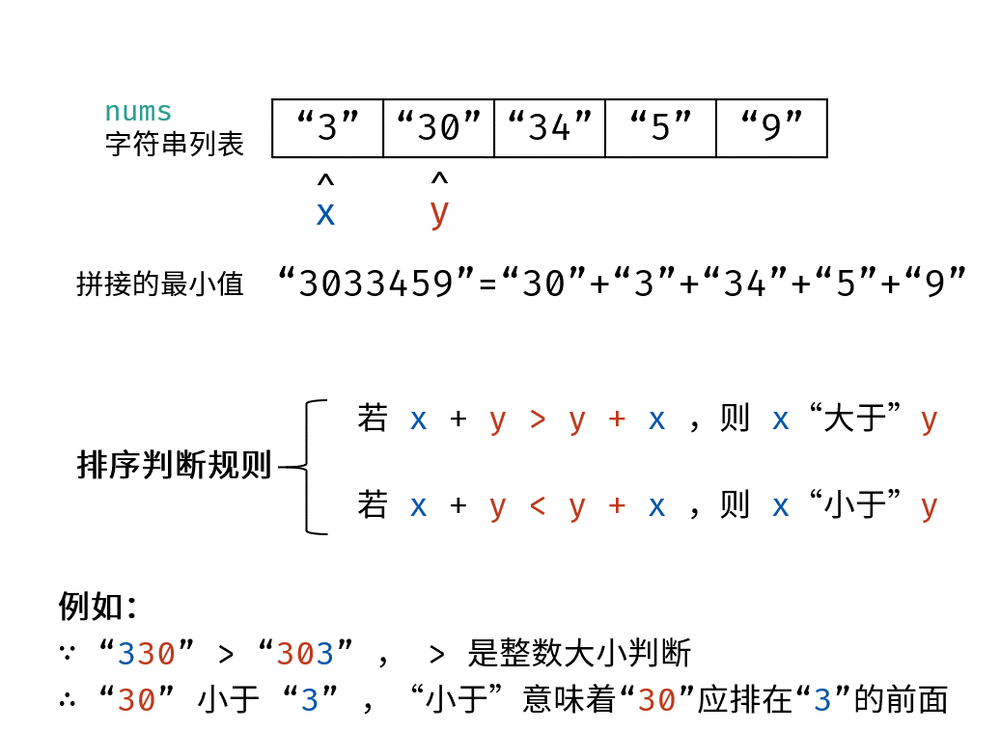


```java
class Solution {
    public String minNumber(int[] nums) {
        String[] strs = new String[nums.length];
        for(int i = 0; i < nums.length; i++){
            strs[i] = String.valueOf(nums[i]);
        }
        Arrays.sort(strs, (x,y) -> (x+y).compareTo(y+x));
        StringBuilder ans = new StringBuilder();
        for(String s : strs)
            ans.append(s);
        return ans.toString();
    }
}
```


## [剑指 Offer 03. 数组中重复的数字]


[剑指 Offer 03. 数组中重复的数字](https://leetcode-cn.com/problems/shu-zu-zhong-zhong-fu-de-shu-zi-lcof/)


+ 解法一：使用hashmap

+ 解法二：原地替换：[剑指 Offer 03. 数组中重复的数字（哈希表 / 原地交换，清晰图解） - 数组中重复的数字 - 力扣（LeetCode） (leetcode-cn.com)](https://leetcode-cn.com/problems/shu-zu-zhong-zhong-fu-de-shu-zi-lcof/solution/mian-shi-ti-03-shu-zu-zhong-zhong-fu-de-shu-zi-yua/)

  ​	算法流程：

  1. 遍历数组 nums ，设索引初始值为 i = 0i=0 :

     + 若 nums[i] = i： 说明此数字已在对应索引位置，无需交换，因此跳过；
     + 若 nums[nums[i]] = nums[i] ： 代表索引 nums[i] 处和索引 i 处的元素值都为 nums[i] ，即找到一组重复值，返回此值 nums[i] ；
     + 否则： 交换索引为 i 和 nums[i]的元素值，将此数字交换至对应索引位置。
  2. 若遍历完毕尚未返回，则返回 -1−1 。


```java
class Solution {
    public int findRepeatNumber(int[] nums) {
        int i = 0;
        while(i < nums.length) {
            if(nums[i] == i) {
                i++;
                continue;
            }
            if(nums[nums[i]] == nums[i]) return nums[i];
            int tmp = nums[i];
            nums[i] = nums[tmp];
            nums[tmp] = tmp;
        }
        return -1;
    }
}
```

+ 解法三：二分法
+ 解法四：先排序，重复的元素自然在一起乐。


## [202. 快乐数]

[202. 快乐数](https://leetcode-cn.com/problems/happy-number/)


思路分析

1. 首先肯定有一个方法计算当前数的下一个值。

   ```java
   
       public static  int getNextNum(int num) {
           int res = 0;
           while (num>0){
               int temp = num % 10;
               res += temp * temp;
               num /= 10;
           }
   
           return res;
       }
   ```

   

2. 按照一系列的数字来判断我们是否进入了一个循环。 Hash 


+ 解法一

  ```java
      public static boolean isHappy(int n) {
  
          Set record = new HashSet();
          while (n != 1 && !record.contains(n)) {
              record.add(n);
              n = getNextNum(n);
          }
          return n == 1;
      }
  ```

  但是如果无限大下去，栈空间就boom了

+ 解法二

  我们可以用链表有环来解决这个问题,使用快慢指针来解决这个问题

  如果 `n` 是一个快乐数，即没有循环，那么快跑者最终会比慢跑者先到达数字 1。

  如果 `n` 不是一个快乐的数字，那么最终快跑者和慢跑者将在同一个数字上相遇。

```java
public static boolean isHappy(int n) {

    int slow = n;
    int fast = getNextNum(n);

    while (slow!=fast){
        slow = getNextNum(slow);
        fast = getNextNum(getNextNum(fast));
    }

    return fast == 1;
}
```


## 其他数组题目

[其他数组题目](../k.leetcode/数组.md)


# 字符串

## [剑指 Offer 05. 替换空格]

[剑指 Offer 05. 替换空格](https://leetcode-cn.com/problems/ti-huan-kong-ge-lcof/)


思路分析

1. 是用正则进行替代，直接替换对应位置即可。

   > 使用正则把不相干的提取出来，在进行拼接。

2. 用额外的字符串进行承接，逐个遍历，进行替换。

   > for(old){
   >
   > ​	//如果是空 就放入替换字符
   >
   > ​	new.add()
   >
   > }

3. **但是实际上，很多类似的题目，都可以预先给数组扩容后，再从后往前操作！！**

   1. 定义2个指针，old执行原有字符的末尾，new指向扩容后字符末尾
   2. old>=0,进行替换

   ```java
    while(oldIndex>=0 && newIndex>oldIndex){
               char c=str.charAt(oldIndex);
               if(c==' '){
                   oldIndex--;
                   str.setCharAt(newIndex--,'0');
                   str.setCharAt(newIndex--,'2');
                   str.setCharAt(newIndex--,'%');
               }else{
                   str.setCharAt(newIndex,c);
                   oldIndex--;
                   newIndex--;
               }
           }
   ```

## [剑指 Offer 38. 字符串的排列]

[剑指 Offer 38. 字符串的排列](https://leetcode-cn.com/problems/zi-fu-chuan-de-pai-lie-lcof/)


见全排列： [回溯算法](../C.数据结构与算法/labuladong/回溯算法.md)


## [剑指 Offer 58 - I. 翻转单词顺序]

[剑指 Offer 58 - I. 翻转单词顺序](https://leetcode-cn.com/problems/fan-zhuan-dan-ci-shun-xu-lcof/)


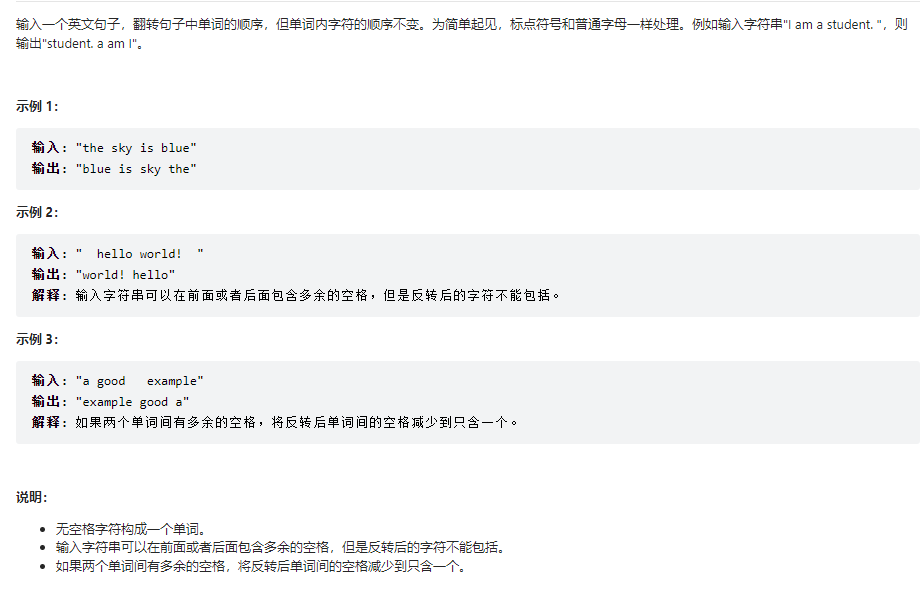


+ 这题目第一反应就是用空格分隔，然后倒序下就可以了，但是面试肯定是不建议的是吧。

+ 看了下官方题解，本质也是一样的。就是改成双指针来做了
  + 倒序遍历字符串 ss ，记录单词左右索引边界 ii , jj ；
  + 每确定一个单词的边界，则将其添加至单词列表 resres ；
  + 最终，将单词列表拼接为字符串，并返回即可。

```java
  public String reverseWords(String s) {

        s.trim();

        int r = s.length() - 1;

        int i = r;
        StringBuilder res = new StringBuilder();
        while (r >= 0) {
            
            while (i >= 0 && s.charAt(i) != ' ') {
                i--;
            }
            //找到一个单词 加进去
            res.append(s.substring(i + 1, r + 1) + " ");
            //跳过单词之间的空字符
            while (i >= 0 && s.charAt(i) == ' ') {
                i--;
            }
            r = i;
        }
        return res.toString().trim();
    }
```


## [43. 字符串相乘]

[43. 字符串相乘](https://leetcode-cn.com/problems/multiply-strings/)

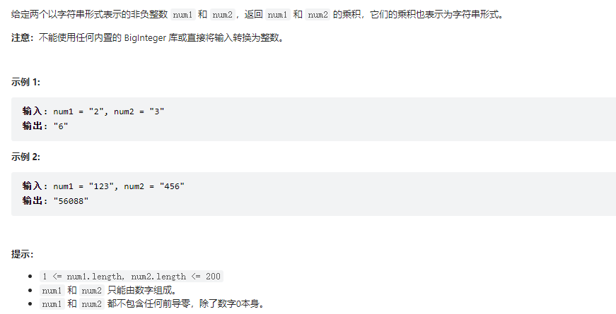


思路分析：[字符串相乘 | 图解字符串模拟 | 最通俗易懂的题解 【c++/java版】 - 字符串相乘 - 力扣（LeetCode） (leetcode-cn.com)](https://leetcode-cn.com/problems/multiply-strings/solution/zi-fu-chuan-mo-ni-zui-tong-su-yi-dong-de-ru8u/)


以num1 = 123 , num2 = 456为例：我们遍历 num2 每一位与 num1 进行相乘，将每一步的结果进行累加，在这个过程如果相乘或者相加的结果大于等于10 ，我们都要去满10进位，如下图所示：

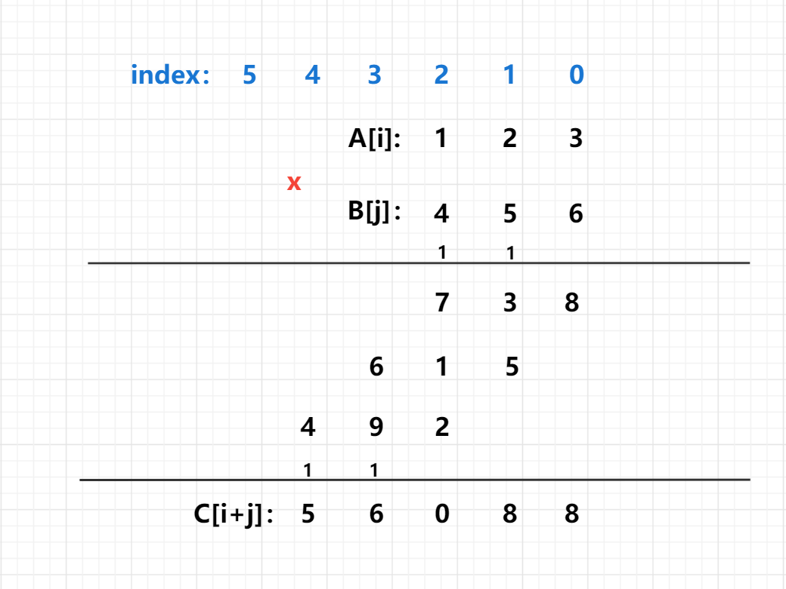

这样模拟普通竖式计算的方法较为复杂，我们可以考虑优化版的竖式计算。

**优化竖式**

其实在相乘或者相加计算过程的每一位，**我们可以考虑先不去满10进位，等到计算完所有的相乘结果以后，最终将其加到一块，再去满10进位** ，最后的结果和普通竖式 一样，但却可以大大简化我们的模拟过程。(如下图所示)

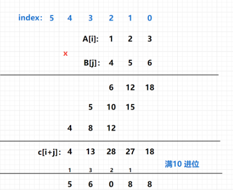


具体过程如下：

+ 长度是n和长度是m的数字相乘，**最多只有n + m**位，为了方便计算，将num1和num2反向存储到A[]和B[]中，即位数低的在数组前面，且开一个大小是n + m的C[]存储计算后的答案。
+ 两个数相乘时，将A[i] * B[j]的结果累加到C[i + j]中，最后C[i + j]表示i + j这个位数的值是C
+ 由于C[]数组中的某些位数字可能是大于等于10的，我们从0枚举到n + m - 1，进行满10进位， 将所有位的值全部变成个位数。
+ 最后将C[]数组反转输出。

```java
 public String multiply(String num1, String num2) {

        int m = num1.length();
        int n = num2.length();

        int[] A = new int[m];
        int[] B = new int[n];
		//反转字符串
        for (int i = m - 1; i >= 0; i--) {
            A[m - 1 - i] = num1.charAt(i) - '0';
        }

        for (int i = n - 1; i >= 0; i--) {
            B[n - 1 - i] = num2.charAt(i) - '0';
        }

     	//进行求和
        int[] C = new int[m + n];

        for (int i = 0; i <= m - 1; i++) {
            for (int j = 0; j <= n - 1; j++) {
                C[i + j] += A[i] * B[j];
            }
        }
        //进行 进位
        int t = 0;
        for (int i = 0; i <= C.length - 1; i++) {
            t += C[i];
            C[i] = t % 10;
            t = t / 10;
        }
        //是否去掉头部的o
        int k = C.length - 1;
        while (k > 0 && C[k] == 0) k--;
        StringBuilder sb = new StringBuilder();
        while (k >= 0) sb.append((char) (C[k--] + '0')); //反转
        return sb.toString();

    }
```


## 滑动窗口

 [滑动窗口](../C.数据结构与算法/labuladong/滑动窗口.md)


# [22. 括号生成]

 [括号生成](../C.数据结构与算法/labuladong/括号生成.md)


# [14. 最长公共前缀]

#### [14. 最长公共前缀](https://leetcode-cn.com/problems/longest-common-prefix/)


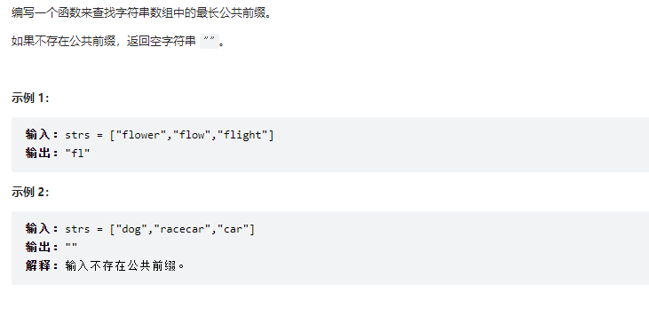


```java
   public String longestCommonPrefix(String[] strs) {

        if (strs.length == 0) {
            return "";
        }

        //默认第一个元素
        String res = strs[0];

        //从第二个元素开始 遍历元素的每个字符 与res比较，缩减res的范围
        for (int i = 1; i <= strs.length - 1; i++) {

            int j = 0;

            while (j < strs[i].length() && j < res.length() && strs[i].charAt(j) == res.charAt(j)) {
                j++;
            }
            res = res.substring(0, j);
        }

        return res;
    }
```


# 链表

## [剑指 Offer 06. 从尾到头打印链表]

[剑指 Offer 06. 从尾到头打印链表](https://leetcode-cn.com/problems/cong-wei-dao-tou-da-yin-lian-biao-lcof/)


这个题目就很简单了。

1. 你可以先将链表的数据放到数组，在反转数组
2. 可以直接反转链表，在放入数组。 (如果不放数组，这个方法就好)
3. 放到栈里面，在放入数组。
4. 放到LinkedList中，取出最后一个

```java
 public int[] reversePrint(ListNode head) {
        LinkedList<Integer> A=new LinkedList<Integer>();
        while(head!=null){
            A.add(head.val);
            head = head.next;
        }
        int [] arr=new int[A.size()];
        for(int i=0;i<arr.length;i++){
            arr[i]=A.removeLast();
        }
        return arr;
    }

```


## [剑指 Offer 35. 复杂链表的复制]

[剑指 Offer 35. 复杂链表的复制](https://leetcode-cn.com/problems/fu-za-lian-biao-de-fu-zhi-lcof/)


**这个难点在于你复制的时候，怎么提前将random构造出来，在你用的时候可以用得到。**

1. 利用Hashmap

   ```java
    public Node copyRandomList(Node head) {
   
           if (head == null) {
               return null;
           }
           //先全部遍历一遍 构造 原始对象->new对象
           Map<Node, Node> map = new HashMap<>();
           Node cur = head;
           while (cur != null) {
               map.put(cur, new Node(cur.val));
               cur = cur.next;
           }
           cur = head;
           while (cur != null) {
               Node value = map.get(cur);
               value.next = map.get(cur.next);
               value.random = map.get(cur.random);
               cur = cur.next;
           }
           return map.get(head);
       }
   ```

   

## [83. 删除排序链表中的重复元素]

[83. 删除排序链表中的重复元素](https://leetcode-cn.com/problems/remove-duplicates-from-sorted-list/)

这个同数组去重是一样的，用快慢指针去做，快指针探测下一个数据是否重复，如果下一个数据不重复，就将快指针的val复制给慢指针。

**不管数组还是链表，首先都要先排序。**


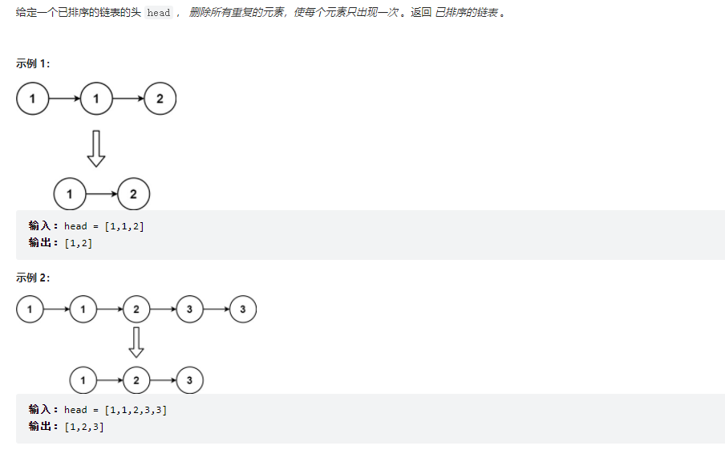

```java
 public ListNode deleteDuplicates(ListNode head) {


        if(null==head){
            return null;
        }

        ListNode fast=head;
        ListNode slow=head;


        while(fast!=null){

            if(fast.val!=slow.val){
                slow=slow.next;
                slow.val=fast.val;
            }

            fast=fast.next;
        }
		//fast走完后，需要从slow后面断掉剩余部分
        slow.next=null;
        return head;
       
    }
```


# [61. 旋转链表]

 [61. 旋转链表](https://leetcode-cn.com/problems/rotate-list/)

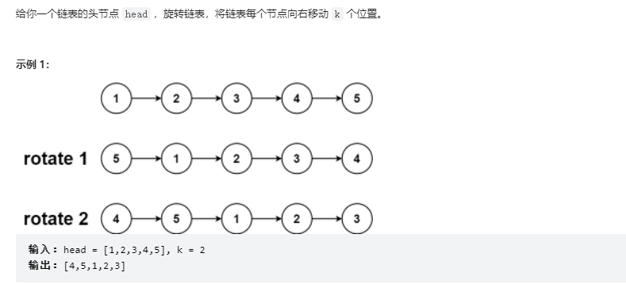


1. 这题要注意k可能是一个很大的数，大于链表的长度，需要取模
2. 移动的位数等于将从倒数第k个数,也就是头需要移动 n-k-1

```java
 public ListNode rotateRight(ListNode head, int k) {

        //先拼接成环，在从头部向后移动，断开其位置 ，就是旋转后的位置
        if (head == null || k == 0) return head;
        int n = 0;               //链表的长度
        ListNode tail = null;  //尾节点
        for (ListNode p = head; p != null; p = p.next) {
            tail = p;
            n++;
        }
        k %= n;
        ListNode p = head;
        // tail   head   k
        // 
        for (int i = 0; i < n - k - 1; i++) p = p.next;   //找到链表的第n-k个节点
        tail.next = head;
        head = p.next;
        p.next = null;
        return head;  //返回新的头节点
    }
```


## 其他链表题目

[其他链表题目](../k.leetcode/链表.md)


# 二叉树

## [剑指 Offer 34. 二叉树中和为某一值的路径]


 [剑指 Offer 34. 二叉树中和为某一值的路径](https://leetcode-cn.com/problems/er-cha-shu-zhong-he-wei-mou-yi-zhi-de-lu-jing-lcof/)

搞定[回溯算法](../C.数据结构与算法/labuladong/回溯算法.md)后，你会发现特别简单


```java
    LinkedList<List<Integer>> res = new LinkedList<>();
    LinkedList<Integer> path = new LinkedList<>();

    public List<List<Integer>> pathSum(TreeNode root, int target) {
        if (null == root) {
            return null;
        }
        backTrack(root, target);
        return res;
    }

    public void backTrack(TreeNode root, int target) {

        if (null == root) {
            return;
        }

        //加入路径
        path.add(root.val);
        target = target - root.val;

        //终止条件  从根节点到叶子节点
        if (target == 0&&null==root.left&&null==root.right) {
            res.add(new LinkedList(path));
            //为什么不加个 return 因为（根节点到叶子节点）>target
        }
        //选择列表
        backTrack(root.left, target);
        backTrack(root.right, target);
        target = target + root.val;
        //退出路径
        path.removeLast();
    }
```


## [剑指 Offer 26. 树的子结构]

[剑指 Offer 26. 树的子结构](https://leetcode-cn.com/problems/shu-de-zi-jie-gou-lcof/)


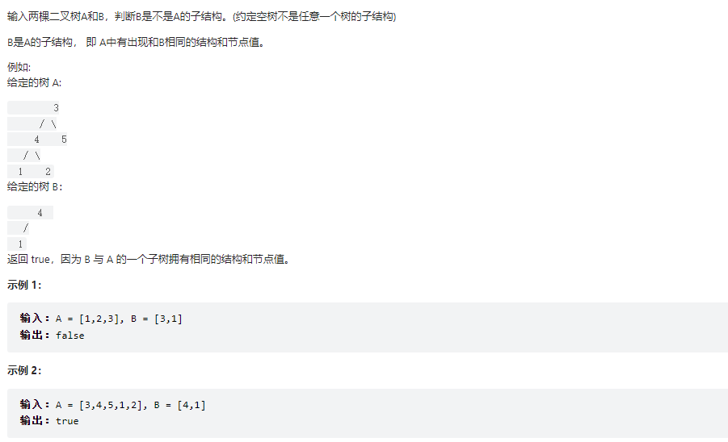

思路分析

1. 我最开始是想用前序遍历，分别得到A和B的遍历顺序，然后在用遍历的方式进行判断，如果相等就是，但是这有一个问题，就是你要标记每一颗树的根节点才能作为起始位置去遍历
2. 后面看到别人的解法，使用递归。


```java
public boolean isSubStructure(TreeNode A, TreeNode B) {

        if (null == A||null == B) {
            return false;
        }
        //子树可能是根节点的子树 也可能是根节点的子节点的子树
        return dfs(A, B) || isSubStructure(A.left, B) || isSubStructure(A.right, B);

    }

    public boolean dfs(TreeNode A, TreeNode B) {
        //B树所有节点都被访问过了，所以返回true  这句话不太理解
        if (null == B) {
            return true;
        }
        //A访问完了，B还没有     A和B结点不相等
        if (null == A) {
            return false;
        }

        return A.val == B.val && dfs(A.left, B.left) && dfs(A.right, B.right);

    }
```


## [剑指 Offer 32 - I. 从上到下打印二叉树]

[剑指 Offer 32 - I. 从上到下打印二叉树](https://leetcode-cn.com/problems/cong-shang-dao-xia-da-yin-er-cha-shu-lcof/)


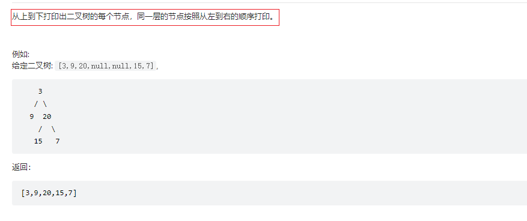


第一反应这不是二叉树的层次遍历吗

细看不就是层次遍历BFS吗


【3,9,20,15,7】

注意看遍历的时候，这题是没有区分层次的，每一个是跟在后面的

如果是层次的话

[[3].[9.20],[15,7]]

```java
 public int[] levelOrder(TreeNode root) {

        if (null == root) {
            return new int[0];
        }
        List<Integer> resList = new LinkedList<>();

        Queue<TreeNode> queue = new LinkedList<>();

        queue.add(root);

        while (!queue.isEmpty()) {

            TreeNode node = queue.poll();
            resList.add(node.val);
            if(node.left != null) queue.add(node.left);
            if(node.right != null) queue.add(node.right);
        }
        //转化为数组
        int[] res = new int[resList.size()];
        for(int i = 0; i < resList.size(); i++)
            res[i] = resList.get(i);
        return res;
    }
```

## [剑指 Offer 32 - II. 从上到下打印二叉树 II]

[剑指 Offer 32 - II. 从上到下打印二叉树 II](https://leetcode-cn.com/problems/cong-shang-dao-xia-da-yin-er-cha-shu-ii-lcof/)

这题就是层次遍历拉 

## [剑指 Offer 32 - III. 从上到下打印二叉树 III]


[剑指 Offer 32 - III. 从上到下打印二叉树 III](https://leetcode-cn.com/problems/cong-shang-dao-xia-da-yin-er-cha-shu-iii-lcof/)


这题一看不就是二叉树的层次遍历吗

只不过每遍历一次需要反转下当前节点的位置，这里需要用一个**变量**来控制，是正序遍历还是逆序遍历


```java
  public List<List<Integer>> levelOrder(TreeNode root) {

        List<List<Integer>> res = new LinkedList<>();

        if (null == root) {
            return res;
        }
        Queue<TreeNode> qe = new LinkedList<>();

        qe.add(root);

        // true 正序遍历 false 逆序
        boolean flag = true;

        while (!qe.isEmpty()) {

            int size = qe.size();

            LinkedList<Integer> temp = new LinkedList<>();

            for (int i = 0; i < size; i++) {

                TreeNode poll = qe.poll();

                if (flag) {
                    temp.addLast(poll.val);
                } else {
                    temp.addFirst(poll.val);
                }
                if (null != poll.left) {
                    qe.add(poll.left);
                }
                if (null != poll.right) {
                    qe.add(poll.right);
                }
            }
            res.add(temp);
            flag = !flag;
        }

        return res;
    }
```


看网上也有人用其他方法来判断是否正序还是倒序

1. 奇数层 偶数层
2. 负负得正 其实跟flag一样的意思


## 其他二叉树

[其他二叉树](../k.leetcode/二叉树.md)


# 虾皮算法题


+ 困难

  #### [52. N皇后 II](https://leetcode-cn.com/problems/n-queens-ii/)

  253

  


  


# 参考资料

https://www.cnblogs.com/gzshan/p/10910831.html

