# Table of Contents

* [相关](#相关)
* [进程和线程](#进程和线程)
* [CAS](#cas)
* [Volatile](#volatile)
* [**如何减少上下文切换**](#如何减少上下文切换)
* [Java并发编程](#java并发编程)
* [**形成死锁的四个必要条件是什么**](#形成死锁的四个必要条件是什么)
* [Java内存模型](#java内存模型)
* [happens-before](#happens-before)
* [volatile是如何来保证内存的可见性？](#volatile是如何来保证内存的可见性)
* [**Synchonized在JVM里的实现原理：**](#synchonized在jvm里的实现原理)
* [线程的状态：](#线程的状态)
* [ThreadLocal](#threadlocal)
* [synchronized](#synchronized)
* [AQS(大头)](#aqs大头)
* [LockSupport](#locksupport)
* [Condition](#condition)
* [Java中阻塞队列](#java中阻塞队列)
* [线程池(大头)](#线程池大头)
* [FutureTask](#futuretask)
* [常见问题](#常见问题)

# 相关

+ 多线程面试题：** [**https://thinkwon.blog.csdn.net/article/details/104863992**](https://thinkwon.blog.csdn.net/article/details/104863992)

+ <https://mp.weixin.qq.com/s?__biz=MzUxODAzNDg4NQ==&mid=2247497371&idx=2&sn=fbdb5294c00923dd468dd03ed1b89557&scene=21#wechat_redirect>

# 进程和线程

+ [Linux进程线程](../学习/A.操作系统/Linux进程线程.md)
+ [进程线程基础知识](../学习/E.Java并发/进程线程基础知识.md)

不管是进程还是线程，进行上下文切换都会带来时间的开销，又因为生活中 大部分都是共享场景，所以使用了多线程。

上下文切换：CPU在任务切换前会保存前一个任务的状态，以便下次切换回这个任务时，可以再加载这个任务的状态。所以任务从保存到再加载的过程就是一次任务切换。

内存屏障：一组处理器指令，用于实现对内存操作的顺序限制。

> 单核CPU开启多线程会怎么样？

# CAS

[CAS](../学习/E.Java并发/CAS.md)

# Volatile

https://mp.weixin.qq.com/s?__biz=MzUxODAzNDg4NQ==&mid=2247486859&idx=1&sn=a09919f9d1877b4188664294ef4694d7&scene=21#wechat_redirect

+ [Volatile](../学习/E.Java并发/Volatile.md)

# **如何减少上下文切换**

减少上下文切换的方法有无锁并发编程、CAS算法、单线程编程和使用协程。

· 无锁并发编程。多线程竞争锁时，会引起上下文切换，所以多线程处理数据时，可以用一些办法来避免使用锁，如将数据用ID进行Hash算法后分段，不同的线程处理不同段的数据。volatile。。。。

· CAS算法。Java的Atomic包使用CAS算法来更新数据，而不需要加锁。

· 使用最少线程。避免创建不需要的线程，比如任务很少，但是创建了很多线程来处理，这样会造成大量线程都处于等待状态。

· 协程：在单线程里实现多任务的调度，并在单线程里维持多个任务间的切换。

# Java并发编程

+ [理论基础](../学习/E.Java并发/理论基础.md)

**Java代码执行的过程：**

java代码--[编译]---Java字节码--[类加载器加载]--JVM--[执行字节码]--汇编指令---CPU执行

# **形成死锁的四个必要条件是什么**

互斥条件：线程(进程)对于所分配到的资源具有排它性，即一个资源只能被一个线程(进程)占用，直到被该线程(进程)释放

请求与保持条件：一个线程(进程)因请求被占用资源而发生阻塞时，对已获得的资源保持不放。

不剥夺条件：线程(进程)已获得的资源在末使用完之前不能被其他线程强行剥夺，只有自己使用完毕后才释放资源。

循环等待条件：当发生死锁时，所等待的线程(进程)必定会形成一个环路（类似于死循环），造成永久阻塞

如何避免死锁的几个常见方法。

· 避免一个线程同时获取多个锁。

· 避免一个线程在锁内同时占用多个资源，尽量保证每个锁只占用一个资源。

· 尝试使用定时锁，使用tryLock(timeout)来替代使用内部锁机制。

· 对于数据库锁，加锁和解锁必须在一个数据库连接里，否则会出现解锁失败。

# Java内存模型

在Java中，所有实例域、静态域和数组元素都存储在堆内存中，堆内存在线程之间共享 （即“共享变量”）。

局部变量，方法定义参数和异常处理器参数不会在线程之间共享，它们不会有内存可见性问题，也不受内存模型的影响。

Java线程之间的通信由Java内存模型（JMM）控制，JMM决定一个线程对共享变量的写入何时对另一个线程可见。从抽象的角度来看，JMM定义了线程和主内存之间的抽象关系：线程之间的共享变量存储在主内存（Main
Memory）中，每个线程都有一个私有的本地内存，本地内存中存储了该线程以读/写共享变量的副本。本地内存是JMM的 一个抽象概念，并不真实存在。它涵盖了缓存、写缓冲区、寄存器以及其他的硬件和编译器优化。

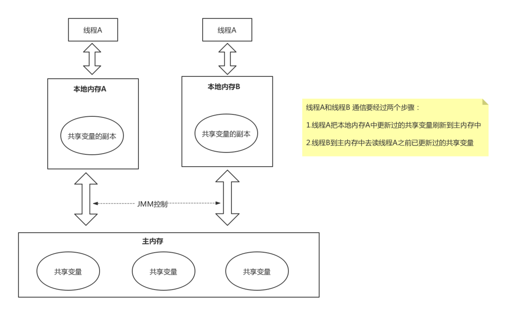

在执行程序时，为了提高性能，编译器和处理器常常会对指令做重排序。重排序分3种类

型。

1）编译器优化的重排序。编译器在不改变单线程程序语义的前提下，可以重新安排语句

的执行顺序。

2）指令级并行的重排序。现代处理器采用了指令级并行技术（Instruction-Level

Parallelism，ILP）来将多条指令重叠执行。如果不存在数据依赖性，处理器可以改变语句对应

机器指令的执行顺序。

3）内存系统的重排序。由于处理器使用缓存和读/写缓冲区，这使得加载和存储操作看上

去可能是在乱序执行。

# happens-before

程序顺序规则：一个线程中的每个操作，happens-before于该线程中的任意后续操作。

·监视器锁规则：对一个锁的解锁，happens-before于随后对这个锁的加锁。

·volatile变量规则：对一个volatile域的写，happens-before于任意后续对这个volatile域的读。

start()规则：如果线程A执行操作ThreadB.start()（启动线程B），那么A线程的

ThreadB.start()操作happens-before于线程B中的任意操作。

join()规则：如果线程A执行操作ThreadB.join()并成功返回，那么线程B中的任意操作

happens-before于线程A从ThreadB.join()操作成功返回。

·传递性：如果A happens-before B，且B happens-before C，那么A happens-before C。

两个操作之间具有happens-before关系，并不意味着前一个操作必须要在后一个

操作之前执行！happens-before仅仅要求前一个操作（执行的结果）对后一个操作可见，且前一

个操作按顺序排在第二个操作之前。

在单线程程序中，对存在控制依赖的操作重排序，不会改变执行结果（这也是as-if-serial

语义允许对存在控制依赖的操作做重排序的原因）；但在多线程程序中，对存在控制依赖的操

作重排序，可能会改变程序的执行结果。

happens-before是来指定两个操作之间的执行顺序

1）如果一个操作happens-before另一个操作，那么第一个操作的执行结果将对第二个操作

可见，而且第一个操作的执行顺序排在第二个操作之前。

2）两个操作之间存在happens-before关系，并不意味着Java平台的具体实现必须要按照

happens-before关系指定的顺序来执行。如果重排序之后的执行结果，与按happens-before关系

来执行的结果一致，那么这种重排序并不非法（也就是说，JMM允许这种重排序）。

**什么是happens-before**

**happens-before：**A happens-before B就是A先行发生于B（这种说法不是很准确），定义为hb(A, B)。在Java内存模型中，happens-before的意思是前一个操作的结果可以被后续操作获取。

**为什么需要happens-before**

JVM会对代码进行编译优化，会出现指令重排序情况，为了避免编译优化对并发编程安全性的影响，**需要happens-before规则定义一些禁止编译优化的场景，保证并发编程的正确性。**以双重检查单例示例进行分析：

单例

//会有线程安全问题

public class UnsafeLazyInitialization {

**private static** Instance instance;

**public static** Instance getInstance() {

if (instance == null) // 1：A线程执行

instance = new Instance(); // 2：B线程执行

return instance;

}

}

//加锁导致性能下降

public class SafeLazyInitialization {

**private** **static** Instance instance;

**public** **synchronized** **static** Instance getInstance() {

if (instance == null)

instance = new Instance();

return instance;

}

}

//为空时再上锁，再鉴别空。但是是会有问题的

public class DoubleCheckedLocking { // 1

**private static** Instance instance; // 2

**public static** Instance getInstance() { // 3

if (instance == null) { // 4:第一次检查

 synchronized (DoubleCheckedLocking.class) { // 5:加锁

if (instance == null) // 6:第二次检查

instance = new Instance(); // 7:问题的根源出在这里

} // 8

} // 9

 return instance; // 10

 } // 11

}

7行：

memory = allocate(); // 1：分配对象的内存空间

ctorInstance(memory); // 2：初始化对象

instance = memory; // 3：设置instance指向刚分配的内存地址

2和3之间，可能会被重排序(因为2/3重排序不会影响单线程的结果，但是会影响多线程结果)，变为

memory = allocate(); // 1：分配对象的内存空间

instance = memory; // 3：设置instance指向刚分配的内存地址

// 注意，此时对象还没有被初始化！

ctorInstance(memory); // 2：初始化对象

则执行可能变成下图这样：线程B访问instance会访问到一个还未初始化的对象。

解决方法：

1）不允许2和3重排序。

2）允许2和3重排序，但不允许其他线程“看到”这个重排序。

1)用volatile解决:

当声明对象的引用为volatile后，3行伪代码中的2和3之间的重排序，在多线程

环境中将会被禁止。

**lock前缀指令****相当于****一个内存屏障**（也称内存栅栏）（**既不是Lock中使用了内存屏障，也不是内存屏障使用了Lock指令**），内存屏障主要提供3个功能：

\1. 确保指令重排序时不会把其后面的指令排到内存屏障之前的位置，也不会把前面的指令排到内存屏障的后面；即在执行到内存屏障这句指令时，在它前面的操作已经全部完成；

public class DoubleCheckedLocking { // 1

**private volatile static** Instance instance; // 2

**public static** Instance getInstance() { // 3

if (instance == null) { // 4:第一次检查

 synchronized (DoubleCheckedLocking.class) { // 5:加锁

if (instance == null) // 6:第二次检查

instance = new Instance(); // 7:问题的根源出在这里

} // 8

} // 9

 return instance; // 10

 } // 11

}

2)基于类初始化的方式解决：

JVM在类的初始化阶段（即在Class被加载后，且被线程使用之前），会去获取一个锁。这个锁可以同步多个线程对同一个类的初始化。

public class InstanceFactory {

**private** **static** class InstanceHolder {

​     **public** **static** Instance instance = new Instance();

}

public static Instance getInstance() {

 return InstanceHolder.instance ; // 这里将导致InstanceHolder类被初始化

}

}

字段延迟初始化降低了初始化类或创建实例的开销，但增加了访问被延迟初始化的字段

的开销。在大多数时候，正常的初始化要优于延迟初始化。如果确实需要对实例字段使用线程

安全的延迟初始化，请使用上面介绍的基于volatile的延迟初始化的方案

顺序一致性内存模型是一个被计算机科学家理想化了的理论参考模型，它为程序员提供了极强的内存可见性保证。顺序一致性内存模型有两大特性：

一个线程中的所有操作必须按照程序的顺序来执行。

（不管程序是否同步）所有线程都只能看到一个单一的操作执行顺序。在顺序一致性内存模型中，每个操作都必须原子执行且立刻对所有线程可见

# volatile是如何来保证内存的可见性？

为了提高处理速度，处理器是不会直接和内存进行通信的，而是先将系统内存的数据读取的内部缓存中后在进行操作，但操作完不知道何时会写到内存。如果对声明了volatile的变量进行写操作，jvm就会向处理器发送一条lock前缀的指令，将这个变量所在缓存行的数据写回到系统内存，再多处理器下，为了保证各个处理器缓存是一致的，就会实现**
缓存的一致性协议**，每个处理器通过**嗅探总线上传播的数据**
来检查自己缓存的值是不是过期了，当处理器发现自己缓存行对应的内存地址被修改，就会将自己处理器的缓存行设置成无效状态，当处理器对这个数据进行读取或修改的时候，会重现从系统内存把数据读到处理器缓存中

volatile的两条实现原则：

**1）Lock前缀指令会引起处理器缓存回写到内存。**Lock前缀指令导致在执行指令期间，声 言处理器的LOCK#信号。在多处理器环境中，LOCK#信号确保在声言该信号期间，处理器可以 独占任何共享内存(
因为它会锁住总线，导致其他CPU不能访问总线，不能访问总线就意味着不能访问系统内存)。但是，在最近的处理器里，LOCK＃信号一般不锁总线，而是锁缓存，毕
竟锁总线开销的比较大。在8.1.4节有详细说明锁定操作对处理器缓存的影响，对于Intel486和 Pentium处理器，在锁操作时，总是在总线上声言LOCK#信号。但在P6和目前的处理器中，如果
访问的内存区域已经缓存在处理器内部，则不会声言LOCK#信号。相反，它会锁定这块内存区 域的缓存并回写到内存，并使用缓存一致性机制来确保修改的原子性，此操作被称为“缓存锁
定”，缓存一致性机制会阻止同时修改由两个以上处理器缓存的内存区域数据。

**2）一个处理器的缓存回写到内存会导致其他处理器的缓存无效。**IA-32处理器和Intel 64处 理器使用MESI（修改、独占、共享、无效）控制协议去维护内部缓存和其他处理器缓存的一致
性。在多核处理器系统中进行操作的时候，IA-32和Intel 64处理器能嗅探其他处理器访问系统 内存和它们的内部缓存。处理器使用嗅探技术保证它的内部缓存、系统内存和其他处理器的缓存的数据在总线上保持一致。例如，在Pentium和P6
family处理器中，如果通过嗅探一个处理器来检测其他处理器打算写内存地址，而这个地址当前处于共享状态，那么正在嗅探的处理 器将使它的缓存行无效，在下次访问相同内存地址时，强制执行缓存行填充。

volatile的使用优化

JDK 7的并发包里新增一个队列集合类Linked- TransferQueue，它在使用volatile变量时，用一种追加字节的方式来优化队列出队和入队的性 能。LinkedTransferQueue的代码如下。

/** 队列中的头部节点 */

private transient f?inal PaddedAtomicReference<QNode> head;

/** 队列中的尾部节点 */

private transient f?inal PaddedAtomicReference<QNode> tail;

static f?inal class PaddedAtomicReference <T> extends AtomicReference T> {

// 使用很多4个字节的引用追加到64个字节 Object p0, p1, p2, p3, p4, p5, p6, p7, p8, p9, pa, pb, pc, pd, pe;

PaddedAtomicReference(T r) {

super(r);

}

}

public class AtomicReference <V> implements java.io.Serializable {

private volatile V value;

// 省略其他代码

｝

追加字节能优化性能？ 。

让我们先来看看LinkedTransferQueue这个类，它使用一个内部类类型来定义队列的 头节点（head）和尾节点（tail），而这个内部类PaddedAtomicReference相对于父类
AtomicReference只做了一件事情，就是将共享变量追加到64字节。我们可以来计算下，一个对 象的引用占4个字节，它追加了15个变量（共占60个字节），再加上父类的value变量，一共64个
字节。为什么追加64字节能够提高并发编程的效率呢？因为对于英特尔酷睿i7、酷睿、Atom和 NetBurst，以及Core Solo和Pentium
M处理器的L1、L2或L3缓存的高速缓存行是64个字节宽，不支持部分填充缓存行，这意味着，如果队列的头节点和尾节点都不足64字节的话，处理器会将 它们都读到同一个高速缓存行中，在多处理器下每个处理器都会缓存同样的头、尾节点，当一
个处理器试图修改头节点时，会将整个缓存行锁定，那么在缓存一致性机制的作用下，会导致 其他处理器不能访问自己高速缓存中的尾节点，而队列的入队和出队操作则需要不停修改头

节点和尾节点，所以在多处理器的情况下将会严重影响到队列的入队和出队效率。Doug lea使 用追加到64字节的方式来填满高速缓冲区的缓存行，避免头节点和尾节点加载到同一个缓存行，使头、尾节点在修改时不会互相锁定。

那么是不是在使用volatile变量时都应该追加到64字节呢？不是的。在两种场景下不应该使用这种方式。

·缓存行非64字节宽的处理器。

·共享变量不会被频繁地写。因为使用追加字节的方式需要处理器读取更多的字节到高速缓冲区，这本身就会带来一定的性能消耗，如果共享变量不被频繁写的话，锁的几率也非常 小，就没必要通过追加字节的方式来避免相互锁定。 不过这种追加字节的方式在Java
7下可能不生效，因为Java 7变得更加智慧，它会淘汰或 重新排列无用字段，需要使用其他追加字节的方式。

**volatile****变****量自身具有下列特性**

可见性。对一个volatile变量的读，总是能看到（任意线程）对这个volatile变量最后的写

入。

·原子性：对任意单个volatile变量的读/写具有原子性，但类似于volatile++这种复合操作不

具有原子性。

Java 提供了 volatile 关键字来保证可见性和禁止指令重排。 volatile 提供 happens-before 的保证，确保一个线程的修改能对其他线程是可见的。当一个共享变量被 volatile
修饰时，它会保证修改的值会立即被更新到主存，当有其他线程需要读取时，它会去内存中读取新值

volatile和锁写的内存语义如下。

当写一个volatile变量时，JMM会把该线程对应的本地内存中的共享变量值刷新到主内存。

volatile和锁读的内存语义如下。

当读一个volatile变量时，JMM会把该线程对应的本地内存置为无效。线程接下来将从主 内存中读取共享变量。

CAS为什么具有volatile读和 volatile写的内存语义呢？

程序会根据当前处理器的类型来决定是否为cmpxchg指令添加lock前 缀。如果程序是在多处理器上运行，就为cmpxchg指令加上lock前缀（Lock Cmpxchg）。反之，如
果程序是在单处理器上运行，就省略lock前缀（单处理器自身会维护单处理器内的顺序一致性，不需要lock前缀提供的内存屏障效果）。

intel的手册对lock前缀的说明如下。

1）确保对内存的读-改-写操作原子执行。在Pentium及Pentium之前的处理器中，带有lock前 缀的指令在执行期间会锁住总线，使得其他处理器暂时无法通过总线访问内存。很显然，这会 带来昂贵的开销。从 Pentium 4、Intel
Xeon及P6处理器开始，Intel使用缓存锁定 来保证指令执行的原子性。缓存锁定将大大降低lock前缀指令的执行开销。

2）禁止该指令，与之前和之后的读和写指令重排序。

3）把写缓冲区中的所有数据刷新到内存中。

> JUC包大多数都是这么玩的。

如果我们仔细分析concurrent包的源代码实现，会发现一个通用化的实现模式。

首先，声明共享变量为volatile。

然后，使用CAS的原子条件更新来实现线程之间的同步。

同时，配合以volatile的读/写和CAS所具有的volatile读和写的内存语义来实现线程之间的

通信。

AQS，非阻塞数据结构和原子变量类（java.util.concurrent.atomic包中的类），这些concurrent

包中的基础类都是使用这种模式来实现的，而concurrent包中的高层类又是依赖于这些基础类

来实现的。

volatile/CAS-》AQS/原子类-〉 lock executor 并发容器.....

# **Synchonized在JVM里的实现原理：**

JVM基于进入和退出Monitor对象来实现方法同步和代码块同步。

代码块同步是使用monitorenter和monitorexit指令实现的，monitorenter指令是在编译后插入到同步代码块的开始位置，而monitorexit是插入到方法结处和异常处，JVM要保证每个monitorenter必须有对应的monitorexit与之配对。任何对象都有一个monitor与之关联，当且一个monitor被持有后，它将处于锁定状态。线程执行到monitorenter
指令时，将会尝试获取对象所对应的monitor的所有权，即尝试获得对象的锁。

java对象头是实现synchronized的锁对象的基础，synchronized使用的锁对象是存储在Java对象头里的。

对象头：

其中Mark Word在默认情况下存储着对象的HashCode、分代年龄、锁标记位等以下是32位JVM的Mark Word默认存储结构

锁一共有4种状态，级别从低到高依次是：无锁状态、偏向锁状态、轻量级锁状 态和重量级锁状态。锁可以升级但不能降级

偏向锁是为了在只有一个线程执行同步块时进一步提高性能**。**

**偏向锁逻辑**

**多数情况下，锁不仅不存在多线程竞争，而且总是由同一个线程多次获取，为了让线程获取锁的代价更低引入偏向锁**

1.线程A第一次访问同步块时，先检测对象头Mark Word中的锁状态是否为01，依此判断此时对象锁是否处于无锁状态或者偏向锁状态（匿名偏向锁，就是谁也不偏向）；

2.然后判断偏向锁标志位是否为1，如果不是，则进入轻量级锁逻辑（使用CAS竞争锁），如果是，则进入下一步流程；

3.判断是偏向锁时，检查对象头Mark Word中记录的Thread Id是否是当前线程ID，如果是，则表明当前线程已经获得对象锁，以后该线程进入同步块时，不需要CAS进行加锁，只会往当前线程的栈中添加一条Displaced Mark
Word为空的Lock Record中，用来统计重入的次数（如图为当对象所处于偏向锁时，当前线程重入3次，线程栈帧中Lock Record记录）。退出同步块释放偏向锁时，则依次删除对应Lock
Record，但是不会修改对象头中的Thread Id。这样实现偏向锁的重入

4.如果对象头Mark Word中Thread Id不是当前线程ID，则进行CAS操作，企图将当前线程ID替换进Mark Word。如果当前对象锁状态处于匿名偏向锁状态（可偏向未锁定），则会替换成功（将Mark Word中的Thread
id由匿名0改成当前线程ID，在当前线程栈中找到内存地址最高的可用Lock Record，将线程ID存入），获取到锁，执行同步代码块；

5.如果对象锁已经被其他线程占用，则会替换失败，开始进行偏向锁撤销，这也是偏向锁的特点，一旦出现线程竞争，就会撤销偏向锁；

6.偏向锁的撤销需要等待全局安全点（safe
point，代表了一个状态，在该状态下所有线程都是暂停的）,暂停持有偏向锁的线程，检查持有偏向锁的线程状态（遍历当前JVM的所有线程，如果能找到，则说明偏向的线程还存活），如果线程还存活，则检查线程是否在执行同步代码块中的代码，如果是，则升级为轻量级锁，进行CAS竞争锁；

7.如果持有偏向锁的线程未存活，或者持有偏向锁的线程未在执行同步代码块中的代码，则进行校验是否允许重偏向，如果不允许重偏向，则撤销偏向锁，将Mark Word设置为无锁状态（未锁定不可偏向状态），然后升级为轻量级锁，进行CAS竞争锁；

8.如果允许重偏向，设置为匿名偏向锁状态,CAS将偏向锁重新指向线程A（在对象头和线程栈帧的锁记录中存储当前线程ID）；

9.唤醒暂停的线程，从安全点继续执行代码。

注：偏向锁撤销是指在获取偏向锁的过程中因不满足条件导致要将锁对象改为非偏向锁状态，而偏向锁释放是指退出同步块时的过程。

注：每次进入同步块（即执行monitorenter）的时候都会以从高往低的顺序在栈中找到第一个可用的Lock Record，并设置偏向线程ID；每次解锁（即执行monitorexit）的时候都会从最低的一个Lock
Record移除。所以如果能找到对应的Lock Record说明偏向的线程还在执行同步代码块中的代码。

**轻量级锁****所适应的场景是线程交替执行同步块的情况，如果存在同一时间访问同一锁的情况，就会导致轻量级锁膨胀为重量级锁。**

（1）轻量级锁加锁

线程在执行同步块之前，JVM会先在当前线程的栈桢中创建用于存储锁记录的空间，并

将对象头中的Mark Word复制到锁记录中，官方称为Displaced Mark Word。然后线程尝试使用

CAS将对象头中的Mark Word替换为指向锁记录的指针。如果成功，当前线程获得锁，如果失

败，表示其他线程竞争锁，当前线程便尝试使用自旋来获取锁。 自旋超时失败则锁升级为重量级锁，修改Mark Word重量级锁标志，线程阻塞。

（2）轻量级锁解锁

轻量级解锁时，会使用原子的CAS操作将Displaced Mark Word替换回到对象头，如果成

功，则表示没有竞争发生。如果失败，表示当前锁存在竞争，

当锁处于这个状态下，其他线程试图获取锁时， 都会被阻塞住，当持有锁的线程释放锁之后会唤醒这些线程，被唤醒的线程就会进行新一轮 的夺锁之争。

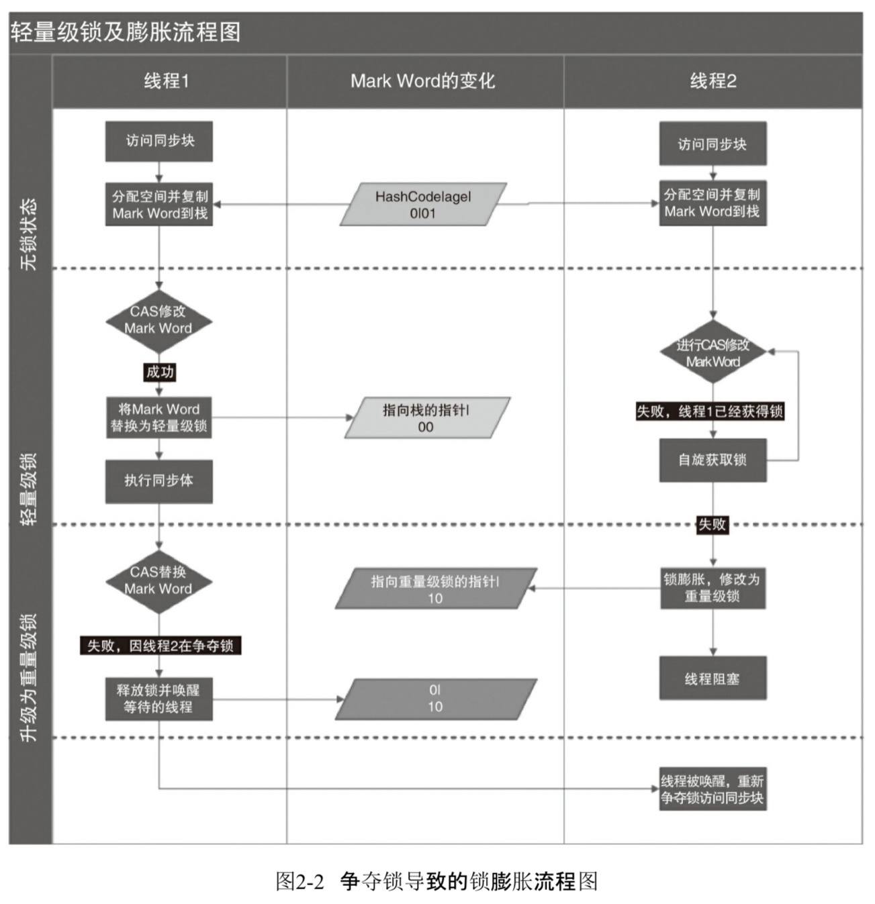

偏向锁**：**

优点：加锁和解锁不需要额外的开销，和执行非同步方法相比仅存在纳秒级的差距。

缺点：如果线程间存在锁竞争，会带来额外的锁撤销的消耗

适用场景：适用于只有一个线程访问同步块场景

轻量级锁**：**

优点：竞争的线程不会阻塞，提高了程序的响应速度。

缺点：如果始终得不到锁竞争的线程，使用自旋会消耗CPU

适用场景:追求响应时间，同步块执行速度非常快

重量级锁**：**

优点：线程竞争不使用自旋，不会消耗CPU

缺点：线程阻塞，响应时间缓慢

适用场景：追求吞吐量。同步块执行速度较长

处理器保证原子性的方式

（1）使用总线锁保证原子性

（2）使用缓存锁保证原子性/

Java保证原子性的方式

锁

循环CAS

CAS需要在操作值的时候，检查值有没有发生变化，如果没有发生变化则进行更新。

CAS的问题：

1.ABA 加版本号解决

2.循环时间长开销大，延迟流水线执行命令来解决【自旋CAS如果长时间不成功，会给CPU带来非常大的执行开销】

3.只能保证一个共享变量的原子操作，通过合并多个变量 a+b 作为c或者使用AtomicReference保证引用对象的原子性

【Java1.5开始AtomicReference类可以保证引用对象之间的原子性，可以把多个变量放在一个对象里进行CAS操作】

# 线程的状态：

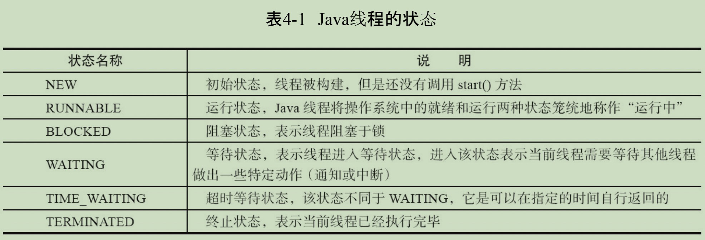

线程状态变化图：

**Daemon****线****程**是一种支持型线程，当一个Java虚拟机中不存在非Daemon线程的时候，Java虚拟机将会退出，这时Daemon不管有没有执行完都会立即终止。可以通过调用Thread.setDaemon(true)
将线程设置为Daemon线程。Daemon属性需要在启动线程之前设置，不能在启动线程之后设置。

**启动线程：**

线程start()方法的含义

是：当前线程（即parent线程）同步告知Java虚拟机，只要线程规划器空闲，应立即启动调用start()方法的线程。

**中断：**

interrupt() 对线程进行中断操作。

isInterrupted() 判断是否被中断

用静态方法Thread.interrupted()对当前线程的中断标识位进行复位

如果该线程已经处于终结状态，即使该线程被中断过，在调用该线程对象的isInterrupted()时依旧会返回false。

从Java的API中可以看到，许多声明抛出InterruptedException的方法（例如Thread.sleep(long millis)
方法）这些方法在抛出InterruptedException之前，Java虚拟机会先将该线程的中断标识位 清除，然后抛出InterruptedException，此时调用isInterrupted()方法将会返回false。

中断分为两种：

1.若线程被中断前，如果该线程处于非阻塞状态(未调用过wait,sleep,join方法)，那么该线程的中断状态将被设为true, 除此之外，不会发生任何事。此时需要通过flag来决定具体要干啥

2.若线程被中断前，该线程处于阻塞状态(调用了wait,sleep,join方法)，那么该线程将会立即从阻塞状态中退出(因为在这三个方法中都会去检查中断状态，随时抛出中断异常)
，并抛出一个InterruptedException异常，同时，该线程的中断状态被设为false, 除此之外，不会发生任何事。

Synchronized不可中断是指：Synchronized**只有获取到锁之后才能中断，等待锁时不可中断。原因：**
Synchronized等待线程是在自旋运行或者已经是重量级锁导致的阻塞状态了（非调用了wait,sleep,join等方法的阻塞），只把中断状态设为true，没有抛出异常真正中断。

Lock 可以中断获取锁：因为在中断获取锁的方法中，CAS获取锁时校验了中断标志位

**stop**

stop()方法在终结 一个线程时不会保证线程的资源正常释放，通常是没有给予线程完成资源释放工作的机会，

因此会导致程序可能工作在不确定状态下。

如何优雅停止线程：

而中断操作是一种简便的线程间交互 方式，而这种交互方式最适合用来取消或停止任务。

除了中断以外，还可以利用一个boolean变量来控制是否需要停止任务并终止该线程。

循环时判断中断/flag。外部可以调用方法中断/修改flag值。

这种通过标识位或者中断操作的方式能够使线程在终止时有机会去清理资源。

Object对象的方法

wait 调用后会释放锁，从wait()方法返回的获得前提是了调用对象的锁。

wait(time)

notify 通知时不释放锁，结束后才释放，其他线程才能从wait返回

notifyAll

使用wait()、notify()和notifyAll()时需要先对调用对象加锁。

notify()或notifyAll()方法调用后，等待线程依旧不会从wait()返回，需要调用notify()或 notifAll()的线程释放锁之后，等待线程才有机会从wait()返回。

等待通知的经典范式：

等待方：

1）获取对象的锁。

2）如果条件不满足，那么调用对象的wait()方法，被通知后仍要检查条件。

3）条件满足则执行对应的逻辑。

synchronized(对象) {

while(条件不满足) {

 对象.wait();

}

 对应的处理逻辑

}

通知方：

1）获得对象的锁。

2）改变条件。

3）通知所有等待在对象上的线程。

synchronized(对象) {

 改变条件

 对象.notifyAll();

}

# ThreadLocal

即线程变量，是一个以ThreadLocal对象为键、任意对象为值的存储结构。这个结构被附带在线程上，也就是说一个线程可以根据一个ThreadLocal对象查询到绑定在这个线程上的一个值。

每个线程都有一个属性：ThreadLocalMap对象，是一个以ThreadLocal对象为键、任意对象为值的存储结构。这样一个线程可以根据当前线程拿到这个对象，然后根据一个ThreadLocal对象查询到绑定在这个线程上的一个值。

方法：

get

set

remove

initialValue

使用

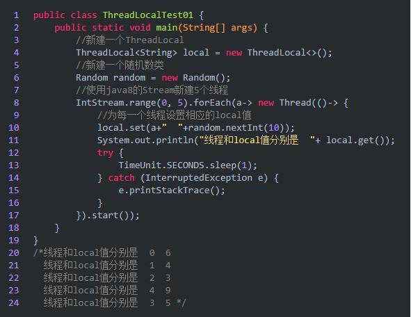

原理：给每个线程维护一个threadLocalMap，threadLocalMap里以当前threadlocal对象为key value为值存储

ThreadLocal和Synchronized都是为了解决多线程中相同变量的访问冲突问题，不同的点是

· Synchronized是通过线程等待，牺牲时间来解决访问冲突

· ThreadLocal是通过每个线程单独一份存储空间，牺牲空间来解决冲突，并且相比于Synchronized，ThreadLocal具有线程隔离的效果，只有在线程内才能获取到对应的值，线程外则不能访问到想要的值。

使用场景：当某些数据是以线程为作用域并且不同线程具有不同的数据副本的时候，就可以考虑采用ThreadLocal。

注意事项：重点来了，突然我们ThreadLocal是null了，也就是要被垃圾回收器回收了，但是此时我们的ThreadLocalMap生命周期和Thread的一样，它不会回收，这时候就出现了一个现象。那就是ThreadLocalMap的key没了，但是value还在，这就造成了内存泄漏。解决办法：使用完ThreadLocal后，执行remove操作，避免出现内存溢出情况。

内存泄露问题：<https://zhuanlan.zhihu.com/p/102571059>

# synchronized 

<https://mp.weixin.qq.com/s?__biz=MzUxODAzNDg4NQ==&mid=2247487236&idx=2&sn=1475f0250734b8ec2ee7bda4905b3b05&scene=21#wechat_redirect>

+ [synchronized](../学习/E.Java并发/Synchronized.md)

synchronized关键字最主要有以下3种应用方式，下面分别介绍

修饰实例方法，作用于当前实例加锁，进入同步代码前要获得当前实例的锁

修饰静态方法，作用于当前类对象加锁，进入同步代码前要获得当前类对象的锁

修饰代码块，指定加锁对象，对给定对象加锁，进入同步代码库前要获得给定对象的锁。

synchronized

对于同步块的实现使用了monitorenter和monitorexit指令，而同步方法则是依靠方法修饰符上的ACC_SYNCHRONIZED来完成的。无论采用哪种方式，其本质是对一
个对象的监视器（monitor）进行获取，而这个获取过程是排他的，也就是同一时刻只能有一个 线程获取到由synchronized所保护对象的监视器。

任意一个对象都拥有自己的监视器，当这个对象由同步块或者这个对象的同步方法调用时，执行方法的线程必须先获取到该对象的监视器才能进入同步块或者同步方法，而没有获取到监视器（执行该方法）的线程将会被阻塞在同步块和同步方法的入口处，进入BLOCKED状态。

注意：

synchronized是可重入的由于synchronized是基于monitor实现的，因此每次重入，monitor中的计数器仍会加1。

**Java锁**

方法

lock

lockInterruptibly 可中断的获取锁

tryLock 尝试获取锁，立即返回true/false

tryLock(time, unit) 可响应中断

unLock

new Condition() 获得和当前线程绑定的等待通知组件

lock和synchronized功能区别

1.所处层面

 synchronized是Java的一个关键字，它的实现是基于JVM层面实现的，Lock是一个接口，属于

JDK层面的实现。

2.使用方式

synchronized可以对实例方法，静态方法，代码块加锁，对实例方法的加锁对象是当前调用方法的对象，对静态方法加锁对象是当前类的.class文件，对代码块加锁对象是传入的对象。而Lock只能对代码快进行加锁。synchronized在执行结束或者出现异常的时候会自动释放锁，不会发生死锁现象，而Lock需要主动去释放锁，否则会出现死锁现象。

3.实现原理

 Synchronized的底层实现原理如下，Lock的实现基本是通过聚合一个同步器【AQS】的子类来完成线程访问控制的，加锁和解锁是利用unsafe方法的park和unpark方法。synchronized竞争的是对象头的Mark
word区 monitor对象，而Lock是竞争同步状态。

4.锁类型

 Lock锁能够响应中断，让等待状态的线程停止等待【lockInterruptibly()可中断地获取锁，与lock()
方法不同的是该方法可以响应中断，即在锁的获取中可以中断当前线程】，而synchronized不支持响应中断。synchoronized和Lock都支持可重入，另外synchronized是非公平锁，而Lock默认是非公平锁，也可以在构造函数传入fair参数为true来实现公平锁,Lock可以尝试非阻塞获取锁【tryLock()
立刻返回，如果能获取则返回true，否则返回false】，可超时获取锁。

5.执行效率

 Synchronized称为重量级锁，在JDK1.6之前执行的效率较低，在JDK1.6之后引入了偏向锁，轻量级锁，自旋锁

**synchronized代码块底层原理**

首先对象头是实现synchronized的基础：

在JVM中，对象在内存中的布局分为三块区域：对象头、实例数据和对齐填充

synchronized使用的锁对象是存储在Java对象头的Mark Word 中。

synchronized的对象锁，指针指向的是monitor对象（也称为管程或监视器锁）的起始地址。

每个对象都存在着一个 monitor 与之关联，并且monitor对象存在于每个Java对象的对象头中(存储的指针的指向)。

当一个 monitor 被某个线程持有后，它便处于锁定状态。

synchronized锁便是通过这种方式获取锁的，也是为什么Java中任意对象可以作为锁的原因，同时也是notify/notifyAll/wait等方法存在于顶级对象Object中的原因。

同步语句块的实现使用的是monitorenter 和 monitorexit
指令。其中monitorenter指令指向同步代码块的开始位置，monitorexit指令则指明同步代码块的结束位置，当执行monitorenter指令时，当前线程将试图获取 objectref(即对象锁) 所对应的 monitor
的持有权，当 objectref 的 monitor 的进入计数器为 0，那线程可以成功取得 monitor，并将计数器值设置为 1，取锁成功。如果当前线程已经拥有 objectref 的 monitor 的持有权，那它可以重入这个
monitor (关于重入性稍后会分析)，重入时计数器的值也会加 1。倘若其他线程已经拥有 objectref 的 monitor 的所有权，那当前线程将被阻塞，直到正在执行线程执行完毕，即monitorexit指令被执行，执行线程将释放
monitor(锁)并设置计数器值为0 ，其他线程将有机会持有 monitor 。值得注意的是编译器将会确保无论方法通过何种方式完成，方法中调用过的每条 monitorenter 指令都有执行其对应 monitorexit
指令，而无论这个方法是正常结束还是异常结束。为了保证在方法异常完成时 monitorenter 和 monitorexit 指令依然可以正确配对执行，编译器会自动产生一个异常处理器，这个异常处理器声明可处理所有的异常，它的目的就是用来执行
monitorexit 指令。从字节码中也可以看出多了一个monitorexit指令，它就是异常结束时被执行的释放monitor 的指令。

synchronized方法底层原理:

 使用ACC_SYNCHRONIZED标示方法是同步方法。当方法调用时，调用指令将会检查方法的 ACC_SYNCHRONIZED 访问标志是否被设置，如果设置了，执行线程将先持有monitor（虚拟机规范中用的是管程一词），
然后再执行方法，最后再方法完成(无论是正常完成还是非正常完成)时释放monitor。在方法执行期间，执行线程持有了monitor，其他任何线程都无法再获得同一个monitor。如果一个同步方法执行期间抛
出了异常，并且在方法内部无法处理此异常，那这个同步方法所持有的monitor将在异常抛到同步方法之外时自动释放

**Java虚拟机对synchronized的优化**

锁的状态总共有四种，无锁状态、偏向锁、轻量级锁和重量级锁。随着锁的竞争，锁会升级。重量级锁，上面的原理已经说过了

**偏向锁**偏向锁的核心思想是，如果一个线程获得了锁，那么锁就进入偏向模式，此时Mark Word
的结构也变为偏向锁结构，当这个线程再次请求锁时，无需再做任何同步操作，即获取锁的过程，这样就省去了大量有关锁申请的操作，从而也就提供程序的性能。所以，对于没有锁竞争的场合，偏向锁有很好的优化效果。

**轻量级锁**倘若偏向锁失败，虚拟机会尝试使用轻量级锁的优化手段(1.6之后加入的)，此时Mark Word
的结构也变为轻量级锁的结构。轻量级锁能够提升程序性能的依据是“对绝大部分的锁，在整个同步周期内都不存在竞争”，注意这是经验数据。需要了解的是，轻量级锁所适应的场景是线程交替执行同步块的场合，如果存在同一时间访问同一锁的场合，就会导致轻量级锁膨胀为重量级锁。

**自旋锁**
轻量级锁失败后，虚拟机为了避免线程真实地在操作系统层面挂起，还会进行一项称为自旋锁的优化手段。这是基于在大多数情况下，线程持有锁的时间都不会太长，如果直接挂起操作系统层面的线程可能会得不偿失，毕竟操作系统实现线程之间的切换时需要从用户态转换到核心态，这个状态之间的转换需要相对比较长的时间，时间成本相对较高，因此自旋锁会假设在不久将来，当前的线程可以获得锁，因此虚拟机会让当前想要获取锁的线程做几个空循环(
这也是称为自旋的原因)
，一般不会太久，可能是50个循环或100循环，在经过若干次循环后，如果得到锁，就顺利进入临界区。如果还不能获得锁，那就会将线程在操作系统层面挂起，这就是自旋锁的优化方式，这种方式确实也是可以提升效率的。最后没办法也就只能升级为重量级锁了。

# AQS(大头)

队列同步器AbstractQueuedSynchronizer，使用了一个**int成员变量(volatile)表示同步状态**，通过内置的**FIFO队列**来完成资源获取线程的排队工作。

同步器的主要使用方式是**继承**，子类通过继承同步器并实现它的抽象方法来管理同步状态。

同步器是实现锁(也可以是任意同步组件)的关键，在锁的视线中聚合同步器。

实现过程中免不了要对同步状态进行更改，这时就需要使用同步器提供的3个方法（getState()、setState(int newState)和compareAndSetState(int expect,int update)
）来进行操作，因为它们能够保证状态的改变是安全的。

子类推荐被定义为自定义同步组件的静态内部类，同步器自身没有实现任何同步接口，它仅仅是定义了若干同步状态获取和释放的方法来供自定义同步组件使用，同步器既可以支持独占式地获取同步状态，也可以支持共享式地获取同步状态，

同步器的设计是**基于模板方法模**式的，也就是说，使用者需要继承同步器并重写指定的方法，随后将同步器组合在自定义同步组件的实现中，并调用同步器提供的模板方法，而这些模板方法将会调用使用者重写的方法。

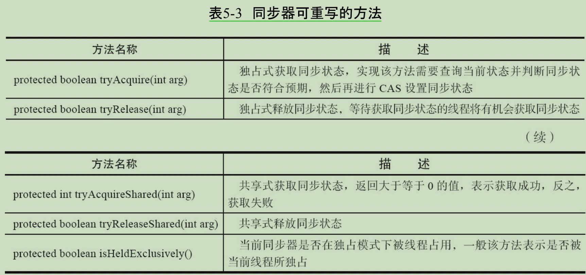

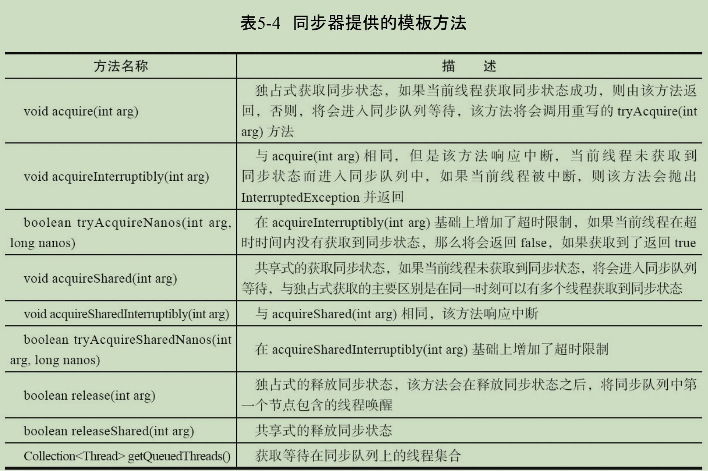

同步器提供的模板方法基本分为3类：

1.独占式获取和释放同步状态

2.共享式获取和释放同步状态

3.查询同步队列中的等待线程情况

实现一个独占锁的示例：

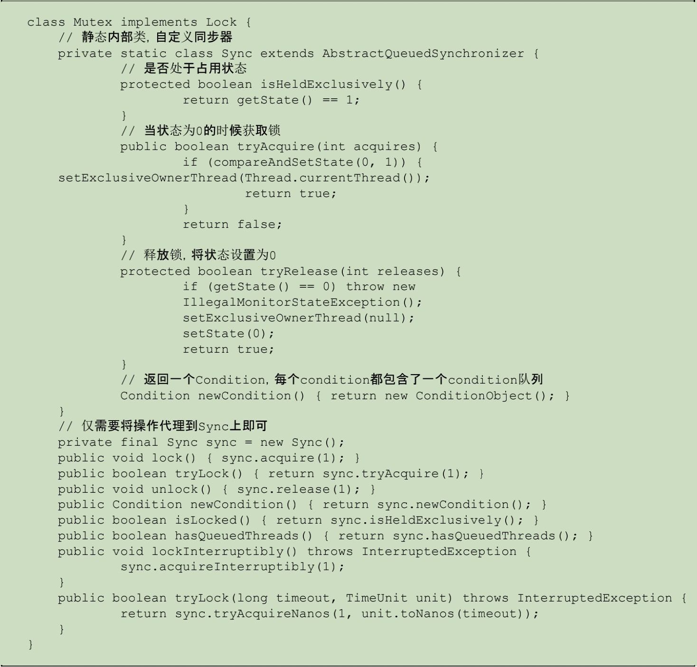

AQS实现原理分析

**1.同步队列**
：同步器依赖内部的同步队列（一个FIFO双向队列）来完成同步状态的管理，当前线程获取同步状态失败时，同步器会将当前线程以及等待状态等信息构造成为一个节点（Node）并将其加入同步队列，同时会阻塞当前线程，当同步状态释放时，会把首节点中的线程唤醒，使其再次尝试获取同步状态。

**2.node属性介绍**

节点是构成同步队列的基础，同步器拥有首节点（head）和尾节点（tail），没有成功获取同步状态的线程将会成为节点加入该队列的尾部。这个加入尾部的过程要是线程安全的，因此，AQS提供了CAS设置尾节点的方法compareAndSetTail(
Node expect,Nodeupdate)

同步队列遵循FIFO，首节点是获取同步状态成功的节点，首节点的线程在释放同步状态时，将会唤醒后继节点，而后继节点将会**在获取同步状态成功时将自己设置为首节点**
。由于只有一个线程能获得同步状态，所以没有线程安全问题，只需要头结点指向原头结点的后继结点，然后原头结点的next断开即可。

**3.独占式同步状态的获取与释放**

**acquire方法：**

public final void acquire(int arg) {

 if (!tryAcquire(arg) && acquireQueued(addWaiter(Node.*EXCLUSIVE*), arg))

​        *selfInterrupt*();

}

其主要逻辑是：

首先调用自定义同步器实现的tryAcquire(int arg)方法，该方法保证线程安全的获取同步状态

如果同步状态获取失败，则构造同步节点（独占式Node.EXCLUSIVE，同一时刻只能有一个线程成功获取同步状态）并通过addWaiter(Node node)方法将该节点死循环CAS的加入到同步队列的尾部

最后调用acquireQueued(Node node,int arg)方法，使得该节点以“死循环”的方式获取同步状态。如果获取不到则阻塞节点中的线程，而被阻塞线程的唤醒主要依靠前驱节点的出队或阻塞线程被中断来实现。

在enq(final Node node)方法中，同步器通过“死循环”来保证节点的正确添加，在“死循环”中只有通过CAS将节点设置成为尾节点之后，当前线程才能从该方法返回，否则，当前线程不断地尝试设置。可以看出，enq(final Node
node)方法将并发添加节点的请求通过CAS变得“串行化”了。

private Node addWaiter(Node mode) {

 Node node = new Node(Thread.*currentThread*(), mode);

 // Try the fast path of enq; backup to full enq on failure

 Node pred = tail;

 if (pred != null) {

 node.prev = pred;

 if (compareAndSetTail(pred, node)) {

 pred.next = node;

 return node;

 }

 }

 enq(node);

 return node;

}

private Node enq(final Node node) {

 for (;;) {

 Node t = tail;

 if (t == null) { // Must initialize

 if (compareAndSetHead(new Node()))

 tail = head;

 } else {

 node.prev = t;

 if (compareAndSetTail(t, node)) {

 t.next = node;

 return t;

 }

 }

 }

}

节点进入同步队列之后，就进入了一个自旋的过程，每个节点（或者说**每个线程）都在自省地观察**，当条件满足，获取到了同步状态，就可以从这个自旋过程中退出，否则依旧留在这个自旋过程中（**并会阻塞节点的线程**）。当(**
线程被中断/前驱结点被释放**)同步状态获取成功之后，当前线程从acquire(int arg)方法返回，如果对于锁这种并发组件而言，代表着当前线程获取了锁。

final boolean acquireQueued(final Node node, int arg) {

 boolean failed = true;

 try {

 boolean interrupted = false;

 for (;;) {

 final Node p = node.predecessor();

 if (p == head && tryAcquire(arg)) { //只有前驱节点是头节点才能够尝试获取同步状态，其他的只能一直自旋

 setHead(node);

 p.next = null; // help GC

 failed = false;

 return interrupted;

 }

 if (*shouldParkAfterFailedAcquire*(p, node) &&。//阻塞线程，当中断/前驱结点释放时，则返回再次进入CAS

 parkAndCheckInterrupt())

 interrupted = true;

 }

 } finally {

 if (failed)

 cancelAcquire(node);

 }

}

**release方法：**

public final boolean release(int arg) {

 if (tryRelease(arg)) {

 Node h = head;

 if (h != null && h.waitStatus != 0)

 unparkSuccessor(h); //唤醒头结点的后继结点

 return true;

 }

 return false;

}

**
独占式同步状态获取和释放总结：在获取同步状态时，同步器维护一个同步队列，获取状态失败的线程都会被加入到队列中并在队列中进行自旋（阻塞在CAS中，中断/前驱结点释放时再次循环CAS）；移出队列（或停止自旋）的条件是前驱节点为头节点并且释放且成功获取了同步状态。在释放同步状态时，同步器调用tryRelease(
int arg)方法释放同步状态，然后唤醒头节点的后继节点。**

**3.共享式同步状态的获取与释放**

共享式获取与独占式获取最主要的区别在于同一时刻能否有多个线程同时获取到同步状态。

**acquireShared**

public final void acquireShared(int arg) {

 if (tryAcquireShared(arg) < 0) //返回>=0代表可以获得同步状态

 doAcquireShared(arg);

}

private void doAcquireShared(int arg) {

 final Node node = addWaiter(Node.*SHARED*);

 boolean failed = true;

 try {

 boolean interrupted = false;

 //自旋，判断前结点是否头结点，并尝试获取同步状态，>=0代表可以获得，则返回，否则阻塞在这里，中断/前驱结点释放时再次循环CAS

 for (;;) {

 final Node p = node.predecessor();

 if (p == head) {

 int r = tryAcquireShared(arg);

 if (r >= 0) {

 setHeadAndPropagate(node, r);//有并发安全问题，内部用到CAS

 p.next = null; // help GC

 if (interrupted)

​                        *selfInterrupt*();

 failed = false;

 return;

 }

 }

 if (*shouldParkAfterFailedAcquire*(p, node) &&

 parkAndCheckInterrupt())

 interrupted = true;

 }

 } finally {

 if (failed)

 cancelAcquire(node);

 }

}

**releaseShard**

它和独占式主要区别在于tryReleaseShared(int arg)方法必须确保同步状态（或者资源数）线程安全释放，一般是通过循环和CAS来保证的，因为释放同步状态的操作会同时来自多个线程。

public final boolean releaseShared(int arg) {

 if (tryReleaseShared(arg)) {

 doReleaseShared();

 return true;

 }

 return false;

}

private void doReleaseShared() {

 for (;;) {

 Node h = head;

 if (h != null && h != tail) {

 int ws = h.waitStatus;

 if (ws == Node.*SIGNAL*) {

 if (!*compareAndSetWaitStatus*(h, Node.*SIGNAL*, 0))//使用CAS保证同步状态安全释放

 continue; // loop to recheck cases

 unparkSuccessor(h);//唤醒后继结点

 }

 else if (ws == 0 &&

​                     !*compareAndSetWaitStatus*(h, 0, Node.*PROPAGATE*))

 continue; // loop on failed CAS

 }

 if (h == head)                   // loop if head changed

 break;

 }

}

**4.重入锁**

它表示该锁能够支持一个线程对资源的重复加锁，分公平锁和非公平锁。公平性锁保证了锁的获取按照FIFO原则，而代价是进行大量的线程切换。非公平性锁虽然可能造成线程“饥饿”，但极少的线程切换，保证了其更大的吞吐量。

Synchronied关键字隐式的支持重进入，而ReentrantLock虽然不像sync关键字一样支持隐式的重进入，但是在调用lock()方法时，已经获取到锁的线程，能够再次调用lock()方法获取锁而不被阻塞。

ReentrantLock是通过组合自定义同步器来实现锁的获取与释放。

可以通过ReentrantLock的构造函数传入true和false来实现公平锁和非公平锁【默认为非公平】

内部定义了Sync并且定义了两个子类，NonfairSync[非公平]和fairSync 公平

对于公平锁和非公平锁在尝试获取同步状态和释放同步状态时不同见下列红色注释。

final boolean nonfairTryAcquire(int acquires) {

 final Thread current = Thread.*currentThread*();

 int c = getState();

 //c == 0表示为初始状态

 if (c == 0) {

 if (compareAndSetState(0, acquires)) {

 setExclusiveOwnerThread(current);

 return true;

 }

 }

 //判断当前线程是否会获取的线程，如果是，

 //则将同步状态值进行增加并返回true，表示获取同步状态成功

 else if (current == getExclusiveOwnerThread()) {

 int nextc = c + acquires;

 if (nextc < 0) // overflow

 throw new Error("Maximum lock count exceeded");

 setState(nextc);

 return true;

 }

 return false;

}

protected final boolean tryRelease(int releases) {

 //如果该锁被获取了n次，那么前(n-1)次的tryRelease()必须返回false

//只有同步状态完全释放了，才能返回true,可以看到，该方法将同步状态是否为0

//作为最终释放的条件，当同步状态为0时，将占有线程设置为null,并返回true,表示释放成功

 int c = getState() - releases;

 if (Thread.*currentThread*() != getExclusiveOwnerThread())

 throw new IllegalMonitorStateException();

 boolean free = false;

 if (c == 0) {

 free = true;

 setExclusiveOwnerThread(null);

 }

 setState(c);

 return free;

}

protected final boolean tryAcquire(int acquires) {

 final Thread current = Thread.*currentThread*();

 int c = getState();

 if (c == 0) {

//公平锁获取同步状态的时候，加入了同步队列中当前节点是否有前驱节点的判断，

//如果该方法返回true,则表示有线程毕当前线程更早的请求获取锁，

//因此需要等待前驱线程获取并释放锁之后才能继续获取锁

 if (!hasQueuedPredecessors() && //判断有没有前驱结点

 compareAndSetState(0, acquires)) {

 setExclusiveOwnerThread(current);

 return true;

 }

 }

 //判断当前线程是否会获取的线程，如果是，

 //则将同步状态值进行增加并返回true，表示获取同步状态成功

 else if (current == getExclusiveOwnerThread()) {

 int nextc = c + acquires;

 if (nextc < 0)

 throw new Error("Maximum lock count exceeded");

 setState(nextc);

 return true;

 }

 return false;

}

**5.读写锁设计**

读写锁内部定义两个类ReadLock和WritedLock，获取读写锁时就是获取这两个类的对象，通过分离读锁和写锁，使得并发性相比一般的排他锁有了很大

的提升。

先看写锁调用lock时，实际是调用同步器AQS的模版方法sync.acquire(1);

而在这个模版方法中，首先调用AQS实现类的tryAcquire方法，这个方法会获得同步状态值，如果同步状态不为0，并且（有读操作或者当前线程不是拥有锁的线程）则返回false。否则CAS设置同步状态+1，失败也返回false。成功返回true。

如果上面返回false，则将线程和状态封装成一个结点加入同步队列末尾，并循环检查前驱结点是不是头结点，是则tryAcquire获取同步状态。不是头结点则会调用LockSupport.park阻塞当前线程，当前驱结点LockSupport.unpark这个线程或者中断后继续循环

写锁调用unlock时，实际是调用同步器AQS的模版方法sync.release(1);

而在这个模版方法中，首先调用AQS实现类的tryRelease方法，这个方法会获先看下当前线程是不是持有锁的线程，不是就抛异常，然后设置同步状态-1。这里释放锁没有线程安全问题哟。如果同步状态!
=0，则返回false，如果=0则LockSupport.unpark后继结点，然后返回true

读锁调用lock时，实际是调用同步器AQS的模版方法sync.acquireShard(1)
;而在这个模版方法中，首先调用AQS实现类的tryAcquireShard方法，这个方法会获得同步状态值，如果有写锁并且不是当前线程，则返回-1，即获取同步状态失败。否则获取成功则会对同步状态做增加操作（这个增加操作有点复杂，没看明白。。。）

获取失败后会将线程和状态封装成一个结点加入同步队列末尾，并循环检查前驱结点是不是头结点，是则tryAcquireShard获取同步状态。不是头结点则会调用LockSupport.park阻塞当前线程，当前驱结点LockSupport.unpark这个线程或者中断后继续循环

读锁调用unlock时，实际是调用同步器AQS的模版方法sync.releaseShard(1);

而在这个模版方法中，首先调用AQS实现类的tryReleaseShard方法，这个方法会自旋的CAS的对同步状态做减操作然后LockSupport.unpark后继结点。

读写锁的详细分析可以看这里，注意看下总结部分**：**<https://www.cnblogs.com/xiaoxi/p/9140541.html>

读写锁的同步状态上需要维护读/写状态，所以需要用到按位切割。高16位代表读，低16位代表写

写锁的获取：如果存在读锁，则写锁不能被获取，原因在于：读写锁要确保写锁的操作对读锁可见，如果允许读锁在已被获取的情况下对写锁的获取，那么正在运行的其他读线程就无法感知到当前写线程的操作。因此，只有等待其他读线程都释放了读锁，写锁才能被当前线程获取，而写锁一旦被获取，则其他读写线程的后续访问均被阻塞。

final boolean tryWriteLock() {

 Thread current = Thread.*currentThread*();

 int c = getState();

 if (c != 0) {

 int w = *exclusiveCount*(c);

 if (w == 0 || current != getExclusiveOwnerThread())

 return false;

 if (w == *MAX_COUNT*)

 throw new Error("Maximum lock count exceeded");

 }

 if (!compareAndSetState(c, c + 1))

 return false;

 setExclusiveOwnerThread(current);

 return true;

}

写锁的释放与ReentrantLock的释放过程基本类似，每次释放均减少写状态，当写状态为0时表示写锁已被释放，从而等待的读写线程能够继续访问读写锁，同时前次写线程的修改对后续读写线程可见。

读锁的获取：在tryAcquireShared(int unused)
方法中，如果其他线程已经获取了写锁，则当前线程获取读锁失败，进入等待状态。如果当前线程获取了写锁或者写锁未被获取，则当前线程（线程安全，依靠CAS保证）增加读状态，成功获取读锁。

protected final int tryAcquireShared(int unused) {

 Thread current = Thread.*currentThread*();

 int c = getState();

 if (*exclusiveCount*(c) != 0 &&

 getExclusiveOwnerThread() != current)

 return -1;

 int r = *sharedCount*(c);

 if (!readerShouldBlock() &&

 r < *MAX_COUNT* &&

 compareAndSetState(c, c + *SHARED_UNIT*)) {

 if (r == 0) {

 firstReader = current;

 firstReaderHoldCount = 1;

 } else if (firstReader == current) {

 firstReaderHoldCount++;

 } else {

 HoldCounter rh = cachedHoldCounter;

 if (rh == null || rh.tid != *getThreadId*(current))

 cachedHoldCounter = rh = readHolds.get();

 else if (rh.count == 0)

 readHolds.set(rh);

 rh.count++;

 }

 return 1;

 }

 return fullTryAcquireShared(current);

}

**读写锁支持锁降级：**

**指的是写锁降级成为读锁。锁降级是指把持住（当前拥有的）写锁，再获取到读锁，随后释放（先前拥有的）写锁的过程。**

# LockSupport

在AQS中当需要阻塞或唤醒一个线程的时候，都会使用LockSupport工具类来完成相应工作。LockSupport定义了一组的公共静态方法，这些方法提供了最基本的线程阻塞和唤醒功能，而LockSupport也成为构建同步组件的基础工具

**方法：**

LockSupport增加了park(Object blocker)、parkNanos(Object blocker,long nanos)和parkUntil(Object blocker,long deadline)
3个方法，用于实现阻塞当前线程的功能，其中参数blocker是用来标识当前线程在等待的对象（以下称为阻塞对象），该对象主要用于问题排查和系统监控。

# Condition

任意一个java对象，都拥有一组监视器方法，主要包括wait(),wait(long timeout),notify(),notifyAll()方法，这些方法与synchronized

同步关键字配合，可以实现等待/通知模式，Condition接口也提供给了类似Object的监视器方法，与Lock配合可以实现等待/通知模式。

可响应中断

jvm层面：synchronized wait notify notifyAll

Java层面：lock condition await signal

应用：

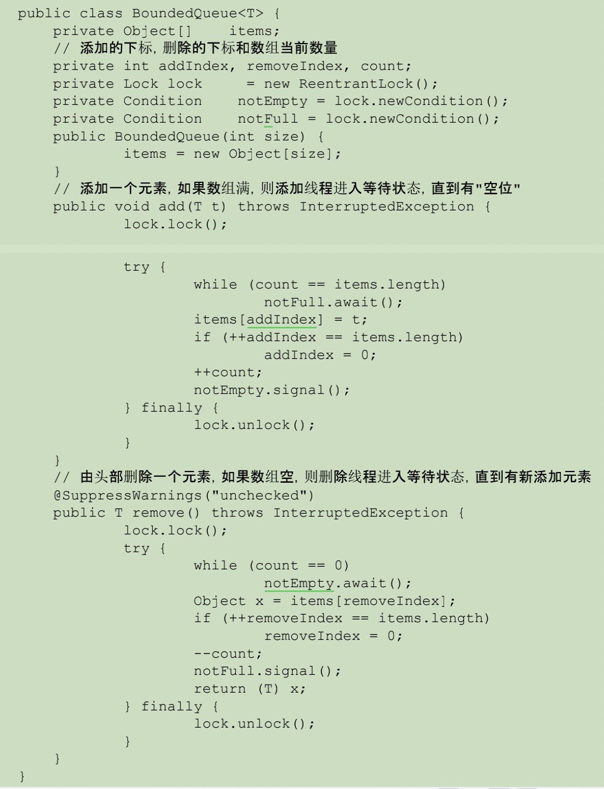

实现分析：

1.等待队列

等待队列是一个FIFO的队列，在队列中的每个节点都包含了一个线程引用，该线程就是在Condition对象上等待的线程，如果一个线程调用了Condition.await()方法，那么该线程将会**释放锁**
、构造成节点加入等待队列并进入等待状态。事实上，节点的定义复用了同步器中节点的定义，也就是说，同步队列和等待队列中节点类型都是同步器的静态内部类AbstractQueuedSynchronizer.Node。一个Condition包含一个等待队列，Condition拥有首节点（firstWaiter）和尾节点（lastWaiter）。当前线程调用Condition.await()
方法，将会以当前线程构造节点，并将节点从**尾部加入**等待队列。

新增节点只需要将原有的尾节点nextWaiter指向它，并且更新尾节点即可。上述节点引用更新的过程并**没有使用CAS保证**，原因在于**调用await()方法的线程必定是获取了锁的线程**，也就是说该过程是由锁来保证线程安全的。

在Object的监视器模型上，一个对象拥有一个同步队列和等待队列，而在并发包中的Lock(更确切的说是同步器),拥有一个同步队列和多个等待队列。

如果从队列（同步队列和等待队列）的角度看await()方法，当调用await()方法时，相当于同步队列的首节点（获取了锁的节点）移动到Condition的等待队列中

2.等待

调用该方法的线程成功获取了锁的线程，也就是同步队列中的首节点，该方法会将当前线程构造成节点并加入等待队列中，然后释放同步状态，唤醒同步队列中的后继节点，然后当前线程会进入等待状态。当等待队列中的节点被唤醒，则唤醒节点的线程开始尝试获取同步状态。如果不是通其他线程调用Condition.signal()
方法唤醒，而是对等待线程进行中断，则会抛出InterruptedException。

public final void await() throws InterruptedException {

 if (Thread.*interrupted*())

 throw new InterruptedException();

 Node node = addConditionWaiter();//作为新建结点加入等待队列

 int savedState = fullyRelease(node);//释放同步状态，并唤醒同步队列头结点

 int interruptMode = 0;

 while (!isOnSyncQueue(node)) {

 LockSupport.*park*(this);

 if ((interruptMode = checkInterruptWhileWaiting(node)) != 0)

 break;

 }

 if (acquireQueued(node, savedState) && interruptMode != *THROW_IE*)//被唤醒推出循环后，尝试获取同步状态

 interruptMode = *REINTERRUPT*;

 if (node.nextWaiter != null) // clean up if cancelled

 unlinkCancelledWaiters();

 if (interruptMode != 0)

 reportInterruptAfterWait(interruptMode);

}

调用该方法的前置条件是当前线程必须获取了锁，可以看到signal()方法进行了isHeldExclusively()检查，也就是当前线程必须是获取了锁的线程。接着获取等待队列的首节点，将其移动到同步队列(移动过程使用CAS保证线程安全)
并使用LockSupport唤醒节点中的线程。

public final void signal() {

 //检查当前线程是否是获取了锁的线程

 if (!isHeldExclusively())

 throw new IllegalMonitorStateException();

 Node first = firstWaiter;

 if (first != null)

 doSignal(first);

}

**ConcurrentLinkedQueue**

并编程中，一般需要用到安全的队列，如果要自己实现安全队列，可以使用2种方式：

方式1：加锁，这种实现方式就是我们常说的阻塞队列。

方式2：使用循环CAS算法实现，这种方式实现队列称之为非阻塞队列。

ConcurrentLinkedQueue按照先进先出原则对元素进行排序。新元素从队列尾部插入，而获取队列元素，则需要从队列头部获取。ConcurrentLinkedQueue内部持有2个节点：head头结点，负责出列，
tail尾节点，负责入列。而元素节点Node，使用item存储入列元素，next指向下一个元素节点。

ConcurrentLinkedQueue使用约定：

1:不允许null入列

2:在入队的最后一个元素的next为null

3:队列中所有未删除的节点的item都不能为null且都能从head节点遍历到

4:删除节点是将item设置为null, 队列迭代时跳过item为null节点

5:head节点跟tail不一定指向头节点或尾节点，可能存在滞后性

入队列

入队操作主要做两件事情，第一是将入队节点设置成当前队列尾节点的下一个节点。第二是更新tail节点，如果tail节点的next节点不为空，则将入队节点设置成tail节点，如果tail节点的next节点为空，则将入队节点设置成tail的next节点，所以tail节点不总是尾节点，理解这一点很重要。

public boolean offer(E e) {

 checkNotNull(e); //为空判断，e为null是抛异常

 final Node<E> newNode = new Node<E>(e); //将e包装成newNode

 for (Node<E> t = tail, p = t;;) { //循环cas，直至加入成功，p用来指向最后一个结点，tail并不一定指向最后一个结点

 //t = p = tail

 Node<E> q = p.next;

 if (q == null) { //判断p是否为尾节点

 //如果是，p.next = newNode

 if (p.casNext(null, newNode)) {

 //首次添加时，p 等于t，不进行尾节点更新，所以所尾节点存在滞后性

 //并发环境，可能存添加/删除，tail就更难保证正确指向最后节点。

 if (p != t)

 //更新尾节点为最新元素

 casTail(t, newNode);

 return true;

 }

 }

 else if (p == q)

 //当tail不执行最后节点时，如果执行出列操作，很有可能将tail也给移除了

 //此时需要对tail节点进行复位，复位到head节点

 p = (t != (t = tail)) ? t : head;

 else

 //推动tail尾节点往队尾移动

 p = (p != t && t != (t = tail)) ? t : q; //p的下一个结点不为空，并且p和t相等，则p像前走，然后再次进入循环

 }

 }

ConcurrentLinkedQueue是怎么保证线程安全的？

1：是一个死循环，就是不停使用cas判断直到添加元素入队成功。

2：2个cas判断方法

p.casNext(null, newNode) 确保队列在入列时是原子操作

casTail(t, newNode); 确保tail队尾在移动改变时是原子操作

而在并发环境，ConcurrentLinkedQueue入列线程安全考虑具体可分2类：

1>线程1线程2同时入列

这个好理解， 线程1，线程2不管在offer哪个位置开始并发，他们最终的目的都是入列，也即都需要执行casNext方法，
我们只需要确保所有线程都有机会执行casNext方法，并且保证casNext方法是原子操作即可。casNext失败的线程，可以进入下一轮循环，人品好的话就可以入列，衰的话继续循环

2>线程1遍历，线程2入列

ConcurrentLinkedQueue 遍历是线程不安全的， 线程1遍历，线程2很有可能进行入列出列操作， 所以ConcurrentLinkedQueue
的size是变化。换句话说，要想安全遍历ConcurrentLinkedQueue 队列，必须额外加锁。

但换一个角度想， ConcurrentLinkedQueue 的设计初衷非阻塞队列，我们更多关注入列与出列线程安全，这2点能保证就可以啦。

总结

1>入列出列线程安全，遍历不安全

2>不允许添加null元素

3>底层使用链表与cas算法包装入列出列安全

出队列

并不是每次出队时都更新head节点，当head节点里有元素时，直接弹出head节点里的元素，而不会更新head节点。只有当head节点里没有元素时，出队操作才会更新head节点。采用这种方式也是为了减少使用CAS更新head节点的消耗，从而提高出队效率。让我们再通过源码来深入分析下出队过程。

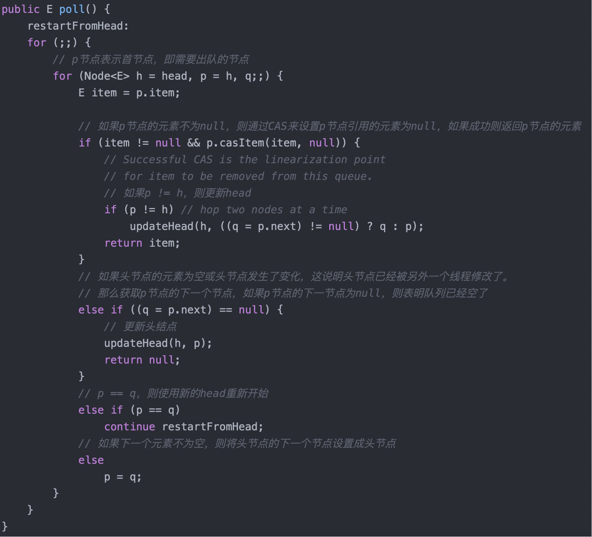

在JDK 1.7的实现中，doug lea使用hops变量来控制并减少tail节点的更新频率，并不是每次节点入队后都将
tail节点更新成尾节点，而是当tail节点和尾节点的距离大于等于常量HOPS的值（默认等于1）时才更新tail节点，tail和尾节点的距离越长使用CAS更新tail节点的次数就会越少，但是距离越长带来的负面效果就是每次入队时定位尾节点的时间就越长，因为循环体需要多循环一次来定位出尾节点，但是这样仍然能提高入队的效率，因为从本质上来看它通过增加对volatile变量的读操作来减少了对volatile变量的写操作，而对volatile变量的写操作开销要远远大于读操作，所以入队效率会有所提升。

在JDK 1.8的实现中，tail的更新时机是通过p和t是否相等来判断的，其实现结果和JDK 1.7相同，即当tail节点和尾节点的距离大于等于1时，更新tail。

原文参考：<https://blog.csdn.net/qq_38293564/article/details/80798310>

# Java中阻塞队列

抛出异常：当队列满时，如果再往队列里插入元素，会抛出IllegalStateException（"Queuefull"）异常。当队列空时，从队列里获取元素会抛出NoSuchElementException异常。

返回特殊值：当往队列插入元素时，会返回元素是否插入成功，成功返回true。如果是移除方法，则是从队列里取出一个元素，如果没有则返回null。

一直阻塞：当阻塞队列满时，如果生产者线程往队列里put元素，队列会一直阻塞生产者线程，直到队列可用或者响应中断退出。当队列空时，如果消费者线程从队列里take元素，队列会阻塞住消费者线程，直到队列不为空。

**JDK 7提供了7个阻塞队列**，如下。

ArrayBlockingQueue：一个由数组结构组成的有界阻塞队列。

 默认情况下**不保证线程公平**的访问队列，所谓公平访问队列是指阻塞的线程，可以按照阻塞的先后顺序访问队列，即先阻塞线程先访问队列。非 公平性是对先等待的线程是非公平的，**当队列可用时，阻塞的线程都可以争夺访问队列的资格**
，有可能先阻塞的线程最后才访问队列。为了保证公平性，通常会降低吞吐量。我们可以使用以下代码创建一个公平的阻塞队列。

LinkedBlockingQueue：一个由链表结构组成的有界阻塞队列。

PriorityBlockingQueue：一个支持优先级排序的**无界**阻塞队列。

DelayQueue：一个使用优先级队列实现的无界阻塞队列。

 使用PriorityQueue来实现。队列中元素必须实现Delayed接口。创建元素时可以指定多久后才能获取这个元素

SynchronousQueue：一个不存储元素的阻塞队列。

 SynchronousQueue是一个不存储元素的阻塞队列。每一个put操作必须等待一个take操作，否则不能继续添加元素。

LinkedTransferQueue：一个由链表结构组成的无界阻塞队列。

LinkedBlockingDeque：一个由链表结构组成的双向阻塞队列。

 双向队列因为多了一个操作队列的入口，在多线程同时入队时，也就减少了一半的竞争。相比其他的阻塞队列，LinkedBlockingDeque多了
addFirst、addLast、offerFirst、offerLast、peekFirst和peekLast等方法

对比：<https://www.cnblogs.com/brant/p/12817964.html>

**阻塞队列的原理**

public ArrayBlockingQueue(int capacity, boolean fair) {

 if (capacity <= 0)

 throw new IllegalArgumentException();

 this.items = new Object[capacity];

 lock = new ReentrantLock(fair);

 notEmpty = lock.newCondition();

 notFull = lock.newCondition();

}

public void put(E e) throws InterruptedException {

​    *checkNotNull*(e);

 final ReentrantLock lock = this.lock;

 lock.lockInterruptibly();

 try {

 while (count == items.length)

 notFull.await();

 enqueue(e);

 } finally {

 lock.unlock();

 }

}

private void enqueue(E x) {

 // assert lock.getHoldCount() == 1;

 // assert items[putIndex] == null;

 final Object[] items = this.items;

 items[putIndex] = x;

 if (++putIndex == items.length)

 putIndex = 0;

 count++;

 notEmpty.signal();

}

public E take() throws InterruptedException {

 final ReentrantLock lock = this.lock;

 lock.lockInterruptibly();

 try {

 while (count == 0)

 notEmpty.await();

 return dequeue();

 } finally {

 lock.unlock();

 }

}

private E dequeue() {

 // assert lock.getHoldCount() == 1;

 // assert items[takeIndex] != null;

 final Object[] items = this.items;

 @SuppressWarnings("unchecked")

 E x = (E) items[takeIndex];

 items[takeIndex] = null;

 if (++takeIndex == items.length)

 takeIndex = 0;

 count--;

 if (itrs != null)

 itrs.elementDequeued();

 notFull.signal();

 return x;

}

当往队列里插入一个元素时，如果队列不可用，那么阻塞生产者主要通过LockSupport.park（this）来实现。继续进入源码，发现调用setBlocker先保存一下将要阻塞的线程，然后调用unsafe.park阻塞当前线程。park这个方法会阻塞当前线程，只有以下4种情况中的一种发生时，该方法才会返回。中断/到超时时间了/unpark/未知异常

public final void await() throws InterruptedException {

 if (Thread.*interrupted*())

 throw new InterruptedException();

 Node node = addConditionWaiter();

 int savedState = fullyRelease(node);

 int interruptMode = 0;

 while (!isOnSyncQueue(node)) {

 LockSupport.*park*(this);

 if ((interruptMode = checkInterruptWhileWaiting(node)) != 0)

 break;

 }

 if (acquireQueued(node, savedState) && interruptMode != *THROW_IE*)

 interruptMode = *REINTERRUPT*;

 if (node.nextWaiter != null) // clean up if cancelled

 unlinkCancelledWaiters();

 if (interruptMode != 0)

 reportInterruptAfterWait(interruptMode);

}

public static void park(Object blocker) {

 Thread t = Thread.*currentThread*();

​    *setBlocker*(t, blocker);

​    *UNSAFE*.park(false, 0L);

​    *setBlocker*(t, null);

}

**Fork/Join框架**

一个用于并行执行任务的框架，是一个把大任务分割成若干个小任务，最终汇总每个小任务结果后得到大任务结果的框架。

工作窃取（work-stealing）算法是指某个线程从其他队列里窃取任务来执行。那么，为什么需要使用工作窃取算法呢？假如我们需要做一个比较大的任务，可以把这个任务分割为若干互不依赖的子任务，为了减少线程间的竞争，把这些子任务分别放到不同的队列里，并为每个队列创建一个单独的线程来执行队列里的任务，线程和队列一一对应。比如A线程负责处理A队列里的任务。但是，有的线程会先把自己队列里的任务干完，而其他线程对应的队列里还有任务等待处理。干完活的线程与其等着，不如去帮其他线程干活，于是它就去其他线程的队列里窃取一个任务来执行。而在这时它们会访问同一个队列，所以为了减少窃取任务线程和被窃取任务线程之间的竞争，通常会使用双端队列，被窃取任务线程永远从双端队列的头部拿任务执行，而窃取任务的线程永远从双端队列的尾部拿任务执行。

有点：并行计算，也减少了竞争

工作窃取算法的缺点：在某些情况下还是存在竞争，比如双端队列里只有一个任务时。并且该算法会消耗了更多的系统资源，比如创建多个线程和多个双端队列。

Fork/Join框架提供了以下两个子类。·RecursiveAction：用于没有返回结果的任务。·RecursiveTask：用于有返回结果的任务。

**使用实例**：计算1+2+3+4，步长2

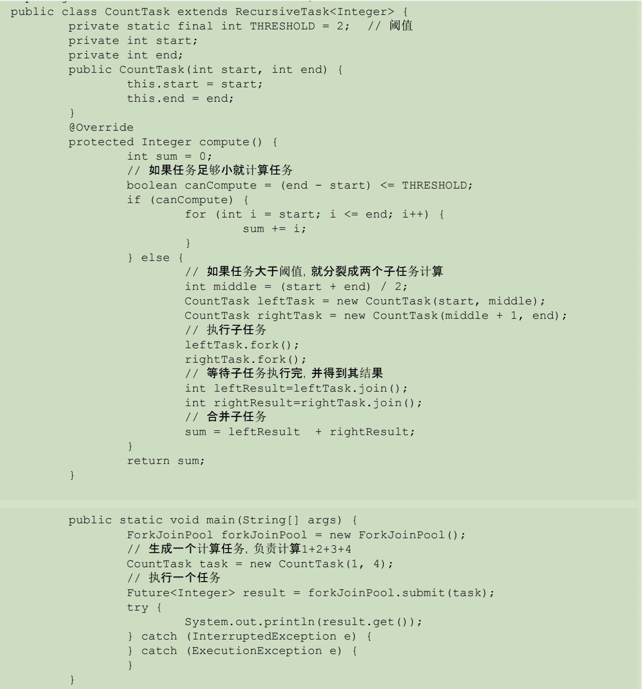

**实现原理**

//当我们调用ForkJoinTask的fork方法时，程序会调用ForkJoinWorkerThread的push方法异步地执行这个任务，然后立即返回结果。代码如下。

public final ForkJoinTask<V> fork() {

 Thread t;

 if ((t = Thread.*currentThread*()) instanceof ForkJoinWorkerThread)

​        ((ForkJoinWorkerThread)t).workQueue.push(this);

 else

 ForkJoinPool.*common*.externalPush(this);

 return this;

}

//push方法把当前任务存放在ForkJoinTask数组队列里。然后再调用ForkJoinPool的signalWork()方法唤醒或创建一个工作线程来执行任务。代码如下。

final void push(ForkJoinTask<?> task) {

 ForkJoinTask<?>[] a; ForkJoinPool p;

 int b = base, s = top, n;

 if ((a = array) != null) { // ignore if queue removed

 int m = a.length - 1; // fenced write for task visibility

​        *U*.putOrderedObject(a, ((m & s) << *ASHIFT*) + *ABASE*, task);

​        *U*.putOrderedInt(this, *QTOP*, s + 1);

 if ((n = s - b) <= 1) {

 if ((p = pool) != null)

 p.signalWork(p.workQueues, this);

 }

 else if (n >= m)

 growArray();

 }

}

**join的作用是阻塞当前线程并等待获取结果**

首先，它调用了doJoin()方法，通过doJoin()
方法得到当前任务的状态来判断返回什么结果，任务状态有4种：已完成（NORMAL）、被取消（CANCELLED）、信号（SIGNAL）和出现异常（EXCEPTIONAL）。如果任务状态是已完成，则直接返回任务结果。如果任务状态是被取消，则直接抛出CancellationException。如果任务状态是抛出异常，则直接抛出对应的异常。

在doJoin()
方法里，首先通过查看任务的状态，看任务是否已经执行完成，如果执行完成，则直接返回任务状态；如果没有执行完，则从任务数组里取出任务并执行。如果任务顺利执行完成，则设置任务状态为NORMAL，如果出现异常，则记录异常，并将任务状态设置为EXCEPTIONAL。

public final V join() {

 int s;

 if ((s = doJoin() & *DONE_MASK*) != *NORMAL*)

 reportException(s);

 return getRawResult();

}

private int doJoin() {

 int s; Thread t; ForkJoinWorkerThread wt; ForkJoinPool.WorkQueue w;

 return (s = status) < 0 ? s :

​        ((t = Thread.*currentThread*()) instanceof ForkJoinWorkerThread) ?

​        (w = (wt = (ForkJoinWorkerThread)t).workQueue).

 tryUnpush(this) && (s = doExec()) < 0 ? s :

 wt.pool.awaitJoin(w, this, 0L) :

 externalAwaitDone();

}

**原子类**

**使用原子的方式更新基本类型**，Atomic包提供了以下3个类。

AtomicBoolean：原子更新布尔类型。

AtomicInteger：原子更新整型。

AtomicLong：原子更新长整型。

源码中使用CAS做+1操作

**原子的方式更新数组，**

AtomicIntegerArray：原子更新整型数组里的元素。

AtomicLongArray：原子更新长整型数组里的元素。

AtomicReferenceArray：原子更新引用类型数组里的元素。

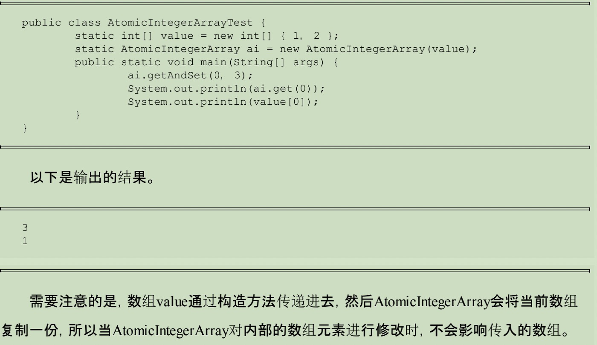

原子更新引用类型

AtomicReference：原子更新引用类型。·AtomicReferenceFieldUpdater：原子更新引用类型里的字段。·AtomicMarkableReference：原子更新带有标记位的引用类型。可以原子更新一个布尔类

原子地更新某个类里的某个字段

·AtomicIntegerFieldUpdater：原子更新整型的字段的更新器。·AtomicLongFieldUpdater：原子更新长整型字段的更新器。·AtomicStampedReference：原子更新带有版本号的引用类型。

要想原子地更新字段类需要两步。第一步，因为原子更新字段类都是抽象类，每次使用的时候必须使用静态方法newUpdater()创建一个更新器，并且需要设置想要更新的类和属性。第二步，更新类的字段（属性）必须使用public
volatile修饰符。

**CountDownLatch**

CountDownLatch允许一个或多个线程等待其他线程完成操作。

CountDownLatch的构造函数接收一个int类型的参数作为计数器，如果你想等待N个点完成，这里就传入N。当我们调用CountDownLatch的countDown方法时，N就会减1，CountDownLatch的await方会阻塞当前线程，直到N变成零。由于countDown方法可以用在任何地方，所以这里说的N个点，可以是N个线程，也可以是1个线程里的N个执行步骤。用在多个线程时，只需要把这个CountDownLatch的引用传递到线程里即可。

**CyclicBarrie**

CyclicBarrier的字面意思是可循环使用（Cyclic）的屏障（Barrier）。它要做的事情是，让一组线程到达一个屏障（也可以叫同步点）时被阻塞，直到最后一个线程到达屏障时，屏障才会开门，所有被屏障拦截的线程才会继续运行。

CyclicBarrier默认的构造方法是CyclicBarrier（int parties），其参数表示屏障拦截的线程数量，每个线程调用await方法告诉CyclicBarrier我已经到达了屏障，然后当前线程被阻塞

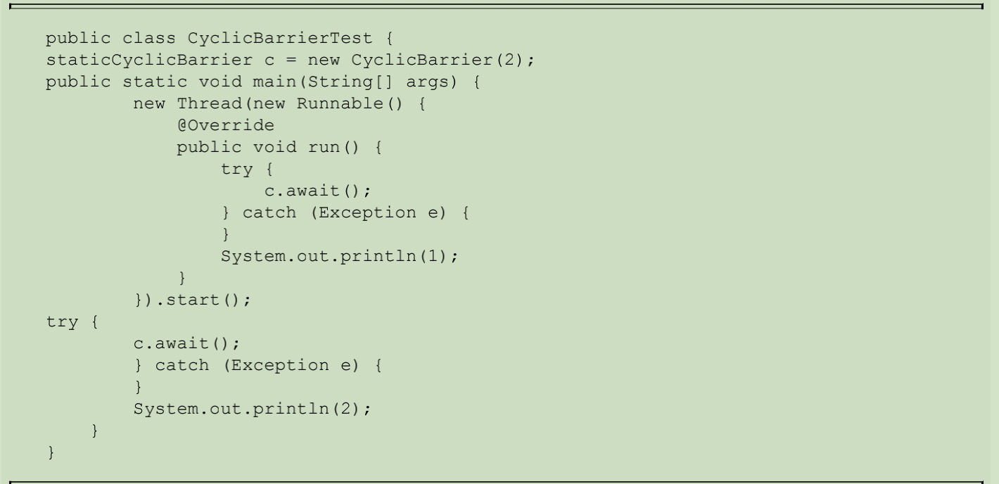

CyclicBarrier和CountDownLatch的区别

CountDownLatch的计数器只能使用一次，而CyclicBarrier的计数器可以使用reset()方法重置。所以CyclicBarrier能处理更为复杂的业务场景。例如，如果计算发生错误，可以重置计数器，并让线程重新执行一次。

Semaphore可可以用于做流量控制

使用实例

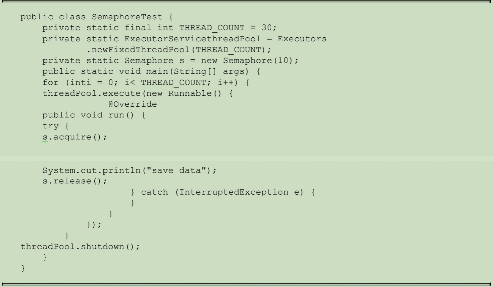

Semaphore还提供一些其他方法，具体如下。·intavailablePermits()：返回此信号量中当前可用的许可证数。·intgetQueueLength()
：返回正在等待获取许可证的线程数。·booleanhasQueuedThreads()：是否有线程正在等待获取许可证。·void reducePermits（int
reduction）：减少reduction个许可证，是个protected方法。·Collection getQueuedThreads()：返回所有等待获取许可证的线程集合，是个protected方法。

原理：<https://zhuanlan.zhihu.com/p/98593407>

Exchange

Exchanger（交换者）是一个用于线程间协作的工具类。Exchanger用于进行线程间的数据交换。它提供一个同步点，在这个同步点，两个线程可以交换彼此的数据。这两个线程通过exchange方法交换数据，如果第一个线程先执行exchange()
方法，它会一直等待第二个线程也执行exchange方法，当两个线程都到达同步点时，这两个线程就可以交换数据，将本线程生产出来的数据传递给对方

使用示例

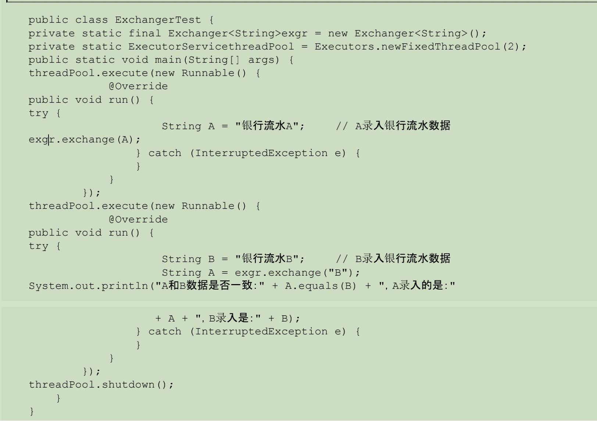

# 线程池(大头)

[线程池.md](../学习/E.Java并发/线程池.md)

# FutureTask

接口定义

boolean cancel(boolean mayInterruptInRunning) 取消一个任务，并返回取消结果。参数表示是否中断线程。

boolean isCancelled()                                        判断任务是否被取消

Boolean isDone()                                          判断当前任务是否执行完毕，包括正常执行完毕、执行异常或者任务取消。

V get()                                                            获取任务执行结果，任务结束之前会阻塞。

V get(long timeout, TimeUnit unit)                    在指定时间内尝试获取执行结果。若超时则抛出超时异常

FutureTask除了实现Future接口外，还实现了Runnable接口。因此，FutureTask可以交给 Executor执行，也可以由调用线程直接执行（FutureTask.run()）

当FutureTask处于未启动或已启动状态时，执行FutureTask.get()方法将导致调用线程阻塞

当FutureTask处于未启动状态时，执行FutureTask.cancel()方法将导致此任务永远不会被执 行；当FutureTask处于已启动状态时，执行FutureTask.cancel（true）方法将以中断执行此任务线程
的方式来试图停止任务

可以把FutureTask交给Executor执行；也可以通过ExecutorService.submit（…）方法返回一个 FutureTask

FutureTask的实现

volatile int state:表示对象状态，volatile关键字保证了内存可见性，state值变更的由CAS操作保证原子性。

而futureTask的阻塞则是通过主线程自旋+挂起park线程实现，任务线程执行完后唤醒主线程unpark

源码解析参考：<https://blog.csdn.net/liangwenmail/article/details/81477483>

# 常见问题

创建线程的方式

1.继承 Thread 类：定义一个类继承Thread，重写run方法，创建这个类的对象，调用start方法启动线程

2.实现 Runnable 接口：定义类实现Runnable接口，重写run方法，创建这个类的对象，以这个对象为target创建Thead对象，调用start方法启动线程

3.实现 Callable 接口：定义类实现Callable接口，重写call方法，创建这个类的对象，以这个对象为参数创建FutureTask对象，将FutureTask作为参数创建Thread对象，调用start方法启动线程

4.使用 Executors 工具类创建线程池

runnable 和 callable 有什么区别？

1）Runnable提供run方法，无法通过throws抛出异常，所有CheckedException必须在run方法内部处理。Callable提供call方法，直接抛出Exception异常。

2）Runnable的run方法无返回值，Callable的call方法提供返回值用来表示任务运行的结果

3）Runnable可以作为Thread构造器的参数，通过开启新的线程来执行，也可以通过线程池来执行。而Callable只能通过线程池执行

run()和 start()有什么区别？

start() 方法用于启动线程，调用后线程处于就绪状态。start() 方法只能调用一次

run()方法称为线程体，用于执行线程的运行时代码。调用start() 方法启动线程后，当分配到时间片后就会调用run()方法。如果直接调用run()，其实就相当于是调用了一个普通函数而已。run()方法必须等待run()
方法执行完毕才能执行后面的代码

**什么是 Callable 和 Future?**

Callable 接口类似于 Runnable，从名字就可以看出来了，但是 Runnable 不会返回结果，并且无法抛出返回结果的异常，而 Callable 功能更强大一些，被线程执行后，可以返回值，这个返回值可以被 Future
拿到，也就是说，Future 可以拿到异步执行任务的返回值。

Future 接口表示异步任务，是一个可能还没有完成的异步任务的结果。所以说 Callable用于产生结果，Future 用于获取结果。

**sleep() 和 wait() 有什么区别？**

两者都可以暂停线程的执行

类的不同：sleep() 是 Thread线程类的静态方法，wait() 是 Object类的方法。

是否释放锁：sleep() 不释放锁；wait() 释放锁。

用途不同：Wait 通常被用于线程间交互/通信，sleep 通常被用于暂停执行。

用法不同：wait() 方法被调用后，线程不会自动苏醒，需要别的线程调用同一个对象上的 notify() 或者 notifyAll() 方法。sleep() 方法执行完成后，线程会自动苏醒。或者可以使用wait(long timeout)
超时后线程会自动苏醒。

**你是如何调用 wait() 方法的？使用 if 块还是循环？为什么？**

处于等待状态的线程可能会收到错误警报和伪唤醒，如果不在循环中检查等待条件，程序就会在没有满足结束条件的情况下退出。

wait() 方法应该在循环调用，因为当线程获取到 CPU 开始执行的时候，其他条件可能还没有满足，所以在处理前，循环检测条件是否满足会更好。

**为什么线程通信的方法 wait(), notify()和 notifyAll()被定义在 Object 类里？**

Wait-notify机制是在获取对象锁的前提下不同线程间的通信机制，

JAVA提供的锁是对象级的而不是线程级的，每个对象都有对应的监视器锁，任意对象都可以当作锁来使用，而Object类是所有类的一个父类，**由于锁对象的任意性**，所以这些通信方法需要被定义在Object类里。

一个线程可以拥有多个对象锁，wait，notify，notifyAll跟对象锁之间是有一个绑定关系的，比如你用对象锁Object调用的wait()方法，那么你只能通过Object.notify()或者Object.notifyAll()
来唤醒这个线程，这样jvm很容易就知道应该从哪个对象锁的等待池中去唤醒线程，假如用Thread.wait()，Thread.notify()，Thread.notifyAll()来调用，虚拟机根本就不知道需要操作的对象锁是哪一个。

**如何停止一个正在运行的线程？**

在java中有以下3种方法可以终止正在运行的线程：

使用退出标志，使线程正常退出，也就是当run方法完成后线程终止。

使用stop方法强行终止，但是不推荐这个方法，因为stop和suspend及resume一样都是过期作废的方法。

使用interrupt方法中断线程。

**Java 中怎么获取一份线程 dump 文件？你如何在 Java 中获取线程堆栈？**

kill -3 [java pid]

不会在当前终端输出，它会输出到代码执行的或指定的地方去。比如，kill -3

tomcat pid, 输出堆栈到 log 目录下。

Jstack [java pid]

这个比较简单，在当前终端显示，也可以重定向到指定文件中。

-JvisualVM：Thread Dump

不做说明，打开 JvisualVM 后，都是界面操作，过程还是很简单的。

**为什么代码会重排序？**

在执行程序时，为了提供性能，处理器和编译器常常会对指令进行重排序，但是不能随意重排序，不是你想怎么排序就怎么排序，它需要满足以下两个条件：

在单线程环境下不能改变程序运行的结果；

存在数据依赖关系的不允许重排序

需要注意的是：重排序不会影响单线程环境的执行结果，但是会破坏多线程的执行语义。

as-if-serial规则和happens-before规则的区别

as-if-serial语义保证单线程内程序的执行结果不被改变，happens-before关系保证正确同步的多线程程序的执行结果不被改变。

as-if-serial语义给编写单线程程序的程序员创造了一个幻境：单线程程序是按程序的顺序来执行的。happens-before关系给编写正确同步的多线程程序的程序员创造了一个幻境：正确同步的多线程程序是按happens-before指定的顺序来执行的。

as-if-serial语义和happens-before这么做的目的，都是为了在不改变程序执行结果的前提下，尽可能地提高程序执行的并行度。

**什么是自旋**

很多 synchronized 里面的代码只是一些很简单的代码，执行时间非常快，此时等待的线程都加锁可能是一种不太值得的操作，因为线程阻塞涉及到用户态和内核态切换的问题。既然 synchronized
里面的代码执行得非常快，不妨让等待锁的线程不要被阻塞，而是在 synchronized 的边界做忙循环，这就是自旋。如果做了多次循环发现还没有获得锁，再阻塞，这样可能是一种更好的策略。

**多线程中 synchronized 锁升级的原理是什么？**

synchronized 锁升级原理：在锁对象的对象头里面有一个 threadid 字段，在第一次访问的时候 threadid 为空，jvm 让其持有偏向锁，并将 threadid 设置为其线程 id，再次进入的时候会先判断
threadid 是否与其线程 id
一致，如果一致则可以直接使用此对象，如果不一致，则升级偏向锁为轻量级锁，通过自旋循环一定次数来获取锁，执行一定次数之后，如果还没有正常获取到要使用的对象，此时就会把锁从轻量级升级为重量级锁，此过程就构成了 synchronized
锁的升级。

锁的升级的目的：锁升级是为了减低了锁带来的性能消耗。在 Java 6 之后优化 synchronized 的实现方式，使用了偏向锁升级为轻量级锁再升级到重量级锁的方式，从而减低了锁带来的性能消耗。

synchronized 和 volatile 的区别是什么？

synchronized 表示只有一个线程可以获取作用对象的锁，执行代码，阻塞其他线程。

volatile 表示变量在 CPU 的寄存器中是不确定的，必须从主存中读取。保证多线程环境下变量的可见性；禁止指令重排序。

区别

volatile 是变量修饰符；synchronized 可以修饰类、方法、变量。

volatile 仅能实现变量的修改可见性，不能保证原子性；而 synchronized 则可以保证变量的修改可见性和原子性。

volatile 不会造成线程的阻塞；synchronized 可能会造成线程的阻塞。

volatile标记的变量不会被编译器优化；synchronized标记的变量可以被编译器优化。

volatile关键字是线程同步的轻量级实现，所以volatile性能肯定比synchronized关键字要好。但是volatile关键字只能用于变量而synchronized关键字可以修饰方法以及代码块。synchronized关键字在JavaSE1.6之后进行了主要包括为了减少获得锁和释放锁带来的性能消耗而引入的偏向锁和轻量级锁以及其它各种优化之后执行效率有了显著提升，实际开发中使用
synchronized 关键字的场景还是更多一

CopyOnWriteArrayList 是什么，可以用于什么应用场景？有哪些优缺点？

CopyOnWriteArrayList 是一个并发容器。有很多人称它是线程安全的，我认为这句话不严谨，缺少一个前提条件，那就是非复合场景下操作它是线程安全的。

CopyOnWriteArrayList(免锁容器)的好处之一是当多个迭代器同时遍历和修改这个列表时，不会抛出 ConcurrentModificationException。在CopyOnWriteArrayList
中，写入将导致创建整个底层数组的副本，而源数组将保留在原地，使得复制的数组在被修改时，读取操作可以安全地执行。

CopyOnWriteArrayList 的使用场景

通过源码分析，我们看出它的优缺点比较明显，所以使用场景也就比较明显。就是合适读多写少的场景。

CopyOnWriteArrayList 的缺点

由于写操作的时候，需要拷贝数组，会消耗内存，如果原数组的内容比较多的情况下，可能导致 young gc 或者 full gc。

不能用于实时读的场景，像拷贝数组、新增元素都需要时间，所以调用一个 set 操作后，读取到数据可能还是旧的，虽然CopyOnWriteArrayList 能做到最终一致性,但是还是没法满足实时性要求。

由于实际使用中可能没法保证 CopyOnWriteArrayList 到底要放置多少数据，万一数据稍微有点多，每次 add/set 都要重新复制数组，这个代价实在太高昂了。在高性能的互联网应用中，这种操作分分钟引起故障。

CopyOnWriteArrayList 的设计思想

读写分离，读和写分开

最终一致性

使用另外开辟空间的思路，来解决并发冲突

线程池中 submit() 和 execute() 方法有什么区别？

接收参数：execute()只能执行 Runnable 类型的任务。submit()可以执行 Runnable 和 Callable 类型的任务。

返回值：submit()方法可以返回持有计算结果的 Future 对象，而execute()没有

异常处理：submit()方便Exception处理

 
